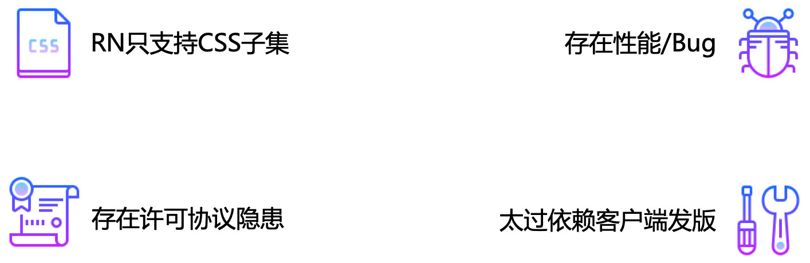
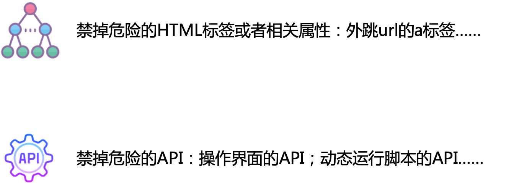
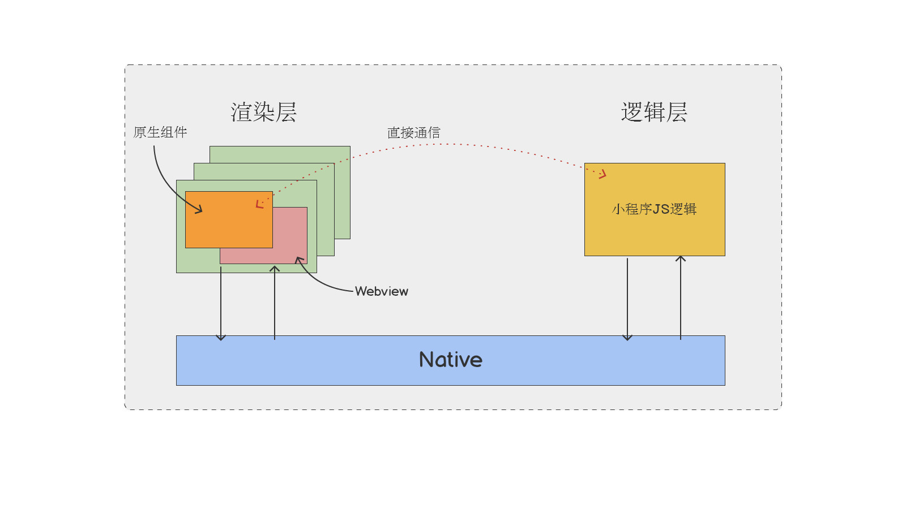

## 动效方案提效
1. 通过AE 脚本生成小程序代码和图片
2. 通过 配置平台上传先关资源
3. 通过扫码功能直接看到小程序上的效果


## 外卖小程序容器化方案（页面容器）
美团外卖App、美团App外卖频道、点评App外卖频道的多端复用。
跨平台 ios， android

采用MRN（Meituan React Native），混合式开发模式，RN使用Native来渲染，JS来编码，从而实现了跨平台开发、快速编译、快速发布、高效渲染和布局

优势
1. 动态化属性提升，我们可以把原有必须在客户端上写的业务放到了远端，业务的动态性得到很大的提升，具备随时上线业务的可能.
2. 业务动态下发，对减少客户端的包大小也有很大的帮助
3. 对于Android和iOS平台，在设计上，通过容器这一层去尽可能屏蔽平台之间的差异，使业务开发人员只需要认识容器，不需要花费大量的精力去关注应用和平台之间的差异，从而使得开发效率得到了极大的提升。

难点：
1. 多方协调：后端，客户端（ios和android ），mach容器化（ios和android） 通过桥协议通信
2. 多端复用，测试

### 桥协议
Bridge 的作用就是给 React Native 内嵌的 JS Engine 提供原生接口的扩展供 JS 调用

KNB定义了Native和JS通信的标准方式，方便开发时进行桥协议扩展，同时KNB也内置众多的Native基础能力，极大地提高了Titans容器的用户体验和开发效率。

### git流程

**工作流**

工作区：即自己当前分支所修改的代码，git add xx 之前的！不包括 git add xx 和 git commit xxx 之后的。

暂存区：已经 git add xxx 进去，且未 git commit xxx 的。

本地分支：已经git commit -m xxx 提交到本地分支的。

```bash
git clone url
git checkout develop/vX.y.z
git checkout develop/vX.y.z-wzl
git stash
git fetch 
git pull
git stash pop
git add .
git commit -m 'feat: xxx'
git status
git push
git commit --amend

git log
git reset --hard commitID  //回退版本
git push origin master -f   //强制推送

git status
git remote -v

```

### React Native 的不足
由于 React Native 和原生交互依赖的只有一个 Bridge，而且 JS 和 Native 交互是异步的，所以对需要和 Native 大量实时交互的功能可能会有性能上的不足，比如动画效率，性能是不如原生的。
React Native 始终是依赖原生的能力，所以摆脱不了对原生的依赖，相对 Flutter 的自己来画 UI 来说，React Native 显得有些尴尬。


### 小程序架构
RN作用小程序开发方式的弊端：（生态依赖别人）


用了Hybrid的方式。简单点说，就是把H5所有代码打包，一次性Load到本地再打开。这样的好处是我们可以用一种近似Web的方式来开发，同时在体验上也可以做到不错的效果，并且也是可以做到云端更新的。



小程序双线程的模型就定下来了：渲染层(Webview)+逻辑层(JSCore)

渲染层用了Webview进行渲染，开发者的JS逻辑运行在一个独立的JSCore线程.原生组件和Webview不是在同一层级进行渲染，原生组件其实是叠在Webview之上，想必大家都遇到过这个问题，video、input、map等等原生组件总是盖在其他组件之上，这就是这个设计带来的问题。

#### 同层渲染
「同层渲染」顾名思义则是指通过一定的技术手段把原生组件直接渲染到 WebView 层级上，此时「原生组件层」已经不存在，原生组件此时已被直接挂载到 WebView 节点上。你几乎可以像使用非原生组件一样去使用「同层渲染」的原生组件，比如使用 view、image 覆盖原生组件、使用 z-index 指定原生组件的层级、把原生组件放置在 scroll-view、swiper、movable-view 等容器内，通过 WXSS 设置原生组件的样式等等


## 服务端分组迁移
小程序的请求基本都通过WebSocket建立连接，之前的服务器通过一个参数来进行服务器分流。小程序内使用美团的公共组件包连接。随着业务的增加，外卖，拼好饭，医药，闪购等都需要做单独区分，因此原来的服务端进行迁移。

我的工作内容是，更新这个npm包，将原来定死的地址使用新的带参数的输入。实现的内容相对比较简单。主要使用到
1. lerna 进行多包管理
2. 小程序灰度方案

小程序灰度方案本身具有平台配置的能力，但是存在弊端，若出现事故需求回滚，而发版往往意味着多需求 。因此采用配置平台来进行管理，通过在建立长连接前访问平台获得配置，在上面通过uuid进行hash运算，放在100区间内，通过配置来达到放量目的

### WebSocket，http区别
区别：
1. WebSocket是双向通信协议，模拟Socket协议，可以双向发送或接受信息，而HTTP是单向的；
2. WebSocket是需要浏览器和服务器握手进行建立连接的，而http是浏览器发起向服务器的连接。
3. HTTP1.1通过使用`Connection:keep-alive`进行长连接，HTTP 1.1默认进行持久连接。在一次 TCP 连接中可以完成多个 HTTP 请求，但是对每个请求仍然要单独发 header，Keep-Alive不会永久保持连接，它有一个保持时间，可以在不同的服务器软件（如Apache）中设定这个时间。
4. websocket的长连接，是一个真的全双工，第一次tcp链路建立之后，后续数据可以双方都进行发送，不需要发送请求头，并且这个连接会持续存在直到客户端或者服务器端的某一方主动关闭连接，与HTTP长连接不同，WebSocket可以更灵活的控制连接关闭的时机，而不是HTTP协议的Keep-Alive一到，服务端立马就关闭（这样很不人性化）
   ```Connection:upgrade```

相同点：
1. 都是一样基于TCP的，都是可靠性传输协议
2. 都是应用层协议 

HTML5 Web Sockets以最小的开销高效地提供了Web连接。相较于经常需要使用推送实时数据到客户端甚至通过维护两个HTTP连接来模拟全双工连接的旧的轮询或长轮询（Comet）来说，这就极大的减少了不必要的网络流量与延迟。

WebSocket在建立握手时，数据是通过HTTP传输的。但是建立之后，在真正传输时候是不需要HTTP协议的。单独建立一条TCP的通信通道进行数据的传送
