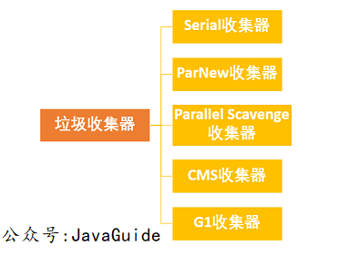
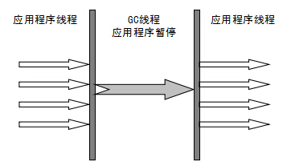

> 遗漏：LinkedList源码分析 ThreadLoacl 死锁
# Java 

## Java基础

### 1 Java语言特点

1. 简单易学；
2. 面向对象（封装，继承，多态）；
3. 平台无关性（ Java 虚拟机实现平台无关性）；
4. 可靠性；
5. 安全性；
6. 支持多线程（ C++ 语言没有内置的多线程机制，因此必须调用操作系统的多线程功能来进行多线程程序设计，而 Java 语言却提供了多线程支持）；
7. 支持网络编程并且很方便（ Java 语言诞生本身就是为简化网络编程设计的，因此 Java 语言不仅支持网络编程而且很方便）；
8. 编译与解释并存；

### 2 JVM 

Java 虚拟机（JVM）是运行 Java 字节码的虚拟机。JVM 有针对不同系统的特定实现（Windows，Linux，macOS），目的是使用相同的字节码，它们都会给出相同的结果。

字节码：在 Java 中，JVM 可以理解的代码就叫做`字节码`（即扩展名为 `.class` 的文件），它不面向任何特定的处理器，只面向虚拟机。Java 语言通过字节码的方式，在一定程度上解决了传统解释型语言执行效率低的问题，同时又保留了解释型语言可移植的特点。所以 Java 程序运行时比较高效，而且，由于字节码并不针对一种特定的机器，因此，Java 程序无须重新编译便可在多种不同操作系统的计算机上运行。

java文件 （编译）class文件 （JVM） 字节码

### 3 为什么说 Java 语言“编译与解释并存”
高级编程语言按照程序的执行方式分为编译型和解释型两种。简单来说，编译型语言是指编译器针对特定的操作系统将源代码一次性翻译成可被该平台执行的机器码；解释型语言是指解释器对源程序逐行解释成特定平台的机器码并立即执行。比如，你想阅读一本英文名著，你可以找一个英文翻译人员帮助你阅读， 有两种选择方式，你可以先等翻译人员将全本的英文名著（也就是源码）都翻译成汉语，再去阅读，也可以让翻译人员翻译一段，你在旁边阅读一段，慢慢把书读完。

Java 语言既具有编译型语言的特征，也具有解释型语言的特征，因为 Java 程序要经过先编译，后解释两个步骤，由 Java 编写的程序需要先经过编译步骤，生成字节码（*.class 文件），这种字节码必须由 Java 解释器来解释执行。因此，我们可以认为 Java 语言编译与解释并存。


### 4 Java 语法

#### 4.1 字符型常量和字符串常量的区别?

1. 形式上: 字符常量是单引号引起的一个字符; 字符串常量是双引号引起的 0 个或若干个字符

2. 含义上: 字符常量相当于一个整型值( ASCII 值),可以参加表达式运算; 字符串常量代表一个地址值(该字符串在内存中存放位置)

3. 占内存大小 字符常量只占 2 个字节; 字符串常量占若干个字节 (注意： char 在 Java 中占两个字节)

#### 4.2 标识符和关键字
在我们编写程序的时候，需要大量地为程序、类、变量、方法等取名字，于是就有了标识符，简单来说，标识符就是一个名字。但是有一些标识符，Java 语言已经赋予了其特殊的含义，只能用于特定的地方，这种特殊的标识符就是关键字。因此，关键字是被赋予特殊含义的标识符。比如，在我们的日常生活中 ，“警察局”这个名字已经被赋予了特殊的含义，所以如果你开一家店，店的名字不能叫“警察局”，“警察局”就是我们日常生活中的关键字。

#### 4.3 Java 泛型

Java 泛型（generics）是 JDK 5 中引入的一个新特性, 泛型提供了编译时类型安全检测机制，该机制允许程序员在编译时检测到非法的类型。泛型的本质是参数化类型，也就是说所操作的数据类型被指定为一个参数。
泛型的好处是在编译的时候检查类型安全，并且所有的强制转换都是自动和隐式的，以提高代码的重用率。
Java 的泛型是伪泛型，这是因为 Java 在编译期间，所有的泛型信息都会被擦掉，这也就是通常所说类型擦除 。 
泛型一般有三种使用方式:泛型类、泛型接口、泛型方法。

\<T>和<?>的区别
> 第一，声明一个泛型类或泛型方法。</br>
> 第二，使用泛型类或泛型方法。</br>
> 类型参数“<T>”主要用于第一种，声明泛型类或泛型方法。</br>
> 无界通配符“<?>”主要用于第二种，使用泛型类或泛型方法

List<? extends T>和List <? super T>有什么区别?
> List<? extends T>可以接受任何继承自T的类型的List，</br>
List<? super T>可以接受任何T的父类构成的List。</br>
例如List<? extends Number>可以接受List<Integer>或List<Float>。

#### 4.4 ==和 equals 的区别
== : 它的作用是判断两个对象的地址是不是相等。即判断两个对象是不是同一个对象。(基本数据类型==比较的是值，引用数据类型==比较的是内存地址)</br>
equals() : 它的作用也是判断两个对象是否相等，它不能用于比较基本数据类型的变量。equals()方法存在于Object类中，而Object类是所有类的直接或间接父类。

equals() 有两种情况，没有重写的情况下，等价于==，重写的话

举例：
* String 中的 equals 方法是被重写过的，因为 Object 的 equals 方法是比较的对象的内存地址，而 String 的 equals 方法比较的是对象的值。
* 当创建 String 类型的对象时，虚拟机会在常量池中查找有没有已经存在的值和要创建的值相同的对象，如果有就把它赋给当前引用。如果没有就在常量池中重新创建一个 String 对象。

#### 4.5 hashCode()与 equals()

hashCode() 的作用是获取哈希码，也称为散列码；它实际上是返回一个 int 整数。这个哈希码的作用是确定该对象在哈希表中的索引位置。hashCode()定义在 JDK 的 Object 类中，这就意味着 Java 中的任何类都包含有 hashCode() 函数。另外需要注意的是： Object 的 hashcode 方法是本地方法，也就是用 c 语言或 c++ 实现的，该方法通常用来将对象的 内存地址 转换为整数之后返回。
```java
public int hashCode() {
        //String 的hashCode()方法
        int h = hash;
        if (h == 0 && value.length > 0) {
            char val[] = value;

            for (int i = 0; i < value.length; i++) {
                h = 31 * h + val[i];
            }
            hash = h;
        }
        return h;
    }
```

1. 如果两个对象相等，则 hashcode 一定也是相同的
2. 两个对象相等,对两个对象分别调用 equals 方法都返回 true
3. 两个对象有相同的 hashcode 值，它们也不一定是相等的
4. **因此，equals 方法被覆盖过，则 hashCode 方法也必须被覆盖**
5. hashCode() 的默认行为是对堆上的对象产生独特值。如果没有重写 hashCode()，则该 class 的两个对象无论如何都不会相等（即使这两个对象指向相同的数据）

如果两个对象相等，则 hashcode 一定也是相同的。两个对象相等,对两个对象分别调用 equals 方法都返回 true。但是，两个对象有相同的 hashcode 值，它们也不一定是相等的 。因此，equals 方法被覆盖过，则 hashCode 方法也必须被覆盖。

如果不重写hashCode()只重写equals()，当使用该类作为HashMap的key时，会出现两个本应该相同的key被存入了不同的位置，hashCode的去重功能就失效了。

#### 4.6 基本类型和包装类

**自动装箱与拆箱**
在装箱的时候自动调用的是Integer的valueOf(int)方法。而在拆箱的时候自动调用的是Integer的intValue方法。

8 种基本类型的包装类和常量池

Java 基本类型的包装类的大部分都实现了常量池技术，即 Byte,Short,Integer,Long,Character,Boolean；前面 4 种包装类默认创建了数值[-128，127] 的相应类型的缓存数据，Character 创建了数值在[0,127]范围的缓存数据，Boolean 直接返回 True Or False。如果超出对应范围仍然会去创建新的对象。

#### 4.7 值传递
Java 程序设计语言总是采用按值调用。也就是说，方法得到的是所有参数值的一个拷贝，也就是说，方法不能修改传递给它的任何参数变量的内容。

下面再总结一下 Java 中方法参数的使用情况：

* 一个方法不能修改一个基本数据类型的参数（即数值型或布尔型）。
* 一个方法可以改变一个对象参数的状态。
* 一个方法不能让对象参数引用一个新的对象。

#### 4.8 重载和重写的区别

重载就是同样的一个方法能够根据输入数据的不同，做出不同的处理

重写就是当子类继承自父类的相同方法，输入数据一样，但要做出有别于父类的响应时，你就要覆盖父类方法

重载：

发生在同一个类中（或者父类和子类之间），方法名必须相同，参数类型不同、个数不同、顺序不同，方法返回值和访问修饰符可以不同。

重写：

重写发生在运行期，是子类对父类的允许访问的方法的实现过程进行重新编写。

1. 返回值类型、方法名、参数列表必须相同，抛出的异常范围小于等于父类，访问修饰符范围大于等于父类。
2. 如果父类方法访问修饰符为 private/final/static 则子类就不能重写该方法，但是被 static 修饰的方法能够被再次声明。
3. 构造方法无法被重写
综上：重写就是子类对父类方法的重新改造，外部样子不能改变，内部逻辑可以改变

#### 4.9 深拷贝 vs 浅拷贝

1. 浅拷贝：对基本数据类型进行值传递，对引用数据类型进行引用传递般的拷贝，此为浅拷贝。
2. 深拷贝：对基本数据类型进行值传递，对引用数据类型，创建一个新的对象，并复制其内容，此为深拷贝。

### 5 Java 面向对象
* 面向过程 ：面向过程性能比面向对象高。 因为类调用时需要实例化，开销比较大，比较消耗资源，所以当性能是最重要的考量因素的时候，比如单片机、嵌入式开发、Linux/Unix 等一般采用面向过程开发。但是，面向过程没有面向对象易维护、易复用、易扩展。
* 面向对象 ：面向对象易维护、易复用、易扩展。 因为面向对象有封装、继承、多态性的特性，所以可以设计出低耦合的系统，使系统更加灵活、更加易于维护。但是，面向对象性能比面向过程低。

#### 5.1 在 Java 中定义一个不做事且没有参数的构造方法的作用
Java 程序在执行子类的构造方法之前，如果没有用 `super()`来调用父类特定的构造方法，则会调用父类中“没有参数的构造方法”。因此，如果父类中只定义了有参数的构造方法，而在子类的构造方法中又没有用 `super()`来调用父类中特定的构造方法，则编译时将发生错误，因为 Java 程序在父类中找不到没有参数的构造方法可供执行。解决办法是在父类里加上一个不做事且没有参数的构造方法。

#### 5.2 成员变量与局部变量的区别有哪些？

1. 从语法形式上看:成员变量是属于类的，而局部变量是在代码块或方法中定义的变量或是方法的参数；成员变量可以被 public,private,static 等修饰符所修饰，而局部变量不能被访问控制修饰符及 static 所修饰；但是，成员变量和局部变量都能被 final 所修饰。
2. 从变量在内存中的存储方式来看:如果成员变量是使用`static`修饰的，那么这个成员变量是属于类的，如果没有使用`static`修饰，这个成员变量是属于实例的。而对象存在于堆内存，局部变量则存在于栈内存。
3. 从变量在内存中的生存时间上看:成员变量是对象的一部分，它随着对象的创建而存在，而局部变量随着方法的调用而自动消失。
4. 成员变量如果没有被赋初值:则会自动以类型的默认值而赋值（一种情况例外:被 final 修饰的成员变量也必须显式地赋值），而局部变量则不会自动赋值。

#### 5.3 创建一个对象用什么运算符?对象实体与对象引用有何不同?
new 运算符，new 创建对象实例（对象实例在堆内存中），对象引用指向对象实例（对象引用存放在栈内存中）。一个对象引用可以指向 0 个或 1 个对象（一根绳子可以不系气球，也可以系一个气球）;一个对象可以有 n 个引用指向它（可以用 n 条绳子系住一个气球）。

#### 一个类的构造方法的作用是什么? 若一个类没有声明构造方法，该程序能正确执行吗? 为什么?

主要作用是完成对类对象的初始化工作。可以执行。因为一个类即使没有声明构造方法也会有默认的不带参数的构造方法。如果我们自己添加了类的构造方法（无论是否有参），Java 就不会再添加默认的无参数的构造方法了，这时候，就不能直接 new 一个对象而不传递参数了，所以我们一直在不知不觉地使用构造方法，这也是为什么我们在创建对象的时候后面要加一个括号（因为要调用无参的构造方法）。如果我们重载了有参的构造方法，记得都要把无参的构造方法也写出来（无论是否用到），因为这可以帮助我们在创建对象的时候少踩坑。

#### 构造方法有哪些特性？
1. 名字与类名相同。
2. 没有返回值，但不能用 void 声明构造函数。
3. 生成类的对象时自动执行，无需调用。

### 面向对象三大特征

#### 封装
封装是指把一个对象的状态信息（也就是属性）隐藏在对象内部，不允许外部对象直接访问对象的内部信息。但是可以提供一些可以被外界访问的方法来操作属性。就好像我们看不到挂在墙上的空调的内部的零件信息（也就是属性），但是可以通过遥控器（方法）来控制空调。如果属性不想被外界访问，我们大可不必提供方法给外界访问。但是如果一个类没有提供给外界访问的方法，那么这个类也没有什么意义了。

#### 继承
继承是使用已存在的类的定义作为基础建立新类的技术，新类的定义可以增加新的数据或新的功能，也可以用父类的功能，但不能选择性地继承父类。通过使用继承，可以快速地创建新的类，可以提高代码的重用，程序的可维护性，节省大量创建新类的时间 ，提高我们的开发效率。

**关于继承如下 3 点请记住：**

1. 子类拥有父类对象所有的属性和方法（包括私有属性和私有方法），但是父类中的私有属性和方法子类是无法访问，**只是拥有**。
2. 子类可以拥有自己属性和方法，即子类可以对父类进行扩展。
3. 子类可以用自己的方式实现父类的方法。（以后介绍）。

#### 多态

多态，顾名思义，表示一个对象具有多种的状态。具体表现为父类的引用指向子类的实例。

**多态的特点:**

- 对象类型和引用类型之间具有继承（类）/实现（接口）的关系；
- 引用类型变量发出的方法调用的到底是哪个类中的方法，必须在程序运行期间才能确定；
- 多态不能调用“只在子类存在但在父类不存在”的方法；
- 如果子类重写了父类的方法，真正执行的是子类覆盖的方法，如果子类没有覆盖父类的方法，执行的是父类的方法。

### 修饰符

#### 在一个静态方法内调用一个非静态成员为什么是非法的?

由于静态方法可以不通过对象进行调用，因此在静态方法里，不能调用其他非静态变量，也不可以访问非静态变量成员。

#### 静态方法和实例方法有何不同

1. 在外部调用静态方法时，可以使用"类名.方法名"的方式，也可以使用"对象名.方法名"的方式。而实例方法只有后面这种方式。也就是说，调用静态方法可以无需创建对象。
2. 静态方法在访问本类的成员时，只允许访问静态成员（即静态成员变量和静态方法），而不允许访问实例成员变量和实例方法；实例方法则无此限制。


### 枚举

#### 概览

enum关键字在 java5 中引入，表示一种特殊类型的类，其总是继承java.lang.Enum类，更多内容可以自行查看其[官方文档](https://docs.oracle.com/javase/6/docs/api/java/lang/Enum.html)。

枚举在很多时候会和常量拿来对比，可能因为本身我们大量实际使用枚举的地方就是为了替代常量。那么这种方式由什么优势呢？

**以这种方式定义的常量使代码更具可读性，允许进行编译时检查，预先记录可接受值的列表，并避免由于传入无效值而引起的意外行为。**

下面示例定义一个简单的枚举类型 pizza 订单的状态，共有三种 ORDERED, READY, DELIVERED状态:

```java
package shuang.kou.enumdemo.enumtest;

public enum PizzaStatus {
    ORDERED,
    READY, 
    DELIVERED; 
}
```

**简单来说，我们通过上面的代码避免了定义常量，我们将所有和 pizza 订单的状态的常量都统一放到了一个枚举类型里面。**

#### 自定义枚举方法

现在我们对枚举是什么以及如何使用它们有了基本的了解，让我们通过在枚举上定义一些额外的API方法，将上一个示例提升到一个新的水平：

```java
public class Pizza {
    private PizzaStatus status;
    public enum PizzaStatus {
        ORDERED,
        READY,
        DELIVERED;
    }
 
    public boolean isDeliverable() {
        return getStatus() == PizzaStatus.READY;
    }
     
    // Methods that set and get the status variable.
}
```

#### 使用 == 比较枚举类型

由于枚举类型确保JVM中仅存在一个常量实例，因此我们可以安全地使用 `==` 运算符比较两个变量，如上例所示；此外，`==` 运算符可提供编译时和运行时的安全性。

首先，让我们看一下以下代码段中的运行时安全性，其中 `==` 运算符用于比较状态，并且如果两个值均为null 都不会引发 NullPointerException。相反，如果使用equals方法，将抛出 NullPointerException：

```java
Pizza.PizzaStatus pizza = null;
System.out.println(pizza.equals(Pizza.PizzaStatus.DELIVERED));//空指针异常
System.out.println(pizza == Pizza.PizzaStatus.DELIVERED);//正常运行
```

对于编译时安全性，我们看另一个示例，两个不同枚举类型进行比较：

```java
if (Pizza.PizzaStatus.DELIVERED.equals(TestColor.GREEN)); // 编译正常
if (Pizza.PizzaStatus.DELIVERED == TestColor.GREEN);      // 编译失败，类型不匹配
```
#### EnumSet and EnumMap

##### EnumSet
`EnumSet` 是一种专门为枚举类型所设计的 `Set` 类型。

与`HashSet`相比，由于使用了内部位向量表示，因此它是特定 `Enum` 常量集的非常有效且紧凑的表示形式。

它提供了类型安全的替代方法，以替代传统的基于int的“位标志”，使我们能够编写更易读和易于维护的简洁代码。

`EnumSet` 是抽象类，其有两个实现：`RegularEnumSet` 、`JumboEnumSet`，选择哪一个取决于实例化时枚举中常量的数量。

在很多场景中的枚举常量集合操作（如：取子集、增加、删除、`containsAll`和`removeAll`批操作）使用`EnumSet`非常合适；如果需要迭代所有可能的常量则使用`Enum.values()`。

```java
public class Pizza {
 
    private static EnumSet<PizzaStatus> undeliveredPizzaStatuses =
      EnumSet.of(PizzaStatus.ORDERED, PizzaStatus.READY);
 
    private PizzaStatus status;
 
    public enum PizzaStatus {
        ...
    }
 
    public boolean isDeliverable() {
        return this.status.isReady();
    }
 
    public void printTimeToDeliver() {
        System.out.println("Time to delivery is " + 
          this.getStatus().getTimeToDelivery() + " days");
    }
 
    public static List<Pizza> getAllUndeliveredPizzas(List<Pizza> input) {
        return input.stream().filter(
          (s) -> undeliveredPizzaStatuses.contains(s.getStatus()))
            .collect(Collectors.toList());
    }
 
    public void deliver() { 
        if (isDeliverable()) { 
            PizzaDeliverySystemConfiguration.getInstance().getDeliveryStrategy()
              .deliver(this); 
            this.setStatus(PizzaStatus.DELIVERED); 
        } 
    }
     
    // Methods that set and get the status variable.
}
```

  下面的测试演示了展示了 `EnumSet` 在某些场景下的强大功能：

```java
@Test
public void givenPizaOrders_whenRetrievingUnDeliveredPzs_thenCorrectlyRetrieved() {
    List<Pizza> pzList = new ArrayList<>();
    Pizza pz1 = new Pizza();
    pz1.setStatus(Pizza.PizzaStatus.DELIVERED);
 
    Pizza pz2 = new Pizza();
    pz2.setStatus(Pizza.PizzaStatus.ORDERED);
 
    Pizza pz3 = new Pizza();
    pz3.setStatus(Pizza.PizzaStatus.ORDERED);
 
    Pizza pz4 = new Pizza();
    pz4.setStatus(Pizza.PizzaStatus.READY);
 
    pzList.add(pz1);
    pzList.add(pz2);
    pzList.add(pz3);
    pzList.add(pz4);
 
    List<Pizza> undeliveredPzs = Pizza.getAllUndeliveredPizzas(pzList); 
    assertTrue(undeliveredPzs.size() == 3); 
}
```
##### EnumMap

`EnumMap`是一个专门化的映射实现，用于将枚举常量用作键。与对应的 `HashMap` 相比，它是一个高效紧凑的实现，并且在内部表示为一个数组:

```java
EnumMap<Pizza.PizzaStatus, Pizza> map;
```

让我们快速看一个真实的示例，该示例演示如何在实践中使用它：

```java
Iterator<Pizza> iterator = pizzaList.iterator();
while (iterator.hasNext()) {
    Pizza pz = iterator.next();
    PizzaStatus status = pz.getStatus();
    if (pzByStatus.containsKey(status)) {
      pzByStatus.get(status).add(pz);
    } else {
      List<Pizza> newPzList = new ArrayList<>();
      newPzList.add(pz);
      pzByStatus.put(status, newPzList);
    }
}
```

 下面的测试演示了展示了 `EnumMap` 在某些场景下的强大功能：

```java
@Test
public void givenPizaOrders_whenGroupByStatusCalled_thenCorrectlyGrouped() {
    List<Pizza> pzList = new ArrayList<>();
    Pizza pz1 = new Pizza();
    pz1.setStatus(Pizza.PizzaStatus.DELIVERED);
 
    Pizza pz2 = new Pizza();
    pz2.setStatus(Pizza.PizzaStatus.ORDERED);
 
    Pizza pz3 = new Pizza();
    pz3.setStatus(Pizza.PizzaStatus.ORDERED);
 
    Pizza pz4 = new Pizza();
    pz4.setStatus(Pizza.PizzaStatus.READY);
 
    pzList.add(pz1);
    pzList.add(pz2);
    pzList.add(pz3);
    pzList.add(pz4);
 
    EnumMap<Pizza.PizzaStatus,List<Pizza>> map = Pizza.groupPizzaByStatus(pzList);
    assertTrue(map.get(Pizza.PizzaStatus.DELIVERED).size() == 1);
    assertTrue(map.get(Pizza.PizzaStatus.ORDERED).size() == 2);
    assertTrue(map.get(Pizza.PizzaStatus.READY).size() == 1);
}
```

#### 通过枚举实现一些设计模式

##### 单例模式

通常，使用类实现 Singleton 模式并非易事，枚举提供了一种实现单例的简便方法。

《Effective Java 》和《Java与模式》都非常推荐这种方式，使用这种方式方式实现枚举可以有什么好处呢？

《Effective Java》

> 这种方法在功能上与公有域方法相近，但是它更加简洁，无偿提供了序列化机制，绝对防止多次实例化，即使是在面对复杂序列化或者反射攻击的时候。虽然这种方法还没有广泛采用，但是单元素的枚举类型已经成为实现 Singleton的最佳方法。 —-《Effective Java 中文版 第二版》

《Java与模式》

>  《Java与模式》中，作者这样写道，使用枚举来实现单实例控制会更加简洁，而且无偿地提供了序列化机制，并由JVM从根本上提供保障，绝对防止多次实例化，是更简洁、高效、安全的实现单例的方式。

下面的代码段显示了如何使用枚举实现单例模式：

```java
public enum PizzaDeliverySystemConfiguration {
    INSTANCE;
    PizzaDeliverySystemConfiguration() {
        // Initialization configuration which involves
        // overriding defaults like delivery strategy
    }
 
    private PizzaDeliveryStrategy deliveryStrategy = PizzaDeliveryStrategy.NORMAL;
 
    public static PizzaDeliverySystemConfiguration getInstance() {
        return INSTANCE;
    }
 
    public PizzaDeliveryStrategy getDeliveryStrategy() {
        return deliveryStrategy;
    }
}
```

如何使用呢？请看下面的代码：

```java
PizzaDeliveryStrategy deliveryStrategy = PizzaDeliverySystemConfiguration.getInstance().getDeliveryStrategy();
```

通过 `PizzaDeliverySystemConfiguration.getInstance()` 获取的就是单例的 `PizzaDeliverySystemConfiguration`


##### 策略模式

通常，策略模式由不同类实现同一个接口来实现的。

 这也就意味着添加新策略意味着添加新的实现类。使用枚举，可以轻松完成此任务，添加新的实现意味着只定义具有某个实现的另一个实例。

下面的代码段显示了如何使用枚举实现策略模式：

```java
public enum PizzaDeliveryStrategy {
    EXPRESS {
        @Override
        public void deliver(Pizza pz) {
            System.out.println("Pizza will be delivered in express mode");
        }
    },
    NORMAL {
        @Override
        public void deliver(Pizza pz) {
            System.out.println("Pizza will be delivered in normal mode");
        }
    };
 
    public abstract void deliver(Pizza pz);
}
```

给 `Pizza `增加下面的方法：

```java
public void deliver() {
    if (isDeliverable()) {
        PizzaDeliverySystemConfiguration.getInstance().getDeliveryStrategy()
          .deliver(this);
        this.setStatus(PizzaStatus.DELIVERED);
    }
}
```

如何使用呢？请看下面的代码：

```java
@Test
public void givenPizaOrder_whenDelivered_thenPizzaGetsDeliveredAndStatusChanges() {
    Pizza pz = new Pizza();
    pz.setStatus(Pizza.PizzaStatus.READY);
    pz.deliver();
    assertTrue(pz.getStatus() == Pizza.PizzaStatus.DELIVERED);
}
```
#### 枚举类JSON表现

使用Jackson库，可以将枚举类型的JSON表示为POJO。下面的代码段显示了可以用于同一目的的Jackson批注：

```java
@JsonFormat(shape = JsonFormat.Shape.OBJECT)
public enum PizzaStatus {
    ORDERED (5){
        @Override
        public boolean isOrdered() {
            return true;
        }
    },
    READY (2){
        @Override
        public boolean isReady() {
            return true;
        }
    },
    DELIVERED (0){
        @Override
        public boolean isDelivered() {
            return true;
        }
    };
 
    private int timeToDelivery;
 
    public boolean isOrdered() {return false;}
 
    public boolean isReady() {return false;}
 
    public boolean isDelivered(){return false;}
 
    @JsonProperty("timeToDelivery")
    public int getTimeToDelivery() {
        return timeToDelivery;
    }
 
    private PizzaStatus (int timeToDelivery) {
        this.timeToDelivery = timeToDelivery;
    }
}
```

我们可以按如下方式使用 `Pizza` 和 `PizzaStatus`：

```java
Pizza pz = new Pizza();
pz.setStatus(Pizza.PizzaStatus.READY);
System.out.println(Pizza.getJsonString(pz));
```

生成 Pizza 状态以以下JSON展示：

```json
{
  "status" : {
    "timeToDelivery" : 2,
    "ready" : true,
    "ordered" : false,
    "delivered" : false
  },
  "deliverable" : true
}
```

### 其它

#### String StringBuffer 和 StringBuilder 的区别是什么? String 为什么是不可变的?

**可变性**
简单的来说：`String` 类中使用 final 关键字修饰字符数组来保存字符串，`private final char value[]`，所以`String` 对象是不可变的。

> 补充（来自[issue 675](https://github.com/Snailclimb/JavaGuide/issues/675)）：在 Java 9 之后，String 、`StringBuilder` 与 `StringBuffer` 的实现改用 byte 数组存储字符串 `private final byte[] value`

而 `StringBuilder` 与 `StringBuffer` 都继承自 `AbstractStringBuilder` 类，在 `AbstractStringBuilder` 中也是使用字符数组保存字符串`char[]value` 但是没有用 `final` 关键字修饰，所以这两种对象都是可变的。

`StringBuilder` 与 `StringBuffer` 的构造方法都是调用父类构造方法也就是`AbstractStringBuilder` 实现的，大家可以自行查阅源码。

线程安全性**

`String` 中的对象是不可变的，也就可以理解为常量，线程安全。`AbstractStringBuilder` 是 `StringBuilder` 与 `StringBuffer` 的公共父类，定义了一些字符串的基本操作，如 `expandCapacity`、`append`、`insert`、`indexOf` 等公共方法。`StringBuffer` 对方法加了同步锁或者对调用的方法加了同步锁，所以是线程安全的。`StringBuilder` 并没有对方法进行加同步锁，所以是非线程安全的。

**性能**

每次对 `String` 类型进行改变的时候，都会生成一个新的 `String` 对象，然后将指针指向新的 `String` 对象。`StringBuffer` 每次都会对 `StringBuffer` 对象本身进行操作，而不是生成新的对象并改变对象引用。相同情况下使用 `StringBuilder` 相比使用 `StringBuffer` 仅能获得 10%~15% 左右的性能提升，但却要冒多线程不安全的风险。

**对于三者使用的总结：**

1. 操作少量的数据: 适用 `String`
2. 单线程操作字符串缓冲区下操作大量数据: 适用 `StringBuilder`
3. 多线程操作字符串缓冲区下操作大量数据: 适用 `StringBuffer`

#### Object 类的常见方法总结

Object 类是一个特殊的类，是所有类的父类。它主要提供了以下 11 个方法：

```java
public final native Class<?> getClass()//native方法，用于返回当前运行时对象的Class对象，使用了final关键字修饰，故不允许子类重写。

public native int hashCode() //native方法，用于返回对象的哈希码，主要使用在哈希表中，比如JDK中的HashMap。
public boolean equals(Object obj)//用于比较2个对象的内存地址是否相等，String类对该方法进行了重写用户比较字符串的值是否相等。

protected native Object clone() throws CloneNotSupportedException//naitive方法，用于创建并返回当前对象的一份拷贝。一般情况下，对于任何对象 x，表达式 x.clone() != x 为true，x.clone().getClass() == x.getClass() 为true。Object本身没有实现Cloneable接口，所以不重写clone方法并且进行调用的话会发生CloneNotSupportedException异常。

public String toString()//返回类的名字@实例的哈希码的16进制的字符串。建议Object所有的子类都重写这个方法。

public final native void notify()//native方法，并且不能重写。唤醒一个在此对象监视器上等待的线程(监视器相当于就是锁的概念)。如果有多个线程在等待只会任意唤醒一个。

public final native void notifyAll()//native方法，并且不能重写。跟notify一样，唯一的区别就是会唤醒在此对象监视器上等待的所有线程，而不是一个线程。

public final native void wait(long timeout) throws InterruptedException//native方法，并且不能重写。暂停线程的执行。注意：sleep方法没有释放锁，而wait方法释放了锁 。timeout是等待时间。

public final void wait(long timeout, int nanos) throws InterruptedException//多了nanos参数，这个参数表示额外时间（以毫微秒为单位，范围是 0-999999）。 所以超时的时间还需要加上nanos毫秒。

public final void wait() throws InterruptedException//跟之前的2个wait方法一样，只不过该方法一直等待，没有超时时间这个概念

protected void finalize() throws Throwable { }//实例被垃圾回收器回收的时候触发的操作

```

#### Java 序列化中如果有些字段不想进行序列化，怎么办？

对于不想进行序列化的变量，使用 transient 关键字修饰。

transient 关键字的作用是：阻止实例中那些用此关键字修饰的的变量序列化；当对象被反序列化时，被 transient 修饰的变量值不会被持久化和恢复。transient 只能修饰变量，不能修饰类和方法。

## Java 核心技术

### 反射机制

通过反射你可以获取任意一个类的所有属性和方法，你还可以调用这些方法和属性。

#### 反射机制优缺点

**优点** ： 可以让咱们的代码更加灵活、为各种框架提供开箱即用的功能提供了便利

**缺点** ：让我们在运行时有了分析操作类的能力，这同样也增加了安全问题。比如可以无视泛型参数的安全检查（泛型参数的安全检查发生在编译时）。另外，反射的性能也要稍差点，不过，对于框架来说实际是影响不大的。

#### 反射的应用场景
像咱们平时大部分时候都是在写业务代码，很少会接触到直接使用反射机制的场景。

但是，这并不代表反射没有用。相反，正是因为反射，你才能这么轻松地使用各种框架。像 Spring/Spring Boot、MyBatis 等等框架中都大量使用了反射机制。

**这些框架中也大量使用了动态代理，而动态代理的实现也依赖反射。**

比如下面是通过 JDK 实现动态代理的示例代码，其中就使用了反射类 `Method` 来调用指定的方法。

```java
public class DebugInvocationHandler implements InvocationHandler {
    /**
     * 代理类中的真实对象
     */
    private final Object target;

    public DebugInvocationHandler(Object target) {
        this.target = target;
    }


    public Object invoke(Object proxy, Method method, Object[] args) throws InvocationTargetException, IllegalAccessException {
        System.out.println("before method " + method.getName());
        Object result = method.invoke(target, args);
        System.out.println("after method " + method.getName());
        return result;
    }
}

```

另外，像 Java 中的一大利器 **注解** 的实现也用到了反射。

为什么你使用 Spring 的时候 ，一个`@Component`注解就声明了一个类为 Spring Bean 呢？为什么你通过一个 `@Value`注解就读取到配置文件中的值呢？究竟是怎么起作用的呢？

这些都是因为你可以基于反射分析类，然后获取到类/属性/方法/方法的参数上的注解。你获取到注解之后，就可以做进一步的处理。

#### 反射的一些基本操作

**简单用代码演示一下反射的一些操作!**

1.创建一个我们要使用反射操作的类 `TargetObject`。

```java
package cn.javaguide;

public class TargetObject {
    private String value;

    public TargetObject() {
        value = "JavaGuide";
    }

    public void publicMethod(String s) {
        System.out.println("I love " + s);
    }

    private void privateMethod() {
        System.out.println("value is " + value);
    }
}
```

2.使用反射操作这个类的方法以及参数

```java
package cn.javaguide;

import java.lang.reflect.Field;
import java.lang.reflect.InvocationTargetException;
import java.lang.reflect.Method;

public class Main {
    public static void main(String[] args) throws ClassNotFoundException, NoSuchMethodException, IllegalAccessException, InstantiationException, InvocationTargetException, NoSuchFieldException {
        /**
         * 获取TargetObject类的Class对象并且创建TargetObject类实例
         */
        Class<?> tagetClass = Class.forName("cn.javaguide.TargetObject");
        TargetObject targetObject = (TargetObject) tagetClass.newInstance();
        /**
         * 获取所有类中所有定义的方法
         */
        Method[] methods = tagetClass.getDeclaredMethods();
        for (Method method : methods) {
            System.out.println(method.getName());
        }
        /**
         * 获取指定方法并调用
         */
        Method publicMethod = tagetClass.getDeclaredMethod("publicMethod",
                String.class);

        publicMethod.invoke(targetObject, "JavaGuide");
        /**
         * 获取指定参数并对参数进行修改
         */
        Field field = tagetClass.getDeclaredField("value");
        //为了对类中的参数进行修改我们取消安全检查
        field.setAccessible(true);
        field.set(targetObject, "JavaGuide");
        /**
         * 调用 private 方法
         */
        Method privateMethod = tagetClass.getDeclaredMethod("privateMethod");
        //为了调用private方法我们取消安全检查
        privateMethod.setAccessible(true);
        privateMethod.invoke(targetObject);
    }
}

```

输出内容：

```
publicMethod
privateMethod
I love JavaGuide
value is JavaGuide
```

**注意** : 有读者提到上面代码运行会抛出 `ClassNotFoundException` 异常,具体原因是你没有下面把这段代码的包名替换成自己创建的 `TargetObject` 所在的包 。

```java
Class<?> tagetClass = Class.forName("cn.javaguide.TargetObject");
```

### 异常

在 Java 中，所有的异常都有一个共同的祖先 `java.lang` 包中的 `Throwable` 类。`Throwable` 类有两个重要的子类 `Exception`（异常）和 `Error`（错误）。`Exception` 能被程序本身处理(`try-catch`)， `Error` 是无法处理的(只能尽量避免)。

`Exception` 和 `Error` 二者都是 Java 异常处理的重要子类，各自都包含大量子类。

- **`Exception`** :程序本身可以处理的异常，可以通过 `catch` 来进行捕获。`Exception` 又可以分为 受检查异常(必须处理) 和 不受检查异常(可以不处理)。
- **`Error`** ：`Error` 属于程序无法处理的错误 ，我们没办法通过 `catch` 来进行捕获 。例如，Java 虚拟机运行错误（`Virtual MachineError`）、虚拟机内存不够错误(`OutOfMemoryError`)、类定义错误（`NoClassDefFoundError`）等 。这些异常发生时，Java 虚拟机（JVM）一般会选择线程终止。

**受检查异常**

Java 代码在编译过程中，如果受检查异常没有被 `catch`/`throw` 处理的话，就没办法通过编译 。比如下面这段 IO 操作的代码。

除了`RuntimeException`及其子类以外，其他的`Exception`类及其子类都属于受检查异常 。常见的受检查异常有： IO 相关的异常、`ClassNotFoundException` 、`SQLException`...。

**不受检查异常**

Java 代码在编译过程中 ，我们即使不处理不受检查异常也可以正常通过编译。

`RuntimeException` 及其子类都统称为非受检查异常，例如：`NullPoin​terException`、`NumberFormatException`（字符串转换为数字）、`ArrayIndexOutOfBoundsException`（数组越界）、`ClassCastException`（类型转换错误）、`ArithmeticException`（算术错误）等。

#### Throwable 类常用方法

- **`public string getMessage()`**:返回异常发生时的简要描述
- **`public string toString()`**:返回异常发生时的详细信息
- **`public string getLocalizedMessage()`**:返回异常对象的本地化信息。使用 `Throwable` 的子类覆盖这个方法，可以生成本地化信息。如果子类没有覆盖该方法，则该方法返回的信息与 `getMessage（）`返回的结果相同
- **`public void printStackTrace()`**:在控制台上打印 `Throwable` 对象封装的异常信息

**try-catch-finally**

- **`try`块：** 用于捕获异常。其后可接零个或多个 `catch` 块，如果没有 `catch` 块，则必须跟一个 `finally` 块。
- **`catch`块：** 用于处理 try 捕获到的异常。
- **`finally` 块：** 无论是否捕获或处理异常，`finally` 块里的语句都会被执行。当在 `try` 块或 `catch` 块中遇到 `return` 语句时，`finally` 语句块将在方法返回之前被执行。

**在以下 3 种特殊情况下，`finally` 块不会被执行：**

2. 在 `try` 或 `finally `块中用了 `System.exit(int)`退出程序。但是，如果 `System.exit(int)` 在异常语句之后，`finally` 还是会被执行
3. 程序所在的线程死亡。
4. 关闭 CPU。

**注意：** 当 try 语句和 finally 语句中都有 return 语句时，在方法返回之前，finally 语句的内容将被执行，并且 finally 语句的返回值将会覆盖原始的返回值。如下：

#### 使用 `try-with-resources` 来代替`try-catch-finally`

1. 适用范围（资源的定义）：** 任何实现 `java.lang.AutoCloseable`或者 `java.io.Closeable` 的对象
2. **关闭资源和 final 的执行顺序：** 在 `try-with-resources` 语句中，任何 catch 或 finally 块在声明的资源关闭后运行

《Effecitve Java》中明确指出：

> 面对必须要关闭的资源，我们总是应该优先使用 `try-with-resources` 而不是`try-finally`。随之产生的代码更简短，更清晰，产生的异常对我们也更有用。`try-with-resources`语句让我们更容易编写必须要关闭的资源的代码，若采用`try-finally`则几乎做不到这点。

Java 中类似于`InputStream`、`OutputStream` 、`Scanner` 、`PrintWriter`等的资源都需要我们调用`close()`方法来手动关闭，一般情况下我们都是通过`try-catch-finally`语句来实现这个需求，如下：

```java
        //读取文本文件的内容
        Scanner scanner = null;
        try {
            scanner = new Scanner(new File("D://read.txt"));
            while (scanner.hasNext()) {
                System.out.println(scanner.nextLine());
            }
        } catch (FileNotFoundException e) {
            e.printStackTrace();
        } finally {
            if (scanner != null) {
                scanner.close();
            }
        }
```

使用 Java 7 之后的 `try-with-resources` 语句改造上面的代码:

```java
try (Scanner scanner = new Scanner(new File("test.txt"))) {
    while (scanner.hasNext()) {
        System.out.println(scanner.nextLine());
    }
} catch (FileNotFoundException fnfe) {
    fnfe.printStackTrace();
}
```

当然多个资源需要关闭的时候，使用 `try-with-resources` 实现起来也非常简单，如果你还是用`try-catch-finally`可能会带来很多问题。

通过使用分号分隔，可以在`try-with-resources`块中声明多个资源。

```java
try (BufferedInputStream bin = new BufferedInputStream(new FileInputStream(new File("test.txt")));
             BufferedOutputStream bout = new BufferedOutputStream(new FileOutputStream(new File("out.txt")))) {
            int b;
            while ((b = bin.read()) != -1) {
                bout.write(b);
            }
        }
        catch (IOException e) {
            e.printStackTrace();
        }
```

### 多线程

#### 简述线程、程序、进程的基本概念。以及他们之间关系是什么?

**线程**与进程相似，但线程是一个比进程更小的执行单位。一个进程在其执行的过程中可以产生多个线程。与进程不同的是同类的多个线程共享同一块内存空间和一组系统资源，所以系统在产生一个线程，或是在各个线程之间作切换工作时，负担要比进程小得多，也正因为如此，线程也被称为轻量级进程。

**程序**是含有指令和数据的文件，被存储在磁盘或其他的数据存储设备中，也就是说程序是静态的代码。

**进程**是程序的一次执行过程，是系统运行程序的基本单位，因此进程是动态的。系统运行一个程序即是一个进程从创建，运行到消亡的过程。简单来说，一个进程就是一个执行中的程序，它在计算机中一个指令接着一个指令地执行着，同时，每个进程还占有某些系统资源如 CPU 时间，内存空间，文件，输入输出设备的使用权等等。换句话说，当程序在执行时，将会被操作系统载入内存中。

线程是进程划分成的更小的运行单位。线程和进程最大的不同在于基本上各进程是独立的，而各线程则不一定，因为同一进程中的线程极有可能会相互影响。从另一角度来说，进程属于操作系统的范畴，主要是同一段时间内，可以同时执行一个以上的程序，而线程则是在同一程序内几乎同时执行一个以上的程序段。

#### 线程有哪些基本状态?

1. NEW

>该状态是指线程刚创建，尚未启动。

2. RUNNABLE
>表示线程正在正常运行中，当然可能会有某种耗时计算/IO等待的操作/CPU时间片切换等，这个状态下发生的等待一般是其他系统资源，而不是锁、Sleep等。

3. BLOCKED

>此状态下，是在多个线程有同步操作的场景，比如正在等待另一个线程的synchronized 块的执行释放，或者可重入的 synchronized块里别人调用wait() 方法，也就是说这里是线程在等待进入临界区。

4. WAITING

>这个状态下是指线程拥有了某个锁之后, 调用了他的wait方法, 等待其他线程/锁拥有者调用 notify / notifyAll 一遍该线程可以继续下一步操作。

>这里要区分 BLOCKED 和 WATING 的区别，一个是在临界点外面等待进入, 一个是在理解点里面wait等待别人notify, 线程调用了join方法 join了另外的线程的时候, 也会进入WAITING状态, 等待被他join的线程执行结束。

5. TIMED_WAITING

>这个状态就是有限的(时间限制)的WAITING, 一般出现在调用wait(long)、join(long)等情况下, 另外一个线程sleep后, 也会进入TIMED_WAITING状态。

6. TERMINATED

>这个状态下表示该线程的run方法已经执行完毕了, 基本上就等于死亡了(当时如果线程被持久持有, 可能不会被回收)。

### I/O
#### Java 中 IO 流分为几种?

- 按照流的流向分，可以分为输入流和输出流；
- 按照操作单元划分，可以划分为字节流和字符流；
- 按照流的角色划分为节点流和处理流。

Java Io 流共涉及 40 多个类，这些类看上去很杂乱，但实际上很有规则，而且彼此之间存在非常紧密的联系， Java I0 流的 40 多个类都是从如下 4 个抽象类基类中派生出来的。

- InputStream/Reader: 所有的输入流的基类，前者是字节输入流，后者是字符输入流。
- OutputStream/Writer: 所有输出流的基类，前者是字节输出流，后者是字符输出流。


#### 既然有了字节流,为什么还要有字符流?

问题本质想问：**不管是文件读写还是网络发送接收，信息的最小存储单元都是字节，那为什么 I/O 流操作要分为字节流操作和字符流操作呢？**

回答：字符流是由 Java 虚拟机将字节转换得到的，问题就出在这个过程还算是非常耗时，并且，如果我们不知道编码类型就很容易出现乱码问题。所以， I/O 流就干脆提供了一个直接操作字符的接口，方便我们平时对字符进行流操作。如果音频文件、图片等媒体文件用字节流比较好，如果涉及到字符的话使用字符流比较好。


#### BIO,NIO,AIO 有什么区别?

 Java 中的 BIO、NIO和 AIO 理解为是 Java 语言对操作系统的各种 IO 模型的封装。程序员在使用这些 API 的时候，不需要关心操作系统层面的知识，也不需要根据不同操作系统编写不同的代码。只需要使用Java的API就可以了。

在讲 BIO,NIO,AIO 之前先来回顾一下这样几个概念：同步与异步，阻塞与非阻塞。

关于同步和异步的概念解读困扰着很多程序员，大部分的解读都会带有自己的一点偏见。参考了 [Stackoverflow](https://stackoverflow.com/questions/748175/asynchronous-vs-synchronous-execution-what-does-it-really-mean)相关问题后对原有答案进行了进一步完善：

> When you execute something synchronously, you wait for it to finish before moving on to another task. When you execute something asynchronously, you can move on to another task before it finishes.
>
> 当你同步执行某项任务时，你需要等待其完成才能继续执行其他任务。当你异步执行某些操作时，你可以在完成另一个任务之前继续进行。

- **同步** ：两个同步任务相互依赖，并且一个任务必须以依赖于另一任务的某种方式执行。 比如在`A->B`事件模型中，你需要先完成 A 才能执行B。 再换句话说，同步调用中被调用者未处理完请求之前，调用不返回，调用者会一直等待结果的返回。
- **异步**： 两个异步的任务是完全独立的，一方的执行不需要等待另外一方的执行。再换句话说，异步调用中一调用就返回结果不需要等待结果返回，当结果返回的时候通过回调函数或者其他方式拿着结果再做相关事情，

**阻塞和非阻塞**

- **阻塞：** 阻塞就是发起一个请求，调用者一直等待请求结果返回，也就是当前线程会被挂起，无法从事其他任务，只有当条件就绪才能继续。
- **非阻塞：** 非阻塞就是发起一个请求，调用者不用一直等着结果返回，可以先去干其他事情。

**如何区分 “同步/异步 ”和 “阻塞/非阻塞” 呢？**

同步/异步是从行为角度描述事物的，而阻塞和非阻塞描述的当前事物的状态（等待调用结果时的状态）。

- **BIO (Blocking I/O):** 同步阻塞 I/O 模式，数据的读取写入必须阻塞在一个线程内等待其完成。在活动连接数不是特别高（小于单机 1000）的情况下，这种模型是比较不错的，可以让每一个连接专注于自己的 I/O 并且编程模型简单，也不用过多考虑系统的过载、限流等问题。线程池本身就是一个天然的漏斗，可以缓冲一些系统处理不了的连接或请求。但是，当面对十万甚至百万级连接的时候，传统的 BIO 模型是无能为力的。因此，我们需要一种更高效的 I/O 处理模型来应对更高的并发量。
- **NIO (Non-blocking/New I/O):** NIO 是一种同步非阻塞的 I/O 模型，在 Java 1.4 中引入了 NIO 框架，对应 java.nio 包，提供了 Channel , Selector，Buffer 等抽象。NIO 中的 N 可以理解为 Non-blocking，不单纯是 New。它支持面向缓冲的，基于通道的 I/O 操作方法。 NIO 提供了与传统 BIO 模型中的 `Socket` 和 `ServerSocket` 相对应的 `SocketChannel` 和 `ServerSocketChannel` 两种不同的套接字通道实现,两种通道都支持阻塞和非阻塞两种模式。阻塞模式使用就像传统中的支持一样，比较简单，但是性能和可靠性都不好；非阻塞模式正好与之相反。对于低负载、低并发的应用程序，可以使用同步阻塞 I/O 来提升开发速率和更好的维护性；对于高负载、高并发的（网络）应用，应使用 NIO 的非阻塞模式来开发
- **AIO (Asynchronous I/O):** AIO 也就是 NIO 2。在 Java 7 中引入了 NIO 的改进版 NIO 2,它是异步非阻塞的 IO 模型。异步 IO 是基于事件和回调机制实现的，也就是应用操作之后会直接返回，不会堵塞在那里，当后台处理完成，操作系统会通知相应的线程进行后续的操作。AIO 是异步 IO 的缩写，虽然 NIO 在网络操作中，提供了非阻塞的方法，但是 NIO 的 IO 行为还是同步的。对于 NIO 来说，我们的业务线程是在 IO 操作准备好时，得到通知，接着就由这个线程自行进行 IO 操作，IO 操作本身是同步的。查阅网上相关资料，我发现就目前来说 AIO 的应用还不是很广泛，Netty 之前也尝试使用过 AIO，不过又放弃了。

### BIO

同步阻塞I/O模式，数据的读取写入必须阻塞在一个线程内等待其完成。

#### 1.1 传统 BIO

BIO通信（一请求一应答）模型图如下(图源网络，原出处不明)：


采用 **BIO 通信模型** 的服务端，通常由一个独立的 Acceptor 线程负责监听客户端的连接。我们一般通过在`while(true)` 循环中服务端会调用 `accept()` 方法等待接收客户端的连接的方式监听请求，请求一旦接收到一个连接请求，就可以建立通信套接字在这个通信套接字上进行读写操作，此时不能再接收其他客户端连接请求，只能等待同当前连接的客户端的操作执行完成， 不过可以通过多线程来支持多个客户端的连接，如上图所示。

如果要让 **BIO 通信模型** 能够同时处理多个客户端请求，就必须使用多线程（主要原因是`socket.accept()`、`socket.read()`、`socket.write()` 涉及的三个主要函数都是同步阻塞的），也就是说它在接收到客户端连接请求之后为每个客户端创建一个新的线程进行链路处理，处理完成之后，通过输出流返回应答给客户端，线程销毁。这就是典型的 **一请求一应答通信模型** 。我们可以设想一下如果这个连接不做任何事情的话就会造成不必要的线程开销，不过可以通过 **线程池机制** 改善，线程池还可以让线程的创建和回收成本相对较低。使用`FixedThreadPool` 可以有效的控制了线程的最大数量，保证了系统有限的资源的控制，实现了N(客户端请求数量):M(处理客户端请求的线程数量)的伪异步I/O模型（N 可以远远大于 M），下面一节"伪异步 BIO"中会详细介绍到。

**我们再设想一下当客户端并发访问量增加后这种模型会出现什么问题？**

在 Java 虚拟机中，线程是宝贵的资源，线程的创建和销毁成本很高，除此之外，线程的切换成本也是很高的。尤其在 Linux 这样的操作系统中，线程本质上就是一个进程，创建和销毁线程都是重量级的系统函数。如果并发访问量增加会导致线程数急剧膨胀可能会导致线程堆栈溢出、创建新线程失败等问题，最终导致进程宕机或者僵死，不能对外提供服务。

#### 1.2 伪异步 IO

为了解决同步阻塞I/O面临的一个链路需要一个线程处理的问题，后来有人对它的线程模型进行了优化一一一后端通过一个线程池来处理多个客户端的请求接入，形成客户端个数M：线程池最大线程数N的比例关系，其中M可以远远大于N.通过线程池可以灵活地调配线程资源，设置线程的最大值，防止由于海量并发接入导致线程耗尽。

伪异步IO模型图(图源网络，原出处不明)：


采用线程池和任务队列可以实现一种叫做伪异步的 I/O 通信框架，它的模型图如上图所示。当有新的客户端接入时，将客户端的 Socket 封装成一个Task（该任务实现java.lang.Runnable接口）投递到后端的线程池中进行处理，JDK 的线程池维护一个消息队列和 N 个活跃线程，对消息队列中的任务进行处理。由于线程池可以设置消息队列的大小和最大线程数，因此，它的资源占用是可控的，无论多少个客户端并发访问，都不会导致资源的耗尽和宕机。

伪异步I/O通信框架采用了线程池实现，因此避免了为每个请求都创建一个独立线程造成的线程资源耗尽问题。不过因为它的底层仍然是同步阻塞的BIO模型，因此无法从根本上解决问题。

#### 1.3 代码示例

下面代码中演示了BIO通信（一请求一应答）模型。我们会在客户端创建多个线程依次连接服务端并向其发送"当前时间+:hello world"，服务端会为每个客户端线程创建一个线程来处理。代码示例出自闪电侠的博客，原地址如下：        

[https://www.jianshu.com/p/a4e03835921a](https://www.jianshu.com/p/a4e03835921a)

**客户端**

```java
/**
 * 
 * @author 闪电侠
 * @date 2018年10月14日
 * @Description:客户端
 */
public class IOClient {

  public static void main(String[] args) {
    // TODO 创建多个线程，模拟多个客户端连接服务端
    new Thread(() -> {
      try {
        Socket socket = new Socket("127.0.0.1", 3333);
        while (true) {
          try {
            socket.getOutputStream().write((new Date() + ": hello world").getBytes());
            Thread.sleep(2000);
          } catch (Exception e) {
          }
        }
      } catch (IOException e) {
      }
    }).start();

  }

}

```

**服务端**

```java
/**
 * @author 闪电侠
 * @date 2018年10月14日
 * @Description: 服务端
 */
public class IOServer {

  public static void main(String[] args) throws IOException {
    // TODO 服务端处理客户端连接请求
    ServerSocket serverSocket = new ServerSocket(3333);

    // 接收到客户端连接请求之后为每个客户端创建一个新的线程进行链路处理
    new Thread(() -> {
      while (true) {
        try {
          // 阻塞方法获取新的连接
          Socket socket = serverSocket.accept();

          // 每一个新的连接都创建一个线程，负责读取数据
          new Thread(() -> {
            try {
              int len;
              byte[] data = new byte[1024];
              InputStream inputStream = socket.getInputStream();
              // 按字节流方式读取数据
              while ((len = inputStream.read(data)) != -1) {
                System.out.println(new String(data, 0, len));
              }
            } catch (IOException e) {
            }
          }).start();

        } catch (IOException e) {
        }

      }
    }).start();

  }

}
```

#### 1.4 总结

在活动连接数不是特别高（小于单机1000）的情况下，这种模型是比较不错的，可以让每一个连接专注于自己的 I/O 并且编程模型简单，也不用过多考虑系统的过载、限流等问题。线程池本身就是一个天然的漏斗，可以缓冲一些系统处理不了的连接或请求。但是，当面对十万甚至百万级连接的时候，传统的 BIO 模型是无能为力的。因此，我们需要一种更高效的 I/O 处理模型来应对更高的并发量。


### NIO (New I/O)

#### 2.1 NIO 简介

 NIO是一种同步非阻塞的I/O模型，在Java 1.4 中引入了 NIO 框架，对应 java.nio 包，提供了 Channel , Selector，Buffer等抽象。

NIO中的N可以理解为Non-blocking，不单纯是New。它支持面向缓冲的，基于通道的I/O操作方法。 NIO提供了与传统BIO模型中的 `Socket` 和 `ServerSocket` 相对应的 `SocketChannel` 和 `ServerSocketChannel` 两种不同的套接字通道实现,两种通道都支持阻塞和非阻塞两种模式。阻塞模式使用就像传统中的支持一样，比较简单，但是性能和可靠性都不好；非阻塞模式正好与之相反。对于低负载、低并发的应用程序，可以使用同步阻塞I/O来提升开发速率和更好的维护性；对于高负载、高并发的（网络）应用，应使用 NIO 的非阻塞模式来开发。

#### 2.2 NIO的特性/NIO与IO区别

如果是在面试中回答这个问题，我觉得首先肯定要从 NIO 流是非阻塞 IO 而 IO 流是阻塞 IO 说起。然后，可以从 NIO 的3个核心组件/特性为 NIO 带来的一些改进来分析。如果，你把这些都回答上了我觉得你对于 NIO 就有了更为深入一点的认识，面试官问到你这个问题，你也能很轻松的回答上来了。

##### 1)Non-blocking IO（非阻塞IO）

**IO流是阻塞的，NIO流是不阻塞的。**

Java NIO使我们可以进行非阻塞IO操作。比如说，单线程中从通道读取数据到buffer，同时可以继续做别的事情，当数据读取到buffer中后，线程再继续处理数据。写数据也是一样的。另外，非阻塞写也是如此。一个线程请求写入一些数据到某通道，但不需要等待它完全写入，这个线程同时可以去做别的事情。

Java IO的各种流是阻塞的。这意味着，当一个线程调用 `read()` 或  `write()` 时，该线程被阻塞，直到有一些数据被读取，或数据完全写入。该线程在此期间不能再干任何事情了

##### 2)Buffer(缓冲区)

**IO 面向流(Stream oriented)，而 NIO 面向缓冲区(Buffer oriented)。**

Buffer是一个对象，它包含一些要写入或者要读出的数据。在NIO类库中加入Buffer对象，体现了新库与原I/O的一个重要区别。在面向流的I/O中·可以将数据直接写入或者将数据直接读到 Stream 对象中。虽然 Stream 中也有 Buffer 开头的扩展类，但只是流的包装类，还是从流读到缓冲区，而 NIO 却是直接读到 Buffer 中进行操作。

在NIO厍中，所有数据都是用缓冲区处理的。在读取数据时，它是直接读到缓冲区中的; 在写入数据时，写入到缓冲区中。任何时候访问NIO中的数据，都是通过缓冲区进行操作。

最常用的缓冲区是 ByteBuffer,一个 ByteBuffer 提供了一组功能用于操作 byte 数组。除了ByteBuffer,还有其他的一些缓冲区，事实上，每一种Java基本类型（除了Boolean类型）都对应有一种缓冲区。

##### 3)Channel (通道)

NIO 通过Channel（通道） 进行读写。

通道是双向的，可读也可写，而流的读写是单向的。无论读写，通道只能和Buffer交互。因为 Buffer，通道可以异步地读写。

##### 4)Selector (选择器)

NIO有选择器，而IO没有。

选择器用于使用单个线程处理多个通道。因此，它需要较少的线程来处理这些通道。线程之间的切换对于操作系统来说是昂贵的。 因此，为了提高系统效率选择器是有用的。


#### 2.3  NIO 读数据和写数据方式

通常来说NIO中的所有IO都是从 Channel（通道） 开始的。

- 从通道进行数据读取 ：创建一个缓冲区，然后请求通道读取数据。
- 从通道进行数据写入 ：创建一个缓冲区，填充数据，并要求通道写入数据。

数据读取和写入操作图示：


#### 2.4 NIO核心组件简单介绍

NIO 包含下面几个核心的组件：

- Channel(通道)
- Buffer(缓冲区)
- Selector(选择器)

整个NIO体系包含的类远远不止这三个，只能说这三个是NIO体系的“核心API”。我们上面已经对这三个概念进行了基本的阐述，这里就不多做解释了。

#### 2.5 代码示例

代码示例出自闪电侠的博客，原地址如下：        

[https://www.jianshu.com/p/a4e03835921a](https://www.jianshu.com/p/a4e03835921a)

客户端 IOClient.java 的代码不变，我们对服务端使用 NIO 进行改造。以下代码较多而且逻辑比较复杂，大家看看就好。

```java
/**
 * 
 * @author 闪电侠
 * @date 2019年2月21日
 * @Description: NIO 改造后的服务端
 */
public class NIOServer {
  public static void main(String[] args) throws IOException {
    // 1. serverSelector负责轮询是否有新的连接，服务端监测到新的连接之后，不再创建一个新的线程，
    // 而是直接将新连接绑定到clientSelector上，这样就不用 IO 模型中 1w 个 while 循环在死等
    Selector serverSelector = Selector.open();
    // 2. clientSelector负责轮询连接是否有数据可读
    Selector clientSelector = Selector.open();

    new Thread(() -> {
      try {
        // 对应IO编程中服务端启动
        ServerSocketChannel listenerChannel = ServerSocketChannel.open();
        listenerChannel.socket().bind(new InetSocketAddress(3333));
        listenerChannel.configureBlocking(false);
        listenerChannel.register(serverSelector, SelectionKey.OP_ACCEPT);

        while (true) {
          // 监测是否有新的连接，这里的1指的是阻塞的时间为 1ms
          if (serverSelector.select(1) > 0) {
            Set<SelectionKey> set = serverSelector.selectedKeys();
            Iterator<SelectionKey> keyIterator = set.iterator();

            while (keyIterator.hasNext()) {
              SelectionKey key = keyIterator.next();

              if (key.isAcceptable()) {
                try {
                  // (1) 每来一个新连接，不需要创建一个线程，而是直接注册到clientSelector
                  SocketChannel clientChannel = ((ServerSocketChannel) key.channel()).accept();
                  clientChannel.configureBlocking(false);
                  clientChannel.register(clientSelector, SelectionKey.OP_READ);
                } finally {
                  keyIterator.remove();
                }
              }

            }
          }
        }
      } catch (IOException ignored) {
      }
    }).start();
    new Thread(() -> {
      try {
        while (true) {
          // (2) 批量轮询是否有哪些连接有数据可读，这里的1指的是阻塞的时间为 1ms
          if (clientSelector.select(1) > 0) {
            Set<SelectionKey> set = clientSelector.selectedKeys();
            Iterator<SelectionKey> keyIterator = set.iterator();

            while (keyIterator.hasNext()) {
              SelectionKey key = keyIterator.next();

              if (key.isReadable()) {
                try {
                  SocketChannel clientChannel = (SocketChannel) key.channel();
                  ByteBuffer byteBuffer = ByteBuffer.allocate(1024);
                  // (3) 面向 Buffer
                  clientChannel.read(byteBuffer);
                  byteBuffer.flip();
                  System.out.println(
                      Charset.defaultCharset().newDecoder().decode(byteBuffer).toString());
                } finally {
                  keyIterator.remove();
                  key.interestOps(SelectionKey.OP_READ);
                }
              }

            }
          }
        }
      } catch (IOException ignored) {
      }
    }).start();

  }
}
```

为什么大家都不愿意用 JDK 原生 NIO 进行开发呢？从上面的代码中大家都可以看出来，是真的难用！除了编程复杂、编程模型难之外，它还有以下让人诟病的问题：

- JDK 的 NIO 底层由 epoll 实现，该实现饱受诟病的空轮询 bug 会导致 cpu 飙升 100%
- 项目庞大之后，自行实现的 NIO 很容易出现各类 bug，维护成本较高，上面这一坨代码我都不能保证没有 bug

Netty 的出现很大程度上改善了 JDK 原生 NIO 所存在的一些让人难以忍受的问题。


### 3. AIO (Asynchronous I/O)

AIO 也就是 NIO 2。在 Java 7 中引入了 NIO 的改进版 NIO 2,它是异步非阻塞的IO模型。异步 IO 是基于事件和回调机制实现的，也就是应用操作之后会直接返回，不会堵塞在那里，当后台处理完成，操作系统会通知相应的线程进行后续的操作。

AIO 是异步IO的缩写，虽然 NIO 在网络操作中，提供了非阻塞的方法，但是 NIO 的 IO 行为还是同步的。对于 NIO 来说，我们的业务线程是在 IO 操作准备好时，得到通知，接着就由这个线程自行进行 IO 操作，IO操作本身是同步的。（除了 AIO 其他的 IO 类型都是同步的，这一点可以从底层IO线程模型解释，推荐一篇文章：[《漫话：如何给女朋友解释什么是Linux的五种IO模型？》](https://mp.weixin.qq.com/s?__biz=Mzg3MjA4MTExMw==&mid=2247484746&amp;idx=1&amp;sn=c0a7f9129d780786cabfcac0a8aa6bb7&source=41#wechat_redirect) ）

查阅网上相关资料，我发现就目前来说 AIO 的应用还不是很广泛，Netty 之前也尝试使用过 AIO，不过又放弃了。


### 代理模式

代理模式是一种比较好理解的设计模式。简单来说就是 **我们使用代理对象来代替对真实对象(real object)的访问，这样就可以在不修改原目标对象的前提下，提供额外的功能操作，扩展目标对象的功能。**

**代理模式的主要作用是扩展目标对象的功能，比如说在目标对象的某个方法执行前后你可以增加一些自定义的操作。**

举个例子：你找了小红来帮你问话，小红就可以看作是代理你的代理对象，代理的行为（方法）是问话。

代理模式有静态代理和动态代理两种实现方式，我们 先来看一下静态代理模式的实现。

#### 静态代理

静态代理中，我们对目标对象的每个方法的增强都是手动完成的（_后面会具体演示代码_），非常不灵活（_比如接口一旦新增加方法，目标对象和代理对象都要进行修改_）且麻烦(_需要对每个目标类都单独写一个代理类_)。** 实际应用场景非常非常少，日常开发几乎看不到使用静态代理的场景。

上面我们是从实现和应用角度来说的静态代理，从 JVM 层面来说， **静态代理在编译时就将接口、实现类、代理类这些都变成了一个个实际的 class 文件。**

静态代理实现步骤:

1. 定义一个接口及其实现类；
2. 创建一个代理类同样实现这个接口
3. 将目标对象注入进代理类，然后在代理类的对应方法调用目标类中的对应方法。这样的话，我们就可以通过代理类屏蔽对目标对象的访问，并且可以在目标方法执行前后做一些自己想做的事情。

下面通过代码展示！

**1.定义发送短信的接口**

```java
public interface SmsService {
    String send(String message);
}
```

**2.实现发送短信的接口**

```java
public class SmsServiceImpl implements SmsService {
    public String send(String message) {
        System.out.println("send message:" + message);
        return message;
    }
}
```

**3.创建代理类并同样实现发送短信的接口**

```java
public class SmsProxy implements SmsService {

    private final SmsService smsService;

    public SmsProxy(SmsService smsService) {
        this.smsService = smsService;
    }

    @Override
    public String send(String message) {
        //调用方法之前，我们可以添加自己的操作
        System.out.println("before method send()");
        smsService.send(message);
        //调用方法之后，我们同样可以添加自己的操作
        System.out.println("after method send()");
        return null;
    }
}
```

**4.实际使用**

```java
public class Main {
    public static void main(String[] args) {
        SmsService smsService = new SmsServiceImpl();
        SmsProxy smsProxy = new SmsProxy(smsService);
        smsProxy.send("java");
    }
}
```

运行上述代码之后，控制台打印出：

```bash
before method send()
send message:java
after method send()
```

可以输出结果看出，我们已经增加了 `SmsServiceImpl` 的`send()`方法。


#### 动态代理


相比于静态代理来说，动态代理更加灵活。我们不需要针对每个目标类都单独创建一个代理类，并且也不需要我们必须实现接口，我们可以直接代理实现类( _CGLIB 动态代理机制_)。

**从 JVM 角度来说，动态代理是在运行时动态生成类字节码，并加载到 JVM 中的。**

说到动态代理，Spring AOP、RPC 框架应该是两个不得不的提的，它们的实现都依赖了动态代理。

**动态代理在我们日常开发中使用的相对较小，但是在框架中的几乎是必用的一门技术。学会了动态代理之后，对于我们理解和学习各种框架的原理也非常有帮助。**

就 Java 来说，动态代理的实现方式有很多种，比如 **JDK 动态代理**、**CGLIB 动态代理**等等。

[guide-rpc-framework](https://github.com/Snailclimb/guide-rpc-framework) 使用的是 JDK 动态代理，我们先来看看 JDK 动态代理的使用。

另外，虽然 [guide-rpc-framework](https://github.com/Snailclimb/guide-rpc-framework) 没有用到 **CGLIB 动态代理 ，我们这里还是简单介绍一下其使用以及和**JDK 动态代理的对比。

#### 静态代理和动态代理的对比

1. **灵活性** ：动态代理更加灵活，不需要必须实现接口，可以直接代理实现类，并且可以不需要针对每个目标类都创建一个代理类。另外，静态代理中，接口一旦新增加方法，目标对象和代理对象都要进行修改，这是非常麻烦的！
2. **JVM 层面** ：静态代理在编译时就将接口、实现类、代理类这些都变成了一个个实际的 class 文件。而动态代理是在运行时动态生成类字节码，并加载到 JVM 中的。

#### JDK 动态代理类使用步骤

**在 Java 动态代理机制中 `InvocationHandler` 接口和 `Proxy` 类是核心。**

`Proxy` 类中使用频率最高的方法是：`newProxyInstance()` ，这个方法主要用来生成一个代理对象。

```java
    public static Object newProxyInstance(ClassLoader loader,
                                          Class<?>[] interfaces,
                                          InvocationHandler h)
        throws IllegalArgumentException
    {
        ......
    }
```

这个方法一共有 3 个参数：

1. **loader** :类加载器，用于加载代理对象。
2. **interfaces** : 被代理类实现的一些接口；
3. **h** : 实现了 `InvocationHandler` 接口的对象；

要实现动态代理的话，还必须需要实现`InvocationHandler` 来自定义处理逻辑。 当我们的动态代理对象调用一个方法时候，这个方法的调用就会被转发到实现`InvocationHandler` 接口类的 `invoke` 方法来调用。

```java
public interface InvocationHandler {

    /**
     * 当你使用代理对象调用方法的时候实际会调用到这个方法
     */
    public Object invoke(Object proxy, Method method, Object[] args)
        throws Throwable;
}
```

`invoke()` 方法有下面三个参数：

1. **proxy** :动态生成的代理类
2. **method** : 与代理类对象调用的方法相对应
3. **args** : 当前 method 方法的参数

也就是说：**你通过`Proxy` 类的 `newProxyInstance()` 创建的代理对象在调用方法的时候，实际会调用到实现`InvocationHandler` 接口的类的 `invoke()`方法。** 你可以在 `invoke()` 方法中自定义处理逻辑，比如在方法执行前后做什么事情。


##### JDK 动态代理类使用步骤


1. 定义一个接口及其实现类；
2. 自定义 `InvocationHandler` 并重写`invoke`方法，在 `invoke` 方法中我们会调用原生方法（被代理类的方法）并自定义一些处理逻辑；
3. 通过 `Proxy.newProxyInstance(ClassLoader loader,Class<?>[] interfaces,InvocationHandler h)` 方法创建代理对象；

##### 代码示例

这样说可能会有点空洞和难以理解，我上个例子，大家感受一下吧！

**1.定义发送短信的接口**

```java
public interface SmsService {
    String send(String message);
}
```

**2.实现发送短信的接口**

```java
public class SmsServiceImpl implements SmsService {
    public String send(String message) {
        System.out.println("send message:" + message);
        return message;
    }
}
```

**3.定义一个 JDK 动态代理类**

```java
import java.lang.reflect.InvocationHandler;
import java.lang.reflect.InvocationTargetException;
import java.lang.reflect.Method;

/**
 * @author shuang.kou
 * @createTime 2020年05月11日 11:23:00
 */
public class DebugInvocationHandler implements InvocationHandler {
    /**
     * 代理类中的真实对象
     */
    private final Object target;

    public DebugInvocationHandler(Object target) {
        this.target = target;
    }


    public Object invoke(Object proxy, Method method, Object[] args) throws InvocationTargetException, IllegalAccessException {
        //调用方法之前，我们可以添加自己的操作
        System.out.println("before method " + method.getName());
        Object result = method.invoke(target, args);
        //调用方法之后，我们同样可以添加自己的操作
        System.out.println("after method " + method.getName());
        return result;
    }
}

```

`invoke()` 方法: 当我们的动态代理对象调用原生方法的时候，最终实际上调用到的是 `invoke()` 方法，然后 `invoke()` 方法代替我们去调用了被代理对象的原生方法。

**4.获取代理对象的工厂类**

```java
public class JdkProxyFactory {
    public static Object getProxy(Object target) {
        return Proxy.newProxyInstance(
                target.getClass().getClassLoader(), // 目标类的类加载
                target.getClass().getInterfaces(),  // 代理需要实现的接口，可指定多个
                new DebugInvocationHandler(target)   // 代理对象对应的自定义 InvocationHandler
        );
    }
}
```

`getProxy()` ：主要通过`Proxy.newProxyInstance（）`方法获取某个类的代理对象

**5.实际使用**

```java
SmsService smsService = (SmsService) JdkProxyFactory.getProxy(new SmsServiceImpl());
smsService.send("java");
```

运行上述代码之后，控制台打印出：

```
before method send
send message:java
after method send
```

#### CGLIB 动态代理机制

**JDK 动态代理有一个最致命的问题是其只能代理实现了接口的类。**

**为了解决这个问题，我们可以用 CGLIB 动态代理机制来避免。**

[CGLIB](https://github.com/cglib/cglib)(_Code Generation Library_)是一个基于[ASM](http://www.baeldung.com/java-asm)的字节码生成库，它允许我们在运行时对字节码进行修改和动态生成。CGLIB 通过继承方式实现代理。很多知名的开源框架都使用到了[CGLIB](https://github.com/cglib/cglib)， 例如 Spring 中的 AOP 模块中：如果目标对象实现了接口，则默认采用 JDK 动态代理，否则采用 CGLIB 动态代理。

**在 CGLIB 动态代理机制中 `MethodInterceptor` 接口和 `Enhancer` 类是核心。**

你需要自定义 `MethodInterceptor` 并重写 `intercept` 方法，`intercept` 用于拦截增强被代理类的方法。

```java
public interface MethodInterceptor
extends Callback{
    // 拦截被代理类中的方法
    public Object intercept(Object obj, java.lang.reflect.Method method, Object[] args,
                               MethodProxy proxy) throws Throwable;
}

```

1. **obj** :被代理的对象（需要增强的对象）
2. **method** :被拦截的方法（需要增强的方法）
3. **args** :方法入参
4. **methodProxy** :用于调用原始方法

你可以通过 `Enhancer`类来动态获取被代理类，当代理类调用方法的时候，实际调用的是 `MethodInterceptor` 中的 `intercept` 方法。

##### CGLIB 动态代理类使用步骤

1. 定义一个类；
2. 自定义 `MethodInterceptor` 并重写 `intercept` 方法，`intercept` 用于拦截增强被代理类的方法，和 JDK 动态代理中的 `invoke` 方法类似；
3. 通过 `Enhancer` 类的 `create()`创建代理类；


##### 代码示例

不同于 JDK 动态代理不需要额外的依赖。[CGLIB](https://github.com/cglib/cglib)(_Code Generation Library_) 实际是属于一个开源项目，如果你要使用它的话，需要手动添加相关依赖。

```xml
<dependency>
  <groupId>cglib</groupId>
  <artifactId>cglib</artifactId>
  <version>3.3.0</version>
</dependency>
```

**1.实现一个使用阿里云发送短信的类**

```java
package github.javaguide.dynamicProxy.cglibDynamicProxy;

public class AliSmsService {
    public String send(String message) {
        System.out.println("send message:" + message);
        return message;
    }
}
```

**2.自定义 `MethodInterceptor`（方法拦截器）**

```java
import net.sf.cglib.proxy.MethodInterceptor;
import net.sf.cglib.proxy.MethodProxy;

import java.lang.reflect.Method;

/**
 * 自定义MethodInterceptor
 */
public class DebugMethodInterceptor implements MethodInterceptor {


    /**
     * @param o           被代理的对象（需要增强的对象）
     * @param method      被拦截的方法（需要增强的方法）
     * @param args        方法入参
     * @param methodProxy 用于调用原始方法
     */
    @Override
    public Object intercept(Object o, Method method, Object[] args, MethodProxy methodProxy) throws Throwable {
        //调用方法之前，我们可以添加自己的操作
        System.out.println("before method " + method.getName());
        Object object = methodProxy.invokeSuper(o, args);
        //调用方法之后，我们同样可以添加自己的操作
        System.out.println("after method " + method.getName());
        return object;
    }

}
```

**3.获取代理类**

```java
import net.sf.cglib.proxy.Enhancer;

public class CglibProxyFactory {

    public static Object getProxy(Class<?> clazz) {
        // 创建动态代理增强类
        Enhancer enhancer = new Enhancer();
        // 设置类加载器
        enhancer.setClassLoader(clazz.getClassLoader());
        // 设置被代理类
        enhancer.setSuperclass(clazz);
        // 设置方法拦截器
        enhancer.setCallback(new DebugMethodInterceptor());
        // 创建代理类
        return enhancer.create();
    }
}
```

**4.实际使用**

```java
AliSmsService aliSmsService = (AliSmsService) CglibProxyFactory.getProxy(AliSmsService.class);
aliSmsService.send("java");
```

运行上述代码之后，控制台打印出：

```bash
before method send
send message:java
after method send
```

#### JDK 动态代理和 CGLIB 动态代理对比

1. **JDK 动态代理只能只能代理实现了接口的类或者直接代理接口，而 CGLIB 可以代理未实现任何接口的类。** 另外， CGLIB 动态代理是通过生成一个被代理类的子类来拦截被代理类的方法调用，因此不能代理声明为 final 类型的类和方法。
2. 就二者的效率来说，大部分情况都是 JDK 动态代理更优秀，随着 JDK 版本的升级，这个优势更加明显。


## JAVA集合

### 1. ArrayList 简介

`ArrayList` 的底层是数组队列，相当于动态数组。与 Java 中的数组相比，它的容量能动态增长。在添加大量元素前，应用程序可以使用`ensureCapacity`操作来增加 `ArrayList` 实例的容量。这可以减少递增式再分配的数量。

`ArrayList`继承于 **`AbstractList`** ，实现了 **`List`**, **`RandomAccess`**, **`Cloneable`**, **`java.io.Serializable`** 这些接口。

```java
public class ArrayList<E> extends AbstractList<E>
        implements List<E>, RandomAccess, Cloneable, java.io.Serializable{

  }
```

- `RandomAccess` 是一个标志接口，表明实现这个这个接口的 List 集合是支持**快速随机访问**的。在 `ArrayList` 中，我们即可以通过元素的序号快速获取元素对象，这就是快速随机访问。
- `ArrayList` 实现了 **`Cloneable` 接口** ，即覆盖了函数`clone()`，能被克隆。
- `ArrayList` 实现了 `java.io.Serializable `接口，这意味着`ArrayList`支持序列化，能通过序列化去传输。

#### 1.1. Arraylist 和 Vector 的区别?

1. `ArrayList` 是 `List` 的主要实现类，底层使用 `Object[ ]`存储，适用于频繁的查找工作，线程不安全 ；
2. `Vector` 是 `List` 的古老实现类，底层使用 `Object[ ]`存储，线程安全的。

#### 1.2. Arraylist 与 LinkedList 区别?

1. **是否保证线程安全：** `ArrayList` 和 `LinkedList` 都是不同步的，也就是不保证线程安全；
2. **底层数据结构：** `Arraylist` 底层使用的是 **`Object` 数组**；`LinkedList` 底层使用的是 **双向链表** 数据结构（JDK1.6 之前为循环链表，JDK1.7 取消了循环。注意双向链表和双向循环链表的区别，下面有介绍到！）
3. **插入和删除是否受元素位置的影响：** ① **`ArrayList` 采用数组存储，所以插入和删除元素的时间复杂度受元素位置的影响。** 比如：执行`add(E e)`方法的时候， `ArrayList` 会默认在将指定的元素追加到此列表的末尾，这种情况时间复杂度就是 O(1)。但是如果要在指定位置 i 插入和删除元素的话（`add(int index, E element)`）时间复杂度就为 O(n-i)。因为在进行上述操作的时候集合中第 i 和第 i 个元素之后的(n-i)个元素都要执行向后位/向前移一位的操作。 ② **`LinkedList` 采用链表存储，所以对于`add(E e)`方法的插入，删除元素时间复杂度不受元素位置的影响，近似 O(1)，如果是要在指定位置`i`插入和删除元素的话（`(add(int index, E element)`） 时间复杂度近似为`o(n))`因为需要先移动到指定位置再插入。**
4. **是否支持快速随机访问：** `LinkedList` 不支持高效的随机元素访问，而 `ArrayList` 支持。快速随机访问就是通过元素的序号快速获取元素对象(对应于`get(int index)`方法)。
5. **内存空间占用：** `ArrayList` 的空 间浪费主要体现在在 list 列表的结尾会预留一定的容量空间，而 `LinkedList` 的空间花费则体现在它的每一个元素都需要消耗比 `ArrayList` 更多的空间（因为要存放直接后继和直接前驱以及数据）。

### 2. ArrayList 核心源码解读

```java
package java.util;

import java.util.function.Consumer;
import java.util.function.Predicate;
import java.util.function.UnaryOperator;


public class ArrayList<E> extends AbstractList<E>
        implements List<E>, RandomAccess, Cloneable, java.io.Serializable
{
    private static final long serialVersionUID = 8683452581122892189L;

    /**
     * 默认初始容量大小
     */
    private static final int DEFAULT_CAPACITY = 10;

    /**
     * 空数组（用于空实例）。
     */
    private static final Object[] EMPTY_ELEMENTDATA = {};

     //用于默认大小空实例的共享空数组实例。
      //我们把它从EMPTY_ELEMENTDATA数组中区分出来，以知道在添加第一个元素时容量需要增加多少。
    private static final Object[] DEFAULTCAPACITY_EMPTY_ELEMENTDATA = {};

    /**
     * 保存ArrayList数据的数组
     */
    transient Object[] elementData; // non-private to simplify nested class access

    /**
     * ArrayList 所包含的元素个数
     */
    private int size;

    /**
     * 带初始容量参数的构造函数（用户可以在创建ArrayList对象时自己指定集合的初始大小）
     */
    public ArrayList(int initialCapacity) {
        if (initialCapacity > 0) {
            //如果传入的参数大于0，创建initialCapacity大小的数组
            this.elementData = new Object[initialCapacity];
        } else if (initialCapacity == 0) {
            //如果传入的参数等于0，创建空数组
            this.elementData = EMPTY_ELEMENTDATA;
        } else {
            //其他情况，抛出异常
            throw new IllegalArgumentException("Illegal Capacity: "+
                                               initialCapacity);
        }
    }

    /**
     *默认无参构造函数
     *DEFAULTCAPACITY_EMPTY_ELEMENTDATA 为0.初始化为10，也就是说初始其实是空数组 当添加第一个元素的时候数组容量才变成10
     */
    public ArrayList() {
        this.elementData = DEFAULTCAPACITY_EMPTY_ELEMENTDATA;
    }

    /**
     * 构造一个包含指定集合的元素的列表，按照它们由集合的迭代器返回的顺序。
     */
    public ArrayList(Collection<? extends E> c) {
        //将指定集合转换为数组
        elementData = c.toArray();
        //如果elementData数组的长度不为0
        if ((size = elementData.length) != 0) {
            // 如果elementData不是Object类型数据（c.toArray可能返回的不是Object类型的数组所以加上下面的语句用于判断）
            if (elementData.getClass() != Object[].class)
                //将原来不是Object类型的elementData数组的内容，赋值给新的Object类型的elementData数组
                elementData = Arrays.copyOf(elementData, size, Object[].class);
        } else {
            // 其他情况，用空数组代替
            this.elementData = EMPTY_ELEMENTDATA;
        }
    }

    /**
     * 修改这个ArrayList实例的容量是列表的当前大小。 应用程序可以使用此操作来最小化ArrayList实例的存储。
     */
    public void trimToSize() {
        modCount++;
        if (size < elementData.length) {
            elementData = (size == 0)
              ? EMPTY_ELEMENTDATA
              : Arrays.copyOf(elementData, size);
        }
    }
//下面是ArrayList的扩容机制
//ArrayList的扩容机制提高了性能，如果每次只扩充一个，
//那么频繁的插入会导致频繁的拷贝，降低性能，而ArrayList的扩容机制避免了这种情况。
    /**
     * 如有必要，增加此ArrayList实例的容量，以确保它至少能容纳元素的数量
     * @param   minCapacity   所需的最小容量
     */
    public void ensureCapacity(int minCapacity) {
        //如果是true，minExpand的值为0，如果是false,minExpand的值为10
        int minExpand = (elementData != DEFAULTCAPACITY_EMPTY_ELEMENTDATA)
            // any size if not default element table
            ? 0
            // larger than default for default empty table. It's already
            // supposed to be at default size.
            : DEFAULT_CAPACITY;
        //如果最小容量大于已有的最大容量
        if (minCapacity > minExpand) {
            ensureExplicitCapacity(minCapacity);
        }
    }
   //得到最小扩容量
    private void ensureCapacityInternal(int minCapacity) {
        if (elementData == DEFAULTCAPACITY_EMPTY_ELEMENTDATA) {
              // 获取“默认的容量”和“传入参数”两者之间的最大值
            minCapacity = Math.max(DEFAULT_CAPACITY, minCapacity);
        }

        ensureExplicitCapacity(minCapacity);
    }
  //判断是否需要扩容
    private void ensureExplicitCapacity(int minCapacity) {
        modCount++;

        // overflow-conscious code
        if (minCapacity - elementData.length > 0)
            //调用grow方法进行扩容，调用此方法代表已经开始扩容了
            grow(minCapacity);
    }

    /**
     * 要分配的最大数组大小
     */
    private static final int MAX_ARRAY_SIZE = Integer.MAX_VALUE - 8;

    /**
     * ArrayList扩容的核心方法。
     */
    private void grow(int minCapacity) {
        // oldCapacity为旧容量，newCapacity为新容量
        int oldCapacity = elementData.length;
        //将oldCapacity 右移一位，其效果相当于oldCapacity /2，
        //我们知道位运算的速度远远快于整除运算，整句运算式的结果就是将新容量更新为旧容量的1.5倍，
        int newCapacity = oldCapacity + (oldCapacity >> 1);
        //然后检查新容量是否大于最小需要容量，若还是小于最小需要容量，那么就把最小需要容量当作数组的新容量，
        if (newCapacity - minCapacity < 0)
            newCapacity = minCapacity;
        //再检查新容量是否超出了ArrayList所定义的最大容量，
        //若超出了，则调用hugeCapacity()来比较minCapacity和 MAX_ARRAY_SIZE，
        //如果minCapacity大于MAX_ARRAY_SIZE，则新容量则为Interger.MAX_VALUE，否则，新容量大小则为 MAX_ARRAY_SIZE。
        if (newCapacity - MAX_ARRAY_SIZE > 0)
            newCapacity = hugeCapacity(minCapacity);
        // minCapacity is usually close to size, so this is a win:
        elementData = Arrays.copyOf(elementData, newCapacity);
    }
    //比较minCapacity和 MAX_ARRAY_SIZE
    private static int hugeCapacity(int minCapacity) {
        if (minCapacity < 0) // overflow
            throw new OutOfMemoryError();
        return (minCapacity > MAX_ARRAY_SIZE) ?
            Integer.MAX_VALUE :
            MAX_ARRAY_SIZE;
    }

    /**
     *返回此列表中的元素数。
     */
    public int size() {
        return size;
    }

    /**
     * 如果此列表不包含元素，则返回 true 。
     */
    public boolean isEmpty() {
        //注意=和==的区别
        return size == 0;
    }

    /**
     * 如果此列表包含指定的元素，则返回true 。
     */
    public boolean contains(Object o) {
        //indexOf()方法：返回此列表中指定元素的首次出现的索引，如果此列表不包含此元素，则为-1
        return indexOf(o) >= 0;
    }

    /**
     *返回此列表中指定元素的首次出现的索引，如果此列表不包含此元素，则为-1
     */
    public int indexOf(Object o) {
        if (o == null) {
            for (int i = 0; i < size; i++)
                if (elementData[i]==null)
                    return i;
        } else {
            for (int i = 0; i < size; i++)
                //equals()方法比较
                if (o.equals(elementData[i]))
                    return i;
        }
        return -1;
    }

    /**
     * 返回此列表中指定元素的最后一次出现的索引，如果此列表不包含元素，则返回-1。.
     */
    public int lastIndexOf(Object o) {
        if (o == null) {
            for (int i = size-1; i >= 0; i--)
                if (elementData[i]==null)
                    return i;
        } else {
            for (int i = size-1; i >= 0; i--)
                if (o.equals(elementData[i]))
                    return i;
        }
        return -1;
    }

    /**
     * 返回此ArrayList实例的浅拷贝。 （元素本身不被复制。）
     */
    public Object clone() {
        try {
            ArrayList<?> v = (ArrayList<?>) super.clone();
            //Arrays.copyOf功能是实现数组的复制，返回复制后的数组。参数是被复制的数组和复制的长度
            v.elementData = Arrays.copyOf(elementData, size);
            v.modCount = 0;
            return v;
        } catch (CloneNotSupportedException e) {
            // 这不应该发生，因为我们是可以克隆的
            throw new InternalError(e);
        }
    }

    /**
     *以正确的顺序（从第一个到最后一个元素）返回一个包含此列表中所有元素的数组。
     *返回的数组将是“安全的”，因为该列表不保留对它的引用。 （换句话说，这个方法必须分配一个新的数组）。
     *因此，调用者可以自由地修改返回的数组。 此方法充当基于阵列和基于集合的API之间的桥梁。
     */
    public Object[] toArray() {
        return Arrays.copyOf(elementData, size);
    }

    /**
     * 以正确的顺序返回一个包含此列表中所有元素的数组（从第一个到最后一个元素）;
     *返回的数组的运行时类型是指定数组的运行时类型。 如果列表适合指定的数组，则返回其中。
     *否则，将为指定数组的运行时类型和此列表的大小分配一个新数组。
     *如果列表适用于指定的数组，其余空间（即数组的列表数量多于此元素），则紧跟在集合结束后的数组中的元素设置为null 。
     *（这仅在调用者知道列表不包含任何空元素的情况下才能确定列表的长度。）
     */
    @SuppressWarnings("unchecked")
    public <T> T[] toArray(T[] a) {
        if (a.length < size)
            // 新建一个运行时类型的数组，但是ArrayList数组的内容
            return (T[]) Arrays.copyOf(elementData, size, a.getClass());
            //调用System提供的arraycopy()方法实现数组之间的复制
        System.arraycopy(elementData, 0, a, 0, size);
        if (a.length > size)
            a[size] = null;
        return a;
    }

    // Positional Access Operations

    @SuppressWarnings("unchecked")
    E elementData(int index) {
        return (E) elementData[index];
    }

    /**
     * 返回此列表中指定位置的元素。
     */
    public E get(int index) {
        rangeCheck(index);

        return elementData(index);
    }

    /**
     * 用指定的元素替换此列表中指定位置的元素。
     */
    public E set(int index, E element) {
        //对index进行界限检查
        rangeCheck(index);

        E oldValue = elementData(index);
        elementData[index] = element;
        //返回原来在这个位置的元素
        return oldValue;
    }

    /**
     * 将指定的元素追加到此列表的末尾。
     */
    public boolean add(E e) {
        ensureCapacityInternal(size + 1);  // Increments modCount!!
        //这里看到ArrayList添加元素的实质就相当于为数组赋值
        elementData[size++] = e;
        return true;
    }

    /**
     * 在此列表中的指定位置插入指定的元素。
     *先调用 rangeCheckForAdd 对index进行界限检查；然后调用 ensureCapacityInternal 方法保证capacity足够大；
     *再将从index开始之后的所有成员后移一个位置；将element插入index位置；最后size加1。
     */
    public void add(int index, E element) {
        rangeCheckForAdd(index);

        ensureCapacityInternal(size + 1);  // Increments modCount!!
        //arraycopy()这个实现数组之间复制的方法一定要看一下，下面就用到了arraycopy()方法实现数组自己复制自己
        System.arraycopy(elementData, index, elementData, index + 1,
                         size - index);
        elementData[index] = element;
        size++;
    }

    /**
     * 删除该列表中指定位置的元素。 将任何后续元素移动到左侧（从其索引中减去一个元素）。
     */
    public E remove(int index) {
        rangeCheck(index);

        modCount++;
        E oldValue = elementData(index);

        int numMoved = size - index - 1;
        if (numMoved > 0)
            System.arraycopy(elementData, index+1, elementData, index,
                             numMoved);
        elementData[--size] = null; // clear to let GC do its work
      //从列表中删除的元素
        return oldValue;
    }

    /**
     * 从列表中删除指定元素的第一个出现（如果存在）。 如果列表不包含该元素，则它不会更改。
     *返回true，如果此列表包含指定的元素
     */
    public boolean remove(Object o) {
        if (o == null) {
            for (int index = 0; index < size; index++)
                if (elementData[index] == null) {
                    fastRemove(index);
                    return true;
                }
        } else {
            for (int index = 0; index < size; index++)
                if (o.equals(elementData[index])) {
                    fastRemove(index);
                    return true;
                }
        }
        return false;
    }

    /*
     * Private remove method that skips bounds checking and does not
     * return the value removed.
     */
    private void fastRemove(int index) {
        modCount++;
        int numMoved = size - index - 1;
        if (numMoved > 0)
            System.arraycopy(elementData, index+1, elementData, index,
                             numMoved);
        elementData[--size] = null; // clear to let GC do its work
    }

    /**
     * 从列表中删除所有元素。
     */
    public void clear() {
        modCount++;

        // 把数组中所有的元素的值设为null
        for (int i = 0; i < size; i++)
            elementData[i] = null;

        size = 0;
    }

    /**
     * 按指定集合的Iterator返回的顺序将指定集合中的所有元素追加到此列表的末尾。
     */
    public boolean addAll(Collection<? extends E> c) {
        Object[] a = c.toArray();
        int numNew = a.length;
        ensureCapacityInternal(size + numNew);  // Increments modCount
        System.arraycopy(a, 0, elementData, size, numNew);
        size += numNew;
        return numNew != 0;
    }

    /**
     * 将指定集合中的所有元素插入到此列表中，从指定的位置开始。
     */
    public boolean addAll(int index, Collection<? extends E> c) {
        rangeCheckForAdd(index);

        Object[] a = c.toArray();
        int numNew = a.length;
        ensureCapacityInternal(size + numNew);  // Increments modCount

        int numMoved = size - index;
        if (numMoved > 0)
            System.arraycopy(elementData, index, elementData, index + numNew,
                             numMoved);

        System.arraycopy(a, 0, elementData, index, numNew);
        size += numNew;
        return numNew != 0;
    }

    /**
     * 从此列表中删除所有索引为fromIndex （含）和toIndex之间的元素。
     *将任何后续元素移动到左侧（减少其索引）。
     */
    protected void removeRange(int fromIndex, int toIndex) {
        modCount++;
        int numMoved = size - toIndex;
        System.arraycopy(elementData, toIndex, elementData, fromIndex,
                         numMoved);

        // clear to let GC do its work
        int newSize = size - (toIndex-fromIndex);
        for (int i = newSize; i < size; i++) {
            elementData[i] = null;
        }
        size = newSize;
    }

    /**
     * 检查给定的索引是否在范围内。
     */
    private void rangeCheck(int index) {
        if (index >= size)
            throw new IndexOutOfBoundsException(outOfBoundsMsg(index));
    }

    /**
     * add和addAll使用的rangeCheck的一个版本
     */
    private void rangeCheckForAdd(int index) {
        if (index > size || index < 0)
            throw new IndexOutOfBoundsException(outOfBoundsMsg(index));
    }

    /**
     * 返回IndexOutOfBoundsException细节信息
     */
    private String outOfBoundsMsg(int index) {
        return "Index: "+index+", Size: "+size;
    }

    /**
     * 从此列表中删除指定集合中包含的所有元素。
     */
    public boolean removeAll(Collection<?> c) {
        Objects.requireNonNull(c);
        //如果此列表被修改则返回true
        return batchRemove(c, false);
    }

    /**
     * 仅保留此列表中包含在指定集合中的元素。
     *换句话说，从此列表中删除其中不包含在指定集合中的所有元素。
     */
    public boolean retainAll(Collection<?> c) {
        Objects.requireNonNull(c);
        return batchRemove(c, true);
    }


    /**
     * 从列表中的指定位置开始，返回列表中的元素（按正确顺序）的列表迭代器。
     *指定的索引表示初始调用将返回的第一个元素为next 。 初始调用previous将返回指定索引减1的元素。
     *返回的列表迭代器是fail-fast 。
     */
    public ListIterator<E> listIterator(int index) {
        if (index < 0 || index > size)
            throw new IndexOutOfBoundsException("Index: "+index);
        return new ListItr(index);
    }

    /**
     *返回列表中的列表迭代器（按适当的顺序）。
     *返回的列表迭代器是fail-fast 。
     */
    public ListIterator<E> listIterator() {
        return new ListItr(0);
    }

    /**
     *以正确的顺序返回该列表中的元素的迭代器。
     *返回的迭代器是fail-fast 。
     */
    public Iterator<E> iterator() {
        return new Itr();
    }


```

### 3. ArrayList 扩容机制分析

#### 3.1. 先从 ArrayList 的构造函数说起

**（JDK8）ArrayList 有三种方式来初始化，构造方法源码如下：**

```java
   /**
     * 默认初始容量大小
     */
    private static final int DEFAULT_CAPACITY = 10;


    private static final Object[] DEFAULTCAPACITY_EMPTY_ELEMENTDATA = {};

    /**
     *默认构造函数，使用初始容量10构造一个空列表(无参数构造)
     */
    public ArrayList() {
        this.elementData = DEFAULTCAPACITY_EMPTY_ELEMENTDATA;
    }

    /**
     * 带初始容量参数的构造函数。（用户自己指定容量）
     */
    public ArrayList(int initialCapacity) {
        if (initialCapacity > 0) {//初始容量大于0
            //创建initialCapacity大小的数组
            this.elementData = new Object[initialCapacity];
        } else if (initialCapacity == 0) {//初始容量等于0
            //创建空数组
            this.elementData = EMPTY_ELEMENTDATA;
        } else {//初始容量小于0，抛出异常
            throw new IllegalArgumentException("Illegal Capacity: "+
                                               initialCapacity);
        }
    }


   /**
    *构造包含指定collection元素的列表，这些元素利用该集合的迭代器按顺序返回
    *如果指定的集合为null，throws NullPointerException。
    */
     public ArrayList(Collection<? extends E> c) {
        elementData = c.toArray();
        if ((size = elementData.length) != 0) {
            // c.toArray might (incorrectly) not return Object[] (see 6260652)
            if (elementData.getClass() != Object[].class)
                elementData = Arrays.copyOf(elementData, size, Object[].class);
        } else {
            // replace with empty array.
            this.elementData = EMPTY_ELEMENTDATA;
        }
    }

```

细心的同学一定会发现 ：**以无参数构造方法创建 ArrayList 时，实际上初始化赋值的是一个空数组。当真正对数组进行添加元素操作时，才真正分配容量。即向数组中添加第一个元素时，数组容量扩为 10。** 下面在我们分析 ArrayList 扩容时会讲到这一点内容！

> 补充：JDK7 new无参构造的ArrayList对象时，直接创建了长度是10的Object[]数组elementData 。jdk7中的ArrayList的对象的创建**类似于单例的饿汉式**，而jdk8中的ArrayList的对象的创建**类似于单例的懒汉式**。JDK8的内存优化也值得我们在平时开发中学习。

#### 3.2. 一步一步分析 ArrayList 扩容机制

这里以无参构造函数创建的 ArrayList 为例分析

##### 3.2.1. 先来看 `add` 方法

```java
    /**
     * 将指定的元素追加到此列表的末尾。
     */
    public boolean add(E e) {
   //添加元素之前，先调用ensureCapacityInternal方法
        ensureCapacityInternal(size + 1);  // Increments modCount!!
        //这里看到ArrayList添加元素的实质就相当于为数组赋值
        elementData[size++] = e;
        return true;
    }
```

> **注意** ：JDK11 移除了 `ensureCapacityInternal()` 和 `ensureExplicitCapacity()` 方法

##### 3.2.2. 再来看看 `ensureCapacityInternal()` 方法

（JDK7）可以看到 `add` 方法 首先调用了`ensureCapacityInternal(size + 1)`

```java
   //得到最小扩容量
    private void ensureCapacityInternal(int minCapacity) {
        if (elementData == DEFAULTCAPACITY_EMPTY_ELEMENTDATA) {
              // 获取默认的容量和传入参数的较大值
            minCapacity = Math.max(DEFAULT_CAPACITY, minCapacity);
        }

        ensureExplicitCapacity(minCapacity);
    }
```

**当 要 add 进第 1 个元素时，minCapacity 为 1，在 Math.max()方法比较后，minCapacity 为 10。**

> 此处和后续 JDK8 代码格式化略有不同，核心代码基本一样。

##### 3.2.3. `ensureExplicitCapacity()` 方法

如果调用 `ensureCapacityInternal()` 方法就一定会进入（执行）这个方法，下面我们来研究一下这个方法的源码！

```java
  //判断是否需要扩容
    private void ensureExplicitCapacity(int minCapacity) {
        modCount++;

        // overflow-conscious code
        if (minCapacity - elementData.length > 0)
            //调用grow方法进行扩容，调用此方法代表已经开始扩容了
            grow(minCapacity);
    }

```

我们来仔细分析一下：

- 当我们要 add 进第 1 个元素到 ArrayList 时，elementData.length 为 0 （因为还是一个空的 list），因为执行了 `ensureCapacityInternal()` 方法 ，所以 minCapacity 此时为 10。此时，`minCapacity - elementData.length > 0`成立，所以会进入 `grow(minCapacity)` 方法。
- 当 add 第 2 个元素时，minCapacity 为 2，此时 e lementData.length(容量)在添加第一个元素后扩容成 10 了。此时，`minCapacity - elementData.length > 0` 不成立，所以不会进入 （执行）`grow(minCapacity)` 方法。
- 添加第 3、4···到第 10 个元素时，依然不会执行 grow 方法，数组容量都为 10。

直到添加第 11 个元素，minCapacity(为 11)比 elementData.length（为 10）要大。进入 grow 方法进行扩容。

##### 3.2.4. `grow()` 方法

```java
    /**
     * 要分配的最大数组大小
     */
    private static final int MAX_ARRAY_SIZE = Integer.MAX_VALUE - 8;

    /**
     * ArrayList扩容的核心方法。
     */
    private void grow(int minCapacity) {
        // oldCapacity为旧容量，newCapacity为新容量
        int oldCapacity = elementData.length;
        //将oldCapacity 右移一位，其效果相当于oldCapacity /2，
        //我们知道位运算的速度远远快于整除运算，整句运算式的结果就是将新容量更新为旧容量的1.5倍，
        int newCapacity = oldCapacity + (oldCapacity >> 1);
        //然后检查新容量是否大于最小需要容量，若还是小于最小需要容量，那么就把最小需要容量当作数组的新容量，
        if (newCapacity - minCapacity < 0)
            newCapacity = minCapacity;
       // 如果新容量大于 MAX_ARRAY_SIZE,进入(执行) `hugeCapacity()` 方法来比较 minCapacity 和 MAX_ARRAY_SIZE，
       //如果minCapacity大于最大容量，则新容量则为`Integer.MAX_VALUE`，否则，新容量大小则为 MAX_ARRAY_SIZE 即为 `Integer.MAX_VALUE - 8`。
        if (newCapacity - MAX_ARRAY_SIZE > 0)
            newCapacity = hugeCapacity(minCapacity);
        // minCapacity is usually close to size, so this is a win:
        elementData = Arrays.copyOf(elementData, newCapacity);
    }
```

**int newCapacity = oldCapacity + (oldCapacity >> 1),所以 ArrayList 每次扩容之后容量都会变为原来的 1.5 倍左右（oldCapacity 为偶数就是 1.5 倍，否则是 1.5 倍左右）！** 奇偶不同，比如 ：10+10/2 = 15, 33+33/2=49。如果是奇数的话会丢掉小数.

> ">>"（移位运算符）：>>1 右移一位相当于除 2，右移 n 位相当于除以 2 的 n 次方。这里 oldCapacity 明显右移了 1 位所以相当于 oldCapacity /2。对于大数据的 2 进制运算,位移运算符比那些普通运算符的运算要快很多,因为程序仅仅移动一下而已,不去计算,这样提高了效率,节省了资源

**我们再来通过例子探究一下`grow()` 方法 ：**

- 当 add 第 1 个元素时，oldCapacity 为 0，经比较后第一个 if 判断成立，newCapacity = minCapacity(为 10)。但是第二个 if 判断不会成立，即 newCapacity 不比 MAX_ARRAY_SIZE 大，则不会进入 `hugeCapacity` 方法。数组容量为 10，add 方法中 return true,size 增为 1。
- 当 add 第 11 个元素进入 grow 方法时，newCapacity 为 15，比 minCapacity（为 11）大，第一个 if 判断不成立。新容量没有大于数组最大 size，不会进入 hugeCapacity 方法。数组容量扩为 15，add 方法中 return true,size 增为 11。
- 以此类推······

**这里补充一点比较重要，但是容易被忽视掉的知识点：**

- java 中的 `length`属性是针对数组说的,比如说你声明了一个数组,想知道这个数组的长度则用到了 length 这个属性.
- java 中的 `length()` 方法是针对字符串说的,如果想看这个字符串的长度则用到 `length()` 这个方法.
- java 中的 `size()` 方法是针对泛型集合说的,如果想看这个泛型有多少个元素,就调用此方法来查看!

##### 3.2.5. `hugeCapacity()` 方法。

从上面 `grow()` 方法源码我们知道： 如果新容量大于 MAX_ARRAY_SIZE,进入(执行) `hugeCapacity()` 方法来比较 minCapacity 和 MAX_ARRAY_SIZE，如果 minCapacity 大于最大容量，则新容量则为`Integer.MAX_VALUE`，否则，新容量大小则为 MAX_ARRAY_SIZE 即为 `Integer.MAX_VALUE - 8`。

```java
    private static int hugeCapacity(int minCapacity) {
        if (minCapacity < 0) // overflow
            throw new OutOfMemoryError();
        //对minCapacity和MAX_ARRAY_SIZE进行比较
        //若minCapacity大，将Integer.MAX_VALUE作为新数组的大小
        //若MAX_ARRAY_SIZE大，将MAX_ARRAY_SIZE作为新数组的大小
        //MAX_ARRAY_SIZE = Integer.MAX_VALUE - 8;
        return (minCapacity > MAX_ARRAY_SIZE) ?
            Integer.MAX_VALUE :
            MAX_ARRAY_SIZE;
    }
```

#### 3.3. `System.arraycopy()` 和 `Arrays.copyOf()`方法

阅读源码的话，我们就会发现 ArrayList 中大量调用了这两个方法。比如：我们上面讲的扩容操作以及`add(int index, E element)`、`toArray()` 等方法中都用到了该方法！

##### 3.3.1. `System.arraycopy()` 方法

```java
    /**
     * 在此列表中的指定位置插入指定的元素。
     *先调用 rangeCheckForAdd 对index进行界限检查；然后调用 ensureCapacityInternal 方法保证capacity足够大；
     *再将从index开始之后的所有成员后移一个位置；将element插入index位置；最后size加1。
     */
    public void add(int index, E element) {
        rangeCheckForAdd(index);

        ensureCapacityInternal(size + 1);  // Increments modCount!!
        //arraycopy()方法实现数组自己复制自己
        //elementData:源数组;index:源数组中的起始位置;elementData：目标数组；index + 1：目标数组中的起始位置； size - index：要复制的数组元素的数量；
        System.arraycopy(elementData, index, elementData, index + 1, size - index);
        elementData[index] = element;
        size++;
    }
```

我们写一个简单的方法测试以下：

```java
public class ArraycopyTest {

	public static void main(String[] args) {
		// TODO Auto-generated method stub
		int[] a = new int[10];
		a[0] = 0;
		a[1] = 1;
		a[2] = 2;
		a[3] = 3;
		System.arraycopy(a, 2, a, 3, 3);
		a[2]=99;
		for (int i = 0; i < a.length; i++) {
			System.out.print(a[i] + " ");
		}
	}

}
```

结果：

```
0 1 99 2 3 0 0 0 0 0
```

##### `Arrays.copyOf()`方法

```java
   /**
     以正确的顺序返回一个包含此列表中所有元素的数组（从第一个到最后一个元素）; 返回的数组的运行时类型是指定数组的运行时类型。
     */
    public Object[] toArray() {
    //elementData：要复制的数组；size：要复制的长度
        return Arrays.copyOf(elementData, size);
    }
```

个人觉得使用 `Arrays.copyOf()`方法主要是为了给原有数组扩容，测试代码如下：

```java
public class ArrayscopyOfTest {

	public static void main(String[] args) {
		int[] a = new int[3];
		a[0] = 0;
		a[1] = 1;
		a[2] = 2;
		int[] b = Arrays.copyOf(a, 10);
		System.out.println("b.length"+b.length);
	}
}
```

结果：

```
10
```

##### 两者联系和区别

**联系：**

看两者源代码可以发现 `copyOf()`内部实际调用了 `System.arraycopy()` 方法

**区别：**

`arraycopy()` 需要目标数组，将原数组拷贝到你自己定义的数组里或者原数组，而且可以选择拷贝的起点和长度以及放入新数组中的位置 `copyOf()` 是系统自动在内部新建一个数组，并返回该数组。

#### `ensureCapacity`方法

ArrayList 源码中有一个 `ensureCapacity` 方法不知道大家注意到没有，这个方法 ArrayList 内部没有被调用过，所以很显然是提供给用户调用的，那么这个方法有什么作用呢？

```java
    /**
    如有必要，增加此 ArrayList 实例的容量，以确保它至少可以容纳由minimum capacity参数指定的元素数。
     *
     * @param   minCapacity   所需的最小容量
     */
    public void ensureCapacity(int minCapacity) {
        int minExpand = (elementData != DEFAULTCAPACITY_EMPTY_ELEMENTDATA)
            // any size if not default element table
            ? 0
            // larger than default for default empty table. It's already
            // supposed to be at default size.
            : DEFAULT_CAPACITY;

        if (minCapacity > minExpand) {
            ensureExplicitCapacity(minCapacity);
        }
    }

```

**最好在 add 大量元素之前用 `ensureCapacity` 方法，以减少增量重新分配的次数**

我们通过下面的代码实际测试以下这个方法的效果：

```java
public class EnsureCapacityTest {
	public static void main(String[] args) {
		ArrayList<Object> list = new ArrayList<Object>();
		final int N = 10000000;
		long startTime = System.currentTimeMillis();
		for (int i = 0; i < N; i++) {
			list.add(i);
		}
		long endTime = System.currentTimeMillis();
		System.out.println("使用ensureCapacity方法前："+(endTime - startTime));

	}
}
```

运行结果：

```
使用ensureCapacity方法前：2158
```

```java
public class EnsureCapacityTest {
    public static void main(String[] args) {
        ArrayList<Object> list = new ArrayList<Object>();
        final int N = 10000000;
        list = new ArrayList<Object>();
        long startTime1 = System.currentTimeMillis();
        list.ensureCapacity(N);
        for (int i = 0; i < N; i++) {
            list.add(i);
        }
        long endTime1 = System.currentTimeMillis();
        System.out.println("使用ensureCapacity方法后："+(endTime1 - startTime1));
    }
}
```

运行结果：

```
使用ensureCapacity方法前：1773
```

通过运行结果，我们可以看出向 ArrayList 添加大量元素之前最好先使用`ensureCapacity` 方法，以减少增量重新分配的次数。

### HashMap

HashMap 主要用来存放键值对，它基于哈希表的 Map 接口实现，是常用的 Java 集合之一。

JDK1.8 之前 HashMap 由 数组+链表 组成的，数组是 HashMap 的主体，链表则是主要为了解决哈希冲突而存在的（“拉链法”解决冲突）。

JDK1.8 之后 HashMap 的组成多了红黑树，在满足下面两个条件之后，会执行链表转红黑树操作，以此来加快搜索速度。

- 链表长度大于阈值（默认为 8）
- HashMap 数组长度超过 64

#### 底层数据结构
相比于之前的版本，JDK1.8 以后在解决哈希冲突时有了较大的变化。

当链表长度大于阈值（默认为 8）时，会首先调用 `treeifyBin()`方法。这个方法会根据 HashMap 数组来决定是否转换为红黑树。只有当数组长度大于或者等于 64 的情况下，才会执行转换红黑树操作，以减少搜索时间。否则，就是只是执行 `resize()` 方法对数组扩容。相关源码这里就不贴了，重点关注 `treeifyBin()`方法即可！

**类的属性：**

```java
public class HashMap<K,V> extends AbstractMap<K,V> implements Map<K,V>, Cloneable, Serializable {
    // 序列号
    private static final long serialVersionUID = 362498820763181265L;
    // 默认的初始容量是16
    static final int DEFAULT_INITIAL_CAPACITY = 1 << 4;
    // 最大容量
    static final int MAXIMUM_CAPACITY = 1 << 30;
    // 默认的填充因子
    static final float DEFAULT_LOAD_FACTOR = 0.75f;
    // 当桶(bucket)上的结点数大于这个值时会转成红黑树
    static final int TREEIFY_THRESHOLD = 8;
    // 当桶(bucket)上的结点数小于这个值时树转链表
    static final int UNTREEIFY_THRESHOLD = 6;
    // 桶中结构转化为红黑树对应的table的最小大小
    static final int MIN_TREEIFY_CAPACITY = 64;
    // 存储元素的数组，总是2的幂次倍
    transient Node<k,v>[] table;
    // 存放具体元素的集
    transient Set<map.entry<k,v>> entrySet;
    // 存放元素的个数，注意这个不等于数组的长度。
    transient int size;
    // 每次扩容和更改map结构的计数器
    transient int modCount;
    // 临界值 当实际大小(容量*填充因子)超过临界值时，会进行扩容
    int threshold;
    // 加载因子
    final float loadFactor;
}
```

- **loadFactor 加载因子**

  loadFactor 加载因子是控制数组存放数据的疏密程度，loadFactor 越趋近于 1，那么 数组中存放的数据(entry)也就越多，也就越密，也就是会让链表的长度增加，loadFactor 越小，也就是趋近于 0，数组中存放的数据(entry)也就越少，也就越稀疏。

  **loadFactor 太大导致查找元素效率低，太小导致数组的利用率低，存放的数据会很分散。loadFactor 的默认值为 0.75f 是官方给出的一个比较好的临界值**。

  给定的默认容量为 16，负载因子为 0.75。Map 在使用过程中不断的往里面存放数据，当数量达到了 16 \* 0.75 = 12 就需要将当前 16 的容量进行扩容，而扩容这个过程涉及到 rehash、复制数据等操作，所以非常消耗性能。

- **threshold**

  **threshold = capacity \* loadFactor**，**当 Size>=threshold**的时候，那么就要考虑对数组的扩增了，也就是说，这个的意思就是 **衡量数组是否需要扩增的一个标准**。

**Node 节点类源码:**

```java
// 继承自 Map.Entry<K,V>
static class Node<K,V> implements Map.Entry<K,V> {
       final int hash;// 哈希值，存放元素到hashmap中时用来与其他元素hash值比较
       final K key;//键
       V value;//值
       // 指向下一个节点
       Node<K,V> next;
       Node(int hash, K key, V value, Node<K,V> next) {
            this.hash = hash;
            this.key = key;
            this.value = value;
            this.next = next;
        }
        public final K getKey()        { return key; }
        public final V getValue()      { return value; }
        public final String toString() { return key + "=" + value; }
        // 重写hashCode()方法
        public final int hashCode() {
            return Objects.hashCode(key) ^ Objects.hashCode(value);
        }

        public final V setValue(V newValue) {
            V oldValue = value;
            value = newValue;
            return oldValue;
        }
        // 重写 equals() 方法
        public final boolean equals(Object o) {
            if (o == this)
                return true;
            if (o instanceof Map.Entry) {
                Map.Entry<?,?> e = (Map.Entry<?,?>)o;
                if (Objects.equals(key, e.getKey()) &&
                    Objects.equals(value, e.getValue()))
                    return true;
            }
            return false;
        }
}
```

**树节点类源码:**

```java
static final class TreeNode<K,V> extends LinkedHashMap.Entry<K,V> {
        TreeNode<K,V> parent;  // 父
        TreeNode<K,V> left;    // 左
        TreeNode<K,V> right;   // 右
        TreeNode<K,V> prev;    // needed to unlink next upon deletion
        boolean red;           // 判断颜色
        TreeNode(int hash, K key, V val, Node<K,V> next) {
            super(hash, key, val, next);
        }
        // 返回根节点
        final TreeNode<K,V> root() {
            for (TreeNode<K,V> r = this, p;;) {
                if ((p = r.parent) == null)
                    return r;
                r = p;
       }
```

#### 源码分析

#### 构造方法

HashMap 中有四个构造方法，它们分别如下：

```java
    // 默认构造函数。
    public HashMap() {
        this.loadFactor = DEFAULT_LOAD_FACTOR; // all   other fields defaulted
     }

     // 包含另一个“Map”的构造函数
     public HashMap(Map<? extends K, ? extends V> m) {
         this.loadFactor = DEFAULT_LOAD_FACTOR;
         putMapEntries(m, false);//下面会分析到这个方法
     }

     // 指定“容量大小”的构造函数
     public HashMap(int initialCapacity) {
         this(initialCapacity, DEFAULT_LOAD_FACTOR);
     }

     // 指定“容量大小”和“加载因子”的构造函数
     public HashMap(int initialCapacity, float loadFactor) {
         if (initialCapacity < 0)
             throw new IllegalArgumentException("Illegal initial capacity: " + initialCapacity);
         if (initialCapacity > MAXIMUM_CAPACITY)
             initialCapacity = MAXIMUM_CAPACITY;
         if (loadFactor <= 0 || Float.isNaN(loadFactor))
             throw new IllegalArgumentException("Illegal load factor: " + loadFactor);
         this.loadFactor = loadFactor;
         this.threshold = tableSizeFor(initialCapacity);
     }
```

**putMapEntries 方法：**

```java
final void putMapEntries(Map<? extends K, ? extends V> m, boolean evict) {
    int s = m.size();
    if (s > 0) {
        // 判断table是否已经初始化
        if (table == null) { // pre-size
            // 未初始化，s为m的实际元素个数
            float ft = ((float)s / loadFactor) + 1.0F;
            int t = ((ft < (float)MAXIMUM_CAPACITY) ?
                    (int)ft : MAXIMUM_CAPACITY);
            // 计算得到的t大于阈值，则初始化阈值
            if (t > threshold)
                threshold = tableSizeFor(t);
        }
        // 已初始化，并且m元素个数大于阈值，进行扩容处理
        else if (s > threshold)
            resize();
        // 将m中的所有元素添加至HashMap中
        for (Map.Entry<? extends K, ? extends V> e : m.entrySet()) {
            K key = e.getKey();
            V value = e.getValue();
            putVal(hash(key), key, value, false, evict);
        }
    }
}
```

#### put 方法

HashMap 只提供了 put 用于添加元素，putVal 方法只是给 put 方法调用的一个方法，并没有提供给用户使用。

**对 putVal 方法添加元素的分析如下：**

1. 如果定位到的数组位置没有元素 就直接插入。
2. 如果定位到的数组位置有元素就和要插入的 key 比较，如果 key 相同就直接覆盖，如果 key 不相同，就判断 p 是否是一个树节点，如果是就调用`e = ((TreeNode<K,V>)p).putTreeVal(this, tab, hash, key, value)`将元素添加进入。如果不是就遍历链表插入(插入的是链表尾部)。


说明:上图有两个小问题：

- 直接覆盖之后应该就会 return，不会有后续操作。参考 JDK8 HashMap.java 658 行（[issue#608](https://github.com/Snailclimb/JavaGuide/issues/608)）。
- 当链表长度大于阈值（默认为 8）并且 HashMap 数组长度超过 64 的时候才会执行链表转红黑树的操作，否则就只是对数组扩容。参考 HashMap 的 `treeifyBin()` 方法（[issue#1087](https://github.com/Snailclimb/JavaGuide/issues/1087)）。

```java
public V put(K key, V value) {
    return putVal(hash(key), key, value, false, true);
}

final V putVal(int hash, K key, V value, boolean onlyIfAbsent,
                   boolean evict) {
    Node<K,V>[] tab; Node<K,V> p; int n, i;
    // table未初始化或者长度为0，进行扩容
    if ((tab = table) == null || (n = tab.length) == 0)
        n = (tab = resize()).length;
    // (n - 1) & hash 确定元素存放在哪个桶中，桶为空，新生成结点放入桶中(此时，这个结点是放在数组中)
    if ((p = tab[i = (n - 1) & hash]) == null)
        tab[i] = newNode(hash, key, value, null);
    // 桶中已经存在元素
    else {
        Node<K,V> e; K k;
        // 比较桶中第一个元素(数组中的结点)的hash值相等，key相等
        if (p.hash == hash &&
            ((k = p.key) == key || (key != null && key.equals(k))))
                // 将第一个元素赋值给e，用e来记录
                e = p;
        // hash值不相等，即key不相等；为红黑树结点
        else if (p instanceof TreeNode)
            // 放入树中
            e = ((TreeNode<K,V>)p).putTreeVal(this, tab, hash, key, value);
        // 为链表结点
        else {
            // 在链表最末插入结点
            for (int binCount = 0; ; ++binCount) {
                // 到达链表的尾部
                if ((e = p.next) == null) {
                    // 在尾部插入新结点
                    p.next = newNode(hash, key, value, null);
                    // 结点数量达到阈值(默认为 8 )，执行 treeifyBin 方法
                    // 这个方法会根据 HashMap 数组来决定是否转换为红黑树。
                    // 只有当数组长度大于或者等于 64 的情况下，才会执行转换红黑树操作，以减少搜索时间。否则，就是只是对数组扩容。
                    if (binCount >= TREEIFY_THRESHOLD - 1) // -1 for 1st
                        treeifyBin(tab, hash);
                    // 跳出循环
                    break;
                }
                // 判断链表中结点的key值与插入的元素的key值是否相等
                if (e.hash == hash &&
                    ((k = e.key) == key || (key != null && key.equals(k))))
                    // 相等，跳出循环
                    break;
                // 用于遍历桶中的链表，与前面的e = p.next组合，可以遍历链表
                p = e;
            }
        }
        // 表示在桶中找到key值、hash值与插入元素相等的结点
        if (e != null) {
            // 记录e的value
            V oldValue = e.value;
            // onlyIfAbsent为false或者旧值为null
            if (!onlyIfAbsent || oldValue == null)
                //用新值替换旧值
                e.value = value;
            // 访问后回调
            afterNodeAccess(e);
            // 返回旧值
            return oldValue;
        }
    }
    // 结构性修改
    ++modCount;
    // 实际大小大于阈值则扩容
    if (++size > threshold)
        resize();
    // 插入后回调
    afterNodeInsertion(evict);
    return null;
}
```

**我们再来对比一下 JDK1.7 put 方法的代码**

**对于 put 方法的分析如下：**

- ① 如果定位到的数组位置没有元素 就直接插入。
- ② 如果定位到的数组位置有元素，遍历以这个元素为头结点的链表，依次和插入的 key 比较，如果 key 相同就直接覆盖，不同就采用头插法插入元素。

```java
public V put(K key, V value)
    if (table == EMPTY_TABLE) {
    inflateTable(threshold);
}
    if (key == null)
        return putForNullKey(value);
    int hash = hash(key);
    int i = indexFor(hash, table.length);
    for (Entry<K,V> e = table[i]; e != null; e = e.next) { // 先遍历
        Object k;
        if (e.hash == hash && ((k = e.key) == key || key.equals(k))) {
            V oldValue = e.value;
            e.value = value;
            e.recordAccess(this);
            return oldValue;
        }
    }

    modCount++;
    addEntry(hash, key, value, i);  // 再插入
    return null;
}
```

#### get 方法

```java
public V get(Object key) {
    Node<K,V> e;
    return (e = getNode(hash(key), key)) == null ? null : e.value;
}

final Node<K,V> getNode(int hash, Object key) {
    Node<K,V>[] tab; Node<K,V> first, e; int n; K k;
    if ((tab = table) != null && (n = tab.length) > 0 &&
        (first = tab[(n - 1) & hash]) != null) {
        // 数组元素相等
        if (first.hash == hash && // always check first node
            ((k = first.key) == key || (key != null && key.equals(k))))
            return first;
        // 桶中不止一个节点
        if ((e = first.next) != null) {
            // 在树中get
            if (first instanceof TreeNode)
                return ((TreeNode<K,V>)first).getTreeNode(hash, key);
            // 在链表中get
            do {
                if (e.hash == hash &&
                    ((k = e.key) == key || (key != null && key.equals(k))))
                    return e;
            } while ((e = e.next) != null);
        }
    }
    return null;
}
```

#### resize 方法

进行扩容，会伴随着一次重新 hash 分配，并且会遍历 hash 表中所有的元素，是非常耗时的。在编写程序中，要尽量避免 resize。

```java
final Node<K,V>[] resize() {
    Node<K,V>[] oldTab = table;
    int oldCap = (oldTab == null) ? 0 : oldTab.length;
    int oldThr = threshold;
    int newCap, newThr = 0;
    if (oldCap > 0) {
        // 超过最大值就不再扩充了，就只好随你碰撞去吧
        if (oldCap >= MAXIMUM_CAPACITY) {
            threshold = Integer.MAX_VALUE;
            return oldTab;
        }
        // 没超过最大值，就扩充为原来的2倍
        else if ((newCap = oldCap << 1) < MAXIMUM_CAPACITY && oldCap >= DEFAULT_INITIAL_CAPACITY)
            newThr = oldThr << 1; // double threshold
    }
    else if (oldThr > 0) // initial capacity was placed in threshold
        newCap = oldThr;
    else {
        // signifies using defaults
        newCap = DEFAULT_INITIAL_CAPACITY;
        newThr = (int)(DEFAULT_LOAD_FACTOR * DEFAULT_INITIAL_CAPACITY);
    }
    // 计算新的resize上限
    if (newThr == 0) {
        float ft = (float)newCap * loadFactor;
        newThr = (newCap < MAXIMUM_CAPACITY && ft < (float)MAXIMUM_CAPACITY ? (int)ft : Integer.MAX_VALUE);
    }
    threshold = newThr;
    @SuppressWarnings({"rawtypes","unchecked"})
        Node<K,V>[] newTab = (Node<K,V>[])new Node[newCap];
    table = newTab;
    if (oldTab != null) {
        // 把每个bucket都移动到新的buckets中
        for (int j = 0; j < oldCap; ++j) {
            Node<K,V> e;
            if ((e = oldTab[j]) != null) {
                oldTab[j] = null;
                if (e.next == null)
                    newTab[e.hash & (newCap - 1)] = e;
                else if (e instanceof TreeNode)
                    ((TreeNode<K,V>)e).split(this, newTab, j, oldCap);
                else {
                    Node<K,V> loHead = null, loTail = null;
                    Node<K,V> hiHead = null, hiTail = null;
                    Node<K,V> next;
                    do {
                        next = e.next;
                        // 原索引
                        if ((e.hash & oldCap) == 0) {
                            if (loTail == null)
                                loHead = e;
                            else
                                loTail.next = e;
                            loTail = e;
                        }
                        // 原索引+oldCap
                        else {
                            if (hiTail == null)
                                hiHead = e;
                            else
                                hiTail.next = e;
                            hiTail = e;
                        }
                    } while ((e = next) != null);
                    // 原索引放到bucket里
                    if (loTail != null) {
                        loTail.next = null;
                        newTab[j] = loHead;
                    }
                    // 原索引+oldCap放到bucket里
                    if (hiTail != null) {
                        hiTail.next = null;
                        newTab[j + oldCap] = hiHead;
                    }
                }
            }
        }
    }
    return newTab;
}
```

### HashMap 常用方法测试

```java
package map;

import java.util.Collection;
import java.util.HashMap;
import java.util.Set;

public class HashMapDemo {

    public static void main(String[] args) {
        HashMap<String, String> map = new HashMap<String, String>();
        // 键不能重复，值可以重复
        map.put("san", "张三");
        map.put("si", "李四");
        map.put("wu", "王五");
        map.put("wang", "老王");
        map.put("wang", "老王2");// 老王被覆盖
        map.put("lao", "老王");
        System.out.println("-------直接输出hashmap:-------");
        System.out.println(map);
        /**
         * 遍历HashMap
         */
        // 1.获取Map中的所有键
        System.out.println("-------foreach获取Map中所有的键:------");
        Set<String> keys = map.keySet();
        for (String key : keys) {
            System.out.print(key+"  ");
        }
        System.out.println();//换行
        // 2.获取Map中所有值
        System.out.println("-------foreach获取Map中所有的值:------");
        Collection<String> values = map.values();
        for (String value : values) {
            System.out.print(value+"  ");
        }
        System.out.println();//换行
        // 3.得到key的值的同时得到key所对应的值
        System.out.println("-------得到key的值的同时得到key所对应的值:-------");
        Set<String> keys2 = map.keySet();
        for (String key : keys2) {
            System.out.print(key + "：" + map.get(key)+"   ");

        }
        /**
         * 如果既要遍历key又要value，那么建议这种方式，因为如果先获取keySet然后再执行map.get(key)，map内部会执行两次遍历。
         * 一次是在获取keySet的时候，一次是在遍历所有key的时候。
         */
        // 当我调用put(key,value)方法的时候，首先会把key和value封装到
        // Entry这个静态内部类对象中，把Entry对象再添加到数组中，所以我们想获取
        // map中的所有键值对，我们只要获取数组中的所有Entry对象，接下来
        // 调用Entry对象中的getKey()和getValue()方法就能获取键值对了
        Set<java.util.Map.Entry<String, String>> entrys = map.entrySet();
        for (java.util.Map.Entry<String, String> entry : entrys) {
            System.out.println(entry.getKey() + "--" + entry.getValue());
        }

        /**
         * HashMap其他常用方法
         */
        System.out.println("after map.size()："+map.size());
        System.out.println("after map.isEmpty()："+map.isEmpty());
        System.out.println(map.remove("san"));
        System.out.println("after map.remove()："+map);
        System.out.println("after map.get(si)："+map.get("si"));
        System.out.println("after map.containsKey(si)："+map.containsKey("si"));
        System.out.println("after containsValue(李四)："+map.containsValue("李四"));
        System.out.println(map.replace("si", "李四2"));
        System.out.println("after map.replace(si, 李四2):"+map);
    }

}

```

### ConcurrentHashMap 1.8
#### 1. 存储结构


可以发现 Java8 的 ConcurrentHashMap  相对于 Java7 来说变化比较大，不再是之前的 **Segment 数组 + HashEntry 数组 + 链表**，而是 **Node 数组 + 链表 / 红黑树**。当冲突链表达到一定长度时，链表会转换成红黑树。

#### 2. 初始化 initTable

```java
/**
 * Initializes table, using the size recorded in sizeCtl.
 */
private final Node<K,V>[] initTable() {
    Node<K,V>[] tab; int sc;
    while ((tab = table) == null || tab.length == 0) {
        ／／　如果 sizeCtl < 0 ,说明另外的线程执行CAS 成功，正在进行初始化。
        if ((sc = sizeCtl) < 0)
            // 让出 CPU 使用权
            Thread.yield(); // lost initialization race; just spin
        else if (U.compareAndSwapInt(this, SIZECTL, sc, -1)) {
            try {
                if ((tab = table) == null || tab.length == 0) {
                    int n = (sc > 0) ? sc : DEFAULT_CAPACITY;
                    @SuppressWarnings("unchecked")
                    Node<K,V>[] nt = (Node<K,V>[])new Node<?,?>[n];
                    table = tab = nt;
                    sc = n - (n >>> 2);
                }
            } finally {
                sizeCtl = sc;
            }
            break;
        }
    }
    return tab;
}
```

从源码中可以发现 ConcurrentHashMap 的初始化是通过**自旋和 CAS** 操作完成的。里面需要注意的是变量 `sizeCtl` ，它的值决定着当前的初始化状态。

1. -1  说明正在初始化
2. -N 说明有N-1个线程正在进行扩容
3. 表示 table 初始化大小，如果 table 没有初始化
4. 表示 table 容量，如果 table　已经初始化。

#### 3. put

直接过一遍 put 源码。

```java
public V put(K key, V value) {
    return putVal(key, value, false);
}

/** Implementation for put and putIfAbsent */
final V putVal(K key, V value, boolean onlyIfAbsent) {
    // key 和 value 不能为空
    if (key == null || value == null) throw new NullPointerException();
    int hash = spread(key.hashCode());
    int binCount = 0;
    for (Node<K,V>[] tab = table;;) {
        // f = 目标位置元素
        Node<K,V> f; int n, i, fh;// fh 后面存放目标位置的元素 hash 值
        if (tab == null || (n = tab.length) == 0)
            // 数组桶为空，初始化数组桶（自旋+CAS)
            tab = initTable();
        else if ((f = tabAt(tab, i = (n - 1) & hash)) == null) {
            // 桶内为空，CAS 放入，不加锁，成功了就直接 break 跳出
            if (casTabAt(tab, i, null,new Node<K,V>(hash, key, value, null)))
                break;  // no lock when adding to empty bin
        }
        else if ((fh = f.hash) == MOVED)
            tab = helpTransfer(tab, f);
        else {
            V oldVal = null;
            // 使用 synchronized 加锁加入节点
            synchronized (f) {
                if (tabAt(tab, i) == f) {
                    // 说明是链表
                    if (fh >= 0) {
                        binCount = 1;
                        // 循环加入新的或者覆盖节点
                        for (Node<K,V> e = f;; ++binCount) {
                            K ek;
                            if (e.hash == hash &&
                                ((ek = e.key) == key ||
                                 (ek != null && key.equals(ek)))) {
                                oldVal = e.val;
                                if (!onlyIfAbsent)
                                    e.val = value;
                                break;
                            }
                            Node<K,V> pred = e;
                            if ((e = e.next) == null) {
                                pred.next = new Node<K,V>(hash, key,
                                                          value, null);
                                break;
                            }
                        }
                    }
                    else if (f instanceof TreeBin) {
                        // 红黑树
                        Node<K,V> p;
                        binCount = 2;
                        if ((p = ((TreeBin<K,V>)f).putTreeVal(hash, key,
                                                       value)) != null) {
                            oldVal = p.val;
                            if (!onlyIfAbsent)
                                p.val = value;
                        }
                    }
                }
            }
            if (binCount != 0) {
                if (binCount >= TREEIFY_THRESHOLD)
                    treeifyBin(tab, i);
                if (oldVal != null)
                    return oldVal;
                break;
            }
        }
    }
    addCount(1L, binCount);
    return null;
}
```

1. 根据 key 计算出 hashcode 。
2. 判断是否需要进行初始化。
3. 即为当前 key 定位出的 Node，如果为空表示当前位置可以写入数据，利用 CAS 尝试写入，失败则自旋保证成功。
4. 如果当前位置的 `hashcode == MOVED == -1`,则需要进行扩容。
5. 如果都不满足，则利用 synchronized 锁写入数据。
6. 如果数量大于 `TREEIFY_THRESHOLD` 则要转换为红黑树。

#### 4. get

get 流程比较简单，直接过一遍源码。

```java
public V get(Object key) {
    Node<K,V>[] tab; Node<K,V> e, p; int n, eh; K ek;
    // key 所在的 hash 位置
    int h = spread(key.hashCode());
    if ((tab = table) != null && (n = tab.length) > 0 &&
        (e = tabAt(tab, (n - 1) & h)) != null) {
        // 如果指定位置元素存在，头结点hash值相同
        if ((eh = e.hash) == h) {
            if ((ek = e.key) == key || (ek != null && key.equals(ek)))
                // key hash 值相等，key值相同，直接返回元素 value
                return e.val;
        }
        else if (eh < 0)
            // 头结点hash值小于0，说明正在扩容或者是红黑树，find查找
            return (p = e.find(h, key)) != null ? p.val : null;
        while ((e = e.next) != null) {
            // 是链表，遍历查找
            if (e.hash == h &&
                ((ek = e.key) == key || (ek != null && key.equals(ek))))
                return e.val;
        }
    }
    return null;
}
```

总结一下 get 过程：

1. 根据 hash 值计算位置。
2. 查找到指定位置，如果头节点就是要找的，直接返回它的 value.
3. 如果头节点 hash 值小于 0 ，说明正在扩容或者是红黑树，查找之。
4. 如果是链表，遍历查找之。

总结：

总的来说 ConcruuentHashMap 在 Java8 中相对于 Java7 来说变化还是挺大的，

#### 3.  总结

Java7 中 ConcruuentHashMap 使用的分段锁，也就是每一个 Segment 上同时只有一个线程可以操作，每一个 Segment 都是一个类似 HashMap 数组的结构，它可以扩容，它的冲突会转化为链表。但是 Segment 的个数一但初始化就不能改变。

Java8 中的 ConcruuentHashMap  使用的 Synchronized 锁加 CAS 的机制。结构也由 Java7 中的 **Segment 数组 + HashEntry 数组 + 链表** 进化成了  **Node 数组 + 链表 / 红黑树**，Node 是类似于一个 HashEntry 的结构。它的冲突再达到一定大小时会转化成红黑树，在冲突小于一定数量时又退回链表。

有些同学可能对 Synchronized 的性能存在疑问，其实 Synchronized 锁自从引入锁升级策略后，性能不再是问题，有兴趣的同学可以自己了解下 Synchronized 的**锁升级**。

## JVM

###  jvm 内存模型划分


#### **程序计数器(线程私有)：**

程序计数器（Program Counter Register）是一块较小的内存空间，可以看作是当前线程所执行字节码的行号指示器，指向下一个将要执行的指令代码，由执行引擎来读取下一条指令。更确切的说，一个线程的执行，是通过字节码解释器改变当前线程的计数器的值，来获取下一条需要执行的字节码指令，从而确保线程的正确执行。

为了确保线程切换后（上下文切换）能恢复到正确的执行位置，每个线程都有一个独立的程序计数器，各个线程的计数器互不影响，独立存储。也就是说程序计数器是线程私有的内存。

如果线程执行 Java 方法，这个计数器记录的是正在执行的虚拟机字节码指令的地址；如果执行的是 Native 方法，计数器值为Undefined。

**程序计数器不会发生内存溢出（OutOfMemoryError即OOM）问题。**

#### **Java 虚拟机栈和本地方法栈**

JVM 中的栈包括 Java 虚拟机栈和本地方法栈，两者的区别就是，Java 虚拟机栈为 JVM 执行 Java 方法服务，本地方法栈则为 JVM 使用到的 Native 方法服务。两者作用是极其相似的，本文主要介绍 Java 虚拟机栈，以下简称栈。

**Native 方法是什么？**

JDK 中有很多方法是使用 Native 修饰的。Native 方法不是以 Java 语言实现的，而是以本地语言实现的（比如 C 或 C++）。个人理解Native 方法是与操作系统直接交互的。比如通知垃圾收集器进行垃圾回收的代码 System.gc()，就是使用 native 修饰的。

**栈中存储的是什么？**

栈帧是栈的元素。每个方法在执行时都会创建一个栈帧。栈帧中存储了局部变量表、操作数栈、动态连接和方法出口等信息。每个方法从调用到运行结束的过程，就对应着一个栈帧在栈中压栈到出栈的过程。


##### 局部变量表

栈帧中，由一个局部变量表存储数据。局部变量表中存储了基本数据类型（boolean、byte、char、short、int、float、long、double）的局部变量（包括参数）、和对象的引用（String、数组、对象等），但是不存储对象的内容。局部变量表所需的内存空间在编译期间完成分配，在方法运行期间不会改变局部变量表的大小。

局部变量的容量以变量槽（Variable Slot）为最小单位，每个变量槽最大存储32位的数据类型。对于64位的数据类型（long、double），JVM 会为其分配两个连续的变量槽来存储。以下简称 Slot 。

JVM 通过索引定位的方式使用局部变量表，索引的范围从0开始至局部变量表中最大的 Slot 数量。普通方法与 static 方法在第 0 个槽位的存储有所不同。非 static 方法的第 0 个槽位存储方法所属对象实例的引用。

##### 操作数栈
操作数栈是一个后进先出栈。操作数栈的元素可以是任意的Java数据类型。方法刚开始执行时，操作数栈是空的，在方法执行过程中，通过字节码指令对操作数栈进行压栈和出栈的操作。通常进行算数运算的时候是通过操作数栈来进行的，又或者是在调用其他方法的时候通过操作数栈进行参数传递。操作数栈可以理解为栈帧中用于计算的临时数据存储区。

**栈中可能出现哪些异常？**

StackOverflowError：栈溢出错误

如果一个线程在计算时所需要用到栈大小 > 配置允许最大的栈大小，那么Java虚拟机将抛出 StackOverflowError

OutOfMemoryError：内存不足

栈进行动态扩展时如果无法申请到足够内存，会抛出 OutOfMemoryError 异常。


**Java堆（线程共享）**
堆是Java虚拟机所管理的内存中最大的一块存储区域。堆内存被所有线程共享。主要存放使用new关键字创建的对象。所有对象实例以及数组都要在堆上分配。垃圾收集器就是根据GC算法，收集堆上对象所占用的内存空间（收集的是对象占用的空间而不是对象本身）。

Java堆分为年轻代（Young Generation）和老年代（Old Generation）；年轻代又分为伊甸园（Eden）和幸存区（Survivor区）；幸存区又分为From Survivor空间和 To Survivor空间。

年轻代存储“新生对象”，我们新创建的对象存储在年轻代中。当年轻内存占满后，会触发Minor GC，清理年轻代内存空间。

老年代存储长期存活的对象和大对象。年轻代中存储的对象，经过多次GC后仍然存活的对象会移动到老年代中进行存储。老年代空间占满后，会触发Full GC。

注：Full GC是清理整个堆空间，包括年轻代和老年代。如果Full GC之后，堆中仍然无法存储对象，就会抛出OutOfMemoryError异常。

**方法区（线程共享）**
方法区同 Java 堆一样是被所有线程共享的区间，用于存储已被虚拟机加载的类信息、常量、静态变量、即时编译器编译后的代码。更具体的说，静态变量+常量+类信息（版本、方法、字段等）+运行时常量池存在方法区中。常量池是方法区的一部分。


注：JDK1.8 使用元空间 MetaSpace 替代方法区，元空间并不在 JVM中，而是使用本地内存。元空间两个参数：

> MetaSpaceSize：初始化元空间大小，控制发生GC阈值</br>
> MaxMetaspaceSize ： 限制元空间大小上限，防止异常占用过多物理内存

常量池中存储编译器生成的各种字面量和符号引用。字面量就是Java中常量的意思。比如文本字符串，final修饰的常量等。方法引用则包括类和接口的全限定名，方法名和描述符，字段名和描述符等。


优点：常量池避免了频繁的创建和销毁对象而影响系统性能，其实现了对象的共享。(Integer 常量池（缓存池），和字符串常量池)

String对象的intern方法。

在调用”ab”.intern()方法的时候会返回”ab”，但是这个方法会首先检查字符串池中是否有”ab”这个字符串，如果存在则返回这个字符串的引用，否则就将这个字符串添加到字符串池中，然会返回这个字符串的引用。

### JMM 内存模型

Java虚拟机规范中定义了Java内存模型（Java Memory Model，JMM），用于屏蔽掉各种硬件和操作系统的内存访问差异，以实现让Java程序在各种平台下都能达到一致的并发效果，JMM规范了Java虚拟机与计算机内存是如何协同工作的：规定了一个线程如何和何时可以看到由其他线程修改过后的共享变量的值，以及在必须时如何同步的访问共享变量。

Java内存模型把内存分成了两部分：线程栈区和堆区。调用栈和本地变量存放在线程栈上，对象存放在堆上。

* 一个本地变量可能是原始类型，在这种情况下，它总是“呆在”线程栈上。
* 一个本地变量也可能是指向一个对象的一个引用。在这种情况下，引用（这个本地变量）存放在线程栈上，但是对象本身存放在堆上。
* 一个对象可能包含方法，这些方法可能包含本地变量。这些本地变量仍然存放在线程栈上，即使这些方法所属的对象存放在堆上。
* 一个对象的成员变量可能随着这个对象自身存放在堆上。不管这个成员变量是原始类型还是引用类型。
* 静态成员变量跟随着类定义一起也存放在堆上。
* 存放在堆上的对象可以被所有持有对这个对象引用的线程访问。当一个线程可以访问一个对象时，它也可以访问这个对象的成员变量。如果两个线程同时调用同一个对象上的同一个方法，它们将会都访问这个对象的成员变量，但是每一个线程都拥有这个成员变量的私有拷贝。

从抽象的角度来看，JMM定义了线程和主内存之间的抽象关系：

* 线程之间的共享变量存储在主内存（Main Memory）中
* 每个线程都有一个私有的本地内存（Local Memory），本地内存是JMM的一个抽象概念，并不真实存在，它涵盖了缓存、写缓冲区、寄存器以及其他的硬件和编译器优化。本地内存中存储了该线程以读/写共享变量的拷贝副本。
* 从更低的层次来说，主内存就是硬件的内存，而为了获取更好的运行速度，虚拟机及硬件系统可能会让工作内存优先存储于寄存器和高速缓存中。
* Java内存模型中的线程的工作内存（working memory）是cpu的寄存器和高速缓存的抽象描述。而JVM的静态内存储模型（JVM内存模型）只是一种对内存的物理划分而已，它只局限在内存，而且只局限在JVM的内存。

#### JMM模型下的线程间通信：
线程间通信必须要经过主内存。

如下，如果线程A与线程B之间要通信的话，必须要经历下面2个步骤：

1）线程A把本地内存A中更新过的共享变量刷新到主内存中去。

2）线程B到主内存中去读取线程A之前已更新过的共享变量。

关于主内存与工作内存之间的具体交互协议，即一个变量如何从主内存拷贝到工作内存、如何从工作内存同步到主内存之间的实现细节，Java内存模型定义了以下八种操作来完成：

* lock（锁定）：作用于主内存的变量，把一个变量标识为一条线程独占状态。
* unlock（解锁）：作用于主内存变量，把一个处于锁定状态的变量释放出来，释放后的变量才可以被其他线程锁定。
* read（读取）：作用于主内存变量，把一个变量值从主内存传输到线程的工作内存中，以便随后的load动作使用
* load（载入）：作用于工作内存的变量，它把read操作从主内存中得到的变量值放入工作内存的变量副本中。
* use（使用）：作用于工作内存的变量，把工作内存中的一个变量值传递给执行引擎，每当虚拟机遇到一个需要使用变量的值的字节码指令时将会执行这个操作。
* assign（赋值）：作用于工作内存的变量，它把一个从执行引擎接收到的值赋值给工作内存的变量，每当虚拟机遇到一个给变量赋值的字节码指令时执行这个操作。
* store（存储）：作用于工作内存的变量，把工作内存中的一个变量的值传送到主内存中，以便随后的write的操作。
* write（写入）：作用于主内存的变量，它把store操作从工作内存中一个变量的值传送到主内存的变量中。

Java内存模型还规定了在执行上述八种基本操作时，必须满足如下规则：

* 如果要把一个变量从主内存中复制到工作内存，就需要按顺寻地执行read和load操作， 如果把变量从工作内存中同步回主内存中，就要按顺序地执行store和write操作。但Java内存模型只要求上述操作必须按顺序执行，而没有保证必须是连续执行。
* 不允许read和load、store和write操作之一单独出现
* 不允许一个线程丢弃它的最近assign的操作，即变量在工作内存中改变了之后必须同步到主内存中。
* 不允许一个线程无原因地（没有发生过任何assign操作）把数据从工作内存同步回主内存中。
* 一个新的变量只能在主内存中诞生，不允许在工作内存中直接使用一个未被初始化（load或assign）的变量。即就是对一个变量实施use和store操作之前，必须先执行过了assign和load操作。
* 一个变量在同一时刻只允许一条线程对其进行lock操作，但lock操作可以被同一条线程重复执行多次，多次执行lock后，只有执行相同次数的unlock操作，变量才会被解锁。lock和unlock必须成对出现
* 如果对一个变量执行lock操作，将会清空工作内存中此变量的值，在执行引擎使用这个变量前需要重新执行load或assign操作初始化变量的值
* 如果一个变量事先没有被lock操作锁定，则不允许对它执行unlock操作；也不允许去unlock一个被其他线程锁定的变量。
* 对一个变量执行unlock操作之前，必须先把此变量同步到主内存中（执行store和write操作）。

#### Java内存模型解决的问题

1、多线程读同步与可见性

可见性（共享对象可见性）：线程对共享变量修改的可见性。当一个线程修改了共享变量的值，其他线程能够立刻得知这个修改

解决这个内存可见性问题你可以使用：

* Java中的volatile关键字：volatile关键字可以保证直接从主存中读取一个变量，如果这个变量被修改后，总是会被写回到主存中去。Java内存模型是通过在变量修改后将新值同步回主内存，在变量读取前从主内存刷新变量值这种依赖主内存作为传递媒介的方式来实现可见性的，无论是普通变量还是volatile变量都是如此，普通变量与volatile变量的区别是：volatile的特殊规则保证了新值能立即同步到主内存，以及每个线程在每次使用volatile变量前都立即从主内存刷新。因此我们可以说volatile保证了多线程操作时变量的可见性，而普通变量则不能保证这一点。
* Java中的synchronized关键字：同步快的可见性是由“如果对一个变量执行lock操作，将会清空工作内存中此变量的值，在执行引擎使用这个变量前需要重新执行load或assign操作初始化变量的值”、“对一个变量执行unlock操作之前，必须先把此变量同步回主内存中（执行store和write操作）”这两条规则获得的。
* Java中的final关键字：final关键字的可见性是指，被final修饰的字段在构造器中一旦被初始化完成，并且构造器没有把“this”的引用传递出去（this引用逃逸是一件很危险的事情，其他线程有可能通过这个引用访问到“初始化了一半”的对象），那么在其他线程就能看见final字段的值（无须同步）

2、多线程写同步与原子性

### GC

Java 堆是垃圾收集器管理的主要区域，因此也被称作**GC 堆（Garbage Collected Heap）**.从垃圾回收的角度，由于现在收集器基本都采用分代垃圾收集算法，所以 Java 堆还可以细分为：新生代和老年代：再细致一点有：Eden 空间、From Survivor、To Survivor 空间等。**进一步划分的目的是更好地回收内存，或者更快地分配内存。**

Eden 区、From Survivor0("From") 区、To Survivor1("To") 区都属于新生代，Old Memory 区属于老年代。

大部分情况，对象都会首先在 Eden 区域分配，在一次新生代垃圾回收后，如果对象还存活，则会进入 s0 或者 s1，并且对象的年龄还会加 1(Eden 区->Survivor 区后对象的初始年龄变为 1)，当它的年龄增加到一定程度（默认为 15 岁），就会被晋升到老年代中。对象晋升到老年代的年龄阈值，可以通过参数 `-XX:MaxTenuringThreshold` 来设置。


#### 对象优先在 eden 区分配

目前主流的垃圾收集器都会采用分代回收算法，因此需要将堆内存分为新生代和老年代，这样我们就可以根据各个年代的特点选择合适的垃圾收集算法。

大多数情况下，对象在新生代中 eden 区分配。当 eden 区没有足够空间进行分配时，虚拟机将发起一次 Minor GC

#### 大对象直接进入老年代

大对象就是需要大量连续内存空间的对象（比如：字符串、数组）。

**为什么要这样呢？**

为了避免为大对象分配内存时由于分配担保机制带来的复制而降低效率。

#### 长期存活的对象将进入老年代

既然虚拟机采用了分代收集的思想来管理内存，那么内存回收时就必须能识别哪些对象应放在新生代，哪些对象应放在老年代中。为了做到这一点，虚拟机给每个对象一个对象年龄（Age）计数器。

如果对象在 Eden 出生并经过第一次 Minor GC 后仍然能够存活，并且能被 Survivor 容纳的话，将被移动到 Survivor 空间中，并将对象年龄设为 1.对象在 Survivor 中每熬过一次 MinorGC,年龄就增加 1 岁，当它的年龄增加到一定程度（默认为 15 岁），就会被晋升到老年代中。对象晋升到老年代的年龄阈值，可以通过参数 `-XX:MaxTenuringThreshold` 来设置。

#### 如何判断对象已死
堆中几乎放着所有的对象实例，对堆垃圾回收前的第一步就是要判断哪些对象已经死亡（即不能再被任何途径使用的对象）。

(1)引用计数法

给对象中添加一个引用计数器，每当有一个地方引用它，计数器就加 1；当引用失效，计数器就减 1；任何时候计数器为 0 的对象就是不可能再被使用的。

**这个方法实现简单，效率高，但是目前主流的虚拟机中并没有选择这个算法来管理内存，其最主要的原因是它很难解决对象之间相互循环引用的问题。** 所谓对象之间的相互引用问题，如下面代码所示：除了对象 objA 和 objB 相互引用着对方之外，这两个对象之间再无任何引用。但是他们因为互相引用对方，导致它们的引用计数器都不为 0，于是引用计数算法无法通知 GC 回收器回收他们。

(2)可达性分析算法

这个算法的基本思想就是通过一系列的称为 **“GC Roots”** 的对象作为起点，从这些节点开始向下搜索，节点所走过的路径称为引用链，当一个对象到 GC Roots 没有任何引用链相连的话，则证明此对象是不可用的。


可作为 GC Roots 的对象包括下面几种:

- 虚拟机栈(栈帧中的本地变量表)中引用的对象
- 本地方法栈(Native 方法)中引用的对象
- 方法区中类静态属性引用的对象
- 方法区中常量引用的对象
- 所有被同步锁持有的对象

#### 四种引用

**1．强引用（StrongReference）**

以前我们使用的大部分引用实际上都是强引用，这是使用最普遍的引用。如果一个对象具有强引用，那就类似于**必不可少的生活用品**，垃圾回收器绝不会回收它。当内存空间不足，Java 虚拟机宁愿抛出 OutOfMemoryError 错误，使程序异常终止，也不会靠随意回收具有强引用的对象来解决内存不足问题。

**2．软引用（SoftReference）**

如果一个对象只具有软引用，那就类似于**可有可无的生活用品**。如果内存空间足够，垃圾回收器就不会回收它，如果内存空间不足了，就会回收这些对象的内存。只要垃圾回收器没有回收它，该对象就可以被程序使用。软引用可用来实现内存敏感的高速缓存。

软引用可以和一个引用队列（ReferenceQueue）联合使用，如果软引用所引用的对象被垃圾回收，JAVA 虚拟机就会把这个软引用加入到与之关联的引用队列中。

**3．弱引用（WeakReference）**

如果一个对象只具有弱引用，那就类似于**可有可无的生活用品**。弱引用与软引用的区别在于：只具有弱引用的对象拥有更短暂的生命周期。在垃圾回收器线程扫描它所管辖的内存区域的过程中，一旦发现了只具有弱引用的对象，不管当前内存空间足够与否，都会回收它的内存。不过，由于垃圾回收器是一个优先级很低的线程， 因此不一定会很快发现那些只具有弱引用的对象。

弱引用可以和一个引用队列（ReferenceQueue）联合使用，如果弱引用所引用的对象被垃圾回收，Java 虚拟机就会把这个弱引用加入到与之关联的引用队列中。

**4．虚引用（PhantomReference）**

"虚引用"顾名思义，就是形同虚设，与其他几种引用都不同，虚引用并不会决定对象的生命周期。如果一个对象仅持有虚引用，那么它就和没有任何引用一样，在任何时候都可能被垃圾回收。

**虚引用主要用来跟踪对象被垃圾回收的活动**。

**虚引用与软引用和弱引用的一个区别在于：** 虚引用必须和引用队列（ReferenceQueue）联合使用。当垃圾回收器准备回收一个对象时，如果发现它还有虚引用，就会在回收对象的内存之前，把这个虚引用加入到与之关联的引用队列中。程序可以通过判断引用队列中是否已经加入了虚引用，来了解被引用的对象是否将要被垃圾回收。程序如果发现某个虚引用已经被加入到引用队列，那么就可以在所引用的对象的内存被回收之前采取必要的行动。

特别注意，在程序设计中一般很少使用弱引用与虚引用，使用软引用的情况较多，这是因为**软引用可以加速 JVM 对垃圾内存的回收速度，可以维护系统的运行安全，防止内存溢出（OutOfMemory）等问题的产生**。

**不可达的对象并非“非死不可”**

即使在可达性分析法中不可达的对象，也并非是“非死不可”的，这时候它们暂时处于“缓刑阶段”，要真正宣告一个对象死亡，至少要经历两次标记过程；可达性分析法中不可达的对象被第一次标记并且进行一次筛选，筛选的条件是此对象是否有必要执行 finalize 方法。当对象没有覆盖 finalize 方法，或 finalize 方法已经被虚拟机调用过时，虚拟机将这两种情况视为没有必要执行。

被判定为需要执行的对象将会被放在一个队列中进行第二次标记，除非这个对象与引用链上的任何一个对象建立关联，否则就会被真的回收。

#### 如何判断一个类是无用的类

方法区主要回收的是无用的类，那么如何判断一个类是无用的类的呢？

判定一个常量是否是“废弃常量”比较简单，而要判定一个类是否是“无用的类”的条件则相对苛刻许多。类需要同时满足下面 3 个条件才能算是 **“无用的类”** ：

- 该类所有的实例都已经被回收，也就是 Java 堆中不存在该类的任何实例。
- 加载该类的 `ClassLoader` 已经被回收。
- 该类对应的 `java.lang.Class` 对象没有在任何地方被引用，无法在任何地方通过反射访问该类的方法。

虚拟机可以对满足上述 3 个条件的无用类进行回收，这里说的仅仅是“可以”，而并不是和对象一样不使用了就会必然被回收。

### 垃圾收集算法

#### 标记-清除算法

该算法分为“标记”和“清除”阶段：首先标记出所有不需要回收的对象，在标记完成后统一回收掉所有没有被标记的对象。它是最基础的收集算法，后续的算法都是对其不足进行改进得到。这种垃圾收集算法会带来两个明显的问题：

1. **效率问题**
2. **空间问题（标记清除后会产生大量不连续的碎片）**


#### 标记-复制算法

为了解决效率问题，“标记-复制”收集算法出现了。它可以将内存分为大小相同的两块，每次使用其中的一块。当这一块的内存使用完后，就将还存活的对象复制到另一块去，然后再把使用的空间一次清理掉。这样就使每次的内存回收都是对内存区间的一半进行回收。


#### 标记-整理算法

根据老年代的特点提出的一种标记算法，标记过程仍然与“标记-清除”算法一样，但后续步骤不是直接对可回收对象回收，而是让所有存活的对象向一端移动，然后直接清理掉端边界以外的内存。


#### 分代收集算法

当前虚拟机的垃圾收集都采用分代收集算法，这种算法没有什么新的思想，只是根据对象存活周期的不同将内存分为几块。一般将 java 堆分为新生代和老年代，这样我们就可以根据各个年代的特点选择合适的垃圾收集算法。

**比如在新生代中，每次收集都会有大量对象死去，所以可以选择”标记-复制“算法，只需要付出少量对象的复制成本就可以完成每次垃圾收集。而老年代的对象存活几率是比较高的，而且没有额外的空间对它进行分配担保，所以我们必须选择“标记-清除”或“标记-整理”算法进行垃圾收集。**


### 垃圾收集器



**如果说收集算法是内存回收的方法论，那么垃圾收集器就是内存回收的具体实现。**

虽然我们对各个收集器进行比较，但并非要挑选出一个最好的收集器。因为直到现在为止还没有最好的垃圾收集器出现，更加没有万能的垃圾收集器，**我们能做的就是根据具体应用场景选择适合自己的垃圾收集器**。试想一下：如果有一种四海之内、任何场景下都适用的完美收集器存在，那么我们的 HotSpot 虚拟机就不会实现那么多不同的垃圾收集器了。

#### Serial 收集器

Serial（串行）收集器是最基本、历史最悠久的垃圾收集器了。大家看名字就知道这个收集器是一个单线程收集器了。它的 **“单线程”** 的意义不仅仅意味着它只会使用一条垃圾收集线程去完成垃圾收集工作，更重要的是它在进行垃圾收集工作的时候必须暂停其他所有的工作线程（ **"Stop The World"** ），直到它收集结束。

**新生代采用标记-复制算法，老年代采用标记-整理算法。**



虚拟机的设计者们当然知道 Stop The World 带来的不良用户体验，所以在后续的垃圾收集器设计中停顿时间在不断缩短（仍然还有停顿，寻找最优秀的垃圾收集器的过程仍然在继续）。

但是 Serial 收集器有没有优于其他垃圾收集器的地方呢？当然有，它**简单而高效（与其他收集器的单线程相比）**。Serial 收集器由于没有线程交互的开销，自然可以获得很高的单线程收集效率。Serial 收集器对于运行在 Client 模式下的虚拟机来说是个不错的选择。

#### ParNew 收集器

**ParNew 收集器其实就是 Serial 收集器的多线程版本，除了使用多线程进行垃圾收集外，其余行为（控制参数、收集算法、回收策略等等）和 Serial 收集器完全一样。**

**新生代采用标记-复制算法，老年代采用标记-整理算法。**


它是许多运行在 Server 模式下的虚拟机的首要选择，除了 Serial 收集器外，只有它能与 CMS 收集器（真正意义上的并发收集器，后面会介绍到）配合工作。

**并行和并发概念补充：**

- **并行（Parallel）** ：指多条垃圾收集线程并行工作，但此时用户线程仍然处于等待状态。

- **并发（Concurrent）**：指用户线程与垃圾收集线程同时执行（但不一定是并行，可能会交替执行），用户程序在继续运行，而垃圾收集器运行在另一个 CPU 上。

#### Parallel Scavenge 收集器

Parallel Scavenge 收集器也是使用标记-复制算法的多线程收集器，它看上去几乎和 ParNew 都一样。 **那么它有什么特别之处呢？**

```
-XX:+UseParallelGC

    使用 Parallel 收集器+ 老年代串行

-XX:+UseParallelOldGC

    使用 Parallel 收集器+ 老年代并行

```

**Parallel Scavenge 收集器关注点是吞吐量（高效率的利用 CPU）。CMS 等垃圾收集器的关注点更多的是用户线程的停顿时间（提高用户体验）。所谓吞吐量就是 CPU 中用于运行用户代码的时间与 CPU 总消耗时间的比值。** Parallel Scavenge 收集器提供了很多参数供用户找到最合适的停顿时间或最大吞吐量，如果对于收集器运作不太了解，手工优化存在困难的时候，使用 Parallel Scavenge 收集器配合自适应调节策略，把内存管理优化交给虚拟机去完成也是一个不错的选择。

**新生代采用标记-复制算法，老年代采用标记-整理算法。**


JDK1.8 默认使用的是 Parallel Scavenge + Parallel Old，如果指定了-XX:+UseParallelGC 参数，则默认指定了-XX:+UseParallelOldGC，可以使用-XX:-UseParallelOldGC 来禁用该功能

Serial Old 收集器

**Serial 收集器的老年代版本**，它同样是一个单线程收集器。它主要有两大用途：一种用途是在 JDK1.5 以及以前的版本中与 Parallel Scavenge 收集器搭配使用，另一种用途是作为 CMS 收集器的后备方案。

#### Parallel Old 收集器

**Parallel Scavenge 收集器的老年代版本**。使用多线程和“标记-整理”算法。在注重吞吐量以及 CPU 资源的场合，都可以优先考虑 Parallel Scavenge 收集器和 Parallel Old 收集器。

#### CMS 收集器

**CMS（Concurrent Mark Sweep）收集器是一种以获取最短回收停顿时间为目标的收集器。它非常符合在注重用户体验的应用上使用。**

**CMS（Concurrent Mark Sweep）收集器是 HotSpot 虚拟机第一款真正意义上的并发收集器，它第一次实现了让垃圾收集线程与用户线程（基本上）同时工作。**

从名字中的**Mark Sweep**这两个词可以看出，CMS 收集器是一种 **“标记-清除”算法**实现的，它的运作过程相比于前面几种垃圾收集器来说更加复杂一些。整个过程分为四个步骤：

- **初始标记：** 暂停所有的其他线程，并记录下直接与 root 相连的对象，速度很快 ；
- **并发标记：** 同时开启 GC 和用户线程，用一个闭包结构去记录可达对象。但在这个阶段结束，这个闭包结构并不能保证包含当前所有的可达对象。因为用户线程可能会不断的更新引用域，所以 GC 线程无法保证可达性分析的实时性。所以这个算法里会跟踪记录这些发生引用更新的地方。
- **重新标记：** 重新标记阶段就是为了修正并发标记期间因为用户程序继续运行而导致标记产生变动的那一部分对象的标记记录，这个阶段的停顿时间一般会比初始标记阶段的时间稍长，远远比并发标记阶段时间短
- **并发清除：** 开启用户线程，同时 GC 线程开始对未标记的区域做清扫。


从它的名字就可以看出它是一款优秀的垃圾收集器，主要优点：**并发收集、低停顿**。但是它有下面三个明显的缺点：

- **对 CPU 资源敏感；**
- **无法处理浮动垃圾；**
- **它使用的回收算法-“标记-清除”算法会导致收集结束时会有大量空间碎片产生。**

#### G1 收集器

**G1 (Garbage-First) 是一款面向服务器的垃圾收集器,主要针对配备多颗处理器及大容量内存的机器. 以极高概率满足 GC 停顿时间要求的同时,还具备高吞吐量性能特征.**

被视为 JDK1.7 中 HotSpot 虚拟机的一个重要进化特征。它具备一下特点：

- **并行与并发**：G1 能充分利用 CPU、多核环境下的硬件优势，使用多个 CPU（CPU 或者 CPU 核心）来缩短 Stop-The-World 停顿时间。部分其他收集器原本需要停顿 Java 线程执行的 GC 动作，G1 收集器仍然可以通过并发的方式让 java 程序继续执行。
- **分代收集**：虽然 G1 可以不需要其他收集器配合就能独立管理整个 GC 堆，但是还是保留了分代的概念。
- **空间整合**：与 CMS 的“标记-清理”算法不同，G1 从整体来看是基于“标记-整理”算法实现的收集器；从局部上来看是基于“标记-复制”算法实现的。
- **可预测的停顿**：这是 G1 相对于 CMS 的另一个大优势，降低停顿时间是 G1 和 CMS 共同的关注点，但 G1 除了追求低停顿外，还能建立可预测的停顿时间模型，能让使用者明确指定在一个长度为 M 毫秒的时间片段内。

G1 收集器的运作大致分为以下几个步骤：

- **初始标记**
- **并发标记**
- **最终标记**
- **筛选回收**

**G1 收集器在后台维护了一个优先列表，每次根据允许的收集时间，优先选择回收价值最大的 Region(这也就是它的名字 Garbage-First 的由来)** 。这种使用 Region 划分内存空间以及有优先级的区域回收方式，保证了 G1 收集器在有限时间内可以尽可能高的收集效率（把内存化整为零）。

### 类加载过程

一个类的完整生命周期如下：


Class 文件需要加载到虚拟机中之后才能运行和使用，那么虚拟机是如何加载这些 Class 文件呢？

系统加载 Class 类型的文件主要三步:**加载->连接->初始化**。连接过程又可分为三步:**验证->准备->解析**。


#### 加载

类加载过程的第一步，主要完成下面3件事情：

1. 通过全类名获取定义此类的二进制字节流
2. 将字节流所代表的静态存储结构转换为方法区的运行时数据结构
3. 在内存中生成一个代表该类的 Class 对象,作为方法区这些数据的访问入口

虚拟机规范上面这3点并不具体，因此是非常灵活的。比如："通过全类名获取定义此类的二进制字节流" 并没有指明具体从哪里获取、怎样获取。比如：比较常见的就是从 ZIP 包中读取（日后出现的JAR、EAR、WAR格式的基础）、其他文件生成（典型应用就是JSP）等等。

**一个非数组类的加载阶段（加载阶段获取类的二进制字节流的动作）是可控性最强的阶段，这一步我们可以去完成还可以自定义类加载器去控制字节流的获取方式（重写一个类加载器的 `loadClass()` 方法）。数组类型不通过类加载器创建，它由 Java 虚拟机直接创建。**

类加载器、双亲委派模型也是非常重要的知识点，这部分内容会在后面的文章中单独介绍到。

加载阶段和连接阶段的部分内容是交叉进行的，加载阶段尚未结束，连接阶段可能就已经开始了。

#### 验证


#### 准备

**准备阶段是正式为类变量分配内存并设置类变量初始值的阶段**，这些内存都将在方法区中分配。对于该阶段有以下几点需要注意：

1. 这时候进行内存分配的仅包括类变量（static），而不包括实例变量，实例变量会在对象实例化时随着对象一块分配在 Java 堆中。
2. 这里所设置的初始值"通常情况"下是数据类型默认的零值（如0、0L、null、false等），比如我们定义了`public static int value=111` ，那么 value 变量在准备阶段的初始值就是 0 而不是111（初始化阶段才会赋值）。特殊情况：比如给 value 变量加上了 fianl 关键字`public static final int value=111` ，那么准备阶段 value 的值就被赋值为 111。

#### 解析

解析阶段是虚拟机将常量池内的符号引用替换为直接引用的过程。解析动作主要针对类或接口、字段、类方法、接口方法、方法类型、方法句柄和调用限定符7类符号引用进行。

符号引用就是一组符号来描述目标，可以是任何字面量。**直接引用**就是直接指向目标的指针、相对偏移量或一个间接定位到目标的句柄。在程序实际运行时，只有符号引用是不够的，举个例子：在程序执行方法时，系统需要明确知道这个方法所在的位置。Java 虚拟机为每个类都准备了一张方法表来存放类中所有的方法。当需要调用一个类的方法的时候，只要知道这个方法在方法表中的偏移量就可以直接调用该方法了。通过解析操作符号引用就可以直接转变为目标方法在类中方法表的位置，从而使得方法可以被调用。

综上，解析阶段是虚拟机将常量池内的符号引用替换为直接引用的过程，也就是得到类或者字段、方法在内存中的指针或者偏移量。

#### 初始化

初始化是类加载的最后一步，也是真正执行类中定义的 Java 程序代码(字节码)，初始化阶段是执行初始化方法 `<clinit> ()`方法的过程。

对于`<clinit>（）` 方法的调用，虚拟机会自己确保其在多线程环境中的安全性。因为 `<clinit>（）` 方法是带锁线程安全，所以在多线程环境下进行类初始化的话可能会引起死锁，并且这种死锁很难被发现。

对于初始化阶段，虚拟机严格规范了有且只有5种情况下，必须对类进行初始化(只有主动去使用类才会初始化类)：

1. 当遇到 new 、 getstatic、putstatic或invokestatic 这4条直接码指令时，比如 new 一个类，读取一个静态字段(未被 final 修饰)、或调用一个类的静态方法时。
   - 当jvm执行new指令时会初始化类。即当程序创建一个类的实例对象。
   - 当jvm执行getstatic指令时会初始化类。即程序访问类的静态变量(不是静态常量，常量会被加载到运行时常量池)。
   - 当jvm执行putstatic指令时会初始化类。即程序给类的静态变量赋值。
   - 当jvm执行invokestatic指令时会初始化类。即程序调用类的静态方法。
2. 使用 `java.lang.reflect` 包的方法对类进行反射调用时如Class.forname("..."),newInstance()等等。 ，如果类没初始化，需要触发其初始化。
3. 初始化一个类，如果其父类还未初始化，则先触发该父类的初始化。
4. 当虚拟机启动时，用户需要定义一个要执行的主类 (包含 main 方法的那个类)，虚拟机会先初始化这个类。
5. MethodHandle和VarHandle可以看作是轻量级的反射调用机制，而要想使用这2个调用，
   就必须先使用findStaticVarHandle来初始化要调用的类。
6. **「补充，来自[issue745](https://github.com/Snailclimb/JavaGuide/issues/745)」** 当一个接口中定义了JDK8新加入的默认方法（被default关键字修饰的接口方法）时，如果有这个接口的实现类发生了初始化，那该接口要在其之前被初始化。

### 类加载器

#### 双亲委派模型介绍

每一个类都有一个对应它的类加载器。系统中的 ClassLoder 在协同工作的时候会默认使用 **双亲委派模型** 。即在类加载的时候，系统会首先判断当前类是否被加载过。已经被加载的类会直接返回，否则才会尝试加载。加载的时候，首先会把该请求委派该父类加载器的 `loadClass()` 处理，因此所有的请求最终都应该传送到顶层的启动类加载器 `BootstrapClassLoader` 中。当父类加载器无法处理时，才由自己来处理。当父类加载器为null时，会使用启动类加载器 `BootstrapClassLoader` 作为父类加载器。


#### 双亲委派模型的好处

双亲委派模型保证了Java程序的稳定运行，可以避免类的重复加载（JVM 区分不同类的方式不仅仅根据类名，相同的类文件被不同的类加载器加载产生的是两个不同的类），也保证了 Java 的核心 API 不被篡改。如果没有使用双亲委派模型，而是每个类加载器加载自己的话就会出现一些问题，比如我们编写一个称为 `java.lang.Object` 类的话，那么程序运行的时候，系统就会出现多个不同的 `Object` 类。

#### 如果我们不想用双亲委派模型怎么办？

~~为了避免双亲委托机制，我们可以自己定义一个类加载器，然后重写 `loadClass()` 即可。~~

完善修正（[issue871](https://github.com/Snailclimb/JavaGuide/issues/871)：类加载器一问的补充说明）：

 **自定义加载器的话，需要继承 `ClassLoader` 。如果我们不想打破双亲委派模型，就重写 `ClassLoader` 类中的 `findClass()` 方法即可，无法被父类加载器加载的类最终会通过这个方法被加载。但是，如果想打破双亲委派模型则需要重写 `loadClass()` 方法**


## 多线程

### 多线程基础

#### 进程和线程

**进程**
进程是程序的一次执行过程，是系统运行程序的基本单位，因此进程是动态的。系统运行一个程序即是一个进程从创建，运行到消亡的过程。

在 Java 中，当我们启动 main 函数时其实就是启动了一个 JVM 的进程，而 main 函数所在的线程就是这个进程中的一个线程，也称主线程。

**线程**

线程与进程相似，但线程是一个比进程更小的执行单位。一个进程在其执行的过程中可以产生多个线程。与进程不同的是同类的多个线程共享进程的**堆**和**方法区**资源，但每个线程有自己的**程序计数器**、**虚拟机栈**和**本地方法栈**，所以系统在产生一个线程，或是在各个线程之间作切换工作时，负担要比进程小得多，也正因为如此，线程也被称为轻量级进程。

#### JVM角度描述进程线程

下图是 Java 内存区域，通过下图我们从 JVM 的角度来说一下线程和进程之间的关系。如果你对 Java 内存区域 (运行时数据区) 这部分知识不太了解的话可以阅读一下这篇文章：[《可能是把 Java 内存区域讲的最清楚的一篇文章》](https://github.com/Snailclimb/JavaGuide/blob/3965c02cc0f294b0bd3580df4868d5e396959e2e/Java%E7%9B%B8%E5%85%B3/%E5%8F%AF%E8%83%BD%E6%98%AF%E6%8A%8AJava%E5%86%85%E5%AD%98%E5%8C%BA%E5%9F%9F%E8%AE%B2%E7%9A%84%E6%9C%80%E6%B8%85%E6%A5%9A%E7%9A%84%E4%B8%80%E7%AF%87%E6%96%87%E7%AB%A0.md "《可能是把 Java 内存区域讲的最清楚的一篇文章》")

<div align="center">  

</div>

从上图可以看出：一个进程中可以有多个线程，多个线程共享进程的**堆**和**方法区 (JDK1.8 之后的元空间)**资源，但是每个线程有自己的**程序计数器**、**虚拟机栈** 和 **本地方法栈**。

**总结：** **线程是进程划分成的更小的运行单位。线程和进程最大的不同在于基本上各进程是独立的，而各线程则不一定，因为同一进程中的线程极有可能会相互影响。线程执行开销小，但不利于资源的管理和保护；而进程正相反。**

#### 程序计数器为什么是线程私有

程序计数器主要有下面两个作用：

1. 字节码解释器通过改变程序计数器来依次读取指令，从而实现代码的流程控制，如：顺序执行、选择、循环、异常处理。
2. 在多线程的情况下，程序计数器用于记录当前线程执行的位置，从而当线程被切换回来的时候能够知道该线程上次运行到哪儿了。

需要注意的是，如果执行的是 native 方法，那么程序计数器记录的是 undefined 地址，只有执行的是 Java 代码时程序计数器记录的才是下一条指令的地址。

所以，程序计数器私有主要是为了**线程切换后能恢复到正确的执行位置**。

#### 虚拟机栈和本地方法栈为什么是私有的?

- **虚拟机栈：** 每个 Java 方法在执行的同时会创建一个栈帧用于存储局部变量表、操作数栈、常量池引用等信息。从方法调用直至执行完成的过程，就对应着一个栈帧在 Java 虚拟机栈中入栈和出栈的过程。
- **本地方法栈：** 和虚拟机栈所发挥的作用非常相似，区别是： **虚拟机栈为虚拟机执行 Java 方法 （也就是字节码）服务，而本地方法栈则为虚拟机使用到的 Native 方法服务。** 在 HotSpot 虚拟机中和 Java 虚拟机栈合二为一。

所以，为了**保证线程中的局部变量不被别的线程访问到**，虚拟机栈和本地方法栈是线程私有的。


#### 说说并发与并行的区别?

- **并发：** 同一时间段，多个任务都在执行 (单位时间内不一定同时执行)；
- **并行：** 单位时间内，多个任务同时执行。

#### 为什么要使用多线程

先从总体上来说：

- **从计算机底层来说：** 线程可以比作是轻量级的进程，是程序执行的最小单位,线程间的切换和调度的成本远远小于进程。另外，多核 CPU 时代意味着多个线程可以同时运行，这减少了线程上下文切换的开销。
- **从当代互联网发展趋势来说：** 现在的系统动不动就要求百万级甚至千万级的并发量，而多线程并发编程正是开发高并发系统的基础，利用好多线程机制可以大大提高系统整体的并发能力以及性能。

再深入到计算机底层来探讨：

- **单核时代：** 在单核时代多线程主要是为了提高 CPU 和 IO 设备的综合利用率。举个例子：当只有一个线程的时候会导致 CPU 计算时，IO 设备空闲；进行 IO 操作时，CPU 空闲。我们可以简单地说这两者的利用率目前都是 50%左右。但是当有两个线程的时候就不一样了，当一个线程执行 CPU 计算时，另外一个线程可以进行 IO 操作，这样两个的利用率就可以在理想情况下达到 100%了。
- **多核时代:** 多核时代多线程主要是为了提高 CPU 利用率。举个例子：假如我们要计算一个复杂的任务，我们只用一个线程的话，CPU 只会一个 CPU 核心被利用到，而创建多个线程就可以让多个 CPU 核心被利用到，这样就提高了 CPU 的利用率。

#### 使用多线程可能带来什么问题?

并发编程的目的就是为了能提高程序的执行效率提高程序运行速度，但是并发编程并不总是能提高程序运行速度的，而且并发编程可能会遇到很多问题，比如：内存泄漏、死锁、线程不安全等等。


#### 说说线程的生命周期和状态?

Java 线程在运行的生命周期中的指定时刻只可能处于下面 6 种不同状态的其中一个状态（图源《Java 并发编程艺术》4.1.4 节）。


线程在生命周期中并不是固定处于某一个状态而是随着代码的执行在不同状态之间切换。Java 线程状态变迁如下图所示（图源《Java 并发编程艺术》4.1.4 节）：


> 订正(来自[issue736](https://github.com/Snailclimb/JavaGuide/issues/736))：原图中 wait到 runnable状态的转换中，`join`实际上是`Thread`类的方法，但这里写成了`Object`。

由上图可以看出：线程创建之后它将处于 **NEW（新建）** 状态，调用 `start()` 方法后开始运行，线程这时候处于 **READY（可运行）** 状态。可运行状态的线程获得了 CPU 时间片（timeslice）后就处于 **RUNNING（运行）** 状态。

> 操作系统隐藏 Java 虚拟机（JVM）中的 READY 和 RUNNING 状态，它只能看到 RUNNABLE 状态（图源：[HowToDoInJava](https://howtodoinjava.com/ "HowToDoInJava")：[Java Thread Life Cycle and Thread States](https://howtodoinjava.com/java/multi-threading/java-thread-life-cycle-and-thread-states/ "Java Thread Life Cycle and Thread States")），所以 Java 系统一般将这两个状态统称为 **RUNNABLE（运行中）** 状态 。


当线程执行 `wait()`方法之后，线程进入 **WAITING（等待）** 状态。进入等待状态的线程需要依靠其他线程的通知才能够返回到运行状态，而 **TIME_WAITING(超时等待)** 状态相当于在等待状态的基础上增加了超时限制，比如通过 `sleep（long millis）`方法或 `wait（long millis）`方法可以将 Java 线程置于 TIMED WAITING 状态。当超时时间到达后 Java 线程将会返回到 RUNNABLE 状态。当线程调用同步方法时，在没有获取到锁的情况下，线程将会进入到 **BLOCKED（阻塞）** 状态。线程在执行 Runnable 的`run()`方法之后将会进入到 **TERMINATED（终止）** 状态。


#### 什么是上下文切换?

多线程编程中一般线程的个数都大于 CPU 核心的个数，而一个 CPU 核心在任意时刻只能被一个线程使用，为了让这些线程都能得到有效执行，CPU 采取的策略是为每个线程分配时间片并轮转的形式。当一个线程的时间片用完的时候就会重新处于就绪状态让给其他线程使用，这个过程就属于一次上下文切换。

概括来说就是：当前任务在执行完 CPU 时间片切换到另一个任务之前会先保存自己的状态，以便下次再切换回这个任务时，可以再加载这个任务的状态。**任务从保存到再加载的过程就是一次上下文切换**。

上下文切换通常是计算密集型的。也就是说，它需要相当可观的处理器时间，在每秒几十上百次的切换中，每次切换都需要纳秒量级的时间。所以，上下文切换对系统来说意味着消耗大量的 CPU 时间，事实上，可能是操作系统中时间消耗最大的操作。

Linux 相比与其他操作系统（包括其他类 Unix 系统）有很多的优点，其中有一项就是，其上下文切换和模式切换的时间消耗非常少。

#### 什么是线程死锁

线程死锁描述的是这样一种情况：多个线程同时被阻塞，它们中的一个或者全部都在等待某个资源被释放。由于线程被无限期地阻塞，因此程序不可能正常终止。

如下图所示，线程 A 持有资源 2，线程 B 持有资源 1，他们同时都想申请对方的资源，所以这两个线程就会互相等待而进入死锁状态。


学过操作系统的朋友都知道产生死锁必须具备以下四个条件：

1. 互斥条件：该资源任意一个时刻只由一个线程占用。
2. 请求与保持条件：一个进程因请求资源而阻塞时，对已获得的资源保持不放。
3. 不剥夺条件:线程已获得的资源在未使用完之前不能被其他线程强行剥夺，只有自己使用完毕后才释放资源。
4. 循环等待条件:若干进程之间形成一种头尾相接的循环等待资源关系。

#### 如何避免线程死锁?

我上面说了产生死锁的四个必要条件，为了避免死锁，我们只要破坏产生死锁的四个条件中的其中一个就可以了。现在我们来挨个分析一下：

1. **破坏互斥条件** ：这个条件我们没有办法破坏，因为我们用锁本来就是想让他们互斥的（临界资源需要互斥访问）。
2. **破坏请求与保持条件**  ：一次性申请所有的资源。
3. **破坏不剥夺条件** ：占用部分资源的线程进一步申请其他资源时，如果申请不到，可以主动释放它占有的资源。
4. **破坏循环等待条件** ：靠按序申请资源来预防。按某一顺序申请资源，释放资源则反序释放。破坏循环等待条件。


#### 说说 sleep() 方法和 wait() 方法区别和共同点?

- 两者最主要的区别在于：**`sleep()` 方法没有释放锁，而 `wait()` 方法释放了锁** 。
- 两者都可以暂停线程的执行。
- `wait()` 通常被用于线程间交互/通信，`sleep() `通常被用于暂停执行。
- `wait()` 方法被调用后，线程不会自动苏醒，需要别的线程调用同一个对象上的 `notify() `或者 `notifyAll()` 方法。`sleep() `方法执行完成后，线程会自动苏醒。或者可以使用 `wait(long timeout)` 超时后线程会自动苏醒。

#### 为什么我们调用 start() 方法时会执行 run() 方法，为什么我们不能直接调用 run() 方法？

这是另一个非常经典的 java 多线程面试问题，而且在面试中会经常被问到。很简单，但是很多人都会答不上来！

new 一个 Thread，线程进入了新建状态。调用 `start()`方法，会启动一个线程并使线程进入了就绪状态，当分配到时间片后就可以开始运行了。 `start()` 会执行线程的相应准备工作，然后自动执行 ` run() ` 方法的内容，这是真正的多线程工作。 但是，直接执行 `run()` 方法，会把 `run()` 方法当成一个 main 线程下的普通方法去执行，并不会在某个线程中执行它，所以这并不是多线程工作。

**总结： 调用 `start()` 方法方可启动线程并使线程进入就绪状态，直接执行 `run()` 方法的话不会以多线程的方式执行。**

### synchronized 关键字

#### 说一说自己对于 synchronized 关键字的了解

**`synchronized` 关键字解决的是多个线程之间访问资源的同步性，`synchronized`关键字可以保证被它修饰的方法或者代码块在任意时刻只能有一个线程执行。**

另外，在 Java 早期版本中，`synchronized` 属于 **重量级锁**，效率低下。

**为什么呢？**

因为监视器锁（monitor）是依赖于底层的操作系统的 `Mutex Lock` 来实现的，Java 的线程是映射到操作系统的原生线程之上的。如果要挂起或者唤醒一个线程，都需要操作系统帮忙完成，而操作系统实现线程之间的切换时需要从用户态转换到内核态，这个状态之间的转换需要相对比较长的时间，时间成本相对较高。

庆幸的是在 Java 6 之后 Java 官方对从 JVM 层面对 `synchronized` 较大优化，所以现在的 `synchronized` 锁效率也优化得很不错了。JDK1.6 对锁的实现引入了大量的优化，如自旋锁、适应性自旋锁、锁消除、锁粗化、偏向锁、轻量级锁等技术来减少锁操作的开销。

所以，你会发现目前的话，不论是各种开源框架还是 JDK 源码都大量使用了 `synchronized` 关键字。

#### 说说自己是怎么使用 synchronized 关键字

**synchronized 关键字最主要的三种使用方式：**

**1.修饰实例方法:** 作用于当前对象实例加锁，进入同步代码前要获得 **当前对象实例的锁**

```java
synchronized void method() {
  //业务代码
}
```

**2.修饰静态方法:** 也就是给当前类加锁，会作用于类的所有对象实例 ，进入同步代码前要获得 **当前 class 的锁**。因为静态成员不属于任何一个实例对象，是类成员（ _static 表明这是该类的一个静态资源，不管 new 了多少个对象，只有一份_）。所以，如果一个线程 A 调用一个实例对象的非静态 `synchronized` 方法，而线程 B 需要调用这个实例对象所属类的静态 `synchronized` 方法，是允许的，不会发生互斥现象，**因为访问静态 `synchronized` 方法占用的锁是当前类的锁，而访问非静态 `synchronized` 方法占用的锁是当前实例对象锁**。

```java
synchronized static void method() {
//业务代码
}
```

**3.修饰代码块** ：指定加锁对象，对给定对象/类加锁。`synchronized(this|object)` 表示进入同步代码库前要获得**给定对象的锁**。`synchronized(类.class)` 表示进入同步代码前要获得 **当前 class 的锁**

```java
synchronized(this) {
  //业务代码
}
```

**总结：**

- `synchronized` 关键字加到 `static` 静态方法和 `synchronized(class)` 代码块上都是是给 Class 类上锁。
- `synchronized` 关键字加到实例方法上是给对象实例上锁。
- 尽量不要使用 `synchronized(String a)` 因为 JVM 中，字符串常量池具有缓存功能！

下面我以一个常见的面试题为例讲解一下 `synchronized` 关键字的具体使用。

面试中面试官经常会说：“单例模式了解吗？来给我手写一下！给我解释一下双重检验锁方式实现单例模式的原理呗！”

**双重校验锁实现对象单例（线程安全）**

```java
public class Singleton {

    private volatile static Singleton uniqueInstance;

    private Singleton() {
    }

    public  static Singleton getUniqueInstance() {
       //先判断对象是否已经实例过，没有实例化过才进入加锁代码
        if (uniqueInstance == null) {
            //类对象加锁
            synchronized (Singleton.class) {
                if (uniqueInstance == null) {
                    uniqueInstance = new Singleton();
                }
            }
        }
        return uniqueInstance;
    }
}
```

另外，需要注意 `uniqueInstance` 采用 `volatile` 关键字修饰也是很有必要。

`uniqueInstance` 采用 `volatile` 关键字修饰也是很有必要的， `uniqueInstance = new Singleton();` 这段代码其实是分为三步执行：

1. 为 `uniqueInstance` 分配内存空间
2. 初始化 `uniqueInstance`
3. 将 `uniqueInstance` 指向分配的内存地址

但是由于 JVM 具有指令重排的特性，执行顺序有可能变成 1->3->2。指令重排在单线程环境下不会出现问题，但是在多线程环境下会导致一个线程获得还没有初始化的实例。例如，线程 T1 执行了 1 和 3，此时 T2 调用 `getUniqueInstance`() 后发现 `uniqueInstance` 不为空，因此返回 `uniqueInstance`，但此时 `uniqueInstance` 还未被初始化。

使用 `volatile` 可以禁止 JVM 的指令重排，保证在多线程环境下也能正常运行。

#### 构造方法可以使用 synchronized 关键字修饰么？

先说结论：**构造方法不能使用 synchronized 关键字修饰。**

构造方法本身就属于线程安全的，不存在同步的构造方法一说。

#### synchronized 关键字的底层原理

synchronized不论是修饰代码块还是修饰方法都是通过持有对象锁来实现同步的。而这个对象的markword就指向了一个Monitor（锁/监视器）

**java对象头的markword结构**

我们都知道对象是放在堆内存中的，对象大致可以分为三个部分，分别是对象头，实例变量和填充字节，对象头分成两个部分：mark word和 klass word


其中32位虚拟机 对象头的Mark word为：


锁的类型和状态在对象头Mark Word中都有记录。在申请锁、锁升级等过程中JVM都需要读取对象的Mark Word数据。对于重量级锁对象的markword包含两个部分：指向重量级锁的指针和标志位

由此看来，monitor锁对象地址存在于每个Java对象的对象头中

Monitor结构

每一个锁都对应一个monitor对象，在HotSpot虚拟机中它是由ObjectMonitor实现的（C++实现）

```java
//部分属性
ObjectMonitor() {
    _count        = 0;  //锁计数器
    _owner        = NULL;
    _WaitSet      = NULL; //处于wait状态的线程，会被加入到_WaitSet
    _EntryList    = NULL ; //处于等待锁block状态的线程，会被加入到该列表
  }
```

**synchronized底层原理 = java对象头markword + 操作系统对象monitor：**

每个 Java 对象都可以关联一个 Monitor 对象，如果使用 synchronized 给对象上锁（重量级）之后，该对象头的Mark Word 中就被设置指向 Monitor 对象的指针


1. synchronized无论是加在同步代码块还是方法上，效果都是加在对象上，其原理都是对一个对象上锁
2. 如何给这个obj上锁呢？当一个线程Thread-1要执行临界区的代码时，首先会通过obj对象的markword指向一个monitor锁对象
3. 当Thread-1线程持有monitor对象后，就会把monitor中的owner变量设置为当前线程Thread-1，同时计数器count+1表示当前对象锁被一个线程获取。
4. 当另一个线程Thread-2想要执行临界区的代码时，要判断monitor对象的属性Owner是否为null，如果为null，Thread-2线程就持有了对象锁可以执行临界区的代码，如果不为null，Thread-2线程就会放入monitor的EntryList阻塞队列中，处于阻塞状态Blocked。
5. 当Thread-0将临界区的代码执行完毕，将释放monitor(锁)并将owner变量置为null，同时计算器count-1，并通知EntryList阻塞队列中的线程，唤醒里面的线程

#### jvm指令分析synchronized同步代码块原理

```java
public class TestSynchronized {
    static final Object obj = new Object();
    static int i=0;
    public static void main(String[] args) {
        synchronized (obj){
            i++;
        }
    }
}
```

```java
  public static void main(java.lang.String[]);
    descriptor: ([Ljava/lang/String;)V
    flags: ACC_PUBLIC, ACC_STATIC
    Code:
      stack=2, locals=3, args_size=1
         0: getstatic     #2         // 获取obj对象
         3: dup
         4: astore_1
                  
         5: monitorenter		//将obj对象的markword置为monitor指针
         6: getstatic     #3                  
         9: iconst_1
        10: iadd
        11: putstatic     #3                  
        14: aload_1
        15: monitorexit			//同步代码块正常执行时，将obj对象的markword重置，唤醒EntryList
        16: goto          24
                  
        19: astore_2
        20: aload_1
        21: monitorexit			//同步代码块出现异常时，将obj对象的markword重置，唤醒EntryList
        22: aload_2
        23: athrow
        24: return
      Exception table:
         from    to  target type
             6    16    19   any  //监测6-16行jvm指令，如果出现异常就会到第19行
            19    22    19   any

```

于这两条指令的作用，我们直接参考JVM规范中描述：

**monitorenter 指令：**

每个对象有一个监视器锁（monitor）。当monitor被占用时就会处于锁定状态，线程执行monitorenter指令时尝试获取monitor的所有权，过程如下：

1. 如果monitor的进入数为0，则该线程进入monitor，然后将进入数设置为1，该线程即为monitor的所有者
2. 如果线程已经占有该monitor，只是重新进入，则进入monitor的进入数加1.
3. 如果其他线程已经占用了monitor，则该线程进入阻塞状态，直到monitor的进入数为0，再重新尝试获取monitor的所有权。

**monitorexit指令：**

执行monitorexit的线程必须是持有obj锁对象的线程

指令执行时，monitor的进入数减1，如果减1后进入数为0，那线程释放monitor，不再是这个monitor的所有者。其他被这个monitor阻塞的线程可以尝试去获取这个 monitor 的所有权。

Synchronized的语义底层是通过一个monitor的对象来完成，其实wait/notify等方法也依赖于monitor对象，这就是为什么只有在同步的块或者方法中才能调用wait/notify等方法，否则会抛出IllegalMonitorStateException的异常的原因。


#### jvm指令分析synchronized同步方法原理

```java
public class TestSynchronized {
    static int i=0;
    public synchronized  void add(){
        i++;
    }
}

```

```java
 public synchronized void add();
    descriptor: ()V
    flags: ACC_PUBLIC, ACC_SYNCHRONIZED
    Code:
      stack=2, locals=1, args_size=1
         0: getstatic     #2                  // Field i:I
         3: iconst_1
         4: iadd
         5: putstatic     #2                  // Field i:I
         8: return

```

从反编译的结果来看，方法的同步并没有通过指令monitorenter和monitorexit来完成不过相对于普通方法，其常量池中多了ACC_SYNCHRONIZED标示符。JVM就是根据该标示符来实现方法的同步的：当方法调用时，调用指令将会检查方法的 ACC_SYNCHRONIZED 访问标志是否被设置，如果设置了，执行线程将先获取monitor，获取成功之后才能执行方法体，方法执行完后再释放monitor。在方法执行期间，其他任何线程都无法再获得同一个monitor对象。 其实本质上没有区别，只是方法的同步是一种隐式的方式来实现，无需通过字节码来完成。

#### Synchronized 锁优化，无锁、偏向锁 、轻量级锁、重量级锁 ？

Java SE1.6中为了减少获得锁和释放锁带来的性能消耗而引入自旋锁**、适应性自旋锁、**锁消除、锁粗化、偏向锁、轻量级锁等技术。锁有四种状态，并且会因实际情况进行膨胀升级，其膨胀方向是：无锁——>偏向锁——>轻量级锁——>重量级锁，并且膨胀方向不可逆。

##### 轻量级锁synchronized

轻量级锁的使用场景：如果一个对象虽然有多线程要加锁，但加锁的时间是错开的（也就是没有竞争），那么可以使用轻量级锁来优化。轻量级锁对使用者是透明的，即语法仍然是 synchronized

轻量级锁考虑的是竞争锁对象的线程不多，而且线程持有锁的时间也不长的情景。因为阻塞线程需要CPU从用户态转到内核态，代价较大，如果刚刚阻塞不久这个锁就被释放了，那这个代价就有点得不偿失了，因此这个时候就干脆不阻塞这个线程，让它自旋这等待锁释放。

假设有两个方法同步块，利用同一个对象加锁

```java
static final Object obj = new Object();
public static void method1() {
    synchronized( obj ) {
        // 同步块 A
        method2();
    }
}
public static void method2() {
    synchronized( obj ) {
    	// 同步块 B
    }
}
```

1. 创建锁记录（Lock Record）对象，每个线程的栈帧中都会存放一个锁记录的结构，这个锁记录内部存储的是obj对象的markword。


2. 让锁记录中的Object reference指向锁对象，并尝试使用CAS(compare and swap) 替换obj的markword，将markword的值存入锁记录中：


3. 如果CAS交换成功，对象头中就存放了Thread-0栈帧中的锁记录地址和状态00，表示这时由该线程对对象加锁，如图：


4. 如果CAS失败，有两种情况：
如果是其它线程已经持有了该 Object 的轻量级锁，这时表明有竞争，进入锁膨胀过程
如果是自己执行了 synchronized 锁重入，那么再添加一条 Lock Record 作为重入的计数


5. 当退出 synchronized 代码块（解锁时）如果有取值为 null 的锁记录，表示有重入，这时重置锁记录，表示重入计数减 一。


6. 当退出synchronized代码块（解锁时）锁记录的值不为null，这时使用CAS将markword的值恢复给obj的对象头。成功就说明解锁成功，失败说明轻量级锁进入了锁膨胀已经升级为了重量级锁，进入重量级锁解锁流程

##### 锁膨胀：轻量级-重量级

如果在尝试加轻量级锁的过程中，CAS 操作无法成功，这时一种情况就是有其它线程为此对象加上了轻量级锁（有竞争），这时需要进行锁膨胀，将轻量级锁变为重量级锁。

```java
static Object obj = new Object();
public static void method1() {
    synchronized( obj ) {
    	// 同步块
    }
}
```
1. 当Thread-1对对象obj加轻量级锁时，Thread-0已经对该对象加了轻量级锁


2. 这是Thread-1加轻量级锁失败，进入锁膨胀流程，即为obj对象申请Monitor锁，让obj指向重量级锁地址，然后自己进入monitor的EntryList阻塞：
!(https://img-blog.csdnimg.cn/20200607162904966.png?x-oss-process=image/watermark,type_ZmFuZ3poZW5naGVpdGk,shadow_10,text_aHR0cHM6Ly9ibG9nLmNzZG4ubmV0L3FxXzQyNzY0NDY4,size_16,color_FFFFFF,t_70)

3. 当 Thread-0 退出同步块解锁时，使用 cas 将 Mark Word 的值恢复给对象头，失败。这时会进入重量级解锁
流程，即按照 Monitor 地址找到 Monitor 对象，设置 Owner 为 null，唤醒 EntryList 中 blocked的线程

##### 自旋优化

重量级锁竞争的时候，还可以使用自旋来进行优化，如果当前线程自旋成功（即这时候持锁线程已经退出了同步
块，释放了锁），这时当前线程就可以避免阻塞。

如果Thread-1在尝试加轻量级锁的过程中，CAS 操作失败，这时一种情况就是有其它线程为此对象加上了轻量级锁（有竞争），这时可以使用自旋锁来优化等待其他线程释放锁，自旋锁就是让当前线程循环不断的CAS。

但是如果自旋的时间太长也不行，因为自旋是要消耗CPU的，因此自旋的次数是有限制的，比如10次或者100次，如果自旋次数到了其他还没有释放锁，或者·Thread-1还在执行，Thread-2还在自旋等待，这时又有一个线程Thread-3过来竞争这个锁对象，那么这个时候轻量级锁就会膨胀为重量级锁。重量级锁把除了拥有锁的线程都阻塞，防止CPU空转。

**优点：开启自旋锁后能减少线程的阻塞，在对于锁的竞争不激烈且占用锁时间很短的代码块来说，能提升很大的性能，在这种情况下自旋的消耗小于线程阻塞挂起的消耗。**

**缺点：在线程竞争锁激烈，或持有锁的线程需要长时间执行同步代码块的情况下，使用自旋会使得cpu做的无用功太多。**

自旋会占用 CPU 时间，单核 CPU 自旋就是浪费，多核 CPU 自旋才能发挥优势。
在 Java 6 之后自旋锁是自适应的，比如对象刚刚的一次自旋操作成功过，那么认为这次自旋成功的可能性会
高，就多自旋几次；反之，就少自旋甚至不自旋，总之，比较智能。Java 7 之后不能控制是否开启自旋功能

##### 偏向锁

轻量级锁在没有竞争时（就自己这个线程），每次重入仍然需要执行 CAS 操作。Java 6 中引入了偏向锁来做进一步优化：

> 当Thread-0第一次指向临界区的代码时，会使用CAS将线程ID（ThreadID）设置到obj对象的Markword中

> 当Thread-0线程再次获取锁时，先比较java对象头markword中ThreadID和当前线程的ThreadID是否一致，如果一致，表示没有竞争，不用重新进行CAS操作，以后只要不发生竞争，这个U对象就归该线程所有。

> 如果对象头Markword中的ThreadID和当前线程的ThreadID不一致，说明存在竞争，就会撤销偏向锁，升级为重量级锁。

##### 锁消除

消除锁是虚拟机另外一种锁的优化，这种优化更彻底，在JIT编译时，对运行上下文进行扫描，去除不可能存在竞争的锁。

保证数据的完整性，我们在进行操作时需要对这部分操作进行同步控制，但是在有些情况下，JVM检测到不可能存在共享数据竞争，这是JVM会对这些同步锁进行锁消除。锁消除的依据是逃逸分析的数据支持。

##### 锁粗化
锁粗化是虚拟机对另一种极端情况的优化处理，通过扩大锁的范围，避免反复加锁和释放锁。

我们知道在使用同步锁的时候，需要让同步块的作用范围尽可能小—仅在共享数据的实际作用域中才进行同步，这样做的目的是为了使需要同步的操作数量尽可能缩小，如果存在锁竞争，那么等待锁的线程也能尽快拿到锁。但是如果一系列的连续加锁解锁操作，可能会导致不必要的性能损耗，所以引入锁粗话的概念。
锁粗话概念比较好理解，就是将多个连续的加锁、解锁操作连接在一起，扩展成一个范围更大的锁。

##### Synchronized修饰方法和代码块区别

主要是锁不同：

修饰方法时，对于静态方法，是把 class 作为锁；对于非静态方法，是把 this 对象当做锁；

修饰代码块时，是把任何对象作为锁，如果锁对象为空，会抛出 NullPointerException，但是修饰方法不会；

在锁的作用区域上，修饰方法时是整个方法体；而修饰代码块时只有对应的代码块。后者更加灵活和细粒度。

可以把修饰方法看作是修饰代码块的一种特殊形式，一种快捷方式。

##### 谈谈 synchronized 和 ReentrantLock 的区别

**两者都是可重入锁**

**“可重入锁”** 指的是自己可以再次获取自己的内部锁。比如一个线程获得了某个对象的锁，此时这个对象锁还没有释放，当其再次想要获取这个对象的锁的时候还是可以获取的，如果不可锁重入的话，就会造成死锁。同一个线程每次获取锁，锁的计数器都自增 1，所以要等到锁的计数器下降为 0 时才能释放锁。

**synchronized 依赖于 JVM 而 ReentrantLock 依赖于 API**

`synchronized` 是依赖于 JVM 实现的，前面我们也讲到了 虚拟机团队在 JDK1.6 为 `synchronized` 关键字进行了很多优化，但是这些优化都是在虚拟机层面实现的，并没有直接暴露给我们。`ReentrantLock` 是 JDK 层面实现的（也就是 API 层面，需要 lock() 和 unlock() 方法配合 try/finally 语句块来完成），所以我们可以通过查看它的源代码，来看它是如何实现的。

**ReentrantLock 比 synchronized 增加了一些高级功能**

相比`synchronized`，`ReentrantLock`增加了一些高级功能。主要来说主要有三点：

- **等待可中断** : `ReentrantLock`提供了一种能够中断等待锁的线程的机制，通过 `lock.lockInterruptibly()` 来实现这个机制。也就是说正在等待的线程可以选择放弃等待，改为处理其他事情。
- **可实现公平锁** : `ReentrantLock`可以指定是公平锁还是非公平锁。而`synchronized`只能是非公平锁。所谓的公平锁就是先等待的线程先获得锁。`ReentrantLock`默认情况是非公平的，可以通过 `ReentrantLock`类的`ReentrantLock(boolean fair)`构造方法来制定是否是公平的。
- **可实现选择性通知（锁可以绑定多个条件）**: `synchronized`关键字与`wait()`和`notify()`/`notifyAll()`方法相结合可以实现等待/通知机制。`ReentrantLock`类当然也可以实现，但是需要借助于`Condition`接口与`newCondition()`方法。

> `Condition`是 JDK1.5 之后才有的，它具有很好的灵活性，比如可以实现多路通知功能也就是在一个`Lock`对象中可以创建多个`Condition`实例（即对象监视器），**线程对象可以注册在指定的`Condition`中，从而可以有选择性的进行线程通知，在调度线程上更加灵活。 在使用`notify()/notifyAll()`方法进行通知时，被通知的线程是由 JVM 选择的，用`ReentrantLock`类结合`Condition`实例可以实现“选择性通知”** ，这个功能非常重要，而且是 Condition 接口默认提供的。而`synchronized`关键字就相当于整个 Lock 对象中只有一个`Condition`实例，所有的线程都注册在它一个身上。如果执行`notifyAll()`方法的话就会通知所有处于等待状态的线程这样会造成很大的效率问题，而`Condition`实例的`signalAll()`方法 只会唤醒注册在该`Condition`实例中的所有等待线程。

**如果你想使用上述功能，那么选择 ReentrantLock 是一个不错的选择。性能已不是选择标准**

### volatile 关键字

#### Java 内存模型

Java虚拟机规范中定义了Java内存模型（Java Memory Model，JMM），用于屏蔽掉各种硬件和操作系统的内存访问差异，以实现让Java程序在各种平台下都能达到一致的并发效果，JMM规范了Java虚拟机与计算机内存是如何协同工作的：规定了一个线程如何和何时可以看到由其他线程修改过后的共享变量的值，以及在必须时如何同步的访问共享变量。

Java内存模型（不仅仅是JVM内存分区）：调用栈和本地变量存放在线程栈上，对象存放在堆上。

* 一个本地变量可能是原始类型，在这种情况下，它总是“呆在”线程栈上。
* 一个本地变量也可能是指向一个对象的一个引用。在这种情况下，引用（这个本地变量）存放在线程栈上，但是对象本身存放在堆上。
* 一个对象可能包含方法，这些方法可能包含本地变量。这些本地变量仍然存放在线程栈上，即使这些方法所属的对象存放在堆上。
* 一个对象的成员变量可能随着这个对象自身存放在堆上。不管这个成员变量是原始类型还是引用类型。
* 静态成员变量跟随着类定义一起也存放在堆上。
* 存放在堆上的对象可以被所有持有对这个对象引用的线程访问。当一个线程可以访问一个对象时，它也可以访问这个对象的成员变量。如果两个线程同时调用同一个对象上的同一个方法，它们将会都访问这个对象的成员变量，但是每一个线程都拥有这个成员变量的私有拷贝。

从抽象的角度来看，JMM定义了线程和主内存之间的抽象关系：

* 线程之间的共享变量存储在主内存（Main Memory）中
* 每个线程都有一个私有的本地内存（Local Memory），本地内存是JMM的一个抽象概念，并不真实存在，它涵盖了缓存、写缓冲区、寄存器以及其他的硬件和编译器优化。本地内存中存储了该线程以读/写共享变量的拷贝副本。
* 从更低的层次来说，主内存就是硬件的内存，而为了获取更好的运行速度，虚拟机及硬件系统可能会让工作内存优先存储于寄存器和高速缓存中。
* Java内存模型中的线程的工作内存（working memory）是cpu的寄存器和高速缓存的抽象描述。而JVM的静态内存储模型（JVM内存模型）只是一种对内存的物理划分而已，它只局限在内存，而且只局限在JVM的内存。

关于主内存与工作内存之间的具体交互协议，即一个变量如何从主内存拷贝到工作内存、如何从工作内存同步到主内存之间的实现细节，Java内存模型定义了以下八种操作来完成：

* lock（锁定）：作用于主内存的变量，把一个变量标识为一条线程独占状态。
* unlock（解锁）：作用于主内存变量，把一个处于锁定状态的变量释放出来，释放后的变量才可以被其他线程锁定。
* read（读取）：作用于主内存变量，把一个变量值从主内存传输到线程的工作内存中，以便随后的load动作使用
* load（载入）：作用于工作内存的变量，它把read操作从主内存中得到的变量值放入工作内存的变量副本中。
* use（使用）：作用于工作内存的变量，把工作内存中的一个变量值传递给执行引擎，每当虚拟机遇到一个需要使用变量的值的字节码指令时将会执行这个操作。
* assign（赋值）：作用于工作内存的变量，它把一个从执行引擎接收到的值赋值给工作内存的变量，每当虚拟机遇到一个给变量赋值的字节码指令时执行这个操作。
* store（存储）：作用于工作内存的变量，把工作内存中的一个变量的值传送到主内存中，以便随后的write的操作。
* write（写入）：作用于主内存的变量，它把store操作从工作内存中一个变量的值传送到主内存的变量中。


Java内存模型还规定了在执行上述八种基本操作时，必须满足如下规则：

* 如果要把一个变量从主内存中复制到工作内存，就需要按顺寻地执行read和load操作， 如果把变量从工作内存中同步回主内存中，就要按顺序地执行store和write操作。但Java内存模型只要求上述操作必须按顺序执行，而没有保证必须是连续执行。
* 不允许read和load、store和write操作之一单独出现
* 不允许一个线程丢弃它的最近assign的操作，即变量在工作内存中改变了之后必须同步到主内存中。
* 不允许一个线程无原因地（没有发生过任何assign操作）把数据从工作内存同步回主内存中。
* 一个新的变量只能在主内存中诞生，不允许在工作内存中直接使用一个未被初始化（load或assign）的变量。即就是对一个变量实施use和store操作之前，必须先执行过了assign和load操作。
* 一个变量在同一时刻只允许一条线程对其进行lock操作，但lock操作可以被同一条线程重复执行多次，多次执行lock后，只有执行相同次数的unlock操作，变量才会被解锁。lock和unlock必须成对出现
* 如果对一个变量执行lock操作，将会清空工作内存中此变量的值，在执行引擎使用这个变量前需要重新执行load或assign操作初始化变量的值
* 如果一个变量事先没有被lock操作锁定，则不允许对它执行unlock操作；也不允许去unlock一个被其他线程锁定的变量。
* 对一个变量执行unlock操作之前，必须先把此变量同步到主内存中（执行store和write操作）。

#### 并发编程的三个重要特性

1. **原子性** : 一个的操作或者多次操作，要么所有的操作全部都得到执行并且不会收到任何因素的干扰而中断，要么所有的操作都执行，要么都不执行。`synchronized` 可以保证代码片段的原子性。
2. **可见性** ：当一个变量对共享变量进行了修改，那么另外的线程都是立即可以看到修改后的最新值。`volatile` 关键字可以保证共享变量的可见性。
3. **有序性** ：代码在执行的过程中的先后顺序，Java 在编译器以及运行期间的优化，代码的执行顺序未必就是编写代码时候的顺序。`volatile` 关键字可以禁止指令进行重排序优化。

#### 说说 synchronized 关键字和 volatile 关键字的区别

`synchronized` 关键字和 `volatile` 关键字是两个互补的存在，而不是对立的存在！

- **`volatile` 关键字**是线程同步的**轻量级实现**，所以**`volatile `性能肯定比` synchronized `关键字要好**。但是**`volatile` 关键字只能用于变量而 `synchronized` 关键字可以修饰方法以及代码块**。
- **`volatile` 关键字能保证数据的可见性，但不能保证数据的原子性。`synchronized` 关键字两者都能保证。**
- **`volatile`关键字主要用于解决变量在多个线程之间的可见性，而 `synchronized` 关键字解决的是多个线程之间访问资源的同步性。**

### ThreadLocal

### 线程池

#### 使用线程池的好处

> **池化技术相比大家已经屡见不鲜了，线程池、数据库连接池、Http 连接池等等都是对这个思想的应用。池化技术的思想主要是为了减少每次获取资源的消耗，提高对资源的利用率。**

**线程池**提供了一种限制和管理资源（包括执行一个任务）。 每个**线程池**还维护一些基本统计信息，例如已完成任务的数量。

这里借用《Java 并发编程的艺术》提到的来说一下**使用线程池的好处**：

- **降低资源消耗**。通过重复利用已创建的线程降低线程创建和销毁造成的消耗。
- **提高响应速度**。当任务到达时，任务可以不需要的等到线程创建就能立即执行。
- **提高线程的可管理性**。线程是稀缺资源，如果无限制的创建，不仅会消耗系统资源，还会降低系统的稳定性，使用线程池可以进行统一的分配，调优和监控。

#### Executor 框架

1. **主线程首先要创建实现 `Runnable` 或者 `Callable` 接口的任务对象。**
2. **把创建完成的实现 `Runnable`/`Callable`接口的 对象直接交给 `ExecutorService` 执行**: `ExecutorService.execute（Runnable command）`）或者也可以把 `Runnable` 对象或`Callable` 对象提交给 `ExecutorService` 执行（`ExecutorService.submit（Runnable task）`或 `ExecutorService.submit（Callable <T> task）`）。
3. **如果执行 `ExecutorService.submit（…）`，`ExecutorService` 将返回一个实现`Future`接口的对象**（我们刚刚也提到过了执行 `execute()`方法和 `submit()`方法的区别，`submit()`会返回一个 `FutureTask 对象）。由于 FutureTask` 实现了 `Runnable`，我们也可以创建 `FutureTask`，然后直接交给 `ExecutorService` 执行。
4. **最后，主线程可以执行 `FutureTask.get()`方法来等待任务执行完成。主线程也可以执行 `FutureTask.cancel（boolean mayInterruptIfRunning）`来取消此任务的执行。**

#### 自带线程池


#### ThreadPoolExecutor 类

`ThreadPoolExecutor` 类中提供的四个构造方法。我们来看最长的那个，其余三个都是在这个构造方法的基础上产生（其他几个构造方法说白点都是给定某些默认参数的构造方法比如默认制定拒绝策略是什么），这里就不贴代码讲了，比较简单。

```java
    /**
     * 用给定的初始参数创建一个新的ThreadPoolExecutor。
     */
    public ThreadPoolExecutor(int corePoolSize,//线程池的核心线程数量
                              int maximumPoolSize,//线程池的最大线程数
                              long keepAliveTime,//当线程数大于核心线程数时，多余的空闲线程存活的最长时间
                              TimeUnit unit,//时间单位
                              BlockingQueue<Runnable> workQueue,//任务队列，用来储存等待执行任务的队列
                              ThreadFactory threadFactory,//线程工厂，用来创建线程，一般默认即可
                              RejectedExecutionHandler handler//拒绝策略，当提交的任务过多而不能及时处理时，我们可以定制策略来处理任务
                               ) {
        if (corePoolSize < 0 ||
            maximumPoolSize <= 0 ||
            maximumPoolSize < corePoolSize ||
            keepAliveTime < 0)
            throw new IllegalArgumentException();
        if (workQueue == null || threadFactory == null || handler == null)
            throw new NullPointerException();
        this.corePoolSize = corePoolSize;
        this.maximumPoolSize = maximumPoolSize;
        this.workQueue = workQueue;
        this.keepAliveTime = unit.toNanos(keepAliveTime);
        this.threadFactory = threadFactory;
        this.handler = handler;
    }
```

**下面这些对创建 非常重要，在后面使用线程池的过程中你一定会用到！所以，务必拿着小本本记清楚。**

**`ThreadPoolExecutor` 3 个最重要的参数：**

- **`corePoolSize` :** 核心线程数线程数定义了最小可以同时运行的线程数量。
- **`maximumPoolSize` :** 当队列中存放的任务达到队列容量的时候，当前可以同时运行的线程数量变为最大线程数。
- **`workQueue`:** 当新任务来的时候会先判断当前运行的线程数量是否达到核心线程数，如果达到的话，新任务就会被存放在队列中。

`ThreadPoolExecutor`其他常见参数:

1. **`keepAliveTime`**:当线程池中的线程数量大于 `corePoolSize` 的时候，如果这时没有新的任务提交，核心线程外的线程不会立即销毁，而是会等待，直到等待的时间超过了 `keepAliveTime`才会被回收销毁；
2. **`unit`** : `keepAliveTime` 参数的时间单位。
3. **`threadFactory`** :executor 创建新线程的时候会用到。
4. **`handler`** :饱和策略。关于饱和策略下面单独介绍一下。


**`ThreadPoolExecutor` 饱和策略定义:**

如果当前同时运行的线程数量达到最大线程数量并且队列也已经被放满了任务时，`ThreadPoolTaskExecutor` 定义一些策略:

- **`ThreadPoolExecutor.AbortPolicy`**：抛出 `RejectedExecutionException`来拒绝新任务的处理。
- **`ThreadPoolExecutor.CallerRunsPolicy`**：调用执行自己的线程运行任务，也就是直接在调用`execute`方法的线程中运行(`run`)被拒绝的任务，如果执行程序已关闭，则会丢弃该任务。因此这种策略会降低对于新任务提交速度，影响程序的整体性能。如果您的应用程序可以承受此延迟并且你要求任何一个任务请求都要被执行的话，你可以选择这个策略。
- **`ThreadPoolExecutor.DiscardPolicy`：** 不处理新任务，直接丢弃掉。
- **`ThreadPoolExecutor.DiscardOldestPolicy`：** 此策略将丢弃最早的未处理的任务请求。


#### 线程池原理分析


**为了搞懂线程池的原理，我们需要首先分析一下 `execute`方法。** 在 4.1 节中的 Demo 中我们使用 `executor.execute(worker)`来提交一个任务到线程池中去，这个方法非常重要，下面我们来看看它的源码：

```java
   // 存放线程池的运行状态 (runState) 和线程池内有效线程的数量 (workerCount)
   private final AtomicInteger ctl = new AtomicInteger(ctlOf(RUNNING, 0));
   
    private static int workerCountOf(int c) {
        return c & CAPACITY;
    }
    //任务队列
    private final BlockingQueue<Runnable> workQueue;

    public void execute(Runnable command) {
        // 如果任务为null，则抛出异常。
        if (command == null)
            throw new NullPointerException();
        // ctl 中保存的线程池当前的一些状态信息
        int c = ctl.get();

        //  下面会涉及到 3 步 操作
        // 1.首先判断当前线程池中之行的任务数量是否小于 corePoolSize
        // 如果小于的话，通过addWorker(command, true)新建一个线程，并将任务(command)添加到该线程中；然后，启动该线程从而执行任务。
        if (workerCountOf(c) < corePoolSize) {
            if (addWorker(command, true))
                return;
            c = ctl.get();
        }
        // 2.如果当前之行的任务数量大于等于 corePoolSize 的时候就会走到这里
        // 通过 isRunning 方法判断线程池状态，线程池处于 RUNNING 状态才会被并且队列可以加入任务，该任务才会被加入进去
        if (isRunning(c) && workQueue.offer(command)) {
            int recheck = ctl.get();
            // 再次获取线程池状态，如果线程池状态不是 RUNNING 状态就需要从任务队列中移除任务，并尝试判断线程是否全部执行完毕。同时执行拒绝策略。
            if (!isRunning(recheck) && remove(command))
                reject(command);
                // 如果当前线程池为空就新创建一个线程并执行。
            else if (workerCountOf(recheck) == 0)
                addWorker(null, false);
        }
        //3. 通过addWorker(command, false)新建一个线程，并将任务(command)添加到该线程中；然后，启动该线程从而执行任务。
        //如果addWorker(command, false)执行失败，则通过reject()执行相应的拒绝策略的内容。
        else if (!addWorker(command, false))
            reject(command);
    }
```


#### 几个常见的对比

**`Runnable` vs `Callable`**

`Runnable`自 Java 1.0 以来一直存在，但`Callable`仅在 Java 1.5 中引入,目的就是为了来处理`Runnable`不支持的用例。**`Runnable` 接口**不会返回结果或抛出检查异常，但是**`Callable` 接口**可以。所以，如果任务不需要返回结果或抛出异常推荐使用 **`Runnable` 接口**，这样代码看起来会更加简洁。

工具类 `Executors` 可以实现 `Runnable` 对象和 `Callable` 对象之间的相互转换。（`Executors.callable（Runnable task`）或 `Executors.callable（Runnable task，Object resule）`）。

`Runnable.java`

```java
@FunctionalInterface
public interface Runnable {
   /**
    * 被线程执行，没有返回值也无法抛出异常
    */
    public abstract void run();
}
```

`Callable.java`

```java
@FunctionalInterface
public interface Callable<V> {
    /**
     * 计算结果，或在无法这样做时抛出异常。
     * @return 计算得出的结果
     * @throws 如果无法计算结果，则抛出异常
     */
    V call() throws Exception;
}

```

**`execute()` vs `submit()`**

1. **`execute()`方法用于提交不需要返回值的任务，所以无法判断任务是否被线程池执行成功与否；**
2. **`submit()`方法用于提交需要返回值的任务。线程池会返回一个 `Future` 类型的对象，通过这个 `Future` 对象可以判断任务是否执行成功** ，并且可以通过 `Future` 的 `get()`方法来获取返回值，`get()`方法会阻塞当前线程直到任务完成，而使用 `get（long timeout，TimeUnit unit）`方法则会阻塞当前线程一段时间后立即返回，这时候有可能任务没有执行完。

我们以**`AbstractExecutorService`**接口中的一个 `submit` 方法为例子来看看源代码：

```java
    public Future<?> submit(Runnable task) {
        if (task == null) throw new NullPointerException();
        RunnableFuture<Void> ftask = newTaskFor(task, null);
        execute(ftask);
        return ftask;
    }
```

上面方法调用的 `newTaskFor` 方法返回了一个 `FutureTask` 对象。

```java
    protected <T> RunnableFuture<T> newTaskFor(Runnable runnable, T value) {
        return new FutureTask<T>(runnable, value);
    }
```

我们再来看看`execute()`方法：

```java
    public void execute(Runnable command) {
      ...
    }
```

**`shutdown()`VS`shutdownNow()`**

- **`shutdown（）`** :关闭线程池，线程池的状态变为 `SHUTDOWN`。线程池不再接受新任务了，但是队列里的任务得执行完毕。
- **`shutdownNow（）`** :关闭线程池，线程的状态变为 `STOP`。线程池会终止当前正在运行的任务，并停止处理排队的任务并返回正在等待执行的 List。

### AQS

AQS 是一个用来构建锁和同步器的框架，使用 AQS 能简单且高效地构造出应用广泛的大量的同步器，比如我们提到的 ReentrantLock，Semaphore，其他的诸如 ReentrantReadWriteLock，SynchronousQueue，FutureTask(jdk1.7) 等等皆是基于 AQS 的。当然，我们自己也能利用 AQS 非常轻松容易地构造出符合我们自己需求的同步器。

#### AQS 原理概览

**AQS 核心思想是，如果被请求的共享资源空闲，则将当前请求资源的线程设置为有效的工作线程，并且将共享资源设置为锁定状态。如果被请求的共享资源被占用，那么就需要一套线程阻塞等待以及被唤醒时锁分配的机制，这个机制 AQS 是用 CLH 队列锁实现的，即将暂时获取不到锁的线程加入到队列中。**

> CLH(Craig,Landin,and Hagersten)队列是一个虚拟的双向队列（虚拟的双向队列即不存在队列实例，仅存在结点之间的关联关系）。AQS 是将每条请求共享资源的线程封装成一个 CLH 锁队列的一个结点（Node）来实现锁的分配。

看个 AQS(AbstractQueuedSynchronizer)原理图：


AQS 使用一个 int 成员变量来表示同步状态，通过内置的 FIFO 队列来完成获取资源线程的排队工作。AQS 使用 CAS 对该同步状态进行原子操作实现对其值的修改。

```java
private volatile int state;//共享变量，使用volatile修饰保证线程可见性
```

状态信息通过 protected 类型的`getState`，`setState`，`compareAndSetState`进行操作

```java
//返回同步状态的当前值
protected final int getState() {
        return state;
}
 // 设置同步状态的值
protected final void setState(int newState) {
        state = newState;
}
//原子地（CAS操作）将同步状态值设置为给定值update如果当前同步状态的值等于expect（期望值）
protected final boolean compareAndSetState(int expect, int update) {
        return unsafe.compareAndSwapInt(this, stateOffset, expect, update);
}
```

#### 2.2 AQS 对资源的共享方式

**AQS 定义两种资源共享方式**

**1)Exclusive**（独占）

只有一个线程能执行，如 ReentrantLock。又可分为公平锁和非公平锁,ReentrantLock 同时支持两种锁,下面以 ReentrantLock 对这两种锁的定义做介绍：

- 公平锁：按照线程在队列中的排队顺序，先到者先拿到锁
- 非公平锁：当线程要获取锁时，先通过两次 CAS 操作去抢锁，如果没抢到，当前线程再加入到队列中等待唤醒。

> 说明：下面这部分关于 `ReentrantLock` 源代码内容节选自：https://www.javadoop.com/post/AbstractQueuedSynchronizer-2 ，这是一篇很不错文章，推荐阅读。

**下面来看 ReentrantLock 中相关的源代码：**

ReentrantLock 默认采用非公平锁，因为考虑获得更好的性能，通过 boolean 来决定是否用公平锁（传入 true 用公平锁）。

```java
/** Synchronizer providing all implementation mechanics */
private final Sync sync;
public ReentrantLock() {
    // 默认非公平锁
    sync = new NonfairSync();
}
public ReentrantLock(boolean fair) {
    sync = fair ? new FairSync() : new NonfairSync();
}
```

ReentrantLock 中公平锁的 `lock` 方法

```java
static final class FairSync extends Sync {
    final void lock() {
        acquire(1);
    }
    // AbstractQueuedSynchronizer.acquire(int arg)
    public final void acquire(int arg) {
        if (!tryAcquire(arg) &&
            acquireQueued(addWaiter(Node.EXCLUSIVE), arg))
            selfInterrupt();
    }
    protected final boolean tryAcquire(int acquires) {
        final Thread current = Thread.currentThread();
        int c = getState();
        if (c == 0) {
            // 1. 和非公平锁相比，这里多了一个判断：是否有线程在等待
            if (!hasQueuedPredecessors() &&
                compareAndSetState(0, acquires)) {
                setExclusiveOwnerThread(current);
                return true;
            }
        }
        else if (current == getExclusiveOwnerThread()) {
            int nextc = c + acquires;
            if (nextc < 0)
                throw new Error("Maximum lock count exceeded");
            setState(nextc);
            return true;
        }
        return false;
    }
}
```

非公平锁的 lock 方法：

```java
static final class NonfairSync extends Sync {
    final void lock() {
        // 2. 和公平锁相比，这里会直接先进行一次CAS，成功就返回了
        if (compareAndSetState(0, 1))
            setExclusiveOwnerThread(Thread.currentThread());
        else
            acquire(1);
    }
    // AbstractQueuedSynchronizer.acquire(int arg)
    public final void acquire(int arg) {
        if (!tryAcquire(arg) &&
            acquireQueued(addWaiter(Node.EXCLUSIVE), arg))
            selfInterrupt();
    }
    protected final boolean tryAcquire(int acquires) {
        return nonfairTryAcquire(acquires);
    }
}
/**
 * Performs non-fair tryLock.  tryAcquire is implemented in
 * subclasses, but both need nonfair try for trylock method.
 */
final boolean nonfairTryAcquire(int acquires) {
    final Thread current = Thread.currentThread();
    int c = getState();
    if (c == 0) {
        // 这里没有对阻塞队列进行判断
        if (compareAndSetState(0, acquires)) {
            setExclusiveOwnerThread(current);
            return true;
        }
    }
    else if (current == getExclusiveOwnerThread()) {
        int nextc = c + acquires;
        if (nextc < 0) // overflow
            throw new Error("Maximum lock count exceeded");
        setState(nextc);
        return true;
    }
    return false;
}
```

总结：公平锁和非公平锁只有两处不同：

1. 非公平锁在调用 lock 后，首先就会调用 CAS 进行一次抢锁，如果这个时候恰巧锁没有被占用，那么直接就获取到锁返回了。
2. 非公平锁在 CAS 失败后，和公平锁一样都会进入到 tryAcquire 方法，在 tryAcquire 方法中，如果发现锁这个时候被释放了（state == 0），非公平锁会直接 CAS 抢锁，但是公平锁会判断等待队列是否有线程处于等待状态，如果有则不去抢锁，乖乖排到后面。

公平锁和非公平锁就这两点区别，如果这两次 CAS 都不成功，那么后面非公平锁和公平锁是一样的，都要进入到阻塞队列等待唤醒。

相对来说，非公平锁会有更好的性能，因为它的吞吐量比较大。当然，非公平锁让获取锁的时间变得更加不确定，可能会导致在阻塞队列中的线程长期处于饥饿状态。

**2)Share**（共享）

多个线程可同时执行，如 Semaphore/CountDownLatch。Semaphore、CountDownLatCh、 CyclicBarrier、ReadWriteLock 我们都会在后面讲到。

ReentrantReadWriteLock 可以看成是组合式，因为 ReentrantReadWriteLock 也就是读写锁允许多个线程同时对某一资源进行读。

不同的自定义同步器争用共享资源的方式也不同。自定义同步器在实现时只需要实现共享资源 state 的获取与释放方式即可，至于具体线程等待队列的维护（如获取资源失败入队/唤醒出队等），AQS 已经在上层已经帮我们实现好了。

#### AQS 底层使用了模板方法模式

```java
isHeldExclusively()//该线程是否正在独占资源。只有用到condition才需要去实现它。
tryAcquire(int)//独占方式。尝试获取资源，成功则返回true，失败则返回false。
tryRelease(int)//独占方式。尝试释放资源，成功则返回true，失败则返回false。
tryAcquireShared(int)//共享方式。尝试获取资源。负数表示失败；0表示成功，但没有剩余可用资源；正数表示成功，且有剩余资源。
tryReleaseShared(int)//共享方式。尝试释放资源，成功则返回true，失败则返回false。

```

默认情况下，每个方法都抛出 `UnsupportedOperationException`。 这些方法的实现必须是内部线程安全的，并且通常应该简短而不是阻塞。AQS 类中的其他方法都是 final ，所以无法被其他类使用，只有这几个方法可以被其他类使用。

以 ReentrantLock 为例，state 初始化为 0，表示未锁定状态。A 线程 lock()时，会调用 tryAcquire()独占该锁并将 state+1。此后，其他线程再 tryAcquire()时就会失败，直到 A 线程 unlock()到 state=0（即释放锁）为止，其它线程才有机会获取该锁。当然，释放锁之前，A 线程自己是可以重复获取此锁的（state 会累加），这就是可重入的概念。但要注意，获取多少次就要释放多么次，这样才能保证 state 是能回到零态的。

再以 CountDownLatch 以例，任务分为 N 个子线程去执行，state 也初始化为 N（注意 N 要与线程个数一致）。这 N 个子线程是并行执行的，每个子线程执行完后 countDown()一次，state 会 CAS(Compare and Swap)减 1。等到所有子线程都执行完后(即 state=0)，会 unpark()主调用线程，然后主调用线程就会从 await()函数返回，继续后余动作。

一般来说，自定义同步器要么是独占方法，要么是共享方式，他们也只需实现`tryAcquire-tryRelease`、`tryAcquireShared-tryReleaseShared`中的一种即可。但 AQS 也支持自定义同步器同时实现独占和共享两种方式，如`ReentrantReadWriteLock`。


#### Semaphore(信号量)-允许多个线程同时访问


**synchronized 和 ReentrantLock 都是一次只允许一个线程访问某个资源，Semaphore(信号量)可以指定多个线程同时访问某个资源。**

示例代码如下：

```java
/**
 *
 * @author Snailclimb
 * @date 2018年9月30日
 * @Description: 需要一次性拿一个许可的情况
 */
public class SemaphoreExample1 {
  // 请求的数量
  private static final int threadCount = 550;

  public static void main(String[] args) throws InterruptedException {
    // 创建一个具有固定线程数量的线程池对象（如果这里线程池的线程数量给太少的话你会发现执行的很慢）
    ExecutorService threadPool = Executors.newFixedThreadPool(300);
    // 一次只能允许执行的线程数量。
    final Semaphore semaphore = new Semaphore(20);

    for (int i = 0; i < threadCount; i++) {
      final int threadnum = i;
      threadPool.execute(() -> {// Lambda 表达式的运用
        try {
          semaphore.acquire();// 获取一个许可，所以可运行线程数量为20/1=20
          test(threadnum);
          semaphore.release();// 释放一个许可
        } catch (InterruptedException e) {
          // TODO Auto-generated catch block
          e.printStackTrace();
        }

      });
    }
    threadPool.shutdown();
    System.out.println("finish");
  }

  public static void test(int threadnum) throws InterruptedException {
    Thread.sleep(1000);// 模拟请求的耗时操作
    System.out.println("threadnum:" + threadnum);
    Thread.sleep(1000);// 模拟请求的耗时操作
  }
}
```

执行 `acquire` 方法阻塞，直到有一个许可证可以获得然后拿走一个许可证；每个 `release` 方法增加一个许可证，这可能会释放一个阻塞的 acquire 方法。然而，其实并没有实际的许可证这个对象，Semaphore 只是维持了一个可获得许可证的数量。 Semaphore 经常用于限制获取某种资源的线程数量。

当然一次也可以一次拿取和释放多个许可，不过一般没有必要这样做：

```java
semaphore.acquire(5);// 获取5个许可，所以可运行线程数量为20/5=4
test(threadnum);
semaphore.release(5);// 获取5个许可，所以可运行线程数量为20/5=4
```

除了 `acquire`方法之外，另一个比较常用的与之对应的方法是`tryAcquire`方法，该方法如果获取不到许可就立即返回 false。

Semaphore 有两种模式，公平模式和非公平模式。

- **公平模式：** 调用 acquire 的顺序就是获取许可证的顺序，遵循 FIFO；
- **非公平模式：** 抢占式的。

**Semaphore 对应的两个构造方法如下：**

```java
   public Semaphore(int permits) {
        sync = new NonfairSync(permits);
    }

    public Semaphore(int permits, boolean fair) {
        sync = fair ? new FairSync(permits) : new NonfairSync(permits);
    }
```

**这两个构造方法，都必须提供许可的数量，第二个构造方法可以指定是公平模式还是非公平模式，默认非公平模式。**

[issue645 补充内容](https://github.com/Snailclimb/JavaGuide/issues/645) ：Semaphore 与 CountDownLatch 一样，也是共享锁的一种实现。它默认构造 AQS 的 state 为 permits。当执行任务的线程数量超出 permits,那么多余的线程将会被放入阻塞队列 Park,并自旋判断 state 是否大于 0。只有当 state 大于 0 的时候，阻塞的线程才能继续执行,此时先前执行任务的线程继续执行 release 方法，release 方法使得 state 的变量会加 1，那么自旋的线程便会判断成功。
如此，每次只有最多不超过 permits 数量的线程能自旋成功，便限制了执行任务线程的数量。

由于篇幅问题，如果对 Semaphore 源码感兴趣的朋友可以看下这篇文章：https://juejin.im/post/5ae755366fb9a07ab508adc6

#### CountDownLatch （倒计时器）

`CountDownLatch` 允许 `count` 个线程阻塞在一个地方，直至所有线程的任务都执行完毕。

`CountDownLatch` 是共享锁的一种实现,它默认构造 AQS 的 `state` 值为 `count`。当线程使用 `countDown()` 方法时,其实使用了`tryReleaseShared`方法以 CAS 的操作来减少 `state`,直至 `state` 为 0 。当调用 `await()` 方法的时候，如果 `state` 不为 0，那就证明任务还没有执行完毕，`await()` 方法就会一直阻塞，也就是说 `await()` 方法之后的语句不会被执行。然后，`CountDownLatch`  会自旋 CAS 判断 `state == 0`，如果  `state == 0` 的话，就会释放所有等待的线程，`await()` 方法之后的语句得到执行。

**CountDownLatch 的两种典型用法**

1. 某一线程在开始运行前等待 n 个线程执行完毕。将 CountDownLatch 的计数器初始化为 n ：`new CountDownLatch(n)`，每当一个任务线程执行完毕，就将计数器减 1 `countdownlatch.countDown()`，当计数器的值变为 0 时，在`CountDownLatch上 await()` 的线程就会被唤醒。一个典型应用场景就是启动一个服务时，主线程需要等待多个组件加载完毕，之后再继续执行。
2. 实现多个线程开始执行任务的最大并行性。注意是并行性，不是并发，强调的是多个线程在某一时刻同时开始执行。类似于赛跑，将多个线程放到起点，等待发令枪响，然后同时开跑。做法是初始化一个共享的 `CountDownLatch` 对象，将其计数器初始化为 1 ：`new CountDownLatch(1)`，多个线程在开始执行任务前首先 `coundownlatch.await()`，当主线程调用 countDown() 时，计数器变为 0，多个线程同时被唤醒。


**CountDownLatch 的使用示例**

```java
/**
 *
 * @author SnailClimb
 * @date 2018年10月1日
 * @Description: CountDownLatch 使用方法示例
 */
public class CountDownLatchExample1 {
  // 请求的数量
  private static final int threadCount = 550;

  public static void main(String[] args) throws InterruptedException {
    // 创建一个具有固定线程数量的线程池对象（如果这里线程池的线程数量给太少的话你会发现执行的很慢）
    ExecutorService threadPool = Executors.newFixedThreadPool(300);
    final CountDownLatch countDownLatch = new CountDownLatch(threadCount);
    for (int i = 0; i < threadCount; i++) {
      final int threadnum = i;
      threadPool.execute(() -> {// Lambda 表达式的运用
        try {
          test(threadnum);
        } catch (InterruptedException e) {
          // TODO Auto-generated catch block
          e.printStackTrace();
        } finally {
          countDownLatch.countDown();// 表示一个请求已经被完成
        }

      });
    }
    countDownLatch.await();
    threadPool.shutdown();
    System.out.println("finish");
  }

  public static void test(int threadnum) throws InterruptedException {
    Thread.sleep(1000);// 模拟请求的耗时操作
    System.out.println("threadnum:" + threadnum);
    Thread.sleep(1000);// 模拟请求的耗时操作
  }
}

```

上面的代码中，我们定义了请求的数量为 550，当这 550 个请求被处理完成之后，才会执行`System.out.println("finish");`。

与 CountDownLatch 的第一次交互是主线程等待其他线程。主线程必须在启动其他线程后立即调用 `CountDownLatch.await()` 方法。这样主线程的操作就会在这个方法上阻塞，直到其他线程完成各自的任务。

其他 N 个线程必须引用闭锁对象，因为他们需要通知 `CountDownLatch` 对象，他们已经完成了各自的任务。这种通知机制是通过 `CountDownLatch.countDown()`方法来完成的；每调用一次这个方法，在构造函数中初始化的 count 值就减 1。所以当 N 个线程都调 用了这个方法，count 的值等于 0，然后主线程就能通过 `await()`方法，恢复执行自己的任务。

再插一嘴：`CountDownLatch` 的 `await()` 方法使用不当很容易产生死锁，比如我们上面代码中的 for 循环改为：

```java
for (int i = 0; i < threadCount-1; i++) {
.......
}
```

这样就导致 `count` 的值没办法等于 0，然后就会导致一直等待。

如果对 CountDownLatch 源码感兴趣的朋友，可以查看： [【JUC】JDK1.8 源码分析之 CountDownLatch（五）](https://www.cnblogs.com/leesf456/p/5406191.html)

**CountDownLatch 的不足**

CountDownLatch 是一次性的，计数器的值只能在构造方法中初始化一次，之后没有任何机制再次对其设置值，当 CountDownLatch 使用完毕后，它不能再次被使用。

**CountDownLatch 相常见面试题**

解释一下 CountDownLatch 概念？

CountDownLatch 和 CyclicBarrier 的不同之处？

两个类都含有这一个意思：对应的线程都完成工作之后再进行下一步动作，也就是大家都准备好之后再进行下一步。然而两者最大的区别是，进行下一步动作的动作实施者是不一样的。这里的“动作实施者”有两种，一种是主线程（即执行main函数），另一种是执行任务的其他线程，后面叫这种线程为“其他线程”，区分于主线程。对于CountDownLatch，当计数为0的时候，下一步的动作实施者是main函数；对于CyclicBarrier，下一步动作实施者是“其他线程”。

>备注：这里我们使用主线程（即main函数）来创建CountDown和CyclicBarrier对象。所以上文将线程分为“主线程”和“其它线程”两类，主要是便于大家理解。需要提醒读者的是，不单单是主线程可以创建该对象，其它当前正在运行的线程也可以创建CountDown和CyclicBarrier对象，此时该current thread扮演了“主线程”的角色。因此，更加准确的方式是将线程分为“当前线程”和“其它线程”，前者表示创建CountDown和CyclicBarrier对象的线程。希望这个备注没有给大家带来更大的困惑。

对于CountDownLatch，其他线程为游戏玩家，比如英雄联盟，主线程为控制游戏开始的线程。在所有的玩家都准备好之前，主线程是处于等待状态的，也就是游戏不能开始。当所有的玩家准备好之后，下一步的动作实施者为主线程，即开始游戏。

对于CyclicBarrier，假设有一家公司要全体员工进行团建活动，活动内容为翻越三个障碍物，每一个人翻越障碍物所用的时间是不一样的。但是公司要求所有人在翻越当前障碍物之后再开始翻越下一个障碍物，也就是所有人翻越第一个障碍物之后，才开始翻越第二个，以此类推。类比地，每一个员工都是一个“其他线程”。当所有人都翻越的所有的障碍物之后，程序才结束。而主线程可能早就结束了，这里我们不用管主线程。


给出一些 CountDownLatch 使用的例子？

CountDownLatch 类中主要的方法？

#### CyclicBarrier(循环栅栏)

CyclicBarrier 和 CountDownLatch 非常类似，它也可以实现线程间的技术等待，但是它的功能比 CountDownLatch 更加复杂和强大。主要应用场景和 CountDownLatch 类似。

> CountDownLatch 的实现是基于 AQS 的，而 CycliBarrier 是基于 ReentrantLock(ReentrantLock 也属于 AQS 同步器)和 Condition 的.

CyclicBarrier 的字面意思是可循环使用（Cyclic）的屏障（Barrier）。它要做的事情是，让一组线程到达一个屏障（也可以叫同步点）时被阻塞，直到最后一个线程到达屏障时，屏障才会开门，所有被屏障拦截的线程才会继续干活。CyclicBarrier 默认的构造方法是 `CyclicBarrier(int parties)`，其参数表示屏障拦截的线程数量，每个线程调用`await`方法告诉 CyclicBarrier 我已经到达了屏障，然后当前线程被阻塞。

再来看一下它的构造函数：

```java
public CyclicBarrier(int parties) {
    this(parties, null);
}

public CyclicBarrier(int parties, Runnable barrierAction) {
    if (parties <= 0) throw new IllegalArgumentException();
    this.parties = parties;
    this.count = parties;
    this.barrierCommand = barrierAction;
}
```

其中，parties 就代表了有拦截的线程的数量，当拦截的线程数量达到这个值的时候就打开栅栏，让所有线程通过。

**CyclicBarrier 的应用场景**

CyclicBarrier 可以用于多线程计算数据，最后合并计算结果的应用场景。比如我们用一个 Excel 保存了用户所有银行流水，每个 Sheet 保存一个帐户近一年的每笔银行流水，现在需要统计用户的日均银行流水，先用多线程处理每个 sheet 里的银行流水，都执行完之后，得到每个 sheet 的日均银行流水，最后，再用 barrierAction 用这些线程的计算结果，计算出整个 Excel 的日均银行流水。

**CyclicBarrier 的使用示例**

示例 1：

```java
/**
 *
 * @author Snailclimb
 * @date 2018年10月1日
 * @Description: 测试 CyclicBarrier 类中带参数的 await() 方法
 */
public class CyclicBarrierExample2 {
  // 请求的数量
  private static final int threadCount = 550;
  // 需要同步的线程数量
  private static final CyclicBarrier cyclicBarrier = new CyclicBarrier(5);

  public static void main(String[] args) throws InterruptedException {
    // 创建线程池
    ExecutorService threadPool = Executors.newFixedThreadPool(10);

    for (int i = 0; i < threadCount; i++) {
      final int threadNum = i;
      Thread.sleep(1000);
      threadPool.execute(() -> {
        try {
          test(threadNum);
        } catch (InterruptedException e) {
          // TODO Auto-generated catch block
          e.printStackTrace();
        } catch (BrokenBarrierException e) {
          // TODO Auto-generated catch block
          e.printStackTrace();
        }
      });
    }
    threadPool.shutdown();
  }

  public static void test(int threadnum) throws InterruptedException, BrokenBarrierException {
    System.out.println("threadnum:" + threadnum + "is ready");
    try {
      /**等待60秒，保证子线程完全执行结束*/
      cyclicBarrier.await(60, TimeUnit.SECONDS);
    } catch (Exception e) {
      System.out.println("-----CyclicBarrierException------");
    }
    System.out.println("threadnum:" + threadnum + "is finish");
  }

}
```

运行结果，如下：

```
threadnum:0is ready
threadnum:1is ready
threadnum:2is ready
threadnum:3is ready
threadnum:4is ready
threadnum:4is finish
threadnum:0is finish
threadnum:1is finish
threadnum:2is finish
threadnum:3is finish
threadnum:5is ready
threadnum:6is ready
threadnum:7is ready
threadnum:8is ready
threadnum:9is ready
threadnum:9is finish
threadnum:5is finish
threadnum:8is finish
threadnum:7is finish
threadnum:6is finish
......
```

可以看到当线程数量也就是请求数量达到我们定义的 5 个的时候， `await`方法之后的方法才被执行。

另外，CyclicBarrier 还提供一个更高级的构造函数`CyclicBarrier(int parties, Runnable barrierAction)`，用于在线程到达屏障时，优先执行`barrierAction`，方便处理更复杂的业务场景。示例代码如下：

```java
/**
 *
 * @author SnailClimb
 * @date 2018年10月1日
 * @Description: 新建 CyclicBarrier 的时候指定一个 Runnable
 */
public class CyclicBarrierExample3 {
  // 请求的数量
  private static final int threadCount = 550;
  // 需要同步的线程数量
  private static final CyclicBarrier cyclicBarrier = new CyclicBarrier(5, () -> {
    System.out.println("------当线程数达到之后，优先执行------");
  });

  public static void main(String[] args) throws InterruptedException {
    // 创建线程池
    ExecutorService threadPool = Executors.newFixedThreadPool(10);

    for (int i = 0; i < threadCount; i++) {
      final int threadNum = i;
      Thread.sleep(1000);
      threadPool.execute(() -> {
        try {
          test(threadNum);
        } catch (InterruptedException e) {
          // TODO Auto-generated catch block
          e.printStackTrace();
        } catch (BrokenBarrierException e) {
          // TODO Auto-generated catch block
          e.printStackTrace();
        }
      });
    }
    threadPool.shutdown();
  }

  public static void test(int threadnum) throws InterruptedException, BrokenBarrierException {
    System.out.println("threadnum:" + threadnum + "is ready");
    cyclicBarrier.await();
    System.out.println("threadnum:" + threadnum + "is finish");
  }

}
```

运行结果，如下：

```
threadnum:0is ready
threadnum:1is ready
threadnum:2is ready
threadnum:3is ready
threadnum:4is ready
------当线程数达到之后，优先执行------
threadnum:4is finish
threadnum:0is finish
threadnum:2is finish
threadnum:1is finish
threadnum:3is finish
threadnum:5is ready
threadnum:6is ready
threadnum:7is ready
threadnum:8is ready
threadnum:9is ready
------当线程数达到之后，优先执行------
threadnum:9is finish
threadnum:5is finish
threadnum:6is finish
threadnum:8is finish
threadnum:7is finish
......
```

**`CyclicBarrier`源码分析**

当调用 `CyclicBarrier` 对象调用 `await()` 方法时，实际上调用的是`dowait(false, 0L)`方法。 `await()` 方法就像树立起一个栅栏的行为一样，将线程挡住了，当拦住的线程数量达到 parties 的值时，栅栏才会打开，线程才得以通过执行。

```java
    public int await() throws InterruptedException, BrokenBarrierException {
        try {
            return dowait(false, 0L);
        } catch (TimeoutException toe) {
            throw new Error(toe); // cannot happen
        }
    }
```

`dowait(false, 0L)`：

```java
    // 当线程数量或者请求数量达到 count 时 await 之后的方法才会被执行。上面的示例中 count 的值就为 5。
    private int count;
    /**
     * Main barrier code, covering the various policies.
     */
    private int dowait(boolean timed, long nanos)
        throws InterruptedException, BrokenBarrierException,
               TimeoutException {
        final ReentrantLock lock = this.lock;
        // 锁住
        lock.lock();
        try {
            final Generation g = generation;

            if (g.broken)
                throw new BrokenBarrierException();

            // 如果线程中断了，抛出异常
            if (Thread.interrupted()) {
                breakBarrier();
                throw new InterruptedException();
            }
            // cout减1
            int index = --count;
            // 当 count 数量减为 0 之后说明最后一个线程已经到达栅栏了，也就是达到了可以执行await 方法之后的条件
            if (index == 0) {  // tripped
                boolean ranAction = false;
                try {
                    final Runnable command = barrierCommand;
                    if (command != null)
                        command.run();
                    ranAction = true;
                    // 将 count 重置为 parties 属性的初始化值
                    // 唤醒之前等待的线程
                    // 下一波执行开始
                    nextGeneration();
                    return 0;
                } finally {
                    if (!ranAction)
                        breakBarrier();
                }
            }

            // loop until tripped, broken, interrupted, or timed out
            for (;;) {
                try {
                    if (!timed)
                        trip.await();
                    else if (nanos > 0L)
                        nanos = trip.awaitNanos(nanos);
                } catch (InterruptedException ie) {
                    if (g == generation && ! g.broken) {
                        breakBarrier();
                        throw ie;
                    } else {
                        // We're about to finish waiting even if we had not
                        // been interrupted, so this interrupt is deemed to
                        // "belong" to subsequent execution.
                        Thread.currentThread().interrupt();
                    }
                }

                if (g.broken)
                    throw new BrokenBarrierException();

                if (g != generation)
                    return index;

                if (timed && nanos <= 0L) {
                    breakBarrier();
                    throw new TimeoutException();
                }
            }
        } finally {
            lock.unlock();
        }
    }

```

总结：`CyclicBarrier` 内部通过一个 count 变量作为计数器，cout 的初始值为 parties 属性的初始化值，每当一个线程到了栅栏这里了，那么就将计数器减一。如果 count 值为 0 了，表示这是这一代最后一个线程到达栅栏，就尝试执行我们构造方法中输入的任务。

#### ReentrantLock 和 ReentrantReadWriteLock

ReentrantLock 和 synchronized 的区别在上面已经讲过了这里就不多做讲解。另外，需要注意的是：读写锁 ReentrantReadWriteLock 可以保证多个线程可以同时读，所以在读操作远大于写操作的时候，读写锁就非常有用了。

## 设计模式

#### 设计模式分类


创建型模式，共五种：工厂方法模式、抽象工厂模式、单例模式、建造者模式、原型模式。

结构型模式，共七种：适配器模式、装饰器模式、代理模式、外观模式、桥接模式、组合模式、享元模式。

行为型模式，共十一种：策略模式、模板方法模式、观察者模式、迭代子模式、责任链模式、命令模式、备忘录模式、状态模式、访问者模式、中介者模式、解释器模式。

#### 设计模式的六大原则

1. 开放封闭原则（Open Close Principle）
   * 原则思想：尽量通过扩展软件实体来解决需求变化，而不是通过修改已有的代码来完成变化
   * 描述：一个软件产品在生命周期内，都会发生变化，既然变化是一个既定的事实，我们就应该在设计的时候尽量适应这些变化，以提高项目的稳定性和灵活性。
   * 优点：单一原则告诉我们，每个类都有自己负责的职责，里氏替换原则不能破坏继承关系的体系。


2. 里氏代换原则（Liskov Substitution Principle）
   * 原则思想：使用的基类可以在任何地方使用继承的子类，完美的替换基类。
   * 大概意思是：子类可以扩展父类的功能，但不能改变父类原有的功能。子类可以实现父类的抽象方法，但不能覆盖父类的非抽象方法，子类中可以增加自己特有的方法。
   * 优点：增加程序的健壮性，即使增加了子类，原有的子类还可以继续运行，互不影响。


3. 依赖倒转原则（Dependence Inversion Principle）
   * 依赖倒置原则的核心思想是面向接口编程.
   * 依赖倒转原则要求我们在程序代码中传递参数时或在关联关系中，尽量引用层次高的抽象层类，
   * 这个是开放封闭原则的基础，具体内容是：对接口编程，依赖于抽象而不依赖于具体。

4. 接口隔离原则（Interface Segregation Principle）
   * 这个原则的意思是：使用多个隔离的接口，比使用单个接口要好。还是一个降低类之间的耦合度的意思，从这儿我们看出，其实设计模式就是一个软件的设计思想，从大型软件架构出发，为了升级和维护方便。所以上文中多次出现：降低依赖，降低耦合。
   * 例如：支付类的接口和订单类的接口，需要把这俩个类别的接口变成俩个隔离的接口
5. 迪米特法则（最少知道原则）（Demeter Principle）
   * 原则思想：一个对象应当对其他对象有尽可能少地了解，简称类间解耦
   * 大概意思就是一个类尽量减少自己对其他对象的依赖，原则是低耦合，高内聚，只有使各个模块之间的耦合尽量的低，才能提高代码的复用率。
   * 优点：低耦合，高内聚。
6. 单一职责原则（Principle of single responsibility）
   * 原则思想：一个方法只负责一件事情。
   * 描述：单一职责原则很简单，一个方法 一个类只负责一个职责，各个职责的程序改动，不影响其它程序。 这是常识，几乎所有程序员都会遵循这个原则。
   * 优点：降低类和类的耦合，提高可读性，增加可维护性和可拓展性，降低可变性的风险。

#### 单例模式&star; 

1.什么是单例

保证一个类只有一个实例，并且提供一个访问该全局访问点

2.那些地方用到了单例模式

* 网站的计数器，一般也是采用单例模式实现，否则难以同步。
* 应用程序的日志应用，一般都是单例模式实现，只有一个实例去操作才好，否则内容不好追加显示。
* 多线程的线程池的设计一般也是采用单例模式，因为线程池要方便对池中的线程进行控制
* Windows的（任务管理器）就是很典型的单例模式，他不能打开俩个
* windows的（回收站）也是典型的单例应用。在整个系统运行过程中，回收站只维护一个实例。


3.单例优缺点

优点：
* 在单例模式中，活动的单例只有一个实例，对单例类的所有实例化得到的都是相同的一个实例。这样就防止其它对象对自己的实例化，确保所有的对象都访问一个实例
* 单例模式具有一定的伸缩性，类自己来控制实例化进程，类就在改变实例化进程上有相应的伸缩性。
* 提供了对唯一实例的受控访问。
* 由于在系统内存中只存在一个对象，因此可以节约系统资源，当需要频繁创建和销毁的对象时单例模式无疑可以提高系统的性能。
* 允许可变数目的实例。
* 避免对共享资源的多重占用。

缺点：
* 不适用于变化的对象，如果同一类型的对象总是要在不同的用例场景发生变化，单例就会引起数据的错误，不能保存彼此的状态。
* 由于单利模式中没有抽象层，因此单例类的扩展有很大的困难。
* 单例类的职责过重，在一定程度上违背了“单一职责原则”。
* 滥用单例将带来一些负面问题，如为了节省资源将数据库连接池对象设计为的单例类，可能会导致共享连接池对象的程序过多而出现连接池溢出；如果实例化的对象长时间不被利用，系统会认为是垃圾而被回收，这将导致对象状态的丢失。

4.单例模式使用注意事项：

使用时不能用反射模式创建单例，否则会实例化一个新的对象
使用懒单例模式时注意线程安全问题
饿单例模式和懒单例模式构造方法都是私有的，因而是不能被继承的，有些单例模式可以被继承（如登记式模式）

5.单例防止反射漏洞攻击

```java
private static boolean flag = false;

private Singleton() {

	if (flag == false) {
		flag = !flag;
	} else {
		throw new RuntimeException("单例模式被侵犯！");
	}
}

public static void main(String[] args) {

}
```

6.如何选择单例创建方式

如果不需要延迟加载单例，可以使用枚举或者饿汉式，相对来说枚举性好于饿汉式。
如果需要延迟加载，可以使用静态内部类或者懒汉式，相对来说静态内部类好于懒韩式。
最好使用饿汉式

7.单例创建方式（主要使用懒汉和懒汉式）

* 饿汉式:类初始化时,会立即加载该对象，线程天生安全,调用效率高。
* 懒汉式: 类初始化时,不会初始化该对象,真正需要使用的时候才会创建该对象,具备懒加载功能。
* 静态内部方式:结合了懒汉式和饿汉式各自的优点，真正需要对象的时候才会加载，加载类是线程安全的。
* 枚举单例: 使用枚举实现单例模式 优点:实现简单、调用效率高，枚举本身就是单例，由jvm从根本上提供保障!避免通过反射和反序列化的漏洞， 缺点没有延迟加载。
* 双重检测锁方式 (因为JVM本质重排序的原因，可能会初始化多次，不推荐使用)

饿汉式:类初始化时,会立即加载该对象，线程天生安全,调用效率高。

```java
//饿汉式
public class Demo1 {

    // 类初始化时,会立即加载该对象，线程安全,调用效率高
    private static Demo1 demo1 = new Demo1();

    private Demo1() {
        System.out.println("私有Demo1构造参数初始化");
    }

    public static Demo1 getInstance() {
        return demo1;
    }

    public static void main(String[] args) {
        Demo1 s1 = Demo1.getInstance();
        Demo1 s2 = Demo1.getInstance();
        System.out.println(s1 == s2);
    }
}
```

懒汉式: 类初始化时,不会初始化该对象,真正需要使用的时候才会创建该对象,具备懒加载功能。

```java
//懒汉式
public class Demo2 {

    //类初始化时，不会初始化该对象，真正需要使用的时候才会创建该对象。
    private static Demo2 demo2;

    private Demo2() {
        System.out.println("私有Demo2构造参数初始化");
    }

    public synchronized static Demo2 getInstance() {
        if (demo2 == null) {
            demo2 = new Demo2();
        }
        return demo2;
    }

    public static void main(String[] args) {
        Demo2 s1 = Demo2.getInstance();
        Demo2 s2 = Demo2.getInstance();
        System.out.println(s1 == s2);
    }
}
```

静态内部方式:结合了懒汉式和饿汉式各自的优点，真正需要对象的时候才会加载，加载类是线程安全的。

```java
// 静态内部类方式
public class Demo3 {

    private Demo3() {
        System.out.println("私有Demo3构造参数初始化");
    }

    public static class SingletonClassInstance {
        private static final Demo3 DEMO_3 = new Demo3();
    }

    // 方法没有同步
    public static Demo3 getInstance() {
        return SingletonClassInstance.DEMO_3;
    }

    public static void main(String[] args) {
        Demo3 s1 = Demo3.getInstance();
        Demo3 s2 = Demo3.getInstance();
        System.out.println(s1 == s2);
    }
}
```

枚举单例: 使用枚举实现单例模式 优点:实现简单、调用效率高，枚举本身就是单例，由jvm从根本上提供保障!避免通过反射和反序列化的漏洞， 缺点没有延迟加载。

```java
//使用枚举实现单例模式 优点:实现简单、枚举本身就是单例，由jvm从根本上提供保障!避免通过反射和反序列化的漏洞 缺点没有延迟加载
public class Demo4 {

    public static Demo4 getInstance() {
        return Demo.INSTANCE.getInstance();
    }

    public static void main(String[] args) {
        Demo4 s1 = Demo4.getInstance();
        Demo4 s2 = Demo4.getInstance();
        System.out.println(s1 == s2);
    }

    //定义枚举
	private static enum Demo {
		INSTANCE;
		// 枚举元素为单例
		private Demo4 demo4;

		private Demo() {
			System.out.println("枚举Demo私有构造参数");
			demo4 = new Demo4();
		}

		public Demo4 getInstance() {
			return demo4;
		}
	}
}
```

双重检测锁方式 (因为JVM本质重排序的原因，可能会初始化多次，不推荐使用)

```java
public class Demo5 {

	private static Demo5 demo5;

	private Demo5() {
		System.out.println("私有Demo4构造参数初始化");
	}

	public static Demo5 getInstance() {
		if (demo5 == null) {
			synchronized (Demo5.class) {
				if (demo5 == null) {
					demo5 = new Demo5();
				}
			}
		}
		return demo5;
	}

	public static void main(String[] args) {
		Demo5 s1 = Demo5.getInstance();
		Demo5 s2 = Demo5.getInstance();
		System.out.println(s1 == s2);
	}
}
```

#### 观察者模式&star; 

1.什么是观察者模式

先讲什么是行为性模型，行为型模式关注的是系统中对象之间的相互交互，解决系统在运行时对象之间的相互通信和协作，进一步明确对象的职责。

观察者模式，是一种行为性模型，又叫发布-订阅模式，他定义对象之间一种一对多的依赖关系，使得当一个对象改变状态，则所有依赖于它的对象都会得到通知并自动更新。

2.模式的职责

观察者模式主要用于1对N的通知。当一个对象的状态变化时，他需要及时告知一系列对象，令他们做出相应。
实现有两种方式：

推：每次都会把通知以广播的方式发送给所有观察者，所有的观察者只能被动接收。

拉：观察者只要知道有情况即可，至于什么时候获取内容，获取什么内容，都可以自主决定。

3.观察者模式应用场景

关联行为场景，需要注意的是，关联行为是可拆分的，而不是“组合”关系。事件多级触发场景。

跨系统的消息交换场景，如消息队列、事件总线的处理机制。

```java

//观察者的接口，用来存放观察者共有方法
public interface Observer {
    // 观察者方法
    void update(int state);
}

// 具体观察者
public class ObserverImpl implements Observer {

    // 具体观察者的属性
    private int myState;

    public void update(int state) {
        myState=state;
        System.out.println("收到消息,myState值改为："+state);
    }

    public int getMyState() {
        return myState;
    }
}

//定义主题，以及定义观察者数组，并实现增、删及通知操作。
public class Subjecct {
	//观察者的存储集合，不推荐ArrayList，线程不安全，
	private Vector<Observer> list = new Vector<>();

	// 注册观察者方法
	public void registerObserver(Observer obs) {
		list.add(obs);
	}
    // 删除观察者方法
	public void removeObserver(Observer obs) {
		list.remove(obs);
	}

	// 通知所有的观察者更新
	public void notifyAllObserver(int state) {
		for (Observer observer : list) {
			observer.update(state);
		}
	}
}

//具体主题
public class RealObserver extends Subjecct {
    //被观察对象的属性
	 private int state;
	 public int getState(){
		 return state;
	 }
	 public void  setState(int state){
		 this.state=state;
		 //主题对象(目标对象)值发生改变
		 this.notifyAllObserver(state);
	 }
}

public class Client {

	public static void main(String[] args) {
		// 目标对象
		RealObserver subject = new RealObserver();
		// 创建多个观察者
		ObserverImpl obs1 = new ObserverImpl();
		ObserverImpl obs2 = new ObserverImpl();
		ObserverImpl obs3 = new ObserverImpl();
		// 注册到观察队列中
		subject.registerObserver(obs1);
		subject.registerObserver(obs2);
		subject.registerObserver(obs3);
		// 改变State状态
		subject.setState(300);
		System.out.println("obs1观察者的MyState状态值为："+obs1.getMyState());
		System.out.println("obs2观察者的MyState状态值为："+obs2.getMyState());
		System.out.println("obs3观察者的MyState状态值为："+obs3.getMyState());
		// 改变State状态
		subject.setState(400);
		System.out.println("obs1观察者的MyState状态值为："+obs1.getMyState());
		System.out.println("obs2观察者的MyState状态值为："+obs2.getMyState());
		System.out.println("obs3观察者的MyState状态值为："+obs3.getMyState());
	}
}
```

#### 工厂模式

1.什么是工厂模式

它提供了一种创建对象的最佳方式。在工厂模式中，我们在创建对象时不会对客户端暴露创建逻辑，并且是通过使用一个共同的接口来指向新创建的对象。实现了创建者和调用者分离，工厂模式分为简单工厂、工厂方法、抽象工厂模式

2.工厂模式好处

* 工厂模式是我们最常用的实例化对象模式了，是用工厂方法代替new操作的一种模式。
* 利用工厂模式可以降低程序的耦合性，为后期的维护修改提供了很大的便利。
* 将选择实现类、创建对象统一管理和控制。从而将调用者跟我们的实现类解耦。

3.为什么要学习工厂设计模式

不知道你们面试题问到过源码没有，你知道Spring的源码吗，MyBatis的源码吗，等等等
如果你想学习很多框架的源码，或者你想自己开发自己的框架，就必须先掌握设计模式（工厂设计模式用的是非常非常广泛的）

4.Spring开发中的工厂设计模式

1.Spring IOC

看过Spring源码就知道，在Spring IOC容器创建bean的过程是使用了工厂设计模式

Spring中无论是通过xml配置还是通过配置类还是注解进行创建bean，大部分都是通过简单工厂来进行创建的。

当容器拿到了beanName和class类型后，动态的通过反射创建具体的某个对象，最后将创建的对象放到Map中。

2.为什么Spring IOC要使用工厂设计模式创建Bean呢

在实际开发中，如果我们A对象调用B，B调用C，C调用D的话我们程序的耦合性就会变高。（耦合大致分为类与类之间的依赖，方法与方法之间的依赖。）

在很久以前的三层架构编程时，都是控制层调用业务层，业务层调用数据访问层时，都是是直接new对象，耦合性大大提升，代码重复量很高，对象满天飞

为了避免这种情况，Spring使用工厂模式编程，写一个工厂，由工厂创建Bean，以后我们如果要对象就直接管工厂要就可以，剩下的事情不归我们管了。Spring IOC容器的工厂中有个静态的Map集合，是为了让工厂符合单例设计模式，即每个对象只生产一次，生产出对象后就存入到Map集合中，保证了实例不会重复影响程序效率。

5.工厂模式分类

工厂模式分为简单工厂、工厂方法、抽象工厂模式
* 简单工厂 ：用来生产同一等级结构中的任意产品。（不支持拓展增加产品）
* 工厂方法 ：用来生产同一等级结构中的固定产品。（支持拓展增加产品）   
* 抽象工厂 ：用来生产不同产品族的全部产品。（不支持拓展增加产品；支持增加产品族）

##### 简单工厂模式

简单工厂模式相当于是一个工厂中有各种产品，创建在一个类中，客户无需知道具体产品的名称，只需要知道产品类所对应的参数即可。但是工厂的职责过重，而且当类型过多时不利于系统的扩展维护。


```java
public interface Car {
	public void run();
}

public class Bmw implements Car {
	public void run() {
		System.out.println("我是宝马汽车...");
	}
}

public class AoDi implements Car {
	public void run() {
		System.out.println("我是奥迪汽车..");
	}
}

public class CarFactory {

	 public static Car createCar(String name) {
		if ("".equals(name)) {
             return null;
		}
		if(name.equals("奥迪")){
			return new AoDi();
		}
		if(name.equals("宝马")){
			return new Bmw();
		}
		return null;
	}
}

public class Client01 {

	public static void main(String[] args) {
		Car aodi  =CarFactory.createCar("奥迪");
		Car bmw  =CarFactory.createCar("宝马");
		aodi.run();
		bmw.run();
	}
}
```

单工厂的优点/缺点

优点：简单工厂模式能够根据外界给定的信息，决定究竟应该创建哪个具体类的对象。明确区分了各自的职责和权力，有利于整个软件体系结构的优化。

缺点：很明显工厂类集中了所有实例的创建逻辑，容易违反GRASPR的高内聚的责任分配原则

##### 工厂方法模式

工厂方法模式Factory Method，又称多态性工厂模式。在工厂方法模式中，核心的工厂类不再负责所有的产品的创建，而是将具体创建的工作交给子类去做。该核心类成为一个抽象工厂角色，仅负责给出具体工厂子类必须实现的接口，而不接触哪一个产品类应当被实例化这种细节

```java
public interface Car {
	public void run();
}

public interface CarFactory {
	Car createCar();
}

public class AoDi implements Car {
	public void run() {
		System.out.println("我是奥迪汽车..");
	}
}

public class Bmw implements Car {
	public void run() {
		System.out.println("我是宝马汽车...");
	}
}

public class AoDiFactory implements CarFactory {

	public Car createCar() {
	
		return new AoDi();
	}
}

public class BmwFactory implements CarFactory {

	public Car createCar() {

		return new Bmw();
	}

}

public class Client {

	public static void main(String[] args) {
		Car aodi = new AoDiFactory().createCar();
		Car jili = new BmwFactory().createCar();
		aodi.run();
		jili.run();
	}
}
```

##### 抽象工厂模式

抽象工厂简单地说是工厂的工厂，抽象工厂可以创建具体工厂，由具体工厂来产生具体产品。


```java
//汽车
public interface Car {
	   void run();
}

 class CarA implements Car{

	public void run() {
		System.out.println("宝马");
	}
	
}
 class CarB implements Car{

	public void run() {
		System.out.println("摩拜");
	}
	
}


//发动机
public interface Engine {

    void run();

}

class EngineA implements Engine {

    public void run() {
        System.out.println("转的快!");
    }

}

class EngineB implements Engine {

    public void run() {
        System.out.println("转的慢!");
    }

}


public interface TotalFactory {
	// 创建汽车
	Car createChair();
	// 创建发动机
	Engine createEngine();
}

//总工厂实现类，由他决定调用哪个工厂的那个实例
class TotalFactoryReally implements TotalFactory {

	public Engine createEngine() {

		return new EngineA();
	}

	public Car createChair() {

		return new CarA();
	}
}

public class Test {

    public static void main(String[] args) {
        TotalFactory totalFactory2 = new TotalFactoryReally();
        Car car = totalFactory2.createChair();
        car.run();

        TotalFactory totalFactory = new TotalFactoryReally();
        Engine engine = totalFactory.createEngine();
        engine.run();
    }
}

```

#### 代理模式

1.什么是代理模式

通过代理控制对象的访问，可以在这个对象调用方法之前、调用方法之后去处理/添加新的功能。(也就是AO的P微实现)

代理在原有代码乃至原业务流程都不修改的情况下，直接在业务流程中切入新代码，增加新功能，这也和Spring的（面向切面编程）很相似

2.代理模式应用场景

Spring AOP、日志打印、异常处理、事务控制、权限控制等

3.代理的分类
* 静态代理(静态定义代理类)
* 动态代理(动态生成代理类，也称为Jdk自带动态代理)
* Cglib 、javaassist（字节码操作库）

4.三种代理的区别

* 静态代理：简单代理模式，是动态代理的理论基础。常见使用在代理模式
* jdk动态代理：使用反射完成代理。需要有顶层接口才能使用，常见是mybatis的mapper文件是代理。
* cglib动态代理：也是使用反射完成代理，可以直接代理类（jdk动态代理不行），使用字节码技术，不能对 final类进行继承。（需要导入jar包）

5.用代码演示三种代理

**静态代理**

由程序员创建或工具生成代理类的源码，再编译代理类。所谓静态也就是在程序运行前就已经存在代理类的字节码文件，代理类和委托类的关系在运行前就确定了。

```java
//接口类
public class UserDao{
	public void save() {
		System.out.println("保存数据方法");
	}
}

//运行测试类
public  class Test{
	public static void main(String[] args) {
		UserDao userDao = new UserDao();
		userDao.save();
	}
}

//代理类
public class UserDaoProxy extends UserDao {
	private UserDao userDao;

	public UserDaoProxy(UserDao userDao) {
		this.userDao = userDao;
	}

	public void save() {
		System.out.println("开启事物...");
		userDao.save();
		System.out.println("关闭事物...");
	}

}

//添加完静态代理的测试类
public class Test{
	public static void main(String[] args) {
		UserDao userDao = new UserDao();
		UserDaoProxy userDaoProxy = new UserDaoProxy(userDao);
		userDaoProxy.save();
	}
}
```

缺点：每个需要代理的对象都需要自己重复编写代理，很不舒服，

优点：但是可以面相实际对象或者是接口的方式实现代理

**动态代理**

动态代理也叫做，JDK代理、接口代理。

动态代理的对象，是利用JDK的API，动态的在内存中构建代理对象（是根据被代理的接口来动态生成代理类的class文件，并加载运行的过程），这就叫动态代理

```java
//接口
public interface UserDao {
    void save();
}

//接口实现类
public class UserDaoImpl implements UserDao {
	public void save() {
		System.out.println("保存数据方法");
	}
}

// 每次生成动态代理类对象时,实现了InvocationHandler接口的调用处理器对象
public class InvocationHandlerImpl implements InvocationHandler {

	// 这其实业务实现类对象，用来调用具体的业务方法
    private Object target;

    // 通过构造函数传入目标对象
    public InvocationHandlerImpl(Object target) {
        this.target = target;
    }

    //动态代理实际运行的代理方法
    public Object invoke(Object proxy, Method method, Object[] args) throws Throwable {
        System.out.println("调用开始处理");
        //下面invoke()方法是以反射的方式来创建对象，第一个参数是要创建的对象，第二个是构成方法的参数，由第二个参数来决定创建对象使用哪个构造方法
		Object result = method.invoke(target, args);
        System.out.println("调用结束处理");
        return result;
    }
}

public class Test {
    public static void main(String[] args) {
        // 被代理对象
        UserDao userDaoImpl = new UserDaoImpl();
        InvocationHandlerImpl invocationHandlerImpl = new InvocationHandlerImpl(userDaoImpl);

        //类加载器
        ClassLoader loader = userDaoImpl.getClass().getClassLoader();
        Class<?>[] interfaces = userDaoImpl.getClass().getInterfaces();

        // 主要装载器、一组接口及调用处理动态代理实例
        UserDao newProxyInstance = (UserDao) Proxy.newProxyInstance(loader, interfaces, invocationHandlerImpl);
        newProxyInstance.save();
    }
}

```

缺点：必须是面向接口，目标业务类必须实现接口

优点：不用关心代理类，只需要在运行阶段才指定代理哪一个对象

**CGLIB动态代理**

CGLIB动态代理原理：

利用asm开源包，对代理对象类的class文件加载进来，通过修改其字节码生成子类来处理。

什么是CGLIB动态代理

CGLIB动态代理和jdk代理一样，使用反射完成代理，不同的是他可以直接代理类（jdk动态代理不行，他必须目标业务类必须实现接口），CGLIB动态代理底层使用字节码技术，CGLIB动态代理不能对 final类进行继承。（CGLIB动态代理需要导入jar包）

```java
//接口
public interface UserDao {
    void save();
}

//接口实现类
public class UserDaoImpl implements UserDao {
	public void save() {
		System.out.println("保存数据方法");
	}
}

//代理主要类
public class CglibProxy implements MethodInterceptor {
	private Object targetObject;
	// 这里的目标类型为Object，则可以接受任意一种参数作为被代理类，实现了动态代理
	public Object getInstance(Object target) {
		// 设置需要创建子类的类
		this.targetObject = target;
		Enhancer enhancer = new Enhancer();
		enhancer.setSuperclass(target.getClass());
		enhancer.setCallback(this);
		return enhancer.create();
	}

	//代理实际方法
	public Object intercept(Object obj, Method method, Object[] args, MethodProxy proxy) throws Throwable {
		System.out.println("开启事物");
		Object result = proxy.invoke(targetObject, args);
		System.out.println("关闭事物");
		// 返回代理对象
		return result;
	}
}

//测试CGLIB动态代理
public class Test {
    public static void main(String[] args) {
        CglibProxy cglibProxy = new CglibProxy();
        UserDao userDao = (UserDao) cglibProxy.getInstance(new UserDaoImpl());
        userDao.save();
    }
}
```

#### 建造者模式

1.什么是建造者模式

建造者模式：是将一个复杂的对象的构建与它的表示分离，使得同样的构建过程可以创建不同的方式进行创建。

工厂类模式是提供的是创建单个类的产品

而建造者模式则是将各种产品集中起来进行管理，用来具有不同的属性的产品

建造者模式通常包括下面几个角色：

* builder：给出一个抽象接口，以规范产品对象的各个组成成分的建造。这个接口规定要实现复杂对象的哪些部分的创建，并不涉及具体的对象部件的创建。
* ConcreteBuilder：实现Builder接口，针对不同的商业逻辑，具体化复杂对象的各部分的创建。 在建造过程完成后，提供产品的实例。
* Director：调用具体建造者来创建复杂对象的各个部分，在指导者中不涉及具体产品的信息，只负责保证对象各部分完整创建或按某种顺序创建。
* Product：要创建的复杂对象。


2.建造者模式的使用场景
使用场景：

* 需要生成的对象具有复杂的内部结构。
* 需要生成的对象内部属性本身相互依赖。


与工厂模式的区别是：建造者模式更加关注与零件装配的顺序。

JAVA 中的 StringBuilder就是建造者模式创建的，他把一个单个字符的char数组组合起来

Spring不是建造者模式，它提供的操作应该是对于字符串本身的一些操作，而不是创建或改变一个字符串。

```java
//装备类
public class Arms {
	//头盔
	private String helmet;
	//铠甲
	private String armor;
	//武器
	private String weapon;
	
	//省略Git和Set方法...........
}

public interface PersonBuilder {

	void builderHelmetMurder();

	void builderArmorMurder();

	void builderWeaponMurder();

	void builderHelmetYanLong();

	void builderArmorYanLong();

	void builderWeaponYanLong();

	Arms BuilderArms(); //组装
}

public class ArmsBuilder implements PersonBuilder {
    private Arms arms;

    //创建一个Arms实例,用于调用set方法
    public ArmsBuilder() {
        arms = new Arms();
    }

    public void builderHelmetMurder() {
        arms.setHelmet("夺命头盔");
    }

    public void builderArmorMurder() {
        arms.setArmor("夺命铠甲");
    }

    public void builderWeaponMurder() {
        arms.setWeapon("夺命宝刀");
    }

    public void builderHelmetYanLong() {
        arms.setHelmet("炎龙头盔");
    }

    public void builderArmorYanLong() {
        arms.setArmor("炎龙铠甲");
    }

    public void builderWeaponYanLong() {
        arms.setWeapon("炎龙宝刀");
    }

    public Arms BuilderArms() {
        return arms;
    }
}

public class PersonDirector {
	
	//组装
	public Arms constructPerson(PersonBuilder pb) {
		pb.builderHelmetYanLong();
		pb.builderArmorMurder();
		pb.builderWeaponMurder();
		return pb.BuilderArms();
	}

	//这里进行测试
	public static void main(String[] args) {
		PersonDirector pb = new PersonDirector();
		Arms arms = pb.constructPerson(new ArmsBuilder());
		System.out.println(arms.getHelmet());
		System.out.println(arms.getArmor());
		System.out.println(arms.getWeapon());
	}
}
```

#### 模板方法模式

1.什么是模板方法

模板方法模式：定义一个操作中的算法骨架（父类），而将一些步骤延迟到子类中。

模板方法使得子类可以不改变一个算法的结构来重定义该算法的

2.什么时候使用模板方法

实现一些操作时，整体步骤很固定，但是呢。就是其中一小部分需要改变，这时候可以使用模板方法模式，将容易变的部分抽象出来，供子类实现。

3.实际开发中应用场景哪里用到了模板方法

其实很多框架中都有用到了模板方法模式

例如：数据库访问的封装、Junit单元测试、servlet中关于doGet/doPost方法的调用等等

```java
//模板方法
public abstract class RestaurantTemplate {

	// 1.看菜单
	public void menu() {
		System.out.println("看菜单");
	}

	// 2.点菜业务
	abstract void spotMenu();

	// 3.吃饭业务
	public void havingDinner(){ System.out.println("吃饭"); }

	// 3.付款业务
	abstract void payment();

	// 3.走人
	public void GoR() { System.out.println("走人"); }

	//模板通用结构
	public void process(){
		menu();
		spotMenu();
		havingDinner();
		payment();
		GoR();
	}
}

public class RestaurantGinsengImpl extends RestaurantTemplate {

    void spotMenu() {
        System.out.println("人参");
    }

    void payment() {
        System.out.println("5快");
    }
}

public class RestaurantLobsterImpl  extends RestaurantTemplate  {

    void spotMenu() {
        System.out.println("龙虾");
    }

    void payment() {
        System.out.println("50块");
    }
}

public class Client {

    public static void main(String[] args) {
        //调用第一个模板实例
        RestaurantTemplate restaurantTemplate = new RestaurantGinsengImpl();
        restaurantTemplate.process();
    }
}
```


#### 外观模式
1.什么是外观模式

外观模式：也叫门面模式，隐藏系统的复杂性，并向客户端提供了一个客户端可以访问系统的接口。

它向现有的系统添加一个接口，用这一个接口来隐藏实际的系统的复杂性。

使用外观模式，他外部看起来就是一个接口，其实他的内部有很多复杂的接口已经被实现

```java
//阿里短信消息
public interface AliSmsService {
	void sendSms();
}

public class AliSmsServiceImpl implements AliSmsService {

    public void sendSms() {
        System.out.println("阿里短信消息");
    }

}

//发送邮件消息
public interface EamilSmsService {
	void sendSms();
}

public class EamilSmsServiceImpl implements   EamilSmsService{
	public void sendSms() {
		System.out.println("发送邮件消息");
	}
}

//微信消息推送
public interface WeiXinSmsService {
   void sendSms();
}

public class WeiXinSmsServiceImpl implements  WeiXinSmsService {
    public void sendSms() {
        System.out.println("发送微信消息推送");
    }
}

public class Computer {
	AliSmsService aliSmsService;
	EamilSmsService eamilSmsService;
	WeiXinSmsService weiXinSmsService;

	public Computer() {
		aliSmsService = new AliSmsServiceImpl();
		eamilSmsService = new EamilSmsServiceImpl();
		weiXinSmsService = new WeiXinSmsServiceImpl();
	}

	//只需要调用它
	public void sendMsg() {
		aliSmsService.sendSms();
		eamilSmsService.sendSms();
		weiXinSmsService.sendSms();
	}
}

public class Client {

    public static void main(String[] args) {
        //普通模式需要这样
        AliSmsService aliSmsService = new AliSmsServiceImpl();
        EamilSmsService eamilSmsService = new EamilSmsServiceImpl();
        WeiXinSmsService weiXinSmsService = new WeiXinSmsServiceImpl();
        aliSmsService.sendSms();
        eamilSmsService.sendSms();
        weiXinSmsService.sendSms();

        //利用外观模式简化方法
        new Computer().sendMsg();
    }
}
```

#### 原型模式

1.什么是原型模式

原型设计模式简单来说就是克隆

原型表明了有一个样板实例，这个原型是可定制的。原型模式多用于创建复杂的或者构造耗时的实例，因为这种情况下，复制一个已经存在的实例可使程序运行更高效。

2.原型模式的应用场景

* 类初始化需要消化非常多的资源，这个资源包括数据、硬件资源等。这时我们就可以通过原型拷贝避免这些消耗。
* 通过new产生的一个对象需要非常繁琐的数据准备或者权限，这时可以使用原型模式。
* 一个对象需要提供给其他对象访问，而且各个调用者可能都需要修改其值时，可以考虑使用原型模式拷贝多个对象供调用者使用，即保护性拷贝。


**我们Spring框架中的多例就是使用原型。**

3.原型模式的使用方式

1. 实现Cloneable接口。在java语言有一个Cloneable接口，它的作用只有一个，就是在运行时通知虚拟机可以安全地在实现了此接口的类上使用clone方法。在java虚拟机中，只有实现了这个接口的类才可以被拷贝，否则在运行时会抛出CloneNotSupportedException异常。

2. 重写Object类中的clone方法。Java中，所有类的父类都是Object类，Object类中有一个clone方法，作用是返回对象的一个拷贝，但是其作用域protected类型的，一般的类无法调用，因此Prototype类需要将clone方法的作用域修改为public类型。

原型模式分为浅复制和深复制

（浅复制）只是拷贝了基本类型的数据，而引用类型数据，只是拷贝了一份引用地址。

（深复制）在计算机中开辟了一块新的内存地址用于存放复制的对象。

```java

public class User implements Cloneable {
    private String name;
    private String password;
    private ArrayList<String> phones;

    protected User clone() {
        try {
            User user = (User) super.clone();
            //重点，如果要连带引用类型一起复制，需要添加底下一条代码，如果不加就对于是复制了引用地址
            user.phones = (ArrayList<String>) this.phones.clone();//设置深复制
            return user;
        } catch (CloneNotSupportedException e) {
            e.printStackTrace();
        }
        return null;
    }
	
	//省略所有属性Git Set方法......
}

public class Client {
    public static void main(String[] args) {
        //创建User原型对象
        User user = new User();
        user.setName("李三");
        user.setPassword("123456");
        ArrayList<String> phones = new ArrayList<>();
        phones.add("17674553302");
        user.setPhones(phones);

        //copy一个user对象,并且对象的属性
        User user2 = user.clone();
        user2.setPassword("654321");

        //查看俩个对象是否是一个
        System.out.println(user == user2);

        //查看属性内容
        System.out.println(user.getName() + " | " + user2.getName());
        System.out.println(user.getPassword() + " | " + user2.getPassword());
        //查看对于引用类型拷贝
        System.out.println(user.getPhones() == user2.getPhones());
    }
}
```

策略模式

1.什么是策略模式

定义了一系列的算法 或 逻辑 或 相同意义的操作，并将每一个算法、逻辑、操作封装起来，而且使它们还可以相互替换。（其实策略模式Java中用的非常非常广泛）

我觉得主要是为了 简化 if…else 所带来的复杂和难以维护。

2.策略模式应用场景

策略模式的用意是针对一组算法或逻辑，将每一个算法或逻辑封装到具有共同接口的独立的类中，从而使得它们之间可以相互替换。

例如：我要做一个不同会员打折力度不同的三种策略，初级会员，中级会员，高级会员（三种不同的计算）。

例如：我要一个支付模块，我要有微信支付、支付宝支付、银联支付等

3.策略模式的优点和缺点

优点： 1、算法可以自由切换。 2、避免使用多重条件判断。 3、扩展性非常良好。

缺点： 1、策略类会增多。 2、所有策略类都需要对外暴露。

```java

//策略模式 定义抽象方法 所有支持公共接口
abstract class PayStrategy {

	// 支付逻辑方法
	abstract void algorithmInterface();

}

class PayStrategyA extends PayStrategy {

	void algorithmInterface() {
		System.out.println("微信支付");
	}
}

class PayStrategyB extends PayStrategy {

	void algorithmInterface() {
		System.out.println("支付宝支付");
	}
}

class PayStrategyC extends PayStrategy {

	void algorithmInterface() {
		System.out.println("银联支付");
	}
}

class Context {

	PayStrategy strategy;

	public Context(PayStrategy strategy) {
		this.strategy = strategy;
	}

	public void algorithmInterface() {
		strategy.algorithmInterface();
	}

}

class ClientTestStrategy {
	public static void main(String[] args) {
		Context context;
		//使用支付逻辑A
		context = new Context(new PayStrategyA());
		context.algorithmInterface();
		//使用支付逻辑B
		context = new Context(new PayStrategyB());
		context.algorithmInterface();
		//使用支付逻辑C
		context = new Context(new PayStrategyC());
		context.algorithmInterface();
	}
}
```


# 计算机网络

## 一 OSI与TCP/IP各层的结构与功能,都有哪些协议?

学习计算机网络时我们一般采用折中的办法，也就是中和 OSI 和 TCP/IP 的优点，采用一种只有五层协议的体系结构，这样既简洁又能将概念阐述清楚。


结合互联网的情况，自上而下地，非常简要的介绍一下各层的作用。

### 1.1 应用层

**应用层(application-layer）的任务是通过应用进程间的交互来完成特定网络应用。**应用层协议定义的是应用进程（进程：主机中正在运行的程序）间的通信和交互的规则。对于不同的网络应用需要不同的应用层协议。在互联网中应用层协议很多，如**域名系统DNS**，支持万维网应用的 **HTTP协议**，支持电子邮件的 **SMTP协议**等等。我们把应用层交互的数据单元称为报文。

**域名系统**

> 域名系统(Domain Name System缩写 DNS，Domain Name被译为域名)是因特网的一项核心服务，它作为可以将域名和IP地址相互映射的一个分布式数据库，能够使人更方便的访问互联网，而不用去记住能够被机器直接读取的IP数串。（百度百科）例如：一个公司的 Web 网站可看作是它在网上的门户，而域名就相当于其门牌地址，通常域名都使用该公司的名称或简称。例如上面提到的微软公司的域名，类似的还有：IBM 公司的域名是 www.ibm.com、Oracle 公司的域名是 www.oracle.com、Cisco公司的域名是 www.cisco.com 等。

**HTTP协议**

> 超文本传输协议（HTTP，HyperText Transfer Protocol)是互联网上应用最为广泛的一种网络协议。所有的 WWW（万维网） 文件都必须遵守这个标准。设计 HTTP 最初的目的是为了提供一种发布和接收 HTML 页面的方法。（百度百科）

### 1.2 运输层

**运输层(transport layer)的主要任务就是负责向两台主机进程之间的通信提供通用的数据传输服务**。应用进程利用该服务传送应用层报文。“通用的”是指并不针对某一个特定的网络应用，而是多种应用可以使用同一个运输层服务。由于一台主机可同时运行多个线程，因此运输层有复用和分用的功能。所谓复用就是指多个应用层进程可同时使用下面运输层的服务，分用和复用相反，是运输层把收到的信息分别交付上面应用层中的相应进程。

**运输层主要使用以下两种协议:**

1. **传输控制协议 TCP**（Transmission Control Protocol）--提供**面向连接**的，**可靠的**数据传输服务。
2. **用户数据协议 UDP**（User Datagram Protocol）--提供**无连接**的，尽最大努力的数据传输服务（**不保证数据传输的可靠性**）。

**TCP 与 UDP 的对比见问题三。**


### 1.3 网络层

**在 计算机网络中进行通信的两个计算机之间可能会经过很多个数据链路，也可能还要经过很多通信子网。网络层的任务就是选择合适的网间路由和交换结点， 确保数据及时传送。** 在发送数据时，网络层把运输层产生的报文段或用户数据报封装成分组和包进行传送。在 TCP/IP 体系结构中，由于网络层使用 **IP 协议**，因此分组也叫 **IP 数据报** ，简称 **数据报**。

这里要注意：**不要把运输层的“用户数据报 UDP ”和网络层的“ IP 数据报”弄混**。另外，无论是哪一层的数据单元，都可笼统地用“分组”来表示。

这里强调指出，网络层中的“网络”二字已经不是我们通常谈到的具体网络，而是指计算机网络体系结构模型中第三层的名称.

互联网是由大量的异构（heterogeneous）网络通过路由器（router）相互连接起来的。互联网使用的网络层协议是无连接的网际协议（Internet Protocol）和许多路由选择协议，因此互联网的网络层也叫做**网际层**或**IP层**。

### 1.4 数据链路层
**数据链路层(data link layer)通常简称为链路层。两台主机之间的数据传输，总是在一段一段的链路上传送的，这就需要使用专门的链路层的协议。** 在两个相邻节点之间传送数据时，**数据链路层将网络层交下来的 IP 数据报组装成帧**，在两个相邻节点间的链路上传送帧。每一帧包括数据和必要的控制信息（如同步信息，地址信息，差错控制等）。

在接收数据时，控制信息使接收端能够知道一个帧从哪个比特开始和到哪个比特结束。这样，数据链路层在收到一个帧后，就可从中提出数据部分，上交给网络层。
控制信息还使接收端能够检测到所收到的帧中有无差错。如果发现差错，数据链路层就简单地丢弃这个出了差错的帧，以避免继续在网络中传送下去白白浪费网络资源。如果需要改正数据在链路层传输时出现差错（这就是说，数据链路层不仅要检错，而且还要纠错），那么就要采用可靠性传输协议来纠正出现的差错。这种方法会使链路层的协议复杂些。

### 1.5 物理层
在物理层上所传送的数据单位是比特。

 **物理层(physical layer)的作用是实现相邻计算机节点之间比特流的透明传送，尽可能屏蔽掉具体传输介质和物理设备的差异，** 使其上面的数据链路层不必考虑网络的具体传输介质是什么。“透明传送比特流”表示经实际电路传送后的比特流没有发生变化，对传送的比特流来说，这个电路好像是看不见的。

在互联网使用的各种协中最重要和最著名的就是 TCP/IP 两个协议。现在人们经常提到的TCP/IP并不一定单指TCP和IP这两个具体的协议，而往往表示互联网所使用的整个TCP/IP协议族。

### 1.6 总结一下

上面我们对计算机网络的五层体系结构有了初步的了解，下面附送一张七层体系结构图总结一下（图片来源于网络）。


## 二 TCP 三次握手和四次挥手(面试常客)

### 图解


第一次握手：建立连接时，客户端发送syn包（syn=x）到服务器，并进入SYN_SENT状态，等待服务器确认；SYN：同步序列编号（Synchronize Sequence Numbers）。

第二次握手：服务器收到syn包，必须确认客户的SYN（ack=x+1），同时自己也发送一个SYN包（syn=y），即SYN+ACK包，此时服务器进入SYN_RECV状态；

第三次握手：客户端收到服务器的SYN+ACK包，向服务器发送确认包ACK(ack=y+1），此包发送完毕，客户端和服务器进入ESTABLISHED（TCP连接成功）状态，完成三次握手。


1）客户端进程发出连接释放报文，并且停止发送数据。释放数据报文首部，FIN=1，其序列号为seq=u（等于前面已经传送过来的数据的最后一个字节的序号加1），此时，客户端进入FIN-WAIT-1（终止等待1）状态。 TCP规定，FIN报文段即使不携带数据，也要消耗一个序号。

2）服务器收到连接释放报文，发出确认报文，ACK=1，ack=u+1，并且带上自己的序列号seq=v，此时，服务端就进入了CLOSE-WAIT（关闭等待）状态。TCP服务器通知高层的应用进程，客户端向服务器的方向就释放了，这时候处于半关闭状态，即客户端已经没有数据要发送了，但是服务器若发送数据，客户端依然要接受。这个状态还要持续一段时间，也就是整个CLOSE-WAIT状态持续的时间。

3）客户端收到服务器的确认请求后，此时，客户端就进入FIN-WAIT-2（终止等待2）状态，等待服务器发送连接释放报文（在这之前还需要接受服务器发送的最后的数据）。

4）服务器将最后的数据发送完毕后，就向客户端发送连接释放报文，FIN=1，ack=u+1，由于在半关闭状态，服务器很可能又发送了一些数据，假定此时的序列号为seq=w，此时，服务器就进入了LAST-ACK（最后确认）状态，等待客户端的确认。

5）客户端收到服务器的连接释放报文后，必须发出确认，ACK=1，ack=w+1，而自己的序列号是seq=u+1，此时，客户端就进入了TIME-WAIT（时间等待）状态。注意此时TCP连接还没有释放，必须经过2∗∗MSL（最长报文段寿命）的时间后，当客户端撤销相应的TCB后，才进入CLOSED状态。

6）服务器只要收到了客户端发出的确认，立即进入CLOSED状态。同样，撤销TCB后，就结束了这次的TCP连接。可以看到，服务器结束TCP连接的时间要比客户端早一些。

**常见面试题**

【问题1】为什么连接的时候是三次握手，关闭的时候却是四次握手？

答：因为当Server端收到Client端的SYN连接请求报文后，可以直接发送SYN+ACK报文。其中ACK报文是用来应答的，SYN报文是用来同步的。但是关闭连接时，当Server端收到FIN报文时，很可能并不会立即关闭SOCKET，所以只能先回复一个ACK报文，告诉Client端，"你发的FIN报文我收到了"。只有等到我Server端所有的报文都发送完了，我才能发送FIN报文，因此不能一起发送。故需要四步握手。

【问题2】为什么TIME_WAIT状态需要经过2MSL(最大报文段生存时间)才能返回到CLOSE状态？

答：虽然按道理，四个报文都发送完毕，我们可以直接进入CLOSE状态了，但是我们必须假象网络是不可靠的，有可以最后一个ACK丢失。所以TIME_WAIT状态就是用来重发可能丢失的ACK报文。在Client发送出最后的ACK回复，但该ACK可能丢失。Server如果没有收到ACK，将不断重复发送FIN片段。所以Client不能立即关闭，它必须确认Server接收到了该ACK。Client会在发送出ACK之后进入到TIME_WAIT状态。Client会设置一个计时器，等待2MSL的时间。如果在该时间内再次收到FIN，那么Client会重发ACK并再次等待2MSL。所谓的2MSL是两倍的MSL(Maximum Segment Lifetime)。MSL指一个片段在网络中最大的存活时间，2MSL就是一个发送和一个回复所需的最大时间。如果直到2MSL，Client都没有再次收到FIN，那么Client推断ACK已经被成功接收，则结束TCP连接。

【问题3】为什么不能用两次握手进行连接？

答：3次握手完成两个重要的功能，既要双方做好发送数据的准备工作(双方都知道彼此已准备好)，也要允许双方就初始序列号进行协商，这个序列号在握手过程中被发送和确认。

       现在把三次握手改成仅需要两次握手，死锁是可能发生的。作为例子，考虑计算机S和C之间的通信，假定C给S发送一个连接请求分组，S收到了这个分组，并发 送了确认应答分组。按照两次握手的协定，S认为连接已经成功地建立了，可以开始发送数据分组。可是，C在S的应答分组在传输中被丢失的情况下，将不知道S 是否已准备好，不知道S建立什么样的序列号，C甚至怀疑S是否收到自己的连接请求分组。在这种情况下，C认为连接还未建立成功，将忽略S发来的任何数据分 组，只等待连接确认应答分组。而S在发出的分组超时后，重复发送同样的分组。这样就形成了死锁。

【问题4】如果已经建立了连接，但是客户端突然出现故障了怎么办？

TCP还设有一个保活计时器，显然，客户端如果出现故障，服务器不能一直等下去，白白浪费资源。服务器每收到一次客户端的请求后都会重新复位这个计时器，时间通常是设置为2小时，若两小时还没有收到客户端的任何数据，服务器就会发送一个探测报文段，以后每隔75秒钟发送一次。若一连发送10个探测报文仍然没反应，服务器就认为客户端出了故障，接着就关闭连接。

## 三 TCP,UDP 协议的区别

1. 基于连接与无连接
2. TCP要求系统资源较多，UDP较少； 
3. UDP程序结构较简单 
4. 流模式（TCP）与数据报模式(UDP); 
5. TCP保证数据正确性，UDP可能丢包 
6. TCP保证数据顺序，UDP不保证 

## TCP如何确保可靠传输

TCP协议保证数据传输可靠性的方式主要有：

* 校验和
* 序列号
* 确认应答
* 超时重传
* 连接管理
* 流量控制
* 拥塞控制

### 校验和

计算方式：在数据传输的过程中，将发送的数据段都当做一个16位的整数。将这些整数加起来。并且前面的进位不能丢弃，补在后面，最后取反，得到校验和。

发送方：在发送数据之前计算检验和，并进行校验和的填充。

接收方：收到数据后，对数据以同样的方式进行计算，求出校验和，与发送方的进行比对。

注意：如果接收方比对校验和与发送方不一致，那么数据一定传输有误。但是如果接收方比对校验和与发送方一致，数据不一定传输成功。

### 确认应答与序列号
序列号：TCP传输时将每个字节的数据都进行了编号，这就是序列号。

确认应答：TCP传输的过程中，每次接收方收到数据后，都会对传输方进行确认应答。也就是发送ACK报文。这个ACK报文当中带有对应的确认序列号，告诉发送方，接收到了哪些数据，下一次的数据从哪里发。

序列号的作用不仅仅是应答的作用，有了序列号能够将接收到的数据根据序列号排序，并且去掉重复序列号的数据。这也是TCP传输可靠性的保证之一。

### 超时重传
在进行TCP传输时，由于确认应答与序列号机制，也就是说发送方发送一部分数据后，都会等待接收方发送的ACK报文，并解析ACK报文，判断数据是否传输成功。如果发送方发送完数据后，迟迟没有等到接收方的ACK报文，这该怎么办呢？而没有收到ACK报文的原因可能是什么呢？

首先，发送方没有介绍到响应的ACK报文原因可能有两点：

1. 数据在传输过程中由于网络原因等直接全体丢包，接收方根本没有接收到。
2. 接收方接收到了响应的数据，但是发送的ACK报文响应却由于网络原因丢包了。

TCP在解决这个问题的时候引入了一个新的机制，叫做超时重传机制。简单理解就是发送方在发送完数据后等待一个时间，时间到达没有接收到ACK报文，那么对刚才发送的数据进行重新发送。如果是刚才第一个原因，接收方收到二次重发的数据后，便进行ACK应答。如果是第二个原因，接收方发现接收的数据已存在（判断存在的根据就是序列号，所以上面说序列号还有去除重复数据的作用），那么直接丢弃，仍旧发送ACK应答。

那么发送方发送完毕后等待的时间是多少呢？如果这个等待的时间过长，那么会影响TCP传输的整体效率，如果等待时间过短，又会导致频繁的发送重复的包。如何权衡？

由于TCP传输时保证能够在任何环境下都有一个高性能的通信，因此这个最大超时时间（也就是等待的时间）是动态计算的。

### 连接管理
连接管理就是三次握手与四次挥手的过程，在前面详细讲过这个过程，这里不再赘述。保证可靠的连接，是保证可靠性的前提。

### 流量控制
接收端在接收到数据后，对其进行处理。如果发送端的发送速度太快，导致接收端的结束缓冲区很快的填充满了。此时如果发送端仍旧发送数据，那么接下来发送的数据都会丢包，继而导致丢包的一系列连锁反应，超时重传呀什么的。而TCP根据接收端对数据的处理能力，决定发送端的发送速度，这个机制就是流量控制。

在TCP协议的报头信息当中，有一个16位字段的窗口大小。在介绍这个窗口大小时我们知道，窗口大小的内容实际上是接收端接收数据缓冲区的剩余大小。这个数字越大，证明接收端接收缓冲区的剩余空间越大，网络的吞吐量越大。接收端会在确认应答发送ACK报文时，将自己的即时窗口大小填入，并跟随ACK报文一起发送过去。而发送方根据ACK报文里的窗口大小的值的改变进而改变自己的发送速度。如果接收到窗口大小的值为0，那么发送方将停止发送数据。并定期的向接收端发送窗口探测数据段，让接收端把窗口大小告诉发送端。

### 拥塞控制
TCP的拥塞控制采用了四种算法，即 **慢开始** 、 **拥塞避免** 、**快重传** 和 **快恢复**

TCP传输的过程中，发送端开始发送数据的时候，如果刚开始就发送大量的数据，那么就可能造成一些问题。网络可能在开始的时候就很拥堵，如果给网络中在扔出大量数据，那么这个拥堵就会加剧。拥堵的加剧就会产生大量的丢包，就对大量的超时重传，严重影响传输。

所以TCP引入了慢启动的机制，在开始发送数据时，先发送少量的数据探路。探清当前的网络状态如何，再决定多大的速度进行传输。这时候就引入一个叫做拥塞窗口的概念。发送刚开始定义拥塞窗口为 1，每次收到ACK应答，拥塞窗口加 1。在发送数据之前，首先将拥塞窗口与接收端反馈的窗口大小比对，取较小的值作为实际发送的窗口。

拥塞窗口的增长是指数级别的。慢启动的机制只是说明在开始的时候发送的少，发送的慢，但是增长的速度是非常快的。为了控制拥塞窗口的增长，不能使拥塞窗口单纯的加倍，设置一个拥塞窗口的阈值，当拥塞窗口大小超过阈值时，不能再按照指数来增长，而是线性的增长。在慢启动开始的时候，慢启动的阈值等于窗口的最大值，一旦造成网络拥塞，发生超时重传时，慢启动的阈值会为原来的一半（这里的原来指的是发生网络拥塞时拥塞窗口的大小），同时拥塞窗口重置为 1。


## ARQ协议

**自动重传请求**（Automatic Repeat-reQuest，ARQ）是OSI模型中数据链路层和传输层的错误纠正协议之一。它通过使用确认和超时这两个机制，在不可靠服务的基础上实现可靠的信息传输。如果发送方在发送后一段时间之内没有收到确认帧，它通常会重新发送。ARQ包括停止等待ARQ协议和连续ARQ协议。

### 停止等待ARQ协议
停止等待协议是为了实现可靠传输的，它的基本原理就是每发完一个分组就停止发送，等待对方确认（回复ACK）。如果过了一段时间（超时时间后），还是没有收到 ACK 确认，说明没有发送成功，需要重新发送，直到收到确认后再发下一个分组。

在停止等待协议中，若接收方收到重复分组，就丢弃该分组，但同时还要发送确认。

**优缺点：**

- **优点：** 简单
- **缺点：** 信道利用率低，等待时间长

**1) 无差错情况:**

发送方发送分组,接收方在规定时间内收到,并且回复确认.发送方再次发送。

**2) 出现差错情况（超时重传）:**

停止等待协议中超时重传是指只要超过一段时间仍然没有收到确认，就重传前面发送过的分组（认为刚才发送过的分组丢失了）。因此每发送完一个分组需要设置一个超时计时器，其重传时间应比数据在分组传输的平均往返时间更长一些。这种自动重传方式常称为 **自动重传请求 ARQ** 。另外在停止等待协议中若收到重复分组，就丢弃该分组，但同时还要发送确认。**连续 ARQ 协议** 可提高信道利用率。发送维持一个发送窗口，凡位于发送窗口内的分组可连续发送出去，而不需要等待对方确认。接收方一般采用累积确认，对按序到达的最后一个分组发送确认，表明到这个分组位置的所有分组都已经正确收到了。

**3) 确认丢失和确认迟到**

- **确认丢失** ：确认消息在传输过程丢失。当A发送M1消息，B收到后，B向A发送了一个M1确认消息，但却在传输过程中丢失。而A并不知道，在超时计时过后，A重传M1消息，B再次收到该消息后采取以下两点措施：1. 丢弃这个重复的M1消息，不向上层交付。 2. 向A发送确认消息。（不会认为已经发送过了，就不再发送。A能重传，就证明B的确认消息丢失）。
- **确认迟到** ：确认消息在传输过程中迟到。A发送M1消息，B收到并发送确认。在超时时间内没有收到确认消息，A重传M1消息，B仍然收到并继续发送确认消息（B收到了2份M1）。此时A收到了B第二次发送的确认消息。接着发送其他数据。过了一会，A收到了B第一次发送的对M1的确认消息（A也收到了2份确认消息）。处理如下：1. A收到重复的确认后，直接丢弃。2. B收到重复的M1后，也直接丢弃重复的M1。

### 连续ARQ协议

连续 ARQ 协议可提高信道利用率。发送方维持一个发送窗口，凡位于发送窗口内的分组可以连续发送出去，而不需要等待对方确认。接收方一般采用累计确认，对按序到达的最后一个分组发送确认，表明到这个分组为止的所有分组都已经正确收到了。

**优缺点：**

- **优点：** 信道利用率高，容易实现，即使确认丢失，也不必重传。
- **缺点：** 不能向发送方反映出接收方已经正确收到的所有分组的信息。 比如：发送方发送了 5条 消息，中间第三条丢失（3号），这时接收方只能对前两个发送确认。发送方无法知道后三个分组的下落，而只好把后三个全部重传一次。这也叫 Go-Back-N（回退 N），表示需要退回来重传已经发送过的 N 个消息。

## 在浏览器中输入url地址 ->> 显示主页的过程(面试常客)

整个流程如下：
* 域名解析
* 为了将消息从你的PC上传到服务器上.需要用到IP协议、ARP协议和OSPF协议
* 发起TCP的3次握手
* 建立TCP连接后发起http请求
* 服务器响应http请求
* 浏览器解析html代码,并请求html代码中的资源(如js、css、图片等）
* 断开TCP连接
* 浏览器对页面进行渲染呈现给用户

### 域名解析

1. 浏览器搜索自己的DNS缓存（维护一张域名与IP地址的对应表）

2. 若没有，则搜索操作系统中的DNS缓存（维护一张域名与IP地址的对应表）

3. 若没有，则搜索操作系统的hosts文件（Windows环境下，维护一张域名与IP地址的对应表，位置一般在 C:\Windows\System32\drivers\etc\hosts）

4. 若没有，则操作系统将域名发送至 本地域名服务器- -（递归查询方式），本地域名服务器 查询自己的DNS缓存，查找成功则返回结果，否则，（以下是迭代查询方式）

   4.1. 本地域名服务器 向根域名服务器（其虽然没有每个域名的具体信息，但存储了负责每个域，如com、net、org等的解析的顶级域名服务器的地址）发起请求，此处，根域名服务器返回com域的顶级域名服务器的地址

   4.2. 本地域名服务器 向com域的顶级域名服务器发起请求，返回baidu.com权限域名服务器（权限域名服务器，用来保存该区中的所有主机域名到IP地址的映射）地址

   4.3. 本地域名服务器 向baidu.com权限域名服务器发起请求，得到www.baidu.com的IP地址

5. 本地域名服务器 将得到的IP地址返回给操作系统，同时自己也将IP地址缓存起来

6. 操作系统将 IP 地址返回给浏览器，同时自己也将IP地址缓存起来

7. 至此，浏览器已经得到了域名对应的IP地址

### ARP协议 和 OSPF协议

ARP协议是“Address Resolution Protocol”（地址解析协议）的缩写。其作用是在以太网环境中，数据的传输所依懒的是MAC地址而非IP地址，而将已知IP地址转换为MAC地址的工作是由ARP协议来完成的。

## HTTP状态码


* 200 OK：客户端请求成功。
* 400 Bad Request：客户端请求有语法错误，不能被服务器所理解。
* 401 Unauthorized：请求未经授权，这个状态代码必须和WWW-Authenticate报头域一起使用。
* 403 Forbidden：服务器收到请求，但是拒绝提供服务。
* 404 Not Found：请求资源不存在，举个例子：输入了错误的URL。
* 500 Internal Server Error：服务器发生不可预期的错误。
* 503 Server Unavailable：服务器当前不能处理客户端的请求，一段时间后可能恢复正常，举个例子：HTTP/1.1 200 OK（CRLF）。


## 七 各种协议与HTTP协议之间的关系
一般面试官会通过这样的问题来考察你对计算机网络知识体系的理解。

图片来源：《图解HTTP》


## 八  HTTP长连接,短连接

在HTTP/1.0中默认使用短连接。也就是说，客户端和服务器每进行一次HTTP操作，就建立一次连接，任务结束就中断连接。当客户端浏览器访问的某个HTML或其他类型的Web页中包含有其他的Web资源（如JavaScript文件、图像文件、CSS文件等），每遇到这样一个Web资源，浏览器就会重新建立一个HTTP会话。

而从HTTP/1.1起，默认使用长连接，用以保持连接特性。使用长连接的HTTP协议，会在响应头加入这行代码：

```
Connection:keep-alive
```

在使用长连接的情况下，当一个网页打开完成后，客户端和服务器之间用于传输HTTP数据的TCP连接不会关闭，客户端再次访问这个服务器时，会继续使用这一条已经建立的连接。Keep-Alive不会永久保持连接，它有一个保持时间，可以在不同的服务器软件（如Apache）中设定这个时间。实现长连接需要客户端和服务端都支持长连接。

**HTTP协议的长连接和短连接，实质上是TCP协议的长连接和短连接。** 

## 九 HTTP是不保存状态的协议,如何保存用户状态?

HTTP 是一种不保存状态，即无状态（stateless）协议。也就是说 HTTP  协议自身不对请求和响应之间的通信状态进行保存。那么我们保存用户状态呢？Session 机制的存在就是为了解决这个问题，Session 的主要作用就是通过服务端记录用户的状态。典型的场景是购物车，当你要添加商品到购物车的时候，系统不知道是哪个用户操作的，因为 HTTP 协议是无状态的。服务端给特定的用户创建特定的 Session 之后就可以标识这个用户并且跟踪这个用户了（一般情况下，服务器会在一定时间内保存这个 Session，过了时间限制，就会销毁这个Session）。

在服务端保存 Session 的方法很多，最常用的就是内存和数据库(比如是使用内存数据库redis保存)。既然 Session 存放在服务器端，那么我们如何实现 Session 跟踪呢？大部分情况下，我们都是通过在 Cookie 中附加一个 Session ID 来方式来跟踪。

**Cookie 被禁用怎么办?**

最常用的就是利用 URL 重写把 Session ID 直接附加在URL路径的后面。


## 十 Cookie的作用是什么?和Session有什么区别？

Cookie 和 Session都是用来跟踪浏览器用户身份的会话方式，但是两者的应用场景不太一样。

 **Cookie 一般用来保存用户信息** 比如①我们在 Cookie 中保存已经登录过得用户信息，下次访问网站的时候页面可以自动帮你登录的一些基本信息给填了；②一般的网站都会有保持登录也就是说下次你再访问网站的时候就不需要重新登录了，这是因为用户登录的时候我们可以存放了一个 Token 在 Cookie 中，下次登录的时候只需要根据 Token 值来查找用户即可(为了安全考虑，重新登录一般要将 Token 重写)；③登录一次网站后访问网站其他页面不需要重新登录。
 
 **Session 的主要作用就是通过服务端记录用户的状态。** 典型的场景是购物车，当你要添加商品到购物车的时候，系统不知道是哪个用户操作的，因为 HTTP 协议是无状态的。服务端给特定的用户创建特定的 Session 之后就可以标识这个用户并且跟踪这个用户了。

Cookie 数据保存在客户端(浏览器端)，Session 数据保存在服务器端。

Cookie 存储在客户端中，而Session存储在服务器上，相对来说 Session 安全性更高。如果要在 Cookie 中存储一些敏感信息，不要直接写入 Cookie 中，最好能将 Cookie 信息加密然后使用到的时候再去服务器端解密。

## HTTP1.0和HTTP1.1和HTTP2.0的区别

### HTTP1.0和HTTP1.1的区别
1. 长连接(Persistent Connection)：HTTP1.1支持长连接和请求的流水线处理，在一个TCP连接上可以传送多个HTTP请求和响应，减少了建立和关闭连接的消耗和延迟，在HTTP1.1中默认开启长连接keep-alive，一定程度上弥补了HTTP1.0每次请求都要创建连接的缺点。HTTP1.0需要使用keep-alive参数来告知服务器端要建立一个长连接。请求的流水线（Pipelining）处理，在一个TCP连接上可以传送多个HTTP请求和响应，减少了建立和关闭连接的消耗和延迟。例如：一个包含有许多图像的网页文件的多个请求和应答可以在一个连接中传输，但每个单独的网页文件的请求和应答仍然需要使用各自的连接。  HTTP 1.1还允许客户端不用等待上一次请求结果返回，就可以发出下一次请求，但服务器端必须按照接收到客户端请求的先后顺序依次回送响应结果，以保证客户端能够区分出每次请求的响应内容。

1. 节约带宽：HTTP1.0中存在一些浪费带宽的现象，例如客户端只是需要某个对象的一部分，而服务器却将整个对象送过来了，并且不支持断点续传功能。HTTP1.1支持只发送header信息（不带任何body信息），如果服务器认为客户端有权限请求服务器，则返回100，客户端接收到100才开始把请求body发送到服务器；如果返回401，客户端就可以不用发送请求body了节约了带宽。

1. HOST域：在HTTP1.0中认为每台服务器都绑定一个唯一的IP地址，因此，请求消息中的URL并没有传递主机名（hostname），HTTP1.0没有host域。随着虚拟主机技术的发展，在一台物理服务器上可以存在多个虚拟主机（Multi-homed Web Servers），并且它们共享一个IP地址。HTTP1.1的请求消息和响应消息都支持host域，且请求消息中如果没有host域会报告一个错误（400 Bad Request）。

1. 缓存处理：在HTTP1.0中主要使用header里的If-Modified-Since,Expires来做为缓存判断的标准，HTTP1.1则引入了更多的缓存控制策略例如Entity tag，If-Unmodified-Since, If-Match, If-None-Match等更多可供选择的缓存头来控制缓存策略。

1. 错误通知的管理：在HTTP1.1中新增了24个错误状态响应码，如409（Conflict）表示请求的资源与资源的当前状态发生冲突；410（Gone）表示服务器上的某个资源被永久性的删除。


### HTTP1.1和HTTP2.0的区别

1. 多路复用：HTTP2.0使用了多路复用的技术，做到同一个连接并发处理多个请求，而且并发请求的数量比HTTP1.1大了好几个数量级。HTTP1.1也可以多建立几个TCP连接，来支持处理更多并发的请求，但是创建TCP连接本身也是有开销的。
2. 头部数据压缩：在HTTP1.1中，HTTP请求和响应都是由状态行、请求/响应头部、消息主体三部分组成。一般而言，消息主体都会经过gzip压缩，或者本身传输的就是压缩过后的二进制文件，但状态行和头部却没有经过任何压缩，直接以纯文本传输。随着Web功能越来越复杂，每个页面产生的请求数也越来越多，导致消耗在头部的流量越来越多，尤其是每次都要传输UserAgent、Cookie这类不会频繁变动的内容，完全是一种浪费。HTTP1.1不支持header数据的压缩，HTTP2.0使用HPACK算法对header的数据进行压缩，这样数据体积小了，在网络上传输就会更快。
3. 服务器推送： 服务端推送是一种在客户端请求之前发送数据的机制。网页使用了许多资源：HTML、样式表、脚本、图片等等。在HTTP1.1中这些资源每一个都必须明确地请求。这是一个很慢的过程。浏览器从获取HTML开始，然后在它解析和评估页面的时候，增量地获取更多的资源。因为服务器必须等待浏览器做每一个请求，网络经常是空闲的和未充分使用的。为了改善延迟，HTTP2.0引入了server push，它允许服务端推送资源给浏览器，在浏览器明确地请求之前，免得客户端再次创建连接发送请求到服务器端获取。这样客户端可以直接从本地加载这些资源，不用再通过网络。


## 十二 URI和URL的区别是什么?

- URI(Uniform Resource Identifier) 是统一资源标志符，可以唯一标识一个资源。
- URL(Uniform Resource Location) 是统一资源定位符，可以提供该资源的路径。它是一种具体的 URI，即 URL 可以用来标识一个资源，而且还指明了如何 locate 这个资源。

URI的作用像身份证号一样，URL的作用更像家庭住址一样。URL是一种具体的URI，它不仅唯一标识资源，而且还提供了定位该资源的信息。

## 十三 HTTP 和 HTTPS 的区别

HTTPS 设计目标：

(1) 数据保密性：保证数据内容在传输的过程中不会被第三方查看。就像快递员传递包裹一样，都进行了封装，别人无法获知里面装了什么  。

(2) 数据完整性：及时发现被第三方篡改的传输内容。就像快递员虽然不知道包裹里装了什么东西，但他有可能中途掉包，数据完整性就是指如果被掉包，我们能轻松发现并拒收 。

(3) 身份校验安全性：保证数据到达用户期望的目的地。就像我们邮寄包裹时，虽然是一个封装好的未掉包的包裹，但必须确定这个包裹不会送错地方，通过身份校验来确保送对了地方。

#### HTTP 与 HTTPS  的区别

1. HTTPS  协议需要到 CA （Certificate Authority，证书颁发机构）申请证书，一般免费证书较少，因而需要一定费用。(以前的网易官网是http，而网易邮箱是 https 。)

2. HTTP 是超文本传输协议，信息是明文传输，HTTPS 则是具有安全性的 SSL 加密传输协议。

3. HTTP 和 HTTPS 使用的是完全不同的连接方式，用的端口也不一样，前者是80，后者是443。

4. HTTP 的连接很简单，是无状态的。HTTPS 协议是由 SSL+HTTP 协议构建的可进行加密传输、身份认证的网络协议，比 HTTP 协议安全。(无状态的意思是其数据包的发送、传输和接收都是相互独立的。无连接的意思是指通信双方都不长久的维持对方的任何信息。)

#### HTTPS 相对于 HTTP 的改进

**双向的身份认证**

客户端和服务端在传输数据之前，会通过基于X.509证书对双方进行身份认证 。具体过程如下：

客户端发起 SSL 握手消息给服务端要求连接。

服务端将证书发送给客户端。

客户端检查服务端证书，确认是否由自己信任的证书签发机构签发(客户端内置了所有受信任 CA 的证书)。 如果不是，将是否继续通讯的决定权交给用户选择 ( 注意，这里将是一个安全缺陷 )。如果检查无误或者用户选择继续，则客户端认可服务端的身份。

服务端要求客户端发送证书，并检查是否通过验证。失败则关闭连接，认证成功则从客户端证书中获得客户端的公钥，一般为 1024 位或者 2048 位。到此，服务器客户端双方的身份认证结束，双方确保身份都是真实可靠的。

注意：

(1) 采用 HTTPS 协议的服务器必须要有一套数字证书，可以自己制作，也可以向组织申请。区别就是自己颁发的证书需要客户端验证通过，才可以继续访问。这套证书其实就是一对公钥和私钥。

(2) 互联网有太多的服务需要使用证书来验证身份，以至于客户端（操作系统或浏览器等）无法内置所有证书，需要通过服务端将证书发送给客户端。

(3) 客户端内置的是 CA 的根证书(Root Certificate)，HTTPS 协议中服务器会发送证书链（Certificate Chain）给客户端。

 


**数据传输的机密性**

客户端和服务端在开始传输数据之前，会协商传输过程需要使用的加密算法。 客户端发送协商请求给服务端, 其中包含自己支持的非对成加密的密钥交换算法 ( 一般是RSA)，数据签名摘要算法 ( 一般是SHA或者MD5) ，加密传输数据的对称加密算法 ( 一般是DES)，以及加密密钥的长度。 服务端接收到消息之后，选中安全性最高的算法，并将选中的算法发送给客户端，完成协商。客户端生成随机的字符串，通过协商好的非对称加密算法，使用服务端的公钥对该字符串进行加密，发送给服务端。 服务端接收到之后，使用自己的私钥解密得到该字符串。在随后的数据传输当中，使用这个字符串作为密钥进行对称加密。

 


**防止重放攻击**

SSL 使用序列号来保护通讯方免受报文重放攻击。这个序列号被加密后作为数据包的负载。在整个 SSL 握手中，都有一个唯一的随机数来标记 SSL 握手。 这样防止了攻击者嗅探整个登录过程，获取到加密的登录数据之后，不对数据进行解密，而直接重传登录数据包的攻击手法。

可以看到，鉴于电子商务等安全上的需求，HTTPS 对比 HTTP 协议，在安全方面已经取得了极大的增强。总结来说，HTTPS 的改进点在于创造性的使用了非对称加密算法，在不安全的网路上，安全的传输了用来进行非对称加密的密钥，综合利用了非对称加密的安全性和对称加密的快速性。

#### HTTPS 的优点

1、使用 HTTPS 协议可认证用户和服务器，确保数据发送到正确的客户机和服务器。

2、HTTPS 协议是由SSL+HTTP 协议构建的可进行加密传输、身份认证的网络协议，要比 HTTP 协议安全，可防止数据在传输过程中不被窃取、修改，确保数据的完整性。

3、HTTPS 是现行架构下最安全的解决方案，虽然不是绝对安全，但它大幅增加了中间人攻击的成本。


#### HTTPS 的缺点（对比优点）
1、HTTPS 协议握手阶段比较费时，会使页面的加载时间延长近。

2、HTTPS 连接缓存不如 HTTP 高效，会增加数据开销，甚至已有的安全措施也会因此而受到影响。

3、HTTPS 协议的安全是有范围的，在黑客攻击、拒绝服务攻击和服务器劫持等方面几乎起不到什么作用。

4、SSL 证书通常需要绑定 IP，不能在同一 IP 上绑定多个域名，IPv4 资源不可能支撑这个消耗。

5、成本增加。部署 HTTPS 后，因为 HTTPS 协议的工作要增加额外的计算资源消耗，例如 SSL 协议加密算法和 SSL 交互次数将占用一定的计算资源和服务器成本。

6、HTTPS 协议的加密范围也比较有限。最关键的，SSL 证书的信用链体系并不安全，特别是在某些国家可以控制 CA 根证书的情况下，中间人攻击一样可行。

#### HTTPS连接过程
① 客户端的浏览器向服务器发送请求，并传送客户端 SSL 协议的版本号，加密算法的种类，产生的随机数，以及其他服务器和客户端之间通讯所需要的各种信息。

② 服务器向客户端传送 SSL 协议的版本号，加密算法的种类，随机数以及其他相关信息，同时服务器还将向客户端传送自己的证书。

③ 客户端利用服务器传过来的信息验证服务器的合法性，服务器的合法性包括：证书是否过期，发行服务器证书的 CA 是否可靠，发行者证书的公钥能否正确解开服务器证书的 "发行者的数字签名"，服务器证书上的域名是否和服务器的实际域名相匹配。如果合法性验证没有通过，通讯将断开；如果合法性验证通过，将继续进行第四步。

④ 用户端随机产生一个用于通讯的 "对称密码"，然后用服务器的公钥（服务器的公钥从步骤②中的服务器的证书中获得）对其加密，然后将加密后的“预主密码”传给服务器。

⑤ 如果服务器要求客户的身份认证（在握手过程中为可选），用户可以建立一个随机数然后对其进行数据签名，将这个含有签名的随机数和客户自己的证书以及加密过的密钥一起传给服务器。

⑥ 如果服务器要求客户的身份认证，服务器必须检验客户证书和签名随机数的合法性，具体的合法性验证过程包括：客户的证书使用日期是否有效，为客户提供证书的 CA  是否可靠，发行 CA 的公钥能否正确解开客户证书的发行 CA 的数字签名，检查客户的证书是否在证书废止列表（CRL）中。检验如果没有通过，通讯立刻中断；如果验证通过，服务器将用自己的私钥解开加密的私钥，然后执行一系列步骤来产生主通讯密码（客户端也将通过同样的方法产生相同的主通讯密码）。

⑦ 服务器和客户端用相同的对称加密密钥，对称密钥用于 SSL 协议的安全数据通讯的加解密通讯。同时在 SSL 通讯过程中还要完成数据通讯的完整性，防止数据通讯中的任何变化。

⑧ 客户端向服务器端发出信息，指明后面的数据通讯将使用的步骤 ⑦ 中的主密码为对称密钥，同时通知服务器客户端的握手过程结束。

⑨ 服务器向客户端发出信息，指明后面的数据通讯将使用的步骤 ⑦ 中的主密码为对称密钥，同时通知客户端服务器端的握手过程结束。

⑩ SSL 的握手部分结束，SSL 安全通道的数据通讯开始，客户和服务器开始使用相同的对称密钥进行数据通讯，同时进行通讯完整性的检验。


# 操作系统

## 一 操作系统基础

### 1.1 什么是操作系统？

👨‍💻**面试官** ： 先来个简单问题吧！**什么是操作系统？**

🙋 **我** ：我通过以下四点向您介绍一下什么是操作系统吧！

1. **操作系统（Operating System，简称 OS）是管理计算机硬件与软件资源的程序，是计算机的基石。**
2. **操作系统本质上是一个运行在计算机上的软件程序 ，用于管理计算机硬件和软件资源。**  举例：运行在你电脑上的所有应用程序都通过操作系统来调用系统内存以及磁盘等等硬件。
3. **操作系统存在屏蔽了硬件层的复杂性。** 操作系统就像是硬件使用的负责人，统筹着各种相关事项。
4. **操作系统的内核（Kernel）是操作系统的核心部分，它负责系统的内存管理，硬件设备的管理，文件系统的管理以及应用程序的管理**。 内核是连接应用程序和硬件的桥梁，决定着系统的性能和稳定性。

### 1.2 系统调用

👨‍💻**面试官** ：**什么是系统调用呢？** 能不能详细介绍一下。

🙋 **我** ：介绍系统调用之前，我们先来了解一下用户态和系统态。


根据进程访问资源的特点，我们可以把进程在系统上的运行分为两个级别：

1. 用户态(user mode) : 用户态运行的进程可以直接读取用户程序的数据。
2. 系统态(kernel mode):可以简单的理解系统态运行的进程或程序几乎可以访问计算机的任何资源，不受限制。

说了用户态和系统态之后，那么什么是系统调用呢？

我们运行的程序基本都是运行在用户态，如果我们调用操作系统提供的系统态级别的子功能咋办呢？那就需要系统调用了！

也就是说在我们运行的用户程序中，凡是与系统态级别的资源有关的操作（如文件管理、进程控制、内存管理等)，都必须通过系统调用方式向操作系统提出服务请求，并由操作系统代为完成。

这些系统调用按功能大致可分为如下几类：

- 设备管理。完成设备的请求或释放，以及设备启动等功能。
- 文件管理。完成文件的读、写、创建及删除等功能。
- 进程控制。完成进程的创建、撤销、阻塞及唤醒等功能。
- 进程通信。完成进程之间的消息传递或信号传递等功能。
- 内存管理。完成内存的分配、回收以及获取作业占用内存区大小及地址等功能。

## 二 进程和线程

### 2.1 进程和线程的区别

👨‍💻**面试官**: 好的！我明白了！那你再说一下： **进程和线程的区别**。

🙋 **我：** 好的！ 下图是 Java 内存区域，我们从 JVM 的角度来说一下线程和进程之间的关系吧！

> 如果你对 Java 内存区域 (运行时数据区) 这部分知识不太了解的话可以阅读一下这篇文章：[《可能是把 Java 内存区域讲的最清楚的一篇文章》](https://snailclimb.gitee.io/javaguide/#/docs/java/jvm/Java内存区域)


从上图可以看出：一个进程中可以有多个线程，多个线程共享进程的**堆**和**方法区 (JDK1.8 之后的元空间)**资源，但是每个线程有自己的**程序计数器**、**虚拟机栈** 和 **本地方法栈**。

**总结：** 线程是进程划分成的更小的运行单位,一个进程在其执行的过程中可以产生多个线程。线程和进程最大的不同在于基本上各进程是独立的，而各线程则不一定，因为同一进程中的线程极有可能会相互影响。线程执行开销小，但不利于资源的管理和保护；而进程正相反。

### 2.2 进程有哪几种状态?

👨‍💻**面试官** ： 那你再说说**进程有哪几种状态?**

🙋 **我** ：我们一般把进程大致分为 5 种状态，这一点和[线程](https://github.com/Snailclimb/JavaGuide/blob/master/docs/java/Multithread/JavaConcurrencyBasicsCommonInterviewQuestionsSummary.md#6-%E8%AF%B4%E8%AF%B4%E7%BA%BF%E7%A8%8B%E7%9A%84%E7%94%9F%E5%91%BD%E5%91%A8%E6%9C%9F%E5%92%8C%E7%8A%B6%E6%80%81)很像！

- **创建状态(new)** ：进程正在被创建，尚未到就绪状态。
- **就绪状态(ready)** ：进程已处于准备运行状态，即进程获得了除了处理器之外的一切所需资源，一旦得到处理器资源(处理器分配的时间片)即可运行。
- **运行状态(running)** ：进程正在处理器上上运行(单核 CPU 下任意时刻只有一个进程处于运行状态)。
- **阻塞状态(waiting)** ：又称为等待状态，进程正在等待某一事件而暂停运行如等待某资源为可用或等待 IO 操作完成。即使处理器空闲，该进程也不能运行。
- **结束状态(terminated)** ：进程正在从系统中消失。可能是进程正常结束或其他原因中断退出运行。

> 订正：下图中 running 状态被 interrupt 向 ready 状态转换的箭头方向反了。


### 2.3 进程间的通信方式

👨‍💻**面试官** ：**进程间的通信常见的的有哪几种方式呢?**

🙋 **我** ：大概有 7 种常见的进程间的通信方式。

> 下面这部分总结参考了:[《进程间通信 IPC (InterProcess Communication)》](https://www.jianshu.com/p/c1015f5ffa74) 这篇文章，推荐阅读，总结的非常不错。

1. **管道/匿名管道(Pipes)** ：用于具有亲缘关系的父子进程间或者兄弟进程之间的通信。
1. **有名管道(Names Pipes)** : 匿名管道由于没有名字，只能用于亲缘关系的进程间通信。为了克服这个缺点，提出了有名管道。有名管道严格遵循**先进先出(first in first out)**。有名管道以磁盘文件的方式存在，可以实现本机任意两个进程通信。
1. **信号(Signal)** ：信号是一种比较复杂的通信方式，用于通知接收进程某个事件已经发生；
1. **消息队列(Message Queuing)** ：消息队列是消息的链表,具有特定的格式,存放在内存中并由消息队列标识符标识。管道和消息队列的通信数据都是先进先出的原则。与管道（无名管道：只存在于内存中的文件；命名管道：存在于实际的磁盘介质或者文件系统）不同的是消息队列存放在内核中，只有在内核重启(即，操作系统重启)或者显示地删除一个消息队列时，该消息队列才会被真正的删除。消息队列可以实现消息的随机查询,消息不一定要以先进先出的次序读取,也可以按消息的类型读取.比 FIFO 更有优势。**消息队列克服了信号承载信息量少，管道只能承载无格式字 节流以及缓冲区大小受限等缺。**
1. **信号量(Semaphores)** ：信号量是一个计数器，用于多进程对共享数据的访问，信号量的意图在于进程间同步。这种通信方式主要用于解决与同步相关的问题并避免竞争条件。
1. **共享内存(Shared memory)** ：使得多个进程可以访问同一块内存空间，不同进程可以及时看到对方进程中对共享内存中数据的更新。这种方式需要依靠某种同步操作，如互斥锁和信号量等。可以说这是最有用的进程间通信方式。
1. **套接字(Sockets)** : 此方法主要用于在客户端和服务器之间通过网络进行通信。套接字是支持 TCP/IP 的网络通信的基本操作单元，可以看做是不同主机之间的进程进行双向通信的端点，简单的说就是通信的两方的一种约定，用套接字中的相关函数来完成通信过程。

### 2.4 线程间的同步的方式

👨‍💻**面试官** ：**那线程间的同步的方式有哪些呢?**

🙋 **我** ：线程同步是两个或多个共享关键资源的线程的并发执行。应该同步线程以避免关键的资源使用冲突。操作系统一般有下面三种线程同步的方式：

1. **互斥量(Mutex)**：采用互斥对象机制，只有拥有互斥对象的线程才有访问公共资源的权限。因为互斥对象只有一个，所以可以保证公共资源不会被多个线程同时访问。比如 Java 中的 synchronized 关键词和各种 Lock 都是这种机制。
1. **信号量(Semphares)** ：它允许同一时刻多个线程访问同一资源，但是需要控制同一时刻访问此资源的最大线程数量
1. **事件(Event)** :Wait/Notify：通过通知操作的方式来保持多线程同步，还可以方便的实现多线程优先级的比较操


### 2.5 进程的调度算法

👨‍💻**面试官** ：**你知道操作系统中进程的调度算法有哪些吗?**

🙋 **我** ：嗯嗯！这个我们大学的时候学过，是一个很重要的知识点！

为了确定首先执行哪个进程以及最后执行哪个进程以实现最大 CPU 利用率，计算机科学家已经定义了一些算法，它们是：

- **先到先服务(FCFS)调度算法** : 从就绪队列中选择一个最先进入该队列的进程为之分配资源，使它立即执行并一直执行到完成或发生某事件而被阻塞放弃占用 CPU 时再重新调度。
- **短作业优先(SJF)的调度算法** : 从就绪队列中选出一个估计运行时间最短的进程为之分配资源，使它立即执行并一直执行到完成或发生某事件而被阻塞放弃占用 CPU 时再重新调度。
- **高响应比优先调度算法**：高响应比优先调度算法则是既考虑了作业等待的时间，又考虑了作业运行时间的调度算法，因此既照顾了短作业，又不致使长作业的等待时间过长，从而改善了处理机的调度能力。
- **时间片轮转调度算法** : 时间片轮转调度是一种最古老，最简单，最公平且使用最广的算法，又称 RR(Round robin)调度。每个进程被分配一个时间段，称作它的时间片，即该进程允许运行的时间。
- **多级反馈队列调度算法** ：前面介绍的几种进程调度的算法都有一定的局限性。如**短进程优先的调度算法，仅照顾了短进程而忽略了长进程** 。多级反馈队列调度算法既能使高优先级的作业得到响应又能使短作业（进程）迅速完成。，因而它是目前**被公认的一种较好的进程调度算法**，UNIX 操作系统采取的便是这种调度算法。
- **优先级调度** ： 为每个流程分配优先级，首先执行具有最高优先级的进程，依此类推。具有相同优先级的进程以 FCFS 方式执行。可以根据内存要求，时间要求或任何其他资源要求来确定优先级。


## 三 操作系统内存管理基础

### 3.1 内存管理介绍

👨‍💻 **面试官**: **操作系统的内存管理主要是做什么？**

🙋 **我：** 操作系统的内存管理主要负责内存的分配与回收（malloc 函数：申请内存，free 函数：释放内存），另外地址转换也就是将逻辑地址转换成相应的物理地址等功能也是操作系统内存管理做的事情。

### 3.2 常见的几种内存管理机制

👨‍💻 **面试官**: **操作系统的内存管理机制了解吗？内存管理有哪几种方式?**

🙋 **我：** 这个在学习操作系统的时候有了解过。

简单分为**连续分配管理方式**和**非连续分配管理方式**这两种。连续分配管理方式是指为一个用户程序分配一个连续的内存空间，常见的如 **块式管理** 。同样地，非连续分配管理方式允许一个程序使用的内存分布在离散或者说不相邻的内存中，常见的如**页式管理** 和 **段式管理**。

1. **块式管理** ： 远古时代的计算机操系统的内存管理方式。将内存分为几个固定大小的块，每个块中只包含一个进程。如果程序运行需要内存的话，操作系统就分配给它一块，如果程序运行只需要很小的空间的话，分配的这块内存很大一部分几乎被浪费了。这些在每个块中未被利用的空间，我们称之为碎片。
2. **页式管理** ：把主存分为大小相等且固定的一页一页的形式，页较小，相对相比于块式管理的划分力度更大，提高了内存利用率，减少了碎片。页式管理通过页表对应逻辑地址和物理地址。
3. **段式管理** ： 页式管理虽然提高了内存利用率，但是页式管理其中的页实际并无任何实际意义。 段式管理把主存分为一段段的，每一段的空间又要比一页的空间小很多 。但是，最重要的是段是有实际意义的，每个段定义了一组逻辑信息，例如,有主程序段 MAIN、子程序段 X、数据段 D 及栈段 S 等。 段式管理通过段表对应逻辑地址和物理地址。

👨‍💻**面试官** ： 回答的还不错！不过漏掉了一个很重要的 **段页式管理机制** 。段页式管理机制结合了段式管理和页式管理的优点。简单来说段页式管理机制就是把主存先分成若干段，每个段又分成若干页，也就是说 **段页式管理机制** 中段与段之间以及段的内部的都是离散的。

🙋 **我** ：谢谢面试官！刚刚把这个给忘记了～


### 3.3 快表和多级页表

👨‍💻**面试官** ： 页表管理机制中有两个很重要的概念：快表和多级页表，这两个东西分别解决了页表管理中很重要的两个问题。你给我简单介绍一下吧！

🙋 **我** ：在分页内存管理中，很重要的两点是：

1. 虚拟地址到物理地址的转换要快。
2. 解决虚拟地址空间大，页表也会很大的问题。

#### 快表

为了解决虚拟地址到物理地址的转换速度，操作系统在 **页表方案** 基础之上引入了 **快表** 来加速虚拟地址到物理地址的转换。我们可以把快表理解为一种特殊的高速缓冲存储器（Cache），其中的内容是页表的一部分或者全部内容。作为页表的 Cache，它的作用与页表相似，但是提高了访问速率。由于采用页表做地址转换，读写内存数据时 CPU 要访问两次主存。有了快表，有时只要访问一次高速缓冲存储器，一次主存，这样可加速查找并提高指令执行速度。

使用快表之后的地址转换流程是这样的：

1. 根据虚拟地址中的页号查快表；
2. 如果该页在快表中，直接从快表中读取相应的物理地址；
3. 如果该页不在快表中，就访问内存中的页表，再从页表中得到物理地址，同时将页表中的该映射表项添加到快表中；
4. 当快表填满后，又要登记新页时，就按照一定的淘汰策略淘汰掉快表中的一个页。

看完了之后你会发现快表和我们平时经常在我们开发的系统使用的缓存（比如 Redis）很像，的确是这样的，操作系统中的很多思想、很多经典的算法，你都可以在我们日常开发使用的各种工具或者框架中找到它们的影子。

#### 多级页表

引入多级页表的主要目的是为了避免把全部页表一直放在内存中占用过多空间，特别是那些根本就不需要的页表就不需要保留在内存中。多级页表属于时间换空间的典型场景，具体可以查看下面这篇文章

- 多级页表如何节约内存：[https://www.polarxiong.com/archives/多级页表如何节约内存.html](https://www.polarxiong.com/archives/多级页表如何节约内存.html)

#### 总结

为了提高内存的空间性能，提出了多级页表的概念；但是提到空间性能是以浪费时间性能为基础的，因此为了补充损失的时间性能，提出了快表（即 TLB）的概念。 不论是快表还是多级页表实际上都利用到了程序的局部性原理，局部性原理在后面的虚拟内存这部分会介绍到。

### 3.4 分页机制和分段机制的共同点和区别

👨‍💻**面试官** ： **分页机制和分段机制有哪些共同点和区别呢？**

🙋 **我** ：

</img>

1. **共同点** ：
   - 分页机制和分段机制都是为了提高内存利用率，较少内存碎片。
   - 页和段都是离散存储的，所以两者都是离散分配内存的方式。但是，每个页和段中的内存是连续的。
2. **区别** ：
   - 页的大小是固定的，由操作系统决定；而段的大小不固定，取决于我们当前运行的程序。
   - 分页仅仅是为了满足操作系统内存管理的需求，而段是逻辑信息的单位，在程序中可以体现为代码段，数据段，能够更好满足用户的需要。

### 3.5 逻辑(虚拟)地址和物理地址

👨‍💻**面试官** ：你刚刚还提到了**逻辑地址和物理地址**这两个概念，我不太清楚，你能为我解释一下不？

🙋 **我：** em...好的嘛！我们编程一般只有可能和逻辑地址打交道，比如在 C 语言中，指针里面存储的数值就可以理解成为内存里的一个地址，这个地址也就是我们说的逻辑地址，逻辑地址由操作系统决定。物理地址指的是真实物理内存中地址，更具体一点来说就是内存地址寄存器中的地址。物理地址是内存单元真正的地址。

### 3.6 CPU 寻址了解吗?为什么需要虚拟地址空间?

👨‍💻**面试官** ：**CPU 寻址了解吗?为什么需要虚拟地址空间?**

🙋 **我** ：这部分我真不清楚！


于是面试完之后我默默去查阅了相关文档！留下了没有技术的泪水。。。

> 这部分内容参考了 Microsoft 官网的介绍，地址：<https://msdn.microsoft.com/zh-cn/library/windows/hardware/hh439648(v=vs.85).aspx>

现代处理器使用的是一种称为 **虚拟寻址(Virtual Addressing)** 的寻址方式。**使用虚拟寻址，CPU 需要将虚拟地址翻译成物理地址，这样才能访问到真实的物理内存。** 实际上完成虚拟地址转换为物理地址转换的硬件是 CPU 中含有一个被称为 **内存管理单元（Memory Management Unit, MMU）** 的硬件。如下图所示：


**为什么要有虚拟地址空间呢？**

先从没有虚拟地址空间的时候说起吧！没有虚拟地址空间的时候，**程序都是直接访问和操作的都是物理内存** 。但是这样有什么问题呢？

1. 用户程序可以访问任意内存，寻址内存的每个字节，这样就很容易（有意或者无意）破坏操作系统，造成操作系统崩溃。
2. 想要同时运行多个程序特别困难，比如你想同时运行一个微信和一个 QQ 音乐都不行。为什么呢？举个简单的例子：微信在运行的时候给内存地址 1xxx 赋值后，QQ 音乐也同样给内存地址 1xxx 赋值，那么 QQ 音乐对内存的赋值就会覆盖微信之前所赋的值，这就造成了微信这个程序就会崩溃。

**总结来说：如果直接把物理地址暴露出来的话会带来严重问题，比如可能对操作系统造成伤害以及给同时运行多个程序造成困难。**

通过虚拟地址访问内存有以下优势：

- 程序可以使用一系列相邻的虚拟地址来访问物理内存中不相邻的大内存缓冲区。
- 程序可以使用一系列虚拟地址来访问大于可用物理内存的内存缓冲区。当物理内存的供应量变小时，内存管理器会将物理内存页（通常大小为 4 KB）保存到磁盘文件。数据或代码页会根据需要在物理内存与磁盘之间移动。
- 不同进程使用的虚拟地址彼此隔离。一个进程中的代码无法更改正在由另一进程或操作系统使用的物理内存。


## 四 虚拟内存

### 4.1 什么是虚拟内存(Virtual Memory)?

👨‍💻**面试官** ：再问你一个常识性的问题！**什么是虚拟内存(Virtual Memory)?**

🙋 **我** ：这个在我们平时使用电脑特别是 Windows 系统的时候太常见了。很多时候我们使用点开了很多占内存的软件，这些软件占用的内存可能已经远远超出了我们电脑本身具有的物理内存。**为什么可以这样呢？** 正是因为 **虚拟内存** 的存在，通过 **虚拟内存** 可以让程序可以拥有超过系统物理内存大小的可用内存空间。另外，**虚拟内存为每个进程提供了一个一致的、私有的地址空间，它让每个进程产生了一种自己在独享主存的错觉（每个进程拥有一片连续完整的内存空间）**。这样会更加有效地管理内存并减少出错。

**虚拟内存**是计算机系统内存管理的一种技术，我们可以手动设置自己电脑的虚拟内存。不要单纯认为虚拟内存只是“使用硬盘空间来扩展内存“的技术。**虚拟内存的重要意义是它定义了一个连续的虚拟地址空间**，并且 **把内存扩展到硬盘空间**。推荐阅读：[《虚拟内存的那点事儿》](https://juejin.im/post/59f8691b51882534af254317)

维基百科中有几句话是这样介绍虚拟内存的。

> **虚拟内存** 使得应用程序认为它拥有连续的可用的内存（一个连续完整的地址空间），而实际上，它通常是被分隔成多个物理内存碎片，还有部分暂时存储在外部磁盘存储器上，在需要时进行数据交换。与没有使用虚拟内存技术的系统相比，使用这种技术的系统使得大型程序的编写变得更容易，对真正的物理内存（例如 RAM）的使用也更有效率。目前，大多数操作系统都使用了虚拟内存，如 Windows 家族的“虚拟内存”；Linux 的“交换空间”等。From:<https://zh.wikipedia.org/wiki/虚拟内存>

### 4.2 局部性原理

👨‍💻**面试官** ：要想更好地理解虚拟内存技术，必须要知道计算机中著名的**局部性原理**。另外，局部性原理既适用于程序结构，也适用于数据结构，是非常重要的一个概念。

🙋 **我** ：局部性原理是虚拟内存技术的基础，正是因为程序运行具有局部性原理，才可以只装入部分程序到内存就开始运行。

> 以下内容摘自《计算机操作系统教程》 第 4 章存储器管理。

早在 1968 年的时候，就有人指出我们的程序在执行的时候往往呈现局部性规律，也就是说在某个较短的时间段内，程序执行局限于某一小部分，程序访问的存储空间也局限于某个区域。

局部性原理表现在以下两个方面：

1. **时间局部性** ：如果程序中的某条指令一旦执行，不久以后该指令可能再次执行；如果某数据被访问过，不久以后该数据可能再次被访问。产生时间局部性的典型原因，是由于在程序中存在着大量的循环操作。
2. **空间局部性** ：一旦程序访问了某个存储单元，在不久之后，其附近的存储单元也将被访问，即程序在一段时间内所访问的地址，可能集中在一定的范围之内，这是因为指令通常是顺序存放、顺序执行的，数据也一般是以向量、数组、表等形式簇聚存储的。

时间局部性是通过将近来使用的指令和数据保存到高速缓存存储器中，并使用高速缓存的层次结构实现。空间局部性通常是使用较大的高速缓存，并将预取机制集成到高速缓存控制逻辑中实现。虚拟内存技术实际上就是建立了 “内存一外存”的两级存储器的结构，利用局部性原理实现髙速缓存。

### 4.3 虚拟存储器

> **勘误：虚拟存储器又叫做虚拟内存，都是 Virtual Memory 的翻译，属于同一个概念。**

👨‍💻**面试官** ：~~都说了虚拟内存了。你再讲讲**虚拟存储器**把！~~

🙋 **我** ：

> 这部分内容来自：[王道考研操作系统知识点整理](https://wizardforcel.gitbooks.io/wangdaokaoyan-os/content/13.html)。

基于局部性原理，在程序装入时，可以将程序的一部分装入内存，而将其他部分留在外存，就可以启动程序执行。由于外存往往比内存大很多，所以我们运行的软件的内存大小实际上是可以比计算机系统实际的内存大小大的。在程序执行过程中，当所访问的信息不在内存时，由操作系统将所需要的部分调入内存，然后继续执行程序。另一方面，操作系统将内存中暂时不使用的内容换到外存上，从而腾出空间存放将要调入内存的信息。这样，计算机好像为用户提供了一个比实际内存大的多的存储器——**虚拟存储器**。

实际上，我觉得虚拟内存同样是一种时间换空间的策略，你用 CPU 的计算时间，页的调入调出花费的时间，换来了一个虚拟的更大的空间来支持程序的运行。不得不感叹，程序世界几乎不是时间换空间就是空间换时间。

### 4.4 虚拟内存的技术实现

👨‍💻**面试官** ：**虚拟内存技术的实现呢？**

🙋 **我** ：**虚拟内存的实现需要建立在离散分配的内存管理方式的基础上。** 虚拟内存的实现有以下三种方式：

1. **请求分页存储管理** ：建立在分页管理之上，为了支持虚拟存储器功能而增加了请求调页功能和页面置换功能。请求分页是目前最常用的一种实现虚拟存储器的方法。请求分页存储管理系统中，在作业开始运行之前，仅装入当前要执行的部分段即可运行。假如在作业运行的过程中发现要访问的页面不在内存，则由处理器通知操作系统按照对应的页面置换算法将相应的页面调入到主存，同时操作系统也可以将暂时不用的页面置换到外存中。
2. **请求分段存储管理** ：建立在分段存储管理之上，增加了请求调段功能、分段置换功能。请求分段储存管理方式就如同请求分页储存管理方式一样，在作业开始运行之前，仅装入当前要执行的部分段即可运行；在执行过程中，可使用请求调入中断动态装入要访问但又不在内存的程序段；当内存空间已满，而又需要装入新的段时，根据置换功能适当调出某个段，以便腾出空间而装入新的段。
3. **请求段页式存储管理**

**这里多说一下？很多人容易搞混请求分页与分页存储管理，两者有何不同呢？**

请求分页存储管理建立在分页管理之上。他们的根本区别是是否将程序全部所需的全部地址空间都装入主存，这也是请求分页存储管理可以提供虚拟内存的原因，我们在上面已经分析过了。

它们之间的根本区别在于是否将一作业的全部地址空间同时装入主存。请求分页存储管理不要求将作业全部地址空间同时装入主存。基于这一点，请求分页存储管理可以提供虚存，而分页存储管理却不能提供虚存。

不管是上面那种实现方式，我们一般都需要：

1. 一定容量的内存和外存：在载入程序的时候，只需要将程序的一部分装入内存，而将其他部分留在外存，然后程序就可以执行了；
2. **缺页中断**：如果**需执行的指令或访问的数据尚未在内存**（称为缺页或缺段），则由处理器通知操作系统将相应的页面或段**调入到内存**，然后继续执行程序；
3. **虚拟地址空间** ：逻辑地址到物理地址的变换。

### 4.5 页面置换算法

👨‍💻**面试官** ：虚拟内存管理很重要的一个概念就是页面置换算法。那你说一下 **页面置换算法的作用?常见的页面置换算法有哪些?**

🙋 **我** ：

> 这个题目经常作为笔试题出现，网上已经给出了很不错的回答，我这里只是总结整理了一下。

地址映射过程中，若在页面中发现所要访问的页面不在内存中，则发生缺页中断 。

> **缺页中断** 就是要访问的**页**不在主存，需要操作系统将其调入主存后再进行访问。 在这个时候，被内存映射的文件实际上成了一个分页交换文件。

当发生缺页中断时，如果当前内存中并没有空闲的页面，操作系统就必须在内存选择一个页面将其移出内存，以便为即将调入的页面让出空间。用来选择淘汰哪一页的规则叫做页面置换算法，我们可以把页面置换算法看成是淘汰页面的规则。

- **OPT 页面置换算法（最佳页面置换算法）** ：最佳(Optimal, OPT)置换算法所选择的被淘汰页面将是以后永不使用的，或者是在最长时间内不再被访问的页面,这样可以保证获得最低的缺页率。但由于人们目前无法预知进程在内存下的若千页面中哪个是未来最长时间内不再被访问的，因而该算法无法实现。一般作为衡量其他置换算法的方法。
- **FIFO（First In First Out） 页面置换算法（先进先出页面置换算法）** : 总是淘汰最先进入内存的页面，即选择在内存中驻留时间最久的页面进行淘汰。
- **LRU （Least Currently Used）页面置换算法（最近最久未使用页面置换算法）** ：LRU算法赋予每个页面一个访问字段，用来记录一个页面自上次被访问以来所经历的时间 T，当须淘汰一个页面时，选择现有页面中其 T 值最大的，即最近最久未使用的页面予以淘汰。
- **LFU （Least Frequently Used）页面置换算法（最少使用页面置换算法）** :  该置换算法选择在之前时期使用最少的页面作为淘汰页。

## 4. Linux 基本命令

下面只是给出了一些比较常用的命令。推荐一个 Linux 命令快查网站，非常不错，大家如果遗忘某些命令或者对某些命令不理解都可以在这里得到解决。

Linux 命令大全：[http://man.linuxde.net/](http://man.linuxde.net/)

### 4.1. 目录切换命令

- **`cd usr`：** 切换到该目录下 usr 目录
- **`cd ..（或cd../）`：** 切换到上一层目录
- **`cd /`：** 切换到系统根目录
- **`cd ~`：** 切换到用户主目录
- **`cd -`：** 切换到上一个操作所在目录

### 4.2. 目录的操作命令(增删改查)

- **`mkdir 目录名称`：** 增加目录。
- **`ls/ll`**（ll 是 ls -l 的别名，ll 命令可以看到该目录下的所有目录和文件的详细信息）：查看目录信息。
- **`find 目录 参数`：** 寻找目录（查）。示例：① 列出当前目录及子目录下所有文件和文件夹: `find .`；② 在`/home`目录下查找以.txt 结尾的文件名:`find /home -name "*.txt"` ,忽略大小写: `find /home -iname "*.txt"` ；③ 当前目录及子目录下查找所有以.txt 和.pdf 结尾的文件:`find . \( -name "*.txt" -o -name "*.pdf" \)`或`find . -name "*.txt" -o -name "*.pdf"`。
- **`mv 目录名称 新目录名称`：** 修改目录的名称（改）。注意：mv 的语法不仅可以对目录进行重命名而且也可以对各种文件，压缩包等进行 重命名的操作。mv 命令用来对文件或目录重新命名，或者将文件从一个目录移到另一个目录中。后面会介绍到 mv 命令的另一个用法。
- **`mv 目录名称 目录的新位置`：** 移动目录的位置---剪切（改）。注意：mv 语法不仅可以对目录进行剪切操作，对文件和压缩包等都可执行剪切操作。另外 mv 与 cp 的结果不同，mv 好像文件“搬家”，文件个数并未增加。而 cp 对文件进行复制，文件个数增加了。
- **`cp -r 目录名称 目录拷贝的目标位置`：** 拷贝目录（改），-r 代表递归拷贝 。注意：cp 命令不仅可以拷贝目录还可以拷贝文件，压缩包等，拷贝文件和压缩包时不 用写-r 递归。
- **`rm [-rf] 目录` :** 删除目录（删）。注意：rm 不仅可以删除目录，也可以删除其他文件或压缩包，为了增强大家的记忆， 无论删除任何目录或文件，都直接使用`rm -rf` 目录/文件/压缩包。

### 4.3. 文件的操作命令(增删改查)

- **`touch 文件名称`:** 文件的创建（增）。
- **`cat/more/less/tail 文件名称`** ：文件的查看（查） 。命令 `tail -f 文件` 可以对某个文件进行动态监控，例如 tomcat 的日志文件， 会随着程序的运行，日志会变化，可以使用 `tail -f catalina-2016-11-11.log` 监控 文 件的变化 。
- **`vim 文件`：** 修改文件的内容（改）。vim 编辑器是 Linux 中的强大组件，是 vi 编辑器的加强版，vim 编辑器的命令和快捷方式有很多，但此处不一一阐述，大家也无需研究的很透彻，使用 vim 编辑修改文件的方式基本会使用就可以了。在实际开发中，使用 vim 编辑器主要作用就是修改配置文件，下面是一般步骤： `vim 文件------>进入文件----->命令模式------>按i进入编辑模式----->编辑文件 ------->按Esc进入底行模式----->输入：wq/q!` （输入 wq 代表写入内容并退出，即保存；输入 q!代表强制退出不保存）。
- **`rm -rf 文件`：** 删除文件（删）。

### 4.4. 压缩文件的操作命令

**1）打包并压缩文件：**

Linux 中的打包文件一般是以.tar 结尾的，压缩的命令一般是以.gz 结尾的。而一般情况下打包和压缩是一起进行的，打包并压缩后的文件的后缀名一般.tar.gz。
命令：`tar -zcvf 打包压缩后的文件名 要打包压缩的文件` ，其中：

- z：调用 gzip 压缩命令进行压缩
- c：打包文件
- v：显示运行过程
- f：指定文件名

比如：假如 test 目录下有三个文件分别是：aaa.txt bbb.txt ccc.txt，如果我们要打包 test 目录并指定压缩后的压缩包名称为 test.tar.gz 可以使用命令：**`tar -zcvf test.tar.gz aaa.txt bbb.txt ccc.txt` 或 `tar -zcvf test.tar.gz /test/`**

**2）解压压缩包：**

命令：`tar [-xvf] 压缩文件``

其中：x：代表解压

示例：

- 将 /test 下的 test.tar.gz 解压到当前目录下可以使用命令：**`tar -xvf test.tar.gz`**
- 将 /test 下的 test.tar.gz 解压到根目录/usr 下:**`tar -xvf test.tar.gz -C /usr`**（- C 代表指定解压的位置）

### 4.5. Linux 的权限命令

操作系统中每个文件都拥有特定的权限、所属用户和所属组。权限是操作系统用来限制资源访问的机制，在 Linux 中权限一般分为读(readable)、写(writable)和执行(excutable)，分为三组。分别对应文件的属主(owner)，属组(group)和其他用户(other)，通过这样的机制来限制哪些用户、哪些组可以对特定的文件进行什么样的操作。

通过 **`ls -l`** 命令我们可以 查看某个目录下的文件或目录的权限

示例：在随意某个目录下`ls -l`


第一列的内容的信息解释如下：


> 下面将详细讲解文件的类型、Linux 中权限以及文件有所有者、所在组、其它组具体是什么？

**文件的类型：**

- d： 代表目录
- -： 代表文件
- l： 代表软链接（可以认为是 window 中的快捷方式）

**Linux 中权限分为以下几种：**

- r：代表权限是可读，r 也可以用数字 4 表示
- w：代表权限是可写，w 也可以用数字 2 表示
- x：代表权限是可执行，x 也可以用数字 1 表示

**文件和目录权限的区别：**

对文件和目录而言，读写执行表示不同的意义。

对于文件：

| 权限名称 |                  可执行操作 |
| :------- | --------------------------: |
| r        | 可以使用 cat 查看文件的内容 |
| w        |          可以修改文件的内容 |
| x        |    可以将其运行为二进制文件 |

对于目录：

| 权限名称 |               可执行操作 |
| :------- | -----------------------: |
| r        |       可以查看目录下列表 |
| w        | 可以创建和删除目录下文件 |
| x        |     可以使用 cd 进入目录 |

需要注意的是： **超级用户可以无视普通用户的权限，即使文件目录权限是 000，依旧可以访问。**

**在 linux 中的每个用户必须属于一个组，不能独立于组外。在 linux 中每个文件有所有者、所在组、其它组的概念。**

- **所有者(u)** ：一般为文件的创建者，谁创建了该文件，就天然的成为该文件的所有者，用 `ls ‐ahl` 命令可以看到文件的所有者 也可以使用 chown 用户名 文件名来修改文件的所有者 。
- **文件所在组(g)** ：当某个用户创建了一个文件后，这个文件的所在组就是该用户所在的组用 `ls ‐ahl`命令可以看到文件的所有组也可以使用 chgrp 组名 文件名来修改文件所在的组。
- **其它组(o)** ：除开文件的所有者和所在组的用户外，系统的其它用户都是文件的其它组。

> 我们再来看看如何修改文件/目录的权限。

**修改文件/目录的权限的命令：`chmod`**

示例：修改/test 下的 aaa.txt 的权限为文件所有者有全部权限，文件所有者所在的组有读写权限，其他用户只有读的权限。

**`chmod u=rwx,g=rw,o=r aaa.txt`** 或者 **`chmod 764 aaa.txt`**


**补充一个比较常用的东西:**

假如我们装了一个 zookeeper，我们每次开机到要求其自动启动该怎么办？

1. 新建一个脚本 zookeeper
2. 为新建的脚本 zookeeper 添加可执行权限，命令是:`chmod +x zookeeper`
3. 把 zookeeper 这个脚本添加到开机启动项里面，命令是：`chkconfig --add zookeeper`
4. 如果想看看是否添加成功，命令是：`chkconfig --list`

### 4.6. Linux 用户管理

Linux 系统是一个多用户多任务的分时操作系统，任何一个要使用系统资源的用户，都必须首先向系统管理员申请一个账号，然后以这个账号的身份进入系统。

用户的账号一方面可以帮助系统管理员对使用系统的用户进行跟踪，并控制他们对系统资源的访问；另一方面也可以帮助用户组织文件，并为用户提供安全性保护。

**Linux 用户管理相关命令:**

- `useradd 选项 用户名`:添加用户账号
- `userdel 选项 用户名`:删除用户帐号
- `usermod 选项 用户名`:修改帐号
- `passwd 用户名`:更改或创建用户的密码
- `passwd -S 用户名` :显示用户账号密码信息
- `passwd -d 用户名`: 清除用户密码

`useradd` 命令用于 Linux 中创建的新的系统用户。`useradd`可用来建立用户帐号。帐号建好之后，再用`passwd`设定帐号的密码．而可用`userdel`删除帐号。使用`useradd`指令所建立的帐号，实际上是保存在 `/etc/passwd`文本文件中。

`passwd`命令用于设置用户的认证信息，包括用户密码、密码过期时间等。系统管理者则能用它管理系统用户的密码。只有管理者可以指定用户名称，一般用户只能变更自己的密码。

### 4.7. Linux 系统用户组的管理

每个用户都有一个用户组，系统可以对一个用户组中的所有用户进行集中管理。不同 Linux 系统对用户组的规定有所不同，如 Linux 下的用户属于与它同名的用户组，这个用户组在创建用户时同时创建。

用户组的管理涉及用户组的添加、删除和修改。组的增加、删除和修改实际上就是对`/etc/group`文件的更新。

**Linux 系统用户组的管理相关命令:**

- `groupadd 选项 用户组` :增加一个新的用户组
- `groupdel 用户组`:要删除一个已有的用户组
- `groupmod 选项 用户组` : 修改用户组的属性

### 4.8. 其他常用命令

- **`pwd`：** 显示当前所在位置

- `sudo + 其他命令`：以系统管理者的身份执行指令，也就是说，经由 sudo 所执行的指令就好像是 root 亲自执行。

- **`grep 要搜索的字符串 要搜索的文件 --color`：** 搜索命令，--color 代表高亮显示

- **`ps -ef`/`ps -aux`：** 这两个命令都是查看当前系统正在运行进程，两者的区别是展示格式不同。如果想要查看特定的进程可以使用这样的格式：**`ps aux|grep redis`** （查看包括 redis 字符串的进程），也可使用 `pgrep redis -a`。

  注意：如果直接用 ps（（Process Status））命令，会显示所有进程的状态，通常结合 grep 命令查看某进程的状态。

- **`kill -9 进程的pid`：** 杀死进程（-9 表示强制终止。）

  先用 ps 查找进程，然后用 kill 杀掉

- **网络通信命令：**
  - 查看当前系统的网卡信息：ifconfig
  - 查看与某台机器的连接情况：ping
  - 查看当前系统的端口使用：netstat -an
- **net-tools 和 iproute2 ：**
  `net-tools`起源于 BSD 的 TCP/IP 工具箱，后来成为老版本 LinuxLinux 中配置网络功能的工具。但自 2001 年起，Linux 社区已经对其停止维护。同时，一些 Linux 发行版比如 Arch Linux 和 CentOS/RHEL 7 则已经完全抛弃了 net-tools，只支持`iproute2`。linux ip 命令类似于 ifconfig，但功能更强大，旨在替代它。更多详情请阅读[如何在 Linux 中使用 IP 命令和示例](https://linoxide.com/linux-command/use-ip-command-linux)
- **`shutdown`：** `shutdown -h now`： 指定现在立即关机；`shutdown +5 "System will shutdown after 5 minutes"`：指定 5 分钟后关机，同时送出警告信息给登入用户。

- **`reboot`：** **`reboot`：** 重开机。**`reboot -w`：** 做个重开机的模拟（只有纪录并不会真的重开机）。

# 数据库

## MYSQL

### 一些常用命令

**查看MySQL提供的所有存储引擎**

```sql
mysql> show engines;
```


从上图我们可以查看出 MySQL 当前默认的存储引擎是InnoDB,并且在5.7版本所有的存储引擎中只有 InnoDB 是事务性存储引擎，也就是说只有 InnoDB 支持事务。

**查看MySQL当前默认的存储引擎**

我们也可以通过下面的命令查看默认的存储引擎。

```sql
mysql> show variables like '%storage_engine%';
```

**查看表的存储引擎**

```sql
show table status like "table_name" ;
```


### MyISAM和InnoDB区别

MyISAM是MySQL的默认数据库引擎（5.5版之前）。虽然性能极佳，而且提供了大量的特性，包括全文索引、压缩、空间函数等，但MyISAM不支持事务和行级锁，而且最大的缺陷就是崩溃后无法安全恢复。不过，5.5版本之后，MySQL引入了InnoDB（事务性数据库引擎），MySQL 5.5版本后默认的存储引擎为InnoDB。

大多数时候我们使用的都是 InnoDB 存储引擎，但是在某些情况下使用 MyISAM 也是合适的比如读密集的情况下。（如果你不介意 MyISAM 崩溃恢复问题的话）。

**两者的对比：**

1. **是否支持行级锁** : MyISAM 只有表级锁(table-level locking)，而InnoDB 支持行级锁(row-level locking)和表级锁,默认为行级锁。
2. **是否支持事务和崩溃后的安全恢复： MyISAM** 强调的是性能，每次查询具有原子性,其执行速度比InnoDB类型更快，但是不提供事务支持。但是**InnoDB** 提供事务支持，外部键等高级数据库功能。 具有事务(commit)、回滚(rollback)和崩溃修复能力(crash recovery capabilities)的事务安全(transaction-safe (ACID compliant))型表。
3. **是否支持外键：** MyISAM不支持，而InnoDB支持。
4. **是否支持MVCC** ：仅 InnoDB 支持。应对高并发事务, MVCC比单纯的加锁更高效;MVCC只在 `READ COMMITTED` 和 `REPEATABLE READ` 两个隔离级别下工作;MVCC可以使用 乐观(optimistic)锁 和 悲观(pessimistic)锁来实现;各数据库中MVCC实现并不统一。推荐阅读：[MySQL-InnoDB-MVCC多版本并发控制](https://segmentfault.com/a/1190000012650596)


### 字符集及校对规则

字符集指的是一种从二进制编码到某类字符符号的映射。校对规则则是指某种字符集下的排序规则。MySQL中每一种字符集都会对应一系列的校对规则。

MySQL采用的是类似继承的方式指定字符集的默认值，每个数据库以及每张数据表都有自己的默认值，他们逐层继承。比如：某个库中所有表的默认字符集将是该数据库所指定的字符集（这些表在没有指定字符集的情况下，才会采用默认字符集） PS：整理自《Java工程师修炼之道》

详细内容可以参考：   [MySQL字符集及校对规则的理解](https://www.cnblogs.com/geaozhang/p/6724393.html#MySQLyuzifuji)

### 索引

MySQL索引使用的数据结构主要有**BTree索引** 和 **哈希索引** 。对于哈希索引来说，底层的数据结构就是哈希表，因此在绝大多数需求为单条记录查询的时候，可以选择哈希索引，查询性能最快；其余大部分场景，建议选择BTree索引。

MySQL的BTree索引使用的是B树中的B+Tree，但对于主要的两种存储引擎的实现方式是不同的。

- **MyISAM:** B+Tree叶节点的data域存放的是数据记录的地址。在索引检索的时候，首先按照B+Tree搜索算法搜索索引，如果指定的Key存在，则取出其 data 域的值，然后以 data 域的值为地址读取相应的数据记录。这被称为“非聚簇索引”。
- **InnoDB:** 其数据文件本身就是索引文件。相比MyISAM，索引文件和数据文件是分离的，其表数据文件本身就是按B+Tree组织的一个索引结构，树的叶节点data域保存了完整的数据记录。这个索引的key是数据表的主键，因此InnoDB表数据文件本身就是主索引。这被称为“聚簇索引（或聚集索引）”。而其余的索引都作为辅助索引，辅助索引的data域存储相应记录主键的值而不是地址，这也是和MyISAM不同的地方。**在根据主索引搜索时，直接找到key所在的节点即可取出数据；在根据辅助索引查找时，则需要先取出主键的值，再走一遍主索引。** **因此，在设计表的时候，不建议使用过长的字段作为主键，也不建议使用非单调的字段作为主键，这样会造成主索引频繁分裂。** PS：整理自《Java工程师修炼之道》


#### 索引优缺点：
**优点**：可以大大加快数据的检索速度，这也是创建索引的最主要的原因，通过使用索引，可以在查询的过程中，使用优化隐藏器，提高系统的性能。

**缺点**：创建索引和维护索引要耗费时间，具体地，当对表中的数据进行增加、删除和修改的时候，索引也要动态的维护，会降低增/改/删的执行效率；占用物理空间。

#### 索引的算法：
**BTree算法：**

BTree是最常用的mysql数据库索引算法，也是mysql默认的算法。因为它不仅可以被用在=,>,>=,<,<=和between这些比较操作符上，而且还可以用于like操作符，只要它的查询条件是一个不以通配符开头的常量

**Hash算法：**

Hash Hash索引只能用于对等比较，例如=,<=>（相当于=）操作符。由于是一次定位数据，不像BTree索引需要从
根节点到枝节点，最后才能访问到页节点这样多次IO访问，所以检索效率远高于BTree索引。

**B树和B+树的区别：**
在B树中，键和值存放在内部节点和叶子节点；但在B+树中，内部节点都是键，没有值，叶子节点同时存放键和值。

B+树的叶子节点有一条链相连，而B树的叶子节点各自独立。

**使用B树的好处：**

B树可以在内部节点同时存储键和值，因此，把频繁访问的数据放在靠近根节点的地方将会大大提高热点数据的查询效率，使得B树在特定数据重复多次查询的场景中更加高效。

**使用B+树的好处：**

由于B+树的内部节点只存放键，不存放值，因此，一次读取，可以在内存页中获取更多的键，有利于更快地缩小查找范围。 B+树的叶节点由一条链相连，当需要进行一次全数据遍历的时候，B+树只需要使用O(logN)时间找到最小的一个节点，然后通过链进行O(N)的顺序遍历即可。而B树则需要对树的每一层进行遍历，这会需要更多的内存置换次数，因此也就需要花费更多的时间

**Hash索引和B+树区别：**

底层实现原理： hash索引底层就是hash表，进行查找时，调用一次hash函数就可以获取到相应的键值，之后进行回表查询获得实际数据。B+树底层实现是多路平衡查找树。对于每一次的查询都是从根节点出发，查找到叶子节点方可以获得所查键值，然后根据查询判断是否需要回表查询数据。
区别：

1. hash索引进行等值查询更快(一般情况下)，但无法进行范围查询。
4. hash索引不支持使用索引进行排序，原理同上。
5. hash索引不支持模糊查询以及多列索引的最左前缀匹配。原理也是因为hash函数的不可预测。
6. hash索引任何时候都避免不了回表查询数据，而B+树在符合某些条件(聚簇索引，覆盖索引等)的时候可以只通过索引完成查询。
7. hash索引虽然在等值查询上较快，但是不稳定。性能不可预测，当某个键值存在大量重复的时候，发生hash碰撞，此时效率可能极差。而B+树的查询效率比较稳定，对于所有的查询都是从根节点到叶子节点，且树的高度较低。
因此，在大多数情况下选择B+树索引可以获得稳定且较好的查询速度。而不需要使用hash索引。

**数据库为什么使用B+树不是B树：**

* B树只适合随机检索，而B+树同时支持随机检索和顺序检索；
* B+树空间利用率更高，可减少I/O次数，磁盘读写代价更低。一般来说，索引本身也很大，不可能全部存储在内存中，因此索引往往以索引文件的形式存储的磁盘上。这样的话，索引查找过程中就要产生磁盘I/O消耗。
* B+树的查询效率更加稳定。B树搜索有可能会在非叶子结点结束，越靠近根节点的记录查找时间越短，只要找到关键字即可确定记录的存在，其性能等价于在关键字全集内做一次二分查找。而在B+树中，顺序检索比较明显，随机检索时，任何关键字的查找都必须走一条从根节点到叶节点的路，所有关键字的查找路径长度相同，导致每一个关键字的查询效率相当。
* 增删文件（节点）时，效率更高。因为B+树的叶子节点包含所有关键字，并以有序的链表结构存储，这样可很好提高增删效率。

#### 聚集索引与非聚集索引

**聚集索引即索引结构和数据一起存放的索引。主键索引属于聚集索引。**

在 Mysql 中，InnoDB 引擎的表的 `.ibd`文件就包含了该表的索引和数据，对于 InnoDB 引擎表来说，该表的索引(B+树)的每个非叶子节点存储索引，叶子节点存储索引和索引对应的数据。

**聚集索引的优点**

聚集索引的查询速度非常的快，因为整个 B+树本身就是一颗多叉平衡树，叶子节点也都是有序的，定位到索引的节点，就相当于定位到了数据。

**聚集索引的缺点**

1. **依赖于有序的数据** ：因为 B+树是多路平衡树，如果索引的数据不是有序的，那么就需要在插入时排序，如果数据是整型还好，否则类似于字符串或 UUID 这种又长又难比较的数据，插入或查找的速度肯定比较慢。
2. **更新代价大** ： 如果对索引列的数据被修改时，那么对应的索引也将会被修改，
   而且况聚集索引的叶子节点还存放着数据，修改代价肯定是较大的，
   所以对于主键索引来说，主键一般都是不可被修改的。

**非聚集索引即索引结构和数据分开存放的索引。**

**二级索引属于非聚集索引。**

> MYISAM 引擎的表的.MYI 文件包含了表的索引，
> 该表的索引(B+树)的每个叶子非叶子节点存储索引，
> 叶子节点存储索引和索引对应数据的指针，指向.MYD 文件的数据。
>
> **非聚集索引的叶子节点并不一定存放数据的指针，
> 因为二级索引的叶子节点就存放的是主键，根据主键再回表查数据。**

**非聚集索引的优点**

**更新代价比聚集索引要小** 。非聚集索引的更新代价就没有聚集索引那么大了，非聚集索引的叶子节点是不存放数据的

**非聚集索引的缺点**

1. 跟聚集索引一样，非聚集索引也依赖于有序的数据
2. **可能会二次查询(回表)** :这应该是非聚集索引最大的缺点了。 当查到索引对应的指针或主键后，可能还需要根据指针或主键再到数据文件或表中查询。

**非聚集索引不一定回表查询。**

> 试想一种情况，用户准备使用 SQL 查询用户名，而用户名字段正好建立了索引。

```text
 SELECT name FROM table WHERE name='guang19';
```

> 那么这个索引的 key 本身就是 name，查到对应的 name 直接返回就行了，无需回表查询。

如果一个索引包含（或者说覆盖）所有需要查询的字段的值，我们就称之为“覆盖索引”。我们知道在 InnoDB 存储引擎中，如果不是主键索引，叶子节点存储的是主键+列值。最终还是要“回表”，也就是要通过主键再查找一次。这样就会比较慢覆盖索引就是把要查询出的列和索引是对应的，不做回表操作！

**覆盖索引即需要查询的字段正好是索引的字段，那么直接根据该索引，就可以查到数据了，
而无需回表查询。**

> 如主键索引，如果一条 SQL 需要查询主键，那么正好根据主键索引就可以查到主键。
>
> 再如普通索引，如果一条 SQL 需要查询 name，name 字段正好有索引，
> 那么直接根据这个索引就可以查到数据，也无需回表。

#### 索引创建原则

**单列索引**

单列索引即由一列属性组成的索引。

**联合索引**(多列索引)

联合索引即由多列属性组成索引。

**最左前缀原则**

假设创建的联合索引由三个字段组成:

```text
ALTER TABLE table ADD INDEX index_name (num,name,age)
```

那么当查询的条件有为:num / (num AND name) / (num AND name AND age)时，索引才生效。所以在创建联合索引时，尽量把查询最频繁的那个字段作为最左(第一个)字段。查询的时候也尽量以这个字段为第一条件。

#### 不合适创建索引的字段

1.被频繁更新的字段应该慎重建立索引

虽然索引能带来查询上的效率，但是维护索引的成本也是不小的。
如果一个字段不被经常查询，反而被经常修改，那么就更不应该在这种字段上建立索引了。

2.不被经常查询的字段没有必要建立索引

3.尽可能的考虑建立联合索引而不是单列索引

因为索引是需要占用磁盘空间的，可以简单理解为每个索引都对应着一颗 B+树。如果一个表的字段过多，索引过多，那么当这个表的数据达到一个体量后，索引占用的空间也是很多的，且修改索引时，耗费的时间也是较多的。如果是联合索引，多个字段在一个索引上，那么将会节约很大磁盘空间，且修改数据的操作效率也会提升。

4.注意避免冗余索引

冗余索引指的是索引的功能相同，能够命中索引(a, b)就肯定能命中索引(a) ，那么索引(a)就是冗余索引。如（name,city ）和（name ）这两个索引就是冗余索引，能够命中前者的查询肯定是能够命中后者的 在大多数情况下，都应该尽量扩展已有的索引而不是创建新索引。


5.考虑在字符串类型的字段上使用前缀索引代替普通索引

前缀索引仅限于字符串类型，较普通索引会占用更小的空间，所以可以考虑使用前缀索引带替普通索引。

**使用索引一定能提高查询性能吗?**

大多数情况下，索引查询都是比全表扫描要快的。但是如果数据库的数据量不大，那么使用索引也不一定能够带来很大提升。


### 查询缓存的使用

> 执行查询语句的时候，会先查询缓存。不过，MySQL 8.0 版本后移除，因为这个功能不太实用

my.cnf加入以下配置，重启MySQL开启查询缓存
```properties
query_cache_type=1
query_cache_size=600000
```

MySQL执行以下命令也可以开启查询缓存

```properties
set global  query_cache_type=1;
set global  query_cache_size=600000;
```
如上，**开启查询缓存后在同样的查询条件以及数据情况下，会直接在缓存中返回结果**。这里的查询条件包括查询本身、当前要查询的数据库、客户端协议版本号等一些可能影响结果的信息。因此任何两个查询在任何字符上的不同都会导致缓存不命中。此外，如果查询中包含任何用户自定义函数、存储函数、用户变量、临时表、MySQL库中的系统表，其查询结果也不会被缓存。

缓存建立之后，MySQL的查询缓存系统会跟踪查询中涉及的每张表，如果这些表（数据或结构）发生变化，那么和这张表相关的所有缓存数据都将失效。

**缓存虽然能够提升数据库的查询性能，但是缓存同时也带来了额外的开销，每次查询后都要做一次缓存操作，失效后还要销毁。** 因此，开启查询缓存要谨慎，尤其对于写密集的应用来说更是如此。如果开启，要注意合理控制缓存空间大小，一般来说其大小设置为几十MB比较合适。此外，**还可以通过sql_cache和sql_no_cache来控制某个查询语句是否需要缓存：**
```sql
select sql_no_cache count(*) from usr;
```


### 什么是事务?

**事务是逻辑上的一组操作，要么都执行，要么都不执行。**

事务最经典也经常被拿出来说例子就是转账了。假如小明要给小红转账1000元，这个转账会涉及到两个关键操作就是：将小明的余额减少1000元，将小红的余额增加1000元。万一在这两个操作之间突然出现错误比如银行系统崩溃，导致小明余额减少而小红的余额没有增加，这样就不对了。事务就是保证这两个关键操作要么都成功，要么都要失败。

### 事务的四大特性(ACID)


1. **原子性（Atomicity）：** 事务是最小的执行单位，不允许分割。事务的原子性确保动作要么全部完成，要么完全不起作用；
2. **一致性（Consistency）：** 执行事务后，数据库从一个正确的状态变化到另一个正确的状态；
3. **隔离性（Isolation）：** 并发访问数据库时，一个用户的事务不被其他事务所干扰，各并发事务之间数据库是独立的；
4. **持久性（Durability）：** 一个事务被提交之后。它对数据库中数据的改变是持久的，即使数据库发生故障也不应该对其有任何影响。

### 并发事务带来哪些问题?

在典型的应用程序中，多个事务并发运行，经常会操作相同的数据来完成各自的任务（多个用户对同一数据进行操作）。并发虽然是必须的，但可能会导致以下的问题。

- **脏读（Dirty read）:** 当一个事务正在访问数据并且对数据进行了修改，而这种修改还没有提交到数据库中，这时另外一个事务也访问了这个数据，然后使用了这个数据。因为这个数据是还没有提交的数据，那么另外一个事务读到的这个数据是“脏数据”，依据“脏数据”所做的操作可能是不正确的。
- **丢失修改（Lost to modify）:** 指在一个事务读取一个数据时，另外一个事务也访问了该数据，那么在第一个事务中修改了这个数据后，第二个事务也修改了这个数据。这样第一个事务内的修改结果就被丢失，因此称为丢失修改。	例如：事务1读取某表中的数据A=20，事务2也读取A=20，事务1修改A=A-1，事务2也修改A=A-1，最终结果A=19，事务1的修改被丢失。
- **不可重复读（Unrepeatableread）:** 指在一个事务内多次读同一数据。在这个事务还没有结束时，另一个事务也访问该数据。那么，在第一个事务中的两次读数据之间，由于第二个事务的修改导致第一个事务两次读取的数据可能不太一样。这就发生了在一个事务内两次读到的数据是不一样的情况，因此称为不可重复读。
- **幻读（Phantom read）:** 幻读与不可重复读类似。它发生在一个事务（T1）读取了几行数据，接着另一个并发事务（T2）插入了一些数据时。在随后的查询中，第一个事务（T1）就会发现多了一些原本不存在的记录，就好像发生了幻觉一样，所以称为幻读。

**不可重复读和幻读区别：**

不可重复读的重点是修改比如多次读取一条记录发现其中某些列的值被修改，幻读的重点在于新增或者删除比如多次读取一条记录发现记录增多或减少了。

### 事务隔离级别有哪些?MySQL的默认隔离级别是?

**SQL 标准定义了四个隔离级别：**

- **READ-UNCOMMITTED(读取未提交)：** 最低的隔离级别，允许读取尚未提交的数据变更，**可能会导致脏读、幻读或不可重复读**。
- **READ-COMMITTED(读取已提交)：** 允许读取并发事务已经提交的数据，**可以阻止脏读，但是幻读或不可重复读仍有可能发生**。
- **REPEATABLE-READ(可重复读)：**  对同一字段的多次读取结果都是一致的，除非数据是被本身事务自己所修改，**可以阻止脏读和不可重复读，但幻读仍有可能发生**。
- **SERIALIZABLE(可串行化)：** 最高的隔离级别，完全服从ACID的隔离级别。所有的事务依次逐个执行，这样事务之间就完全不可能产生干扰，也就是说，**该级别可以防止脏读、不可重复读以及幻读**。

------

|     隔离级别     | 脏读 | 不可重复读 | 幻影读 |
| :--------------: | :--: | :--------: | :----: |
| READ-UNCOMMITTED |  √   |     √      |   √    |
|  READ-COMMITTED  |  ×   |     √      |   √    |
| REPEATABLE-READ  |  ×   |     ×      |   √    |
|   SERIALIZABLE   |  ×   |     ×      |   ×    |

MySQL InnoDB 存储引擎的默认支持的隔离级别是 **REPEATABLE-READ（可重读）**。我们可以通过`SELECT @@tx_isolation;`命令来查看，MySQL 8.0 该命令改为`SELECT @@transaction_isolation;`

```sql
mysql> SELECT @@tx_isolation;
+-----------------+
| @@tx_isolation  |
+-----------------+
| REPEATABLE-READ |
+-----------------+
```

这里需要注意的是：与 SQL 标准不同的地方在于 InnoDB 存储引擎在 **REPEATABLE-READ（可重读）** 
事务隔离级别下使用的是Next-Key Lock 锁算法，因此可以避免幻读的产生，这与其他数据库系统(如 SQL Server)
是不同的。所以说InnoDB 存储引擎的默认支持的隔离级别是 **REPEATABLE-READ（可重读）** 已经可以完全保证事务的隔离性要求，即达到了
 SQL标准的 **SERIALIZABLE(可串行化)** 隔离级别。因为隔离级别越低，事务请求的锁越少，所以大部分数据库系统的隔离级别都是 **READ-COMMITTED(读取提交内容)** ，但是你要知道的是InnoDB 存储引擎默认使用 **REPEAaTABLE-READ（可重读）** 并不会有任何性能损失。

InnoDB 存储引擎在 **分布式事务** 的情况下一般会用到 **SERIALIZABLE(可串行化)** 隔离级别。


### 锁机制与InnoDB锁算法

**MyISAM和InnoDB存储引擎使用的锁：**

- MyISAM采用表级锁(table-level locking)。
- InnoDB支持行级锁(row-level locking)和表级锁,默认为行级锁

**表级锁和行级锁对比：**

- **表级锁：** MySQL中锁定 **粒度最大** 的一种锁，对当前操作的整张表加锁，实现简单，资源消耗也比较少，加锁快，不会出现死锁。其锁定粒度最大，触发锁冲突的概率最高，并发度最低，MyISAM和 InnoDB引擎都支持表级锁。
- **行级锁：** MySQL中锁定 **粒度最小** 的一种锁，只针对当前操作的行进行加锁。 行级锁能大大减少数据库操作的冲突。其加锁粒度最小，并发度高，但加锁的开销也最大，加锁慢，会出现死锁。 

详细内容可以参考： MySQL锁机制简单了解一下：[https://blog.csdn.net/qq_34337272/article/details/80611486](https://blog.csdn.net/qq_34337272/article/details/80611486)

**InnoDB存储引擎的锁的算法有三种：**

- Record lock：单个行记录上的锁
- Gap lock：间隙锁，锁定一个范围，不包括记录本身
- Next-key lock：record+gap 锁定一个范围，包含记录本身

**相关知识点：**

1. innodb对于行的查询使用next-key lock
2. Next-locking keying为了解决Phantom Problem幻读问题
3. 当查询的索引含有唯一属性时，将next-key lock降级为record key
4. Gap锁设计的目的是为了阻止多个事务将记录插入到同一范围内，而这会导致幻读问题的产生
5. 有两种方式显式关闭gap锁：（除了外键约束和唯一性检查外，其余情况仅使用record lock） A. 将事务隔离级别设置为RC B. 将参数innodb_locks_unsafe_for_binlog设置为1

## Redis

### 为什么要用Redis

因为传统的关系型数据库如Mysql已经不能适用所有的场景了，比如秒杀的库存扣减，APP首页的访问流量高峰等等，都很容易把数据库打崩，所以引入了缓存中间件，目前市面上比较常用的缓存中间件有 Redis 和 Memcached 不过中和考虑了他们的优缺点，最后选择了Redis。

### Redis有哪些数据结构

String、Hash、List、Set、SortedSet。

这里我相信99%的读者都能回答上来Redis的5个基本数据类型。如果回答不出来的小伙伴我们就要加油补课哟，大家知道五种类型最适合的场景更好。

但是，如果你是Redis中高级用户，而且你要在这次面试中突出你和其他候选人的不同，还需要加上下面几种数据结构HyperLogLog、Geo、Pub/Sub。

如果你还想加分，那你说还玩过Redis Module，像BloomFilter，RedisSearch，Redis-ML，这个时候面试官得眼睛就开始发亮了，心想这个小伙子有点东西啊。

注：本人在面试回答到Redis相关的问题的时候，经常提到BloomFilter（布隆过滤器）这玩意的使用场景是真的多，而且用起来是真的香，原理也好理解，看一下文章就可以在面试官面前侃侃而谈了，不香么？下方传送门 ↓


#### String
String 类型是 Redis 中最常使用的类型，内部的实现是通过 SDS（Simple Dynamic String ）来存储的。SDS 类似于 Java 中的 ArrayList，可以通过预分配冗余空间的方式来减少内存的频繁分配。

这是最简单的类型，就是普通的 set 和 get，做简单的 KV 缓存。

但是真实的开发环境中，很多仔可能会把很多比较复杂的结构也统一转成String去存储使用，比如有的仔他就喜欢把对象或者List转换为JSONString进行存储，拿出来再反序列话啥的。

String的实际应用场景比较广泛的有：

* 缓存功能：String字符串是最常用的数据类型，不仅仅是Redis，各个语言都是最基本类型，因此，利用Redis作为缓存，配合其它数据库作为存储层，利用Redis支持高并发的特点，可以大大加快系统的读写速度、以及降低后端数据库的压力。
* 计数器：许多系统都会使用Redis作为系统的实时计数器，可以快速实现计数和查询的功能。而且最终的数据结果可以按照特定的时间落地到数据库或者其它存储介质当中进行永久保存。
* 共享用户Session：用户重新刷新一次界面，可能需要访问一下数据进行重新登录，或者访问页面缓存Cookie，但是可以利用Redis将用户的Session集中管理，在这种模式只需要保证Redis的高可用，每次用户Session的更新和获取都可以快速完成。大大提高效率。

#### Hash

这个是类似 Map 的一种结构，这个一般就是可以将结构化的数据，比如一个对象（前提是这个对象没嵌套其他的对象）给缓存在 Redis 里，然后每次读写缓存的时候，可以就操作 Hash 里的某个字段。

但是这个的场景其实还是多少单一了一些，因为现在很多对象都是比较复杂的，比如你的商品对象可能里面就包含了很多属性，其中也有对象。我自己使用的场景用得不是那么多。

#### List
List 是有序列表，这个还是可以玩儿出很多花样的。

比如可以通过 List 存储一些列表型的数据结构，类似粉丝列表、文章的评论列表之类的东西。

比如可以通过 lrange 命令，读取某个闭区间内的元素，可以基于 List 实现分页查询，这个是很棒的一个功能，基于 Redis 实现简单的高性能分页，可以做类似微博那种下拉不断分页的东西，性能高，就一页一页走。

比如可以搞个简单的消息队列，从 List 头怼进去，从 List 屁股那里弄出来。

List本身就是我们在开发过程中比较常用的数据结构了，热点数据更不用说了。

* 消息队列：Redis的链表结构，可以轻松实现阻塞队列，可以使用左进右出的命令组成来完成队列的设计。比如：数据的生产者可以通过Lpush命令从左边插入数据，多个数据消费者，可以使用BRpop命令阻塞的“抢”列表尾部的数据。
* 文章列表或者数据分页展示的应用。

比如，我们常用的博客网站的文章列表，当用户量越来越多时，而且每一个用户都有自己的文章列表，而且当文章多时，都需要分页展示，这时可以考虑使用Redis的列表，列表不但有序同时还支持按照范围内获取元素，可以完美解决分页查询功能。大大提高查询效率。

#### Set
Set 是无序集合，会自动去重的那种。

直接基于 Set 将系统里需要去重的数据扔进去，自动就给去重了，如果你需要对一些数据进行快速的全局去重，你当然也可以基于 JVM 内存里的 HashSet 进行去重，但是如果你的某个系统部署在多台机器上呢？得基于Redis进行全局的 Set 去重。

可以基于 Set 玩儿交集、并集、差集的操作，比如交集吧，我们可以把两个人的好友列表整一个交集，看看俩人的共同好友是谁？对吧。

反正这些场景比较多，因为对比很快，操作也简单，两个查询一个Set搞定。


#### Sorted Set
Sorted set 是排序的 Set，去重但可以排序，写进去的时候给一个分数，自动根据分数排序。

有序集合的使用场景与集合类似，但是set集合不是自动有序的，而Sorted set可以利用分数进行成员间的排序，而且是插入时就排序好。所以当你需要一个有序且不重复的集合列表时，就可以选择Sorted set数据结构作为选择方案。

排行榜：有序集合经典使用场景。例如视频网站需要对用户上传的视频做排行榜，榜单维护可能是多方面：按照时间、按照播放量、按照获得的赞数等。

用Sorted Sets来做带权重的队列，比如普通消息的score为1，重要消息的score为2，然后工作线程可以选择按score的倒序来获取工作任务。让重要的任务优先执行。

微博热搜榜，就是有个后面的热度值，前面就是名称

#### 高级用法
Bitmap :
位图是支持按 bit 位来存储信息，可以用来实现 布隆过滤器（BloomFilter）；

HyperLogLog:
供不精确的去重计数功能，比较适合用来做大规模数据的去重统计，例如统计 UV；

Geospatial:
可以用来保存地理位置，并作位置距离计算或者根据半径计算位置等。有没有想过用Redis来实现附近的人？或者计算最优地图路径？

这三个其实也可以算作一种数据结构，不知道还有多少朋友记得，我在梦开始的地方，Redis基础中提到过，你如果只知道五种基础类型那只能拿60分，如果你能讲出高级用法，那就觉得你有点东西。

pub/sub：
功能是订阅发布功能，可以用作简单的消息队列。

Pipeline：
可以批量执行一组指令，一次性返回全部结果，可以减少频繁的请求应答。

Lua：
Redis 支持提交 Lua 脚本来执行一系列的功能。

我在前电商老东家的时候，秒杀场景经常使用这个东西，讲道理有点香，利用他的原子性。

话说你们想看秒杀的设计么？我记得我面试好像每次都问啊，想看的直接点赞后评论秒杀吧。


### 事务

最后一个功能是事务，但 Redis 提供的不是严格的事务，Redis 只保证串行执行命令，并且能保证全部执行，但是执行命令失败时并不会回滚，而是会继续执行下去。


### 持久化

Redis 提供了 RDB 和 AOF 两种持久化方式，RDB 是把内存中的数据集以快照形式写入磁盘，实际操作是通过 fork 子进程执行，采用二进制压缩存储；AOF 是以文本日志的形式记录 Redis 处理的每一个写入或删除操作。

RDB 把整个 Redis 的数据保存在单一文件中，比较适合用来做灾备，但缺点是快照保存完成之前如果宕机，这段时间的数据将会丢失，另外保存快照时可能导致服务短时间不可用。

AOF 对日志文件的写入操作使用的追加模式，有灵活的同步策略，支持每秒同步、每次修改同步和不同步，缺点就是相同规模的数据集，AOF 要大于 RDB，AOF 在运行效率上往往会慢于 RDB。

细节的点大家去高可用这章看，特别是两者的优缺点，以及怎么抉择。

### 高可用
来看 Redis 的高可用。Redis 支持主从同步，提供 Cluster 集群部署模式，通过 Sentine l哨兵来监控 Redis 主服务器的状态。当主挂掉时，在从节点中根据一定策略选出新主，并调整其他从 slaveof 到新主。

选主的策略简单来说有三个：

slave 的 priority 设置的越低，优先级越高；
同等情况下，slave 复制的数据越多优先级越高；
相同的条件下 runid 越小越容易被选中。
在 Redis 集群中，sentinel 也会进行多实例部署，sentinel 之间通过 Raft 协议来保证自身的高可用。

Redis Cluster 使用分片机制，在内部分为 16384 个 slot 插槽，分布在所有 master 节点上，每个 master 节点负责一部分 slot。数据操作时按 key 做 CRC16 来计算在哪个 slot，由哪个 master 进行处理。数据的冗余是通过 slave 节点来保障。


### 哨兵
哨兵必须用三个实例去保证自己的健壮性的，哨兵+主从并不能保证数据不丢失，但是可以保证集群的高可用。

为啥必须要三个实例呢？我们先看看两个哨兵会咋样。


master宕机了 s1和s2两个哨兵只要有一个认为你宕机了就切换了，并且会选举出一个哨兵去执行故障，但是这个时候也需要大多数哨兵都是运行的。

那这样有啥问题呢？M1宕机了，S1没挂那其实是OK的，但是整个机器都挂了呢？哨兵就只剩下S2个裸屌了，没有哨兵去允许故障转移了，虽然另外一个机器上还有R1，但是故障转移就是不执行。

经典的哨兵集群是这样的：


M1所在的机器挂了，哨兵还有两个，两个人一看他不是挂了嘛，那我们就选举一个出来执行故障转移不就好了。

暖男我，小的总结下哨兵组件的主要功能：

* 集群监控：负责监控 Redis master 和 slave 进程是否正常工作。
* 消息通知：如果某个 Redis 实例有故障，那么哨兵负责发送消息作为报警通知给管理员。
* 故障转移：如果 master node 挂掉了，会自动转移到 slave node 上。
* 配置中心：如果故障转移发生了，通知 client 客户端新的 master 地址。


### 主从
提到这个，就跟我前面提到的数据持久化的RDB和AOF有着比密切的关系了。

我先说下为啥要用主从这样的架构模式，前面提到了单机QPS是有上限的，而且Redis的特性就是必须支撑读高并发的，那你一台机器又读又写，这谁顶得住啊，不当人啊！但是你让这个master机器去写，数据同步给别的slave机器，他们都拿去读，分发掉大量的请求那是不是好很多，而且扩容的时候还可以轻松实现水平扩容。


你启动一台slave 的时候，他会发送一个psync命令给master ，如果是这个slave第一次连接到master，他会触发一个全量复制。master就会启动一个线程，生成RDB快照，还会把新的写请求都缓存在内存中，RDB文件生成后，master会将这个RDB发送给slave的，slave拿到之后做的第一件事情就是写进本地的磁盘，然后加载进内存，然后master会把内存里面缓存的那些新命名都发给slave。

我发出来之后来自CSDN的网友：Jian_Shen_Zer 问了个问题：

主从同步的时候，新的slaver进来的时候用RDB，那之后的数据呢？有新的数据进入master怎么同步到slaver啊

敖丙答：笨，AOF嘛，增量的就像MySQL的Binlog一样，把日志增量同步给从服务就好了

### key 失效机制
Redis 的 key 可以设置过期时间，过期后 Redis 采用主动和被动结合的失效机制，一个是和 MC 一样在访问时触发被动删除，另一种是定期的主动删除。

定期+惰性+内存淘汰

#### 淘汰策略
不管是本地缓存还是分布式缓存，为了保证较高性能，都是使用内存来保存数据，由于成本和内存限制，当存储的数据超过缓存容量时，需要对缓存的数据进行剔除。

一般的剔除策略有 FIFO 淘汰最早数据、LRU 剔除最近最少使用、和 LFU 剔除最近使用频率最低的数据几种策略。

* noeviction:返回错误当内存限制达到并且客户端尝试执行会让更多内存被使用的命令（大部分的写入指令，但DEL和几个例外）
* allkeys-lru: 尝试回收最少使用的键（LRU），使得新添加的数据有空间存放。
* volatile-lru: 尝试回收最少使用的键（LRU），但仅限于在过期集合的键,使得新添加的数据有空间存放。
* allkeys-random: 回收随机的键使得新添加的数据有空间存放。
* volatile-random: 回收随机的键使得新添加的数据有空间存放，但仅限于在过期集合的键。
* volatile-ttl: 回收在过期集合的键，并且优先回收存活时间（TTL）较短的键,使得新添加的数据有空间存放。

### 缓存常见问题

#### 缓存更新方式
这是决定在使用缓存时就该考虑的问题。

缓存的数据在数据源发生变更时需要对缓存进行更新，数据源可能是 DB，也可能是远程服务。更新的方式可以是主动更新。数据源是 DB 时，可以在更新完 DB 后就直接更新缓存。

当数据源不是 DB 而是其他远程服务，可能无法及时主动感知数据变更，这种情况下一般会选择对缓存数据设置失效期，也就是数据不一致的最大容忍时间。

这种场景下，可以选择失效更新，key 不存在或失效时先请求数据源获取最新数据，然后再次缓存，并更新失效期。

但这样做有个问题，如果依赖的远程服务在更新时出现异常，则会导致数据不可用。改进的办法是异步更新，就是当失效时先不清除数据，继续使用旧的数据，然后由异步线程去执行更新任务。这样就避免了失效瞬间的空窗期。另外还有一种纯异步更新方式，定时对数据进行分批更新。实际使用时可以根据业务场景选择更新方式。

#### 数据不一致
第二个问题是数据不一致的问题，可以说只要使用缓存，就要考虑如何面对这个问题。缓存不一致产生的原因一般是主动更新失败，例如更新 DB 后，更新 Redis 因为网络原因请求超时；或者是异步更新失败导致。

解决的办法是，如果服务对耗时不是特别敏感可以增加重试；如果服务对耗时敏感可以通过异步补偿任务来处理失败的更新，或者短期的数据不一致不会影响业务，那么只要下次更新时可以成功，能保证最终一致性就可以。

#### 缓存穿透
缓存穿透。产生这个问题的原因可能是外部的恶意攻击，例如，对用户信息进行了缓存，但恶意攻击者使用不存在的用户id频繁请求接口，导致查询缓存不命中，然后穿透 DB 查询依然不命中。这时会有大量请求穿透缓存访问到 DB。

解决的办法如下。

* 对不存在的用户，在缓存中保存一个空对象进行标记，防止相同 ID 再次访问 DB。不过有时这个方法并不能很好解决问题，可能导致缓存中存储大量无用数据。
* 使用 BloomFilter 过滤器，BloomFilter 的特点是存在性检测，如果 BloomFilter 中不存在，那么数据一定不存在；如果 BloomFilter 中存在，实际数据也有可能会不存在。非常适合解决这类的问题。

#### 缓存击穿
缓存击穿，就是某个热点数据失效时，大量针对这个数据的请求会穿透到数据源。

解决这个问题有如下办法。

* 可以使用互斥锁更新，保证同一个进程中针对同一个数据不会并发请求到 DB，减小 DB 压力。
* 使用随机退避方式，失效时随机 sleep 一个很短的时间，再次查询，如果失败再执行更新。
* 针对多个热点 key 同时失效的问题，可以在缓存时使用固定时间加上一个小的随机数，避免大量热点 key 同一时刻失效。


#### 缓存雪崩
缓存雪崩，产生的原因是缓存挂掉，这时所有的请求都会穿透到 DB。

解决方法：

1. 使用快速失败的熔断策略，减少 DB 瞬间压力；
1. 使用主从模式和集群模式来尽量保证缓存服务的高可用。
1. 实际场景中，这两种方法会结合使用。


# 框架

## Spring

### 什么是Spring

Spring 是一种轻量级开发框架，旨在提高开发人员的开发效率以及系统的可维护性。Spring 官网：<https://spring.io/>。

我们一般说 Spring 框架指的都是 Spring Framework，它是很多模块的集合，使用这些模块可以很方便地协助我们进行开发。这些模块是：核心容器、数据访问/集成,、Web、AOP（面向切面编程）、工具、消息和测试模块。比如：Core Container 中的 Core 组件是Spring 所有组件的核心，Beans 组件和 Context 组件是实现IOC和依赖注入的基础，AOP组件用来实现面向切面编程。

Spring 官网列出的 Spring 的 6 个特征:

- **核心技术** ：依赖注入(DI)，AOP，事件(events)，资源，i18n，验证，数据绑定，类型转换，SpEL。
- **测试** ：模拟对象，TestContext框架，Spring MVC 测试，WebTestClient。
- **数据访问** ：事务，DAO支持，JDBC，ORM，编组XML。
- **Web支持** : Spring MVC和Spring WebFlux Web框架。
- **集成** ：远程处理，JMS，JCA，JMX，电子邮件，任务，调度，缓存。
- **语言** ：Kotlin，Groovy，动态语言。


### 重要的Spring模块

下图对应的是 Spring4.x 版本。目前最新的5.x版本中 Web 模块的 Portlet 组件已经被废弃掉，同时增加了用于异步响应式处理的 WebFlux 组件。


- **Spring Core：** 基础,可以说 Spring 其他所有的功能都需要依赖于该类库。主要提供 IoC 依赖注入功能。
- **Spring Aspects** ： 该模块为与AspectJ的集成提供支持。
- **Spring AOP** ：提供了面向切面的编程实现。
- **Spring JDBC** : Java数据库连接。
- **Spring JMS** ：Java消息服务。
- **Spring ORM** : 用于支持Hibernate等ORM工具。
- **Spring Web** : 为创建Web应用程序提供支持。
- **Spring Test** : 提供了对 JUnit 和 TestNG 测试的支持。

### Spring IOC & AOP

#### IOC
IoC（Inverse of Control:控制反转）是一种设计思想，就是 将原本在程序中手动创建对象的控制权，交由Spring框架来管理。 IoC 在其他语言中也有应用，并非 Spirng 特有。 IoC 容器是 Spring 用来实现 IoC 的载体， IoC 容器实际上就是个Map（key，value）,Map 中存放的是各种对象。

将对象之间的相互依赖关系交给 IoC 容器来管理，并由 IoC 容器完成对象的注入。这样可以很大程度上简化应用的开发，把应用从复杂的依赖关系中解放出来。 IoC 容器就像是一个工厂一样，当我们需要创建一个对象的时候，只需要配置好配置文件/注解即可，完全不用考虑对象是如何被创建出来的。

在实际项目中一个 Service 类可能有几百甚至上千个类作为它的底层，假如我们需要实例化这个 Service，你可能要每次都要搞清这个 Service 所有底层类的构造函数，这可能会把人逼疯。如果利用 IoC 的话，你只需要配置好，然后在需要的地方引用就行了，这大大增加了项目的可维护性且降低了开发难度。

Spring 时代我们一般通过 XML 文件来配置 Bean，后来开发人员觉得 XML 文件来配置不太好，于是 SpringBoot 注解配置就慢慢开始流行起来。

#### AOP

AOP(Aspect-Oriented Programming:面向切面编程) 能够将那些与业务无关，却为业务模块所共同调用的逻辑或责任（例如事务处理、日志管理、权限控制等）封装起来，便于减少系统的重复代码，降低模块间的耦合度，并有利于未来的可拓展性和可维护性。

Spring AOP就是基于动态代理的，如果要代理的对象，实现了某个接口，那么Spring AOP会使用JDK Proxy，去创建代理对象，而对于没有实现接口的对象，就无法使用 JDK Proxy 去进行代理了，这时候Spring AOP会使用Cglib ，这时候Spring AOP会使用 Cglib 生成一个被代理对象的子类来作为代理。

使用 AOP 之后我们可以把一些通用功能抽象出来，在需要用到的地方直接使用即可，这样大大简化了代码量。我们需要增加新功能时也方便，这样也提高了系统扩展性。日志功能、事务管理等等场景都用到了 AOP 。

#### Spring AOP 和 AspectJ AOP 有什么区别？

**Spring AOP 属于运行时增强，而 AspectJ 是编译时增强。** Spring AOP 基于代理(Proxying)，而 AspectJ 基于字节码操作(Bytecode Manipulation)。

 Spring AOP 已经集成了 AspectJ  ，AspectJ  应该算的上是 Java 生态系统中最完整的 AOP 框架了。AspectJ  相比于 Spring AOP 功能更加强大，但是 Spring AOP 相对来说更简单，

如果我们的切面比较少，那么两者性能差异不大。但是，当切面太多的话，最好选择 AspectJ ，它比Spring AOP 快很多。

#### Spring AOP里面的几个名词的概念

（1）连接点（Join point）：指程序运行过程中所执行的方法。在Spring AOP中，一个连接点总代表一个方法的执行。 

（2）切面（Aspect）：被抽取出来的公共模块，可以用来会横切多个对象。Aspect切面可以看成 Pointcut切点 和 Advice通知 的结合，一个切面可以由多个切点和通知组成。

> 在Spring AOP中，切面可以在类上使用 @AspectJ 注解来实现。

（3）切点（Pointcut）：切点用于定义 要对哪些Join point进行拦截。

> 切点分为execution方式和annotation方式。execution方式可以用路径表达式指定对哪些方法拦截，比如指定拦截add*、search*。annotation方式可以指定被哪些注解修饰的代码进行拦截。

（4）通知（Advice）：指要在连接点（Join Point）上执行的动作，即增强的逻辑，比如权限校验和、日志记录等。通知有各种类型，包括Around、Before、After、After returning、After throwing。

（5）目标对象（Target）：包含连接点的对象，也称作被通知（Advice）的对象。 由于Spring AOP是通过动态代理实现的，所以这个对象永远是一个代理对象。

（6）织入（Weaving）：通过动态代理，在目标对象（Target）的方法（即连接点Join point）中执行增强逻辑（Advice）的过程。

（7）引入（Introduction）：添加额外的方法或者字段到被通知的类。Spring允许引入新的接口（以及对应的实现）到任何被代理的对象。例如，你可以使用一个引入来使bean实现 IsModified 接口，以便简化缓存机制。


### Spring通知（Advice）有哪些类型

（1）前置通知（Before Advice）：在连接点（Join point）之前执行的通知。

（2）后置通知（After Advice）：当连接点退出的时候执行的通知（不论是正常返回还是异常退出）。 

（3）环绕通知（Around Advice）：包围一个连接点的通知，这是最强大的一种通知类型。 环绕通知可以在方法调用前后完成自定义的行为。它也可以选择是否继续执行连接点或直接返回它们自己的返回值或抛出异常来结束执行。

（4）返回后通知（AfterReturning Advice）：在连接点正常完成后执行的通知（如果连接点抛出异常，则不执行）

（5）抛出异常后通知（AfterThrowing advice）：在方法抛出异常退出时执行的通知


同一个Aspect，不同advice的执行顺序：

（1）没有异常情况下的执行顺序：

* around before advice
* before advice
* target method 执行
* around after advice
* after advice
* afterReturning

（2）有异常情况下的执行顺序：

* around before advice
* before advice
* target method 执行
* around after advice
* after advice
* afterThrowing
* java.lang.RuntimeException: 异常发生

### Spring容器的启动流程：

（1）初始化Spring容器，注册内置的BeanPostProcessor的BeanDefinition到容器中：

* ① 实例化BeanFactory【DefaultListableBeanFactory】工厂，用于生成Bean对象
* ② 实例化BeanDefinitionReader注解配置读取器，用于对特定注解（如@Service、@Repository）的类进行读取转化成  BeanDefinition 对象，（BeanDefinition 是 Spring 中极其重要的一个概念，它存储了 bean 对象的所有特征信息，如是否单例，是否懒加载，factoryBeanName 等）
* ③ 实例化ClassPathBeanDefinitionScanner路径扫描器，用于对指定的包目录进行扫描查找 bean 对象


（2）将配置类的BeanDefinition注册到容器中：

（3）调用refresh()方法刷新容器：

* ① prepareRefresh()刷新前的预处理：
* ② obtainFreshBeanFactory()：获取在容器初始化时创建的BeanFactory：
* ③ prepareBeanFactory(beanFactory)：BeanFactory的预处理工作，向容器中添加一些组件：
* ④ postProcessBeanFactory(beanFactory)：子类重写该方法，可以实现在BeanFactory创建并预处理完成以后做进一步的设置
* ⑤ invokeBeanFactoryPostProcessors(beanFactory)：在BeanFactory标准初始化之后执行BeanFactoryPostProcessor的方法，即BeanFactory的后置处理器：
* ⑥ registerBeanPostProcessors(beanFactory)：向容器中注册Bean的后置处理器BeanPostProcessor，它的主要作用是干预Spring初始化bean的流程，从而完成代理、自动注入、循环依赖等功能
* ⑦ initMessageSource()：初始化MessageSource组件，主要用于做国际化功能，消息绑定与消息解析：
* ⑧ initApplicationEventMulticaster()：初始化事件派发器，在注册监听器时会用到：
* ⑨ onRefresh()：留给子容器、子类重写这个方法，在容器刷新的时候可以自定义逻辑
* ⑩ registerListeners()：注册监听器：将容器中所有的ApplicationListener注册到事件派发器中，并派发之前步骤产生的事件：
* ⑪  finishBeanFactoryInitialization(beanFactory)：初始化所有剩下的单实例bean，核心方法是preInstantiateSingletons()，会调用getBean()方法创建对象；
* ⑫ finishRefresh()：发布BeanFactory容器刷新完成事件：


### BeanFactory和ApplicationContext有什么区别

        BeanFactory和ApplicationContext是Spring的两大核心接口，都可以当做Spring的容器。

（1）BeanFactory是Spring里面最底层的接口，是IoC的核心，定义了IoC的基本功能，包含了各种Bean的定义、加载、实例化，依赖注入和生命周期管理。ApplicationContext接口作为BeanFactory的子类，除了提供BeanFactory所具有的功能外，还提供了更完整的框架功能：

* 继承MessageSource，因此支持国际化。
* 资源文件访问，如URL和文件（ResourceLoader）。
* 载入多个（有继承关系）上下文（即同时加载多个配置文件） ，使得每一个上下文都专注于一个特定的层次，比如应用的web层。
* 提供在监听器中注册bean的事件。


（2）

①BeanFactroy采用的是延迟加载形式来注入Bean的，只有在使用到某个Bean时(调用getBean())，才对该Bean进行加载实例化。这样，我们就不能提前发现一些存在的Spring的配置问题。如果Bean的某一个属性没有注入，BeanFacotry加载后，直至第一次使用调用getBean方法才会抛出异常。

②ApplicationContext，它是在容器启动时，一次性创建了所有的Bean。这样，在容器启动时，我们就可以发现Spring中存在的配置错误，这样有利于检查所依赖属性是否注入。 

③ApplicationContext启动后预载入所有的单实例Bean，所以在运行的时候速度比较快，因为它们已经创建好了。相对于BeanFactory，ApplicationContext 唯一的不足是占用内存空间，当应用程序配置Bean较多时，程序启动较慢。

（3）BeanFactory和ApplicationContext都支持BeanPostProcessor、BeanFactoryPostProcessor的使用，但两者之间的区别是：BeanFactory需要手动注册，而ApplicationContext则是自动注册。

（4）BeanFactory通常以编程的方式被创建，ApplicationContext还能以声明的方式创建，如使用ContextLoader。

### Spring Bean的生命周期

简单来说，Spring Bean的生命周期只有四个阶段：实例化 Instantiation --> 属性赋值 Populate  --> 初始化 Initialization  --> 销毁 Destruction


（1）实例化Bean：

对于BeanFactory容器，当客户向容器请求一个尚未初始化的bean时，或初始化bean的时候需要注入另一个尚未初始化的依赖时，容器就会调用createBean进行实例化。

对于ApplicationContext容器，当容器启动结束后，通过获取BeanDefinition对象中的信息，实例化所有的bean。

（2）设置对象属性（依赖注入）：实例化后的对象被封装在BeanWrapper对象中，紧接着，Spring根据BeanDefinition中的信息 以及 通过BeanWrapper提供的设置属性的接口完成属性设置与依赖注入。

（3）处理Aware接口：Spring会检测该对象是否实现了xxxAware接口，通过Aware类型的接口，可以让我们拿到Spring容器的一些资源：

* ①如果这个Bean实现了BeanNameAware接口，会调用它实现的setBeanName(String beanId)方法，传入Bean的名字；
* ②如果这个Bean实现了BeanClassLoaderAware接口，调用setBeanClassLoader()方法，传入ClassLoader对象的实例。
* ②如果这个Bean实现了BeanFactoryAware接口，会调用它实现的setBeanFactory()方法，传递的是Spring工厂自身。
* ③如果这个Bean实现了ApplicationContextAware接口，会调用setApplicationContext(ApplicationContext)方法，传入Spring上下文；


（4）BeanPostProcessor前置处理：如果想对Bean进行一些自定义的前置处理，那么可以让Bean实现了BeanPostProcessor接口，那将会调用postProcessBeforeInitialization(Object obj, String s)方法。

（5）InitializingBean：如果Bean实现了InitializingBean接口，执行afeterPropertiesSet()方法。

（6）init-method：如果Bean在Spring配置文件中配置了 init-method 属性，则会自动调用其配置的初始化方法。

（7）BeanPostProcessor后置处理：如果这个Bean实现了BeanPostProcessor接口，将会调用postProcessAfterInitialization(Object obj, String s)方法；由于这个方法是在Bean初始化结束时调用的，所以可以被应用于内存或缓存技术；

以上几个步骤完成后，Bean就已经被正确创建了，之后就可以使用这个Bean了。

（8）DisposableBean：当Bean不再需要时，会经过清理阶段，如果Bean实现了DisposableBean这个接口，会调用其实现的destroy()方法；

（9）destroy-method：最后，如果这个Bean的Spring配置中配置了destroy-method属性，会自动调用其配置的销毁方法。

如果对bean详细加载流程的感兴趣的读者，可以阅读这篇文章：https://blog.csdn.net/a745233700/article/details/113840727


### Spring中bean的作用域：

（1）singleton：默认作用域，单例bean，每个容器中只有一个bean的实例。

（2）prototype：为每一个bean请求创建一个实例。

（3）request：为每一个request请求创建一个实例，在请求完成以后，bean会失效并被垃圾回收器回收。

（4）session：与request范围类似，同一个session会话共享一个实例，不同会话使用不同的实例。

（5）global-session：全局作用域，所有会话共享一个实例。如果想要声明让所有会话共享的存储变量的话，那么这全局变量需要存储在global-session中。


### Spring框架中的Bean是线程安全的么？如果线程不安全，那么如何处理？

Spring容器本身并没有提供Bean的线程安全策略，因此可以说Spring容器中的Bean本身不具备线程安全的特性，但是具体情况还是要结合Bean的作用域来讨论。

（1）对于prototype作用域的Bean，每次都创建一个新对象，也就是线程之间不存在Bean共享，因此不会有线程安全问题。

（2）对于singleton作用域的Bean，所有的线程都共享一个单例实例的Bean，因此是存在线程安全问题的。但是如果单例Bean是一个无状态Bean，也就是线程中的操作不会对Bean的成员执行查询以外的操作，那么这个单例Bean是线程安全的。比如Controller类、Service类和Dao等，这些Bean大多是无状态的，只关注于方法本身。

* 有状态Bean(Stateful Bean) ：就是有实例变量的对象，可以保存数据，是非线程安全的。

* 无状态Bean(Stateless Bean)：就是没有实例变量的对象，不能保存数据，是不变类，是线程安全的。

对于有状态的bean（比如Model和View），就需要自行保证线程安全，最浅显的解决办法就是将有状态的bean的作用域由“singleton”改为“prototype”。

也可以采用ThreadLocal解决线程安全问题，为每个线程提供一个独立的变量副本，不同线程只操作自己线程的副本变量。

ThreadLocal和线程同步机制都是为了解决多线程中相同变量的访问冲突问题。同步机制采用了“时间换空间”的方式，仅提供一份变量，不同的线程在访问前需要获取锁，没获得锁的线程则需要排队。而ThreadLocal采用了“空间换时间”的方式。ThreadLocal会为每一个线程提供一个独立的变量副本，从而隔离了多个线程对数据的访问冲突。因为每一个线程都拥有自己的变量副本，从而也就没有必要对该变量进行同步了。

### Spring基于xml注入bean的几种方式：

* set()方法注入；
* 构造器注入：①通过index设置参数的位置；②通过type设置参数类型；
* 静态工厂注入；
* 实例工厂；

### 循环依赖问题

#### 什么是循环依赖

类与类之间的依赖关系形成了闭环，就会导致循环依赖问题的产生。

比如下图中A类依赖了B类，B类依赖了C类，而最后C类又依赖了A类，这样就形成了循环依赖问题。


#### 循环依赖问题的类型


循环依赖问题在Spring中主要有三种情况：

（1）通过构造方法进行依赖注入时产生的循环依赖问题。

（2）通过setter方法进行依赖注入且是在多例（原型）模式下产生的循环依赖问题。

（3）通过setter方法进行依赖注入且是在单例模式下产生的循环依赖问题。

在Spring中，只有第（3）种方式的循环依赖问题被解决了，其他两种方式在遇到循环依赖问题时都会产生异常。其实也很好解释：

第（1）种构造方法注入的情况下，在new对象的时候就会堵塞住了，其实也就是”先有鸡还是先有蛋“的历史难题。

第（2）种setter方法（多例）的情况下，每一次getBean()时，都会产生一个新的Bean，如此反复下去就会有无穷无尽的Bean产生了，最终就会导致OOM问题的出现。

#### 如何解决

Spring解决的单例模式下的setter方法依赖注入引起的循环依赖问题，主要是通过两个缓存来解决的


#### Spring三大缓存介绍
Spring中有三个缓存，用于存储单例的Bean实例，这三个缓存是彼此互斥的，不会针对同一个Bean的实例同时存储。如果调用getBean，则需要从三个缓存中依次获取指定的Bean实例。 读取顺序依次是一级缓存 ==> 二级缓存 ==> 三级缓存。


1、一级缓存：Map<String, Object> singletonObjects：

（1）第一级缓存的作用：

用于存储单例模式下创建的Bean实例（已经创建完毕）。

该缓存是对外使用的，指的就是使用Spring框架的程序员。

（2）存储什么数据？

K：bean的名称

V：bean的实例对象（有代理对象则指的是代理对象，已经创建完毕）

2、第二级缓存：Map<String, Object> earlySingletonObjects：

（1）第二级缓存的作用：

用于存储单例模式下创建的Bean实例（该Bean被提前暴露的引用，该Bean还在创建中）。

该缓存是对内使用的，指的就是Spring框架内部逻辑使用该缓存。

为了解决第一个classA引用最终如何替换为代理对象的问题（如果有代理对象）

3、第三级缓存：Map<String, ObjectFactory<?>> singletonFactories：

（1）第三级缓存的作用：

通过ObjectFactory对象来存储单例模式下提前暴露的Bean实例的引用（正在创建中）。

该缓存是对内使用的，指的就是Spring框架内部逻辑使用该缓存。

此缓存是解决循环依赖最大的功臣

（2）存储什么数据？

K：bean的名称

V：ObjectFactory，该对象持有提前暴露的bean的引用


（3）为什么第三级缓存要使用ObjectFactory？

如果仅仅是解决循环依赖问题，使用二级缓存就可以了，但是如果对象实现了AOP，那么注入到其他bean的时候，并不是最终的代理对象，而是原始的。这时就需要通过三级缓存的ObjectFactory才能提前产生最终的需要代理的对象。


（4）什么时候将Bean的引用提前暴露给第三级缓存的ObjectFactory持有？时机就是在第一步实例化之后，第二步依赖注入之前，完成此操作。


#### 解决构造函数相互注入造成的循环依赖

前面说Spring可以自动解决单例模式下通过setter()方法进行依赖注入产生的循环依赖问题。而对于通过构造方法进行依赖注入时产生的循环依赖问题没办法自动解决，那针对这种情况，我们可以使用@Lazy注解来解决。

也就是说，对于类A和类B都是通过构造器注入的情况，可以在A或者B的构造函数的形参上加个@Lazy注解实现延迟加载。@Lazy实现原理是，当实例化对象时，如果发现参数或者属性有@Lazy注解修饰，那么就不直接创建所依赖的对象了，而是使用动态代理创建一个代理类。

比如，类A的创建：A a=new A(B)，需要依赖对象B，发现构造函数的形参上有@Lazy注解，那么就不直接创建B了，而是使用动态代理创建了一个代理类B1，此时A跟B就不是相互依赖了，变成了A依赖一个代理类B1，B依赖A。但因为在注入依赖时，类A并没有完全的初始化完，实际上注入的是一个代理对象，只有当他首次被使用的时候才会被完全的初始化。

### Spring的自动装配

在spring中，使用autowire来配置自动装载模式，对象无需自己查找或创建与其关联的其他对象，由容器负责把需要相互协作的对象引用赋予各个对象。

（1）在Spring框架xml配置中共有5种自动装配：

* no：默认的方式是不进行自动装配的，通过手工设置ref属性来进行装配bean。
* byName：通过bean的名称进行自动装配，如果一个bean的 property 与另一bean 的name 相同，就进行自动装配。 
* byType：通过参数的数据类型进行自动装配。
* constructor：利用构造函数进行装配，并且构造函数的参数通过byType进行装配。
* autodetect：自动探测，如果有构造方法，通过 construct的方式自动装配，否则使用 byType的方式自动装配。
（2）基于注解的自动装配方式：

使用@Autowired、@Resource注解来自动装配指定的bean。在使用@Autowired注解之前需要在Spring配置文件进行配置，<context:annotation-config />。在启动spring IoC时，容器自动装载了一个AutowiredAnnotationBeanPostProcessor后置处理器，当容器扫描到@Autowied、@Resource或@Inject时，就会在IoC容器自动查找需要的bean，并装配给该对象的属性。在使用@Autowired时，首先在容器中查询对应类型的bean：

如果查询结果刚好为一个，就将该bean装配给@Autowired指定的数据；

如果查询的结果不止一个，那么@Autowired会根据名称来查找；

如果上述查找的结果为空，那么会抛出异常。解决方法时，使用required=false。

@Autowired可用于：构造函数、成员变量、Setter方法

注：@Autowired和@Resource之间的区别：

(1) @Autowired默认是按照类型装配注入的，默认情况下它要求依赖对象必须存在（可以设置它required属性为false）。

(2) @Resource默认是按照名称来装配注入的，只有当找不到与名称匹配的bean才会按照类型来装配注入。

### Spring事务的实现方式和实现原理

Spring事务的本质其实就是数据库对事务的支持，没有数据库的事务支持，spring是无法提供事务功能的。Spring只提供统一事务管理接口，具体实现都是由各数据库自己实现，数据库事务的提交和回滚是通过binlog或者undo log实现的。Spring会在事务开始时，根据当前环境中设置的隔离级别，调整数据库隔离级别，由此保持一致。

（1）Spring事务的种类：

spring支持编程式事务管理和声明式事务管理两种方式：

①编程式事务管理使用TransactionTemplate。

②声明式事务管理建立在AOP之上的。其本质是通过AOP功能，对方法前后进行拦截，将事务处理的功能编织到拦截的方法中，也就是在目标方法开始之前启动一个事务，在执行完目标方法之后根据执行情况提交或者回滚事务。

声明式事务最大的优点就是不需要在业务逻辑代码中掺杂事务管理的代码，只需在配置文件中做相关的事务规则声明或通过@Transactional注解的方式，便可以将事务规则应用到业务逻辑中，减少业务代码的污染。唯一不足地方是，最细粒度只能作用到方法级别，无法做到像编程式事务那样可以作用到代码块级别。

（2）spring的事务传播机制：

spring事务的传播机制说的是，当多个事务同时存在的时候，spring如何处理这些事务的行为。事务传播机制实际上是使用简单的ThreadLocal实现的，所以，如果调用的方法是在新线程调用的，事务传播实际上是会失效的。

① PROPAGATION_REQUIRED：（默认传播行为）如果当前没有事务，就创建一个新事务；如果当前存在事务，就加入该事务。

② PROPAGATION_REQUIRES_NEW：无论当前存不存在事务，都创建新事务进行执行。

③ PROPAGATION_SUPPORTS：如果当前存在事务，就加入该事务；如果当前不存在事务，就以非事务执行。‘

④ PROPAGATION_NOT_SUPPORTED：以非事务方式执行操作，如果当前存在事务，就把当前事务挂起。

⑤ PROPAGATION_NESTED：如果当前存在事务，则在嵌套事务内执行；如果当前没有事务，则按REQUIRED属性执行。

⑥ PROPAGATION_MANDATORY：如果当前存在事务，就加入该事务；如果当前不存在事务，就抛出异常。

⑦ PROPAGATION_NEVER：以非事务方式执行，如果当前存在事务，则抛出异常。

（3）Spring中的隔离级别：

① ISOLATION_DEFAULT：这是个 PlatfromTransactionManager 默认的隔离级别，使用数据库默认的事务隔离级别。

② ISOLATION_READ_UNCOMMITTED：读未提交，允许事务在执行过程中，读取其他事务未提交的数据。

③ ISOLATION_READ_COMMITTED：读已提交，允许事务在执行过程中，读取其他事务已经提交的数据。

④ ISOLATION_REPEATABLE_READ：可重复读，在同一个事务内，任意时刻的查询结果都是一致的。

⑤ ISOLATION_SERIALIZABLE：所有事务逐个依次执行。

### Spring 框架中都用到了哪些设计模式？

Spring设计模式的详细使用案例可以阅读这篇文章：https://blog.csdn.net/a745233700/article/details/112598471

（1）工厂模式：Spring使用工厂模式，通过BeanFactory和ApplicationContext来创建对象

（2）单例模式：Bean默认为单例模式

（3）策略模式：例如Resource的实现类，针对不同的资源文件，实现了不同方式的资源获取策略

（4）代理模式：Spring的AOP功能用到了JDK的动态代理和CGLIB字节码生成技术

（5）模板方法：可以将相同部分的代码放在父类中，而将不同的代码放入不同的子类中，用来解决代码重复的问题。比如RestTemplate, JmsTemplate, JpaTemplate

（6）适配器模式：Spring AOP的增强或通知（Advice）使用到了适配器模式，Spring MVC中也是用到了适配器模式适配Controller

（7）观察者模式：Spring事件驱动模型就是观察者模式的一个经典应用。

（8）桥接模式：可以根据客户的需求能够动态切换不同的数据源。比如我们的项目需要连接多个数据库，客户在每次访问中根据需要会去访问不同的数据库

### Spring框架中有哪些不同类型的事件？

Spring 提供了以下5种标准的事件：

（1）上下文更新事件（ContextRefreshedEvent）：在调用ConfigurableApplicationContext 接口中的refresh()方法时被触发。

（2）上下文开始事件（ContextStartedEvent）：当容器调用ConfigurableApplicationContext的Start()方法开始/重新开始容器时触发该事件。

（3）上下文停止事件（ContextStoppedEvent）：当容器调用ConfigurableApplicationContext的Stop()方法停止容器时触发该事件。

（4）上下文关闭事件（ContextClosedEvent）：当ApplicationContext被关闭时触发该事件。容器被关闭时，其管理的所有单例Bean都被销毁。

（5）请求处理事件（RequestHandledEvent）：在Web应用中，当一个http请求（request）结束触发该事件。

如果一个bean实现了ApplicationListener接口，当一个ApplicationEvent 被发布以后，bean会自动被通知。


## SpringMVC

### SpringMVC的流程？

* （1）用户发送请求至前端控制器DispatcherServlet；
* （2）DispatcherServlet收到请求后，调用HandlerMapping处理器映射器，请求获取Handler；
* （3）处理器映射器根据请求url找到具体的处理器Handler，生成处理器对象及处理器拦截器(如果有则生成)，一并返回给DispatcherServlet；
* （4）DispatcherServlet 调用 HandlerAdapter处理器适配器，请求执行Handler；
* （5）HandlerAdapter 经过适配调用 具体处理器进行处理业务逻辑；
* （6）Handler执行完成返回ModelAndView；
* （7）HandlerAdapter将Handler执行结果ModelAndView返回给DispatcherServlet；
* （8）DispatcherServlet将ModelAndView传给ViewResolver视图解析器进行解析；
* （9）ViewResolver解析后返回具体View；
* （10）DispatcherServlet对View进行渲染视图（即将模型数据填充至视图中）
* （11）DispatcherServlet响应用户。


* 前端控制器 DispatcherServlet：接收请求、响应结果，相当于转发器，有了DispatcherServlet 就减少了其它组件之间的耦合度。
* 处理器映射器 HandlerMapping：根据请求的URL来查找Handler
* 处理器适配器 HandlerAdapter：负责执行Handler
* 处理器 Handler：处理器，需要程序员开发
* 视图解析器 ViewResolver：进行视图的解析，根据视图逻辑名将ModelAndView解析成真正的视图（view）
* 视图View：View是一个接口， 它的实现类支持不同的视图类型，如jsp，freemarker，pdf等等

### Springmvc的优点:

（1）可以支持各种视图技术，而不仅仅局限于JSP；

（2）与Spring框架集成（如IoC容器、AOP等）；

（3）清晰的角色分配：前端控制器(dispatcherServlet) ，请求到处理器映射（handlerMapping)，处理器适配器（HandlerAdapter)，视图解析器（ViewResolver）。

（4） 支持各种请求资源的映射策略。

### SpringMVC怎么样设定重定向和转发的？

（1）转发：在返回值前面加"forward:"，譬如"forward:user.do?name=method4"

（2）重定向：在返回值前面加"redirect:"，譬如"redirect:http://www.baidu.com"